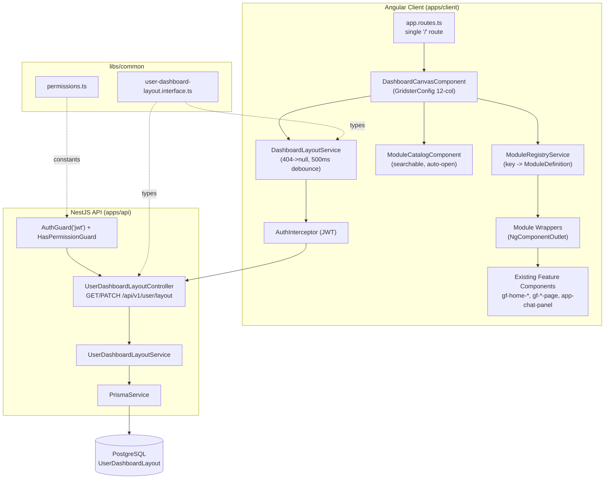

# Technical Specification

# 0. Agent Action Plan

## 0.1 Intent Clarification

This Agent Action Plan is the authoritative interpretation layer between the user's request and its technical execution against the Ghostfolio repository (an Nx monorepo with an Angular client at `apps/client/` and a NestJS API at `apps/api/`). It converts a high-level navigation-paradigm change into a precise, file-level implementation contract.

### 0.1.1 Core Feature Objective

Based on the prompt, the Blitzy platform understands that the new feature requirement is to **replace Ghostfolio's route-based Angular navigation shell with a single-canvas, modular dashboard system** in which every existing authenticated UI feature becomes a self-contained, independently placeable grid module that the user composes via drag-and-drop, with each user's layout persisted to the database.

The feature decomposes into the following discrete, technically-stated requirements:

- **Grid canvas at the root route.** Introduce a single root component, rendered at route `/`, that hosts a drag-and-drop grid built on the `angular-gridster2` v21.0.1 library. The grid specification is fixed: **12 columns, a fixed row height (constant pixel value), and a minimum module size of 2×2 cells.**
- **Module-per-feature model.** Every existing UI feature — portfolio overview, holdings, transactions, analysis, and the AI chat panel — becomes a self-contained, independently placeable grid module. Modules are draggable and resizable within the 12-column grid.
- **Centralized module registry.** A single Angular service registers all available module types with their metadata: a stable key, a human-readable display name, a reference to the Angular component that renders the module, and the module's minimum cell dimensions.
- **Searchable module catalog.** An overlay/sidebar panel lists all registered modules, is searchable by name, supports adding a module (by drag or click) and removing a module (via a module-header action).
- **Per-user layout persistence.** A new Prisma model `UserDashboardLayout` stores each user's grid arrangement (`userId` foreign key, `layoutData` as JSONB, plus an `updatedAt` timestamp). Two new NestJS endpoints — `GET /api/v1/user/layout` and `PATCH /api/v1/user/layout` — read and persist the layout, protected by the platform's existing `AuthGuard('jwt')` and `HasPermissionGuard` pattern <cite index="">[apps/api/src/app/user-financial-profile/user-financial-profile.controller.ts:L94-L96]</cite>.
- **Onboarding behavior.** New users are presented with a blank canvas, and the module catalog auto-opens on first visit when no saved layout exists for the authenticated user.

#### 0.1.1.1 Implicit Requirements Surfaced

The literal request implies several non-obvious technical obligations that the implementation must satisfy:

- **Module wrapper pattern.** Because the registry maps a module key to a component and the canvas renders modules generically, each feature is hosted by a thin *wrapper* component (rendered via `NgComponentOutlet`) that embeds the existing feature component and adds grid chrome (header, remove action). Wrappers must not import the canvas layer.
- **Versioned JSONB layout schema.** `layoutData` is a structured array of `{ moduleKey, x, y, cols, rows }` entries (the `angular-gridster2` `GridsterItem` geometry plus a module-type identifier), carrying a `schemaVersion` field for forward compatibility.
- **Next-available-position placement.** Adding a module from the catalog must place it at the next available grid position, requiring a first-fit placement computation (the `angular-gridster2` API exposes position helpers for this).
- **Debounced persistence pipeline.** Persistence must fire only on grid-state-change events (drag, resize, add, remove) and is debounced ~500ms before a `PATCH` is issued, implemented as an RxJS `Subject` + `debounceTime` in a dedicated client layout service.
- **First-visit detection via HTTP 404.** The layout `GET` returns 404 when no record exists; the client translates 404 to `null` (mirroring the existing `FinancialProfileService` pattern <cite index="">[apps/client/src/app/services/financial-profile.service.ts:L33-L48]</cite>), and the canvas opens the catalog when the layout is `null`.
- **Minimum-dimension enforcement.** Each module declares its minimum cell dimensions in the registry; the grid engine is configured (`minItemCols`/`minItemRows`) to enforce them and reject below-minimum resize attempts.
- **Grid state as single source of truth.** The `GridsterItem[]` array on the canvas is the authoritative store of module positions and sizes; module components hold no layout state.
- **Shared contract + permissions + i18n.** A shared TypeScript interface (`user-dashboard-layout.interface.ts`), two new permission constants in `libs/common/src/lib/permissions.ts` <cite index="">[libs/common/src/lib/permissions.ts:L47]</cite>, and `i18n` attributes on all new UI strings (the client builds with `localize: true` <cite index="">[apps/client/project.json:L77]</cite>) are required.

### 0.1.2 Special Instructions and Constraints

The prompt and the governing project rules impose explicit, non-negotiable directives. They are preserved here verbatim where they constrain the design.

#### 0.1.2.1 Architectural and Behavioral Directives (User-Specified)

- **Integrate with existing authentication unchanged.** The layout endpoints must reuse the existing `AuthGuard('jwt')` and `HasPermissionGuard` pattern; unauthenticated requests must return **401**.
- **Preserve the Angular Router infrastructure.** `RouterModule.forRoot`, the `ServiceWorkerModule` navigation handling, `PageTitleStrategy`, and `ModulePreloadService` must not be removed or degraded; the application is reduced to a single root route `/` that renders the grid canvas, with no additional routes <cite index="">[apps/client/src/main.ts:L70-L104]</cite>.
- **Module isolation.** Module components must not import or reference the grid canvas layer; data flows exclusively through existing services.
- **Grid state is the single source of truth** for module positions and sizes; module components must not hold layout state.
- **Registry is the only introduction mechanism.** New module types may be added only through the centralized module registry; ad-hoc component insertion is prohibited.
- **Persistence is grid-event-driven only.** Layout persistence is triggered exclusively by grid state-change events; module components must not call the layout save API directly.
- **Minimum cell dimensions must be declared and enforced.** Each module declares minimum cell dimensions in the registry; the grid engine must enforce them and reject violations.
- **Material Design 3 token discipline (Decision D-020).** Grid chrome components (module headers, resize handles, drop-zone indicators) must use the `var(--mat-sys-<token>, <hardcoded-fallback>)` pattern for all Material Design 3 styling; direct use of `--mat-sys-*` without fallbacks is prohibited <cite index="">[apps/client/src/app/components/chat-panel/chat-panel.component.scss:L139]</cite>.
- **Schema location precondition.** `schema.prisma` must be located and read before writing the `UserDashboardLayout` migration, and the new model must not conflict with the existing `User` and `FinancialProfile` models — confirmed at `prisma/schema.prisma` (workspace root) with `FinancialProfile` at lines 364–376 <cite index="">[prisma/schema.prisma:L364-L376]</cite>.
- **First-visit catalog auto-open.** The module catalog must auto-open on first visit when no saved layout exists for the authenticated user.

#### 0.1.2.2 Intentional Deviation (Documented)

- **User Directive:** "ChatPanelComponent becomes a standalone grid module; its existing mount-point in `portfolio-page.html:32` is superseded."

This directive intentionally contradicts the existing system documentation, which describes `ChatPanelComponent` (`<app-chat-panel>`) as embedded within the portfolio page below the `mat-tab-nav-bar`, persisting across all six portfolio tabs <cite index="">[apps/client/src/app/pages/portfolio/portfolio-page.html:L32]</cite>. The Blitzy platform treats the prompt as authoritative: the inline `<app-chat-panel></app-chat-panel>` embed is removed and the panel is re-hosted as an "AI Chat" grid module. This deviation is logged explicitly (and is mirrored by an entry in the mandated decision log per the Explainability rule).

#### 0.1.2.3 Boundary Directives

- **Preserve:** all data-fetching services (`PortfolioService`, `SymbolService`, `AiChatService`, `RebalancingService`, `FinancialProfileService`), business logic, Ghostfolio API integrations, and auth guards — unchanged.
- **Exclude (out of scope):** mobile/responsive layout support; shared layouts; admin-defined default layouts; multi-user collaboration.

#### 0.1.2.4 Web Search Requirements

- **Library availability and Angular 21 compatibility.** Verification that `angular-gridster2@21.0.1` exists and aligns with Angular 21 was required and completed; the version is the latest published release and follows the Angular-major alignment scheme. Critically, the v21 line retains `NgZone.run`/`NgZone.runOutsideAngular` for applications still using `zone.js`, which is directly relevant because Ghostfolio is zone-based (`zone.js` 0.16.1 <cite index="">[package.json:L150]</cite>, `provideZoneChangeDetection()` <cite index="">[apps/client/src/main.ts:L87]</cite>). The v21 API also obtains the grid API via `initCallback`/`viewChild(Gridster).api` and removed `optionsChanged()` (a new options-object reference must be assigned to apply option changes).

### 0.1.3 Technical Interpretation

These feature requirements translate to the following technical implementation strategy:

- **To establish the canvas**, we will create a standalone `DashboardCanvasComponent` under `apps/client/src/app/dashboard/dashboard-canvas/` that imports `Gridster` and `GridsterItemComponent` from `angular-gridster2`, holds a `GridsterConfig` (12 columns, fixed row height, `minItemCols`/`minItemRows` = 2, drag/resize enabled), and renders each grid item's module via `NgComponentOutlet`.
- **To centralize module introduction**, we will create a root-provided `ModuleRegistryService` (`apps/client/src/app/dashboard/module-registry.service.ts`) holding a `Map<string, ModuleDefinition>` and registering all feature modules at construction.
- **To enable composition**, we will create a `ModuleCatalogComponent` (`apps/client/src/app/dashboard/module-catalog/`) backed by a Material search field and a filtered list of registered modules, emitting add events to the canvas.
- **To persist layouts**, we will create the `UserDashboardLayout` Prisma model mirroring `FinancialProfile`, a `user-dashboard-layout.controller.ts` and `user-dashboard-layout.service.ts` under `apps/api/src/app/user/`, and a client `DashboardLayoutService` that wraps `GET`/`PATCH /api/v1/user/layout` with 404→`null` handling and a 500ms debounce.
- **To collapse the navigation shell**, we will reduce `apps/client/src/app/app.routes.ts` to a single `path: ''` route rendering the canvas while preserving the router providers wired in `main.ts`, and remove the `<app-chat-panel>` embed from the portfolio page.
- **To honor governance**, we will reuse the existing `health/` and `metrics/` modules for observability, recreate a blank `CODE_REVIEW.md`, and produce the mandated decision log, traceability matrix, and reveal.js executive summary.

## 0.2 Repository Scope Discovery

A systematic inspection of the Angular client (`apps/client/`), the NestJS API (`apps/api/`), the shared libraries (`libs/common/`, `libs/ui/`), and the Prisma schema (`prisma/`) identified every existing file the feature touches and every new file it requires.

### 0.2.1 Comprehensive File Analysis

#### 0.2.1.1 Existing Feature Components (Module Candidates)

Every authenticated feature component that will be wrapped as a selectable grid module was located and confirmed. The module isolation rule means these components are *referenced by* wrappers; they are not themselves modified.

| Module (Catalog) | Existing Component Selector | Source Location |
|------------------|-----------------------------|-----------------|
| Portfolio Overview | `gf-home-overview` | `apps/client/src/app/components/home-overview/` <cite index="">[apps/client/src/app/components/home-overview/home-overview.component.ts:L39]</cite> |
| Holdings | `gf-home-holdings` | `apps/client/src/app/components/home-holdings/` <cite index="">[apps/client/src/app/components/home-holdings/home-holdings.component.ts:L49]</cite> |
| Summary | `gf-home-summary` | `apps/client/src/app/components/home-summary/` <cite index="">[apps/client/src/app/components/home-summary/home-summary.component.ts:L27]</cite> |
| Markets | `gf-home-market` | `apps/client/src/app/components/home-market/` <cite index="">[apps/client/src/app/components/home-market/home-market.component.ts:L33]</cite> |
| Watchlist | `gf-home-watchlist` | `apps/client/src/app/components/home-watchlist/` <cite index="">[apps/client/src/app/components/home-watchlist/home-watchlist.component.ts:L46]</cite> |
| Portfolio Summary | `gf-portfolio-summary` | `apps/client/src/app/components/portfolio-summary/` <cite index="">[apps/client/src/app/components/portfolio-summary/portfolio-summary.component.ts:L29]</cite> |
| Transactions (Activities) | `gf-activities-page` | `apps/client/src/app/pages/portfolio/activities/` <cite index="">[apps/client/src/app/pages/portfolio/activities/activities-page.component.ts:L52]</cite> |
| Allocations | `gf-allocations-page` | `apps/client/src/app/pages/portfolio/allocations/` <cite index="">[apps/client/src/app/pages/portfolio/allocations/allocations-page.component.ts:L57]</cite> |
| Analysis | `gf-analysis-page` | `apps/client/src/app/pages/portfolio/analysis/` <cite index="">[apps/client/src/app/pages/portfolio/analysis/analysis-page.component.ts:L62]</cite> |
| FIRE | `gf-fire-page` | `apps/client/src/app/pages/portfolio/fire/` <cite index="">[apps/client/src/app/pages/portfolio/fire/fire-page.component.ts:L40]</cite> |
| X-ray | `gf-x-ray-page` | `apps/client/src/app/pages/portfolio/x-ray/` <cite index="">[apps/client/src/app/pages/portfolio/x-ray/x-ray-page.component.ts:L35]</cite> |
| AI Chat (extracted) | `app-chat-panel` | `apps/client/src/app/components/chat-panel/` <cite index="">[apps/client/src/app/components/chat-panel/chat-panel.component.ts:L54]</cite> |

#### 0.2.1.2 Navigation Shell and Bootstrap Files (To Modify)

| File | Current Responsibility | Locator |
|------|------------------------|---------|
| `apps/client/src/app/app.routes.ts` | Lazy per-page route table; wildcard `**` → `home` | <cite index="">[apps/client/src/app/app.routes.ts:L142-L144]</cite> |
| `apps/client/src/main.ts` | Standalone bootstrap; `RouterModule.forRoot` with `ModulePreloadService` + `PageTitleStrategy` + `ServiceWorkerModule` | <cite index="">[apps/client/src/main.ts:L70-L104]</cite> |
| `apps/client/src/app/app.component.html` | Shell: `<gf-header>` + `<router-outlet/>` + footer | <cite index="">[apps/client/src/app/app.component.html:L30-L47]</cite> |
| `apps/client/src/app/components/header/` | Top navigation (`gf-header`) with tab navigation | `header.component.{ts,html,scss}` |
| `apps/client/src/app/pages/portfolio/portfolio-page.html` | Hosts the inline `<app-chat-panel>` embed at line 32 | <cite index="">[apps/client/src/app/pages/portfolio/portfolio-page.html:L32]</cite> |
| `apps/client/src/app/pages/portfolio/portfolio-page.component.ts` | Imports `ChatPanelComponent`; builds tab configuration | <cite index="">[apps/client/src/app/pages/portfolio/portfolio-page.component.ts:L1,L28]</cite> |

#### 0.2.1.3 Integration Point Discovery

- **API endpoints.** New routes `GET`/`PATCH /api/v1/user/layout` resolve automatically through the global prefix and URI versioning configured in `apps/api/src/main.ts` (`setGlobalPrefix('api')` and `enableVersioning({ type: VersioningType.URI })`) <cite index="">[apps/api/src/main.ts:L46-L50]</cite>. The `user-financial-profile` feature is the precedent controller pattern <cite index="">[apps/api/src/app/user-financial-profile/user-financial-profile.controller.ts:L75]</cite>.
- **Database models / migrations.** The `User` model receives a one-to-one back-relation declaration only (required by Prisma 7.7.0 for both sides of a 1:1 association); the `FinancialProfile` model is the structural precedent for the new side table <cite index="">[prisma/schema.prisma:L364-L376]</cite>.
- **Service classes.** A new `UserDashboardLayoutService` (API) and `DashboardLayoutService` (client) are added; no existing data services are altered. The client `FinancialProfileService` is the wrapper precedent <cite index="">[apps/client/src/app/services/financial-profile.service.ts:L33-L48]</cite>.
- **Controllers / handlers.** The new `UserDashboardLayoutController` is wired through the existing `UserModule` (which already imports `PrismaModule`) <cite index="">[apps/api/src/app/user/user.module.ts]</cite>.
- **Middleware / guards.** No new middleware. The `HasPermissionGuard` consumes two new permission constants added to `libs/common/src/lib/permissions.ts` (alongside `readFinancialProfile`/`updateFinancialProfile`) <cite index="">[libs/common/src/lib/permissions.ts:L47,L63]</cite>.
- **Observability seams.** The existing `apps/api/src/app/health/` and `apps/api/src/app/metrics/` modules are reused for health/readiness and Prometheus metrics; the `X-Correlation-ID` (`randomUUID` from `node:crypto`) controller convention is reused <cite index="">[apps/api/src/app/user-financial-profile/user-financial-profile.controller.ts:L100]</cite>.

### 0.2.2 Web Search Research Conducted

| Research Topic | Finding Applied to Implementation |
|----------------|-----------------------------------|
| `angular-gridster2` v21.0.1 availability and Angular 21 compatibility | Confirmed as the latest published release on the Angular-major alignment scheme (v21 ↔ Angular 21); pinned as the exact dependency version |
| `zone.js` interaction with the grid engine | v21 retains `NgZone.run`/`NgZone.runOutsideAngular` for zone-based apps; compatible with Ghostfolio's `provideZoneChangeDetection()` setup; satisfies the ≤100ms visual-update validation concern |
| `angular-gridster2` v21 API surface | Grid API obtained via `initCallback`/`viewChild(Gridster).api`; `optionsChanged()` removed (assign a new options object); `itemChangeCallback`/`itemResizeCallback` are the drag/resize-end events that drive debounced persistence |
| Standalone usage pattern | `import { Gridster, GridsterItemComponent } from 'angular-gridster2'` into a standalone component; template `<gridster [options]>` with `@for`-rendered `<gridster-item [item]>` |

### 0.2.3 New File Requirements

- **New client source files (grid system):**
  - `apps/client/src/app/dashboard/dashboard-canvas/dashboard-canvas.component.{ts,html,scss}` — the single-canvas root grid component
  - `apps/client/src/app/dashboard/module-registry.service.ts` — centralized module registry
  - `apps/client/src/app/dashboard/module-catalog/module-catalog.component.{ts,html,scss}` — searchable module catalog
  - `apps/client/src/app/dashboard/dashboard-layout.service.ts` — client wrapper for the layout endpoints (404→`null`, 500ms debounce)
  - `apps/client/src/app/dashboard/modules/<module-name>/<module-name>.component.ts` — one isolation wrapper per feature module
  - `apps/client/src/app/dashboard/dashboard.types.ts` — `ModuleDefinition` + `DashboardItem`/`LayoutData` types
- **New API source files (layout feature):**
  - `apps/api/src/app/user/user-dashboard-layout.controller.ts` — thin controller for `GET`/`PATCH /api/v1/user/layout`
  - `apps/api/src/app/user/user-dashboard-layout.service.ts` — Prisma-backed read/upsert logic with correlation-ID logging
  - `apps/api/src/app/user/dtos/update-user-dashboard-layout.dto.ts` — `class-validator` DTO with size caps
- **New shared file:**
  - `libs/common/src/lib/interfaces/user-dashboard-layout.interface.ts` — shared `UserDashboardLayout` + patch-payload types
- **New test files (following the existing co-located `*.spec.ts` convention):**
  - `apps/client/src/app/dashboard/**/*.spec.ts` — registry service, layout service, canvas, catalog
  - `apps/api/src/app/user/user-dashboard-layout.controller.spec.ts` and `user-dashboard-layout.service.spec.ts`
- **New database files:**
  - `prisma/migrations/<timestamp>_add_user_dashboard_layout/migration.sql` — generated by `prisma migrate dev`
- **New governance / observability deliverables:**
  - `CODE_REVIEW.md` (repository root, recreated blank), `blitzy-deck/<dashboard-exec-summary>.html` (reveal.js), a decision log and bidirectional traceability matrix (Markdown), and an observability dashboard template/runbook for the layout feature

## 0.3 Dependency Inventory

The feature is dependency-light: it adds exactly one runtime package and modifies no existing package versions. The remainder of the stack (Angular Router, Angular Material/CDK, NestJS, Prisma) is reused at its installed version.

### 0.3.1 Package Additions

| Package | Registry | Version | Purpose |
|---------|----------|---------|---------|
| `angular-gridster2` | npm | `21.0.1` | Drag-and-drop, resizable 12-column grid engine that powers the dashboard canvas; v21 line is Angular-21-aligned and zone-compatible |

No packages are removed and no existing package versions are updated. The grid engine's Angular peer requirements are satisfied by the installed `@angular/core` 21.2.7, `@angular/common`, and `@angular/cdk` 21.2.5 <cite index="">[package.json:L62,L65]</cite>.

The relevant existing stack reused (unchanged) by this feature:

| Package | Installed Version | Role in Feature |
|---------|-------------------|-----------------|
| `@angular/core` | `21.2.7` | Standalone components, `NgComponentOutlet`, zone change detection <cite index="">[package.json:L65]</cite> |
| `@angular/material` / `@angular/cdk` | `21.2.5` | Grid chrome (cards, buttons, form fields, sidenav, tooltip) and MD3 tokens <cite index="">[package.json:L62,L67]</cite> |
| `@angular/router` | `21.2.7` | Preserved router infrastructure reduced to the single `/` route <cite index="">[package.json:L70]</cite> |
| `@nestjs/common` / `@nestjs/core` | `11.1.19` | Layout controller/service, guards, DI <cite index="">[package.json:L83,L85]</cite> |
| `prisma` / `@prisma/client` | `7.7.0` | `UserDashboardLayout` model + client regeneration <cite index="">[package.json:L95,L207]</cite> |
| `rxjs` | `7.8.1` | Debounced persistence pipeline (`Subject` + `debounceTime`) <cite index="">[package.json:L142]</cite> |

> Note: The mandated reveal.js executive-summary deliverable loads `reveal.js` 5.1.0, `Mermaid` 11.4.0, and `Lucide` 0.460.0 via pinned CDN `<script>`/`<link>` tags inside a single self-contained HTML file. These are not `package.json` dependencies and introduce no build-time coupling.

### 0.3.2 Import and Reference Updates

- **Manifest update:** `package.json` `dependencies` block gains the `angular-gridster2` entry; the lockfile is regenerated on install.
- **New imports (additive, no rewrites):** files under `apps/client/src/app/dashboard/**` import `{ Gridster, GridsterItemComponent, GridsterConfig, GridsterItem }` from `angular-gridster2`. No existing import statements are rewritten — the feature is purely additive at the import level.
- **Barrel export:** `libs/common/src/lib/interfaces/index.ts` is updated to re-export `user-dashboard-layout.interface.ts`.
- **Prisma client regeneration:** after the schema edit, `@prisma/client` is regenerated (not version-bumped) via the existing `prisma generate` invocation wired into the `postinstall` and `database:generate-typings` scripts <cite index="">[package.json:L19-L39]</cite>, exposing the new `userDashboardLayout` delegate on `PrismaService`.

## 0.4 Integration Analysis

The feature integrates with the host application through a small number of well-defined seams. Existing business logic, data services, and the F-020 AI module remain untouched; integration is achieved through additive wiring and one back-relation declaration.

### 0.4.1 Existing Code Touchpoints

#### 0.4.1.1 Direct Modifications Required

| File | Modification | Locator |
|------|--------------|---------|
| `apps/client/src/app/app.routes.ts` | Collapse the route table to a single `path: ''` route that lazy-loads `DashboardCanvasComponent`; retain the wildcard and the authentication/bootstrap routes | <cite index="">[apps/client/src/app/app.routes.ts:L7-L146]</cite> |
| `apps/client/src/app/app.component.html` | The `<router-outlet>` now renders the canvas; `gf-header` tab-navigation inputs (`hasTabs`) become inert for the dashboard surface | <cite index="">[apps/client/src/app/app.component.html:L30-L47]</cite> |
| `apps/client/src/app/components/header/header.component.{ts,html}` | Neutralize screen-level tab/sidebar navigation; retain the user menu, date-range, and filter controls | `components/header/` |
| `apps/client/src/app/pages/portfolio/portfolio-page.html` | Remove the inline `<app-chat-panel></app-chat-panel>` embed (chat extracted to a module) | <cite index="">[apps/client/src/app/pages/portfolio/portfolio-page.html:L32]</cite> |
| `apps/client/src/app/pages/portfolio/portfolio-page.component.ts` | Remove the `ChatPanelComponent` import and its entry in the `imports` array | <cite index="">[apps/client/src/app/pages/portfolio/portfolio-page.component.ts:L1,L28]</cite> |
| `apps/api/src/app/user/user.module.ts` | Register `UserDashboardLayoutController` and `UserDashboardLayoutService` in `controllers`/`providers`/`exports` | `user/user.module.ts` |
| `libs/common/src/lib/permissions.ts` | Add `readUserDashboardLayout`/`updateUserDashboardLayout` constants and grant them in the appropriate role sets | <cite index="">[libs/common/src/lib/permissions.ts:L47,L102]</cite> |
| `libs/common/src/lib/interfaces/index.ts` | Export the new `user-dashboard-layout.interface.ts` | `interfaces/index.ts` |
| `apps/client/ngsw-config.json` (conditional) | Adjust route/asset caching for the single-route SPA if required by the service worker | `apps/client/ngsw-config.json` |

#### 0.4.1.2 Dependency Injection and Wiring

- **NestJS DI:** `UserDashboardLayoutController` injects `UserDashboardLayoutService`; the service injects the global `PrismaService`. Because the controller/service live under `apps/api/src/app/user/`, they are registered in the existing `UserModule`, which already imports `PrismaModule` — no new module file is strictly required (the alternative dedicated module is captured in the decision log).
- **Route resolution:** the controller's `@Controller('user/layout')` resolves to `/api/v1/user/layout` via the global prefix and URI versioning in `apps/api/src/main.ts` <cite index="">[apps/api/src/main.ts:L46-L50]</cite>.
- **Guard wiring:** `@UseGuards(AuthGuard('jwt'), HasPermissionGuard)` plus `@HasPermission(...)` decorators yield 401 (no JWT) and 403 (insufficient permission), matching the established pattern <cite index="">[apps/api/src/app/user-financial-profile/user-financial-profile.controller.ts:L94-L96]</cite>.
- **Client DI:** `ModuleRegistryService` and `DashboardLayoutService` are `providedIn: 'root'`. The existing `AuthInterceptor` automatically attaches the JWT bearer token to the layout HTTP calls, so no manual token handling is needed <cite index="">[apps/client/src/app/services/financial-profile.service.ts:L33-L48]</cite>.

#### 0.4.1.3 Database / Schema Updates

- **New model:** `prisma/schema.prisma` gains a `UserDashboardLayout` model keyed by `userId` (`@id`), with `layoutData Json`, `createdAt`, `updatedAt`, and a cascade-delete relation to `User` — mirroring `FinancialProfile` <cite index="">[prisma/schema.prisma:L364-L376]</cite>.
- **Back-relation:** the `User` model gains a `dashboardLayout UserDashboardLayout?` back-relation, required because Prisma 7.7.0 mandates explicit back-relation declarations on both sides of one-to-one associations <cite index="">[prisma/schema.prisma:L261-L290]</cite>.
- **Migration:** `prisma migrate dev --name add-user-dashboard-layout` generates a non-conflicting additive `CREATE TABLE` migration under `prisma/migrations/`.

### 0.4.2 Integration Topology

## 0.5 Design System Compliance

The user's prompt specifies Material Design 3 token discipline (Decision D-020) for all grid chrome. This sub-section catalogs the design system, maps each UI element to a concrete library component, and records the single gap that justifies the `angular-gridster2` dependency.

### 0.5.1 System Identification

- **Library:** Angular Material (Material Design 3) — **Version:** `21.2.5` — **Status:** installed <cite index="">[package.json:L67]</cite>
- **Companion:** `@angular/cdk` `21.2.5` (overlay, portal, drag primitives) <cite index="">[package.json:L62]</cite>
- **Package:** npm `@angular/material` + `@angular/cdk`
- **Source inspected:** `apps/client/src/styles/theme.scss` (theme construction via `mat.define-theme` and `mat.all-component-themes`, defining `$gf-theme-default` and `$gf-theme-dark`) <cite index="">[apps/client/src/styles/theme.scss:L145,L159,L228,L242]</cite>, and `apps/client/src/app/components/chat-panel/chat-panel.component.scss` (the canonical `var(--mat-sys-<token>, <fallback>)` usage) <cite index="">[apps/client/src/app/components/chat-panel/chat-panel.component.scss:L139]</cite>
- **Selector convention:** the `gf` prefix is the project standard; `app-chat-panel` is the one documented exception, retained verbatim because its existing embed cannot be renamed without a non-additive edit

### 0.5.2 Component Mapping

Every grid-chrome element resolves to an existing Angular Material component (evidenced by current usage in `chat-panel` and the `financial-profile-form` dialog). No raw HTML controls are used where a Material equivalent exists.

| UI Element | Library Component | Import Path | Props / Variant | Notes |
|------------|-------------------|-------------|-----------------|-------|
| Module container | `MatCard` | `@angular/material/card` | `appearance` | Frames each grid module |
| Module header actions / remove | `MatIconButton` + `MatIcon` | `@angular/material/button`, `@angular/material/icon` | `mat-icon-button` | Remove/close + drag-handle affordance |
| Catalog panel | `MatSidenav` (or CDK Overlay) | `@angular/material/sidenav` | `mode`, `opened` | `MatDialog` is the in-repo precedent for overlays |
| Catalog search field | `MatFormField` + `MatInput` | `@angular/material/form-field`, `@angular/material/input` | `matInput`, `placeholder` | Already used by `chat-panel` |
| Catalog module list | `MatList` / `MatCard` | `@angular/material/list` | `mat-list-item` | One row per registered module |
| Buttons (Add module, etc.) | `MatButton` variants | `@angular/material/button` | `mat-button` / `mat-stroked-button` / `mat-flat-button` | Matches existing button usage |
| Tooltips | `MatTooltip` | `@angular/material/tooltip` | `matTooltip` | `MatTooltipModule` already provided <cite index="">[apps/client/src/main.ts:L23,L69]</cite> |
| Transient errors / save feedback | `MatSnackBar` | `@angular/material/snack-bar` | — | `MatSnackBarModule` already provided <cite index="">[apps/client/src/main.ts:L22,L68]</cite> |
| Loading indicator | `MatProgressBar` | `@angular/material/progress-bar` | `mode` | Used by `chat-panel` |
| Module rendering primitive | `NgComponentOutlet` | `@angular/common` | `ngComponentOutlet` | Renders the registry-resolved component by `Type` |

### 0.5.3 Token Mapping

No Figma attachments were provided, so a Figma-value-to-token resolution table is not applicable. Instead, the binding rule is the Decision D-020 pattern: every CSS property value on grid chrome must resolve to an MD3 system token via `var(--mat-sys-<token>, <hardcoded-fallback>)`. The fallback is **mandatory** — the current theme is constructed with `mat.define-theme`/`mat.all-component-themes` rather than `mat.theme()`, so the `--mat-sys-*` custom properties may not be emitted at runtime, in which case the fallback value renders <cite index="">[apps/client/src/app/components/chat-panel/chat-panel.component.scss:L139]</cite>.

| Chrome Element | MD3 Token (with mandatory fallback) | Observed Precedent |
|----------------|-------------------------------------|--------------------|
| Module surface / card background | `var(--mat-sys-surface-container, <fallback>)` | `chat-panel.component.scss` |
| Primary text on module | `var(--mat-sys-on-surface, <fallback>)` | `chat-panel.component.scss` |
| Secondary / metadata text | `var(--mat-sys-on-surface-variant, <fallback>)` | `chat-panel.component.scss` |
| Module borders / dividers | `var(--mat-sys-outline, <fallback>)` | `chat-panel.component.scss` |
| Drop-zone / active highlight | `var(--mat-sys-primary-container, <fallback>)` | `chat-panel.component.scss` |
| Error states | `var(--mat-sys-error-container, <fallback>)` / `var(--mat-sys-on-error-container, <fallback>)` | `chat-panel.component.scss` |

The tokens above are the set already in active use across `chat-panel.component.scss` and `rebalancing-page.component.scss`; the dashboard chrome reuses them rather than introducing new theme tokens. No hardcoded raw value is permitted outside a token+fallback wrapper (excepting `0`, `none`, `auto`, `inherit`, `currentColor`, `transparent`).

### 0.5.4 Gaps Inventory

| Element / Need | Material Equivalent | Resolution |
|----------------|---------------------|------------|
| 12-column drag/resize grid engine | None | Add `angular-gridster2@21.0.1` — the single justified non-Material UI dependency |
| Drop-zone / placeholder visuals during drag | Rendered by gridster | Style gridster's placeholder via `--mat-sys` tokens with fallbacks |

There are no component gaps in the catalog, search, or module-chrome surfaces — Angular Material covers all of them. The only structural gap is the grid layout engine itself.

### 0.5.5 Compliance Summary

Angular Material 21.2.5 supplies every grid-chrome component the feature needs — cards, icon buttons, form field and input, list, sidenav/dialog, tooltip, snackbar, and progress bar — with no new theme tokens required. Exactly one gap exists: the drag-and-drop grid layout engine, which has no Material equivalent and is satisfied by adding the single `angular-gridster2@21.0.1` dependency. All grid-chrome styling resolves to MD3 `--mat-sys-*` system tokens through the mandatory `var(--mat-sys-<token>, <fallback>)` pattern, in full compliance with Decision D-020.

## 0.6 Technical Implementation

This sub-section defines the concrete, file-by-file execution plan. Every file is assigned a mode — **CREATE**, **UPDATE**, or **REFERENCE** (read-only pattern source). No file requires a hard **DELETE**: feature components are repurposed as modules rather than removed, and superseded page shells are retained or neutralized per the decision log.

### 0.6.1 File-by-File Execution Plan

#### 0.6.1.1 Group 1 — Client Grid Core (CREATE)

| Mode | File | Purpose |
|------|------|---------|
| CREATE | `apps/client/src/app/dashboard/dashboard-canvas/dashboard-canvas.component.ts` (+ `.html`, `.scss`, `.spec.ts`) | Single root grid canvas; owns `GridsterConfig` + `GridsterItem[]` |
| CREATE | `apps/client/src/app/dashboard/module-registry.service.ts` (+ `.spec.ts`) | Centralized registry of module definitions |
| CREATE | `apps/client/src/app/dashboard/module-catalog/module-catalog.component.ts` (+ `.html`, `.scss`, `.spec.ts`) | Searchable, auto-opening module catalog |
| CREATE | `apps/client/src/app/dashboard/dashboard-layout.service.ts` (+ `.spec.ts`) | Client layout API wrapper (404→`null`, 500ms debounce) |
| CREATE | `apps/client/src/app/dashboard/modules/<feature>/<feature>.component.ts` | One isolation wrapper per feature module (×12) |
| CREATE | `apps/client/src/app/dashboard/dashboard.types.ts` | `ModuleDefinition`, `DashboardItem`, `LayoutData` types |

#### 0.6.1.2 Group 2 — Shared Library (CREATE / UPDATE)

| Mode | File | Purpose |
|------|------|---------|
| CREATE | `libs/common/src/lib/interfaces/user-dashboard-layout.interface.ts` | `UserDashboardLayout` + `UserDashboardLayoutPatchPayload` |
| UPDATE | `libs/common/src/lib/interfaces/index.ts` | Barrel-export the new interface |
| UPDATE | `libs/common/src/lib/permissions.ts` | Add + grant `readUserDashboardLayout`/`updateUserDashboardLayout` <cite index="">[libs/common/src/lib/permissions.ts:L47,L102]</cite> |

#### 0.6.1.3 Group 3 — API Layout Feature (CREATE / UPDATE)

| Mode | File | Purpose |
|------|------|---------|
| CREATE | `apps/api/src/app/user/user-dashboard-layout.controller.ts` (+ `.spec.ts`) | Thin controller for `GET`/`PATCH /api/v1/user/layout` |
| CREATE | `apps/api/src/app/user/user-dashboard-layout.service.ts` (+ `.spec.ts`) | Prisma read/upsert + correlation-ID logging |
| CREATE | `apps/api/src/app/user/dtos/update-user-dashboard-layout.dto.ts` | `class-validator` DTO with size caps |
| UPDATE | `apps/api/src/app/user/user.module.ts` | Register controller + service |

#### 0.6.1.4 Group 4 — Database (UPDATE / CREATE)

| Mode | File | Purpose |
|------|------|---------|
| UPDATE | `prisma/schema.prisma` | Add `UserDashboardLayout` model + `User` back-relation <cite index="">[prisma/schema.prisma:L261-L290,L364-L376]</cite> |
| CREATE | `prisma/migrations/<timestamp>_add_user_dashboard_layout/migration.sql` | Additive `CREATE TABLE` via `prisma migrate dev` |

#### 0.6.1.5 Group 5 — Navigation Shell Refactor (UPDATE)

| Mode | File | Purpose |
|------|------|---------|
| UPDATE | `apps/client/src/app/app.routes.ts` | Single `path: ''` → `DashboardCanvasComponent` <cite index="">[apps/client/src/app/app.routes.ts:L7-L146]</cite> |
| UPDATE | `apps/client/src/app/app.component.{ts,html}` | Render canvas; neutralize tab-nav inputs |
| UPDATE | `apps/client/src/app/components/header/header.component.{ts,html}` | Simplify topnav navigation |
| UPDATE | `apps/client/src/app/pages/portfolio/portfolio-page.html` | Remove `<app-chat-panel>` at line 32 <cite index="">[apps/client/src/app/pages/portfolio/portfolio-page.html:L32]</cite> |
| UPDATE | `apps/client/src/app/pages/portfolio/portfolio-page.component.ts` | Remove `ChatPanelComponent` import/usage <cite index="">[apps/client/src/app/pages/portfolio/portfolio-page.component.ts:L1,L28]</cite> |
| UPDATE (conditional) | `apps/client/ngsw-config.json` | Single-route caching adjustment |

#### 0.6.1.6 Group 6 — Governance & Observability Deliverables (CREATE)

| Mode | File | Purpose |
|------|------|---------|
| CREATE | `CODE_REVIEW.md` (repo root) | Recreated blank for the Segmented PR Review |
| CREATE | `blitzy-deck/<dashboard-exec-summary>.html` | Self-contained reveal.js executive summary |
| CREATE | decision log + bidirectional traceability matrix (Markdown) | Explainability deliverables |
| CREATE | observability dashboard template / runbook (Markdown) | Layout-feature metrics + panels |
| REFERENCE | `apps/api/src/app/user-financial-profile/**`, `apps/client/src/app/services/financial-profile.service.ts`, `prisma/schema.prisma` (`FinancialProfile`), `chat-panel.component.scss`, `theme.scss` | Read-only pattern sources |

### 0.6.2 Implementation Approach per File

- **`DashboardCanvasComponent`** — a standalone, `OnPush` component importing `Gridster` and `GridsterItemComponent`. It owns `options: GridsterConfig` (fixed grid type, `minCols`/`maxCols` = 12, constant `fixedRowHeight`, `minItemCols`/`minItemRows` = 2, draggable and resizable enabled, `itemChangeCallback`/`itemResizeCallback` wired to the layout service's debounced save) and `dashboard: DashboardItem[]`. On init it calls `dashboardLayoutService.get()`; a `null` result opens the catalog, otherwise it hydrates the grid. Each item is rendered with `NgComponentOutlet` resolving `registry.get(item.moduleKey).component`. The grid API is obtained via `viewChild(Gridster).api` / `initCallback` per the v21 API.

- **`ModuleRegistryService`** — `providedIn: 'root'`; holds a `Map<string, ModuleDefinition>` and exposes `register`/`get`/`getAll`/`has`. All twelve module definitions are registered in the constructor, making the registry the sole introduction mechanism. A representative definition shape:

<pre><code class="language-typescript">interface ModuleDefinition { key: string; displayName: string; component: Type&lt;unknown&gt;; minItemCols: number; minItemRows: number; icon?: string; }
</code></pre>

- **`ModuleCatalogComponent`** — a `MatFormField` search input filters a `MatList`/`MatCard` of registered modules; selecting (click or drag) emits an add request that the canvas places at the next available position; an `autoOpen` input drives first-visit behavior.

- **`DashboardLayoutService`** — wraps `GET`/`PATCH /api/v1/user/layout`. `get()` translates HTTP 404 to `null` via `catchError`; a private `persist$` `Subject` piped through `debounceTime(500)` + `switchMap` issues the `PATCH`. The only public save entrypoint is `queueSave(layout)`, invoked solely by the canvas's grid-event handlers — module components never call it.

- **Module wrapper components** — standalone components that import and host their existing feature component, add a `MatCard` chrome header (title + remove `MatIconButton`), and hold no layout state. They do not import the canvas (module isolation).

- **`UserDashboardLayoutController`** — mirrors `user-financial-profile`: `@Controller('user/layout')`, a `GET` returning the layout (200) or throwing `NotFoundException` (404), and a `PATCH` annotated `@HttpCode(HttpStatus.OK)`. Both methods are guarded with `@UseGuards(AuthGuard('jwt'), HasPermissionGuard)` + `@HasPermission(...)`, set an `X-Correlation-ID` response header, source `userId` exclusively from `this.request.user.id`, contain no Prisma calls, and stay within the ≤10-line thinness convention <cite index="">[apps/api/src/app/user-financial-profile/user-financial-profile.controller.ts:L94-L146]</cite>.

- **`UserDashboardLayoutService`** — `@Injectable`, injects `PrismaService`; `findByUserId(userId, correlationId?)` returns `null` when absent; `upsertForUser(userId, dto, correlationId?)` performs a Prisma `upsert`. Every method accepts an optional `correlationId` propagated to a `@nestjs/common` `Logger` with a `[<correlationId>]` prefix, and wraps Prisma calls in `try/catch` with `Logger.error`.

- **`update-user-dashboard-layout.dto.ts`** — `class-validator` decorators validate `layoutData` (nested item geometry with `@IsInt`/`@Min`, a `@IsString` `moduleKey` with `@MaxLength`, and `@ArrayMaxSize` to bound the number of modules) for DoS defense, following the `financial-profile.dto.ts` precedent.

- **`prisma/schema.prisma`** — add the side-table model mirroring `FinancialProfile`:

<pre><code class="language-prisma">model UserDashboardLayout { userId String @id; layoutData Json; createdAt DateTime @default(now()); updatedAt DateTime @updatedAt; user User @relation(fields: [userId], references: [id], onDelete: Cascade) }
</code></pre>

  and declare the matching `dashboardLayout UserDashboardLayout?` back-relation on `User` (required by Prisma 7.7.0).

- **Navigation shell files** — `app.routes.ts` collapses to a single canvas route; the portfolio page loses its inline chat embed; `header.component` retains user/account controls while shedding screen-level tab navigation; router providers in `main.ts` are preserved unchanged.

### 0.6.3 User Interface Design

- **Canvas.** A full-viewport, 12-column `angular-gridster2` grid at route `/`. Modules are `MatCard`-framed with a header (display name + remove icon button) and a content region hosting the wrapped feature component. Dragging is initiated from the header/handle; resizing uses gridster's handles; the minimum module size is 2×2 cells and below-minimum resizes are rejected by the engine.
- **Module catalog.** A right-hand `MatSidenav` (or CDK overlay) with a `MatFormField` search at the top and a scrollable `MatList`/`MatCard` of registered modules, each with an icon, localized name, and an add affordance (click or drag). The catalog auto-opens on first visit (no saved layout) and is reachable thereafter from an "Add module" toolbar control.
- **Empty / first-visit state.** A blank canvas with the catalog auto-opened, inviting the user to add their first module; the AI Chat panel appears here as a first-class, selectable module.
- **Styling.** All chrome is styled exclusively through `var(--mat-sys-<token>, <fallback>)`; the drop-zone highlight uses `--mat-sys-primary-container` with a fallback. All labels carry `i18n` attributes for the localized build.

## 0.7 Scope Boundaries

### 0.7.1 Exhaustively In Scope

The following paths (trailing wildcards denote whole groups) are within scope for this feature:

- **Client grid system:** `apps/client/src/app/dashboard/**/*` — canvas, `module-registry.service.ts`, `module-catalog/**`, `dashboard-layout.service.ts`, `modules/**/*` wrappers, `dashboard.types.ts`, and all co-located `*.spec.ts`
- **Navigation shell edits:**
  - `apps/client/src/app/app.routes.ts` (single-route collapse)
  - `apps/client/src/app/app.component.{ts,html,scss}`
  - `apps/client/src/app/components/header/header.component.{ts,html,scss}`
  - `apps/client/src/app/pages/portfolio/portfolio-page.html` (remove chat embed)
  - `apps/client/src/app/pages/portfolio/portfolio-page.component.ts` (remove chat import)
  - `apps/client/ngsw-config.json` (conditional)
- **API layout feature:**
  - `apps/api/src/app/user/user-dashboard-layout.controller.ts`
  - `apps/api/src/app/user/user-dashboard-layout.service.ts`
  - `apps/api/src/app/user/dtos/update-user-dashboard-layout.dto.ts`
  - `apps/api/src/app/user/*dashboard-layout*.spec.ts`
  - `apps/api/src/app/user/user.module.ts`
  - `apps/api/src/app/metrics/*` (additive layout metrics)
- **Shared library:**
  - `libs/common/src/lib/interfaces/user-dashboard-layout.interface.ts`
  - `libs/common/src/lib/interfaces/index.ts`
  - `libs/common/src/lib/permissions.ts`
- **Database:**
  - `prisma/schema.prisma`
  - `prisma/migrations/**/*add_user_dashboard_layout*/**`
- **Manifest:** `package.json` (the `angular-gridster2` dependency)
- **Governance / observability deliverables:** `CODE_REVIEW.md` (root), `blitzy-deck/*dashboard*exec*summary*.html`, the decision log + traceability matrix Markdown, and the observability dashboard template/runbook

### 0.7.2 Explicitly Out of Scope

- **Mobile / responsive grid layout support** — explicitly excluded by the prompt.
- **Shared layouts, admin-defined default layouts, and multi-user / real-time collaboration** — explicitly excluded by the prompt.
- **Internal refactoring of existing feature components** beyond wrapping them — the module isolation rule means wrapped components are referenced, not modified.
- **The F-020 AI prompt-generation feature** (`apps/api/src/app/endpoints/ai/`) — preserved verbatim.
- **Existing data services, business logic, and Ghostfolio API integrations** (`PortfolioService`, `SymbolService`, `AiChatService`, `RebalancingService`, `FinancialProfileService`) — preserved unchanged.
- **Authentication, sign-in, registration, and public marketing routes** — these remain functional. Only the authenticated in-app feature surface collapses into the `/` canvas (see the flagged decision below); removing authentication routes would break the JWT login that the layout endpoints themselves depend on.
- **Material Design 3 theme/token redefinition** — the existing `apps/client/src/styles/theme.scss` is reused; no new tokens are introduced.
- **Changes to other Prisma models** beyond the additive `UserDashboardLayout` model and the required `User` back-relation.
- **Performance optimization beyond the stated targets** (≤100ms drag/resize visual update, ~500ms persistence debounce, ≤300ms p95 layout `GET`).

### 0.7.3 Flagged Decision — Route Collapse Boundary

The literal directive "reduced to single root route `/`, no additional routes" is in tension with the requirement that the router infrastructure and auth guards remain functional and that JWT authentication continues to work. This plan resolves the tension conservatively: **the route collapse targets the authenticated in-app feature surface** (the home and portfolio screen trees and their top-navigation/sidebar tab navigation), folding them into the single `/` canvas, while **authentication, bootstrap, and public routes remain operational**. This resolution is recorded as an explicit entry in the mandated decision log (per the Explainability rule); should the user intend a stricter literal collapse, that is the one item requiring confirmation.

## 0.8 Rules for Feature Addition

This sub-section consolidates the binding rules that govern the implementation: the ten feature-specific rules emphasized by the user, the four project-wide governance rules that mandate additional deliverables, and the measurable validation criteria that constitute acceptance.

### 0.8.1 Feature-Specific Rules (User-Emphasized)

- **Module isolation.** Module components must not import or reference the grid canvas layer; data flows exclusively through existing services.
- **Grid state as single source of truth.** The grid's `GridsterItem[]` state is authoritative for module positions and sizes; module components must not hold layout state.
- **Registry-only introduction.** New module types may be added only through the centralized `ModuleRegistryService`; ad-hoc component insertion is prohibited.
- **Grid-event-driven persistence.** Layout persistence is triggered exclusively by grid state-change events (drag, resize, add, remove); module components must not call the layout save API directly.
- **Router preservation.** The Angular Router, `ServiceWorkerModule` navigation handling, `PageTitleStrategy`, and `ModulePreloadService` must not be removed or degraded; the app reduces to a single root route `/` <cite index="">[apps/client/src/main.ts:L70-L104]</cite>.
- **Minimum cell dimensions.** Each module declares minimum cell dimensions in the registry; the grid engine must enforce them and reject violations (global and per-item `minItemCols`/`minItemRows`).
- **MD3 token discipline (D-020).** Grid chrome must use `var(--mat-sys-<token>, <hardcoded-fallback>)`; bare `--mat-sys-*` references without fallbacks are prohibited <cite index="">[apps/client/src/app/components/chat-panel/chat-panel.component.scss:L139]</cite>.
- **Auth-guarded endpoints.** The layout endpoints must be protected by the existing `AuthGuard('jwt')` + `HasPermissionGuard`; unauthenticated requests return 401 <cite index="">[apps/api/src/app/user-financial-profile/user-financial-profile.controller.ts:L94-L96]</cite>.
- **Schema precondition.** `schema.prisma` must be read before writing the migration and the new model must not conflict with `User`/`FinancialProfile` — confirmed at `prisma/schema.prisma` <cite index="">[prisma/schema.prisma:L364-L376]</cite>.
- **First-visit catalog auto-open.** When no saved layout exists for an authenticated user, the module catalog auto-opens on a blank canvas.

### 0.8.2 Project Governance Rules (Mandated Deliverables)

- **Observability.** The feature must ship observable: structured logging with correlation IDs, distributed tracing across service boundaries, a metrics endpoint, health/readiness checks, and a dashboard template. The implementation reuses the existing `apps/api/src/app/health/` and `apps/api/src/app/metrics/` modules and the `X-Correlation-ID` logging convention, adding layout-specific metrics and a dashboard template; observability must be verified locally.
- **Explainability.** Every non-trivial decision is documented in a Markdown decision-log table (decision, alternatives, why, risks). Because this is a refactor, a bidirectional traceability matrix maps source navigation constructs to target module/grid implementations at 100% coverage. The ChatPanel extraction and the route-collapse resolution each receive explicit decision-log entries. Rationale must live in the decision log, not in code comments.
- **Executive Presentation.** A self-contained reveal.js HTML executive summary (12–18 slides, target 16) is delivered with the Blitzy brand theme embedded inline, Mermaid and Lucide visuals, and CDN versions pinned to reveal.js 5.1.0 / Mermaid 11.4.0 / Lucide 0.460.0.
- **Segmented PR Review.** A `CODE_REVIEW.md` is recreated blank at the repository root, partitions every changed file into sequential domain phases (Infrastructure/DevOps, Security, Backend Architecture, QA/Test Integrity, Business/Domain, Frontend, Other SME), and each phase plus the final verdict resolves to exactly APPROVED or BLOCKED after the code generation run completes.

### 0.8.3 Validation Criteria (Acceptance)

- **Catalog completeness.** All existing feature components appear as selectable modules in the catalog, including the AI chat panel.
- **Placement.** Adding a module from the catalog places it at the next available grid position.
- **Interaction performance.** Grid drag/resize completes its visual update within ~100ms on the zone-based setup (validated against `angular-gridster2` v21's `NgZone` behavior, which is retained for zone.js apps).
- **Persistence latency.** Layout saves to the database within a ~500ms debounce after a grid state change.
- **Endpoint contracts.** `GET /api/v1/user/layout` returns the saved layout (≤300ms p95) and 401 when unauthenticated; `PATCH /api/v1/user/layout` persists and returns 200, and 401 when unauthenticated.
- **Onboarding.** New user → blank canvas with the catalog auto-opened; returning user → saved layout loaded on app init.
- **Router integrity.** Router infrastructure remains functional after the collapse.
- **Build & migration.** `npx nx build client` and `npx nx build api` complete without errors; the Prisma migration runs without conflicts.
- **Testing.** ≥80% line coverage for the module registry service, the layout persistence service, and the grid canvas component; unit tests for registry and canvas initialization; integration tests for `GET`/`PATCH`; scenario tests for new-user blank+catalog, returning-user saved layout, save-on-drag/resize/add/remove within the debounce, unauthenticated 401s, and below-minimum cell-dimension rejection — placed per the existing Nx workspace test conventions.

## 0.9 Attachments

### 0.9.1 User-Provided Attachments

No file attachments were provided with this project.

### 0.9.2 Figma Designs

No Figma designs were provided. Because no Figma frames exist, the Figma design analysis and Figma-token-to-system-token mapping do not apply. The Material Design 3 component and token cataloging in sub-section 0.5 still applies, since the design system is specified through the prompt's Decision D-020 token rule rather than through a Figma source.

### 0.9.3 Authoritative In-Repository References Consulted

In the absence of external attachments, the plan is grounded in the following in-repository reference artifacts (read-only pattern sources), retained as REFERENCE files in the execution plan:

- `apps/api/src/app/user-financial-profile/` (controller, service, module, DTO) — the backend feature template for the layout endpoints <cite index="">[apps/api/src/app/user-financial-profile/user-financial-profile.controller.ts:L75]</cite>
- `apps/client/src/app/services/financial-profile.service.ts` — the client API-wrapper template (404→`null`) <cite index="">[apps/client/src/app/services/financial-profile.service.ts:L33-L48]</cite>
- `prisma/schema.prisma` — the `FinancialProfile` one-to-one side-table precedent and the `User` model <cite index="">[prisma/schema.prisma:L364-L376]</cite>
- `apps/client/src/app/components/chat-panel/chat-panel.component.scss` — the Decision D-020 `var(--mat-sys-<token>, <fallback>)` pattern <cite index="">[apps/client/src/app/components/chat-panel/chat-panel.component.scss:L139]</cite>
- `apps/client/src/styles/theme.scss` — the Material Design 3 theme construction <cite index="">[apps/client/src/styles/theme.scss:L145,L159]</cite>
- `apps/client/src/main.ts` — the preserved router/title/preload/service-worker provider wiring <cite index="">[apps/client/src/main.ts:L70-L104]</cite>
- The Executive Presentation rule references `blitzy-deck/references/blitzy-reveal-theme.css` as the canonical reveal.js theme; this file is not present in the repository, so the executive-summary deliverable embeds the full Blitzy theme inline per the rule's CSS-variable specification.

