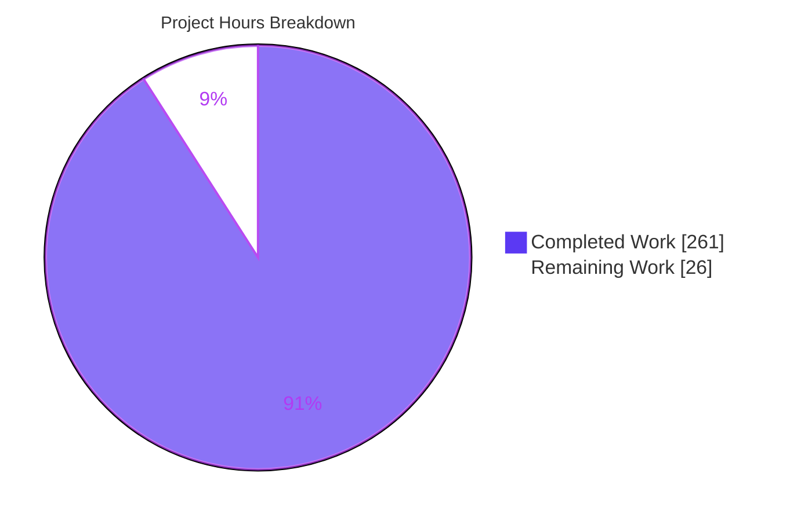
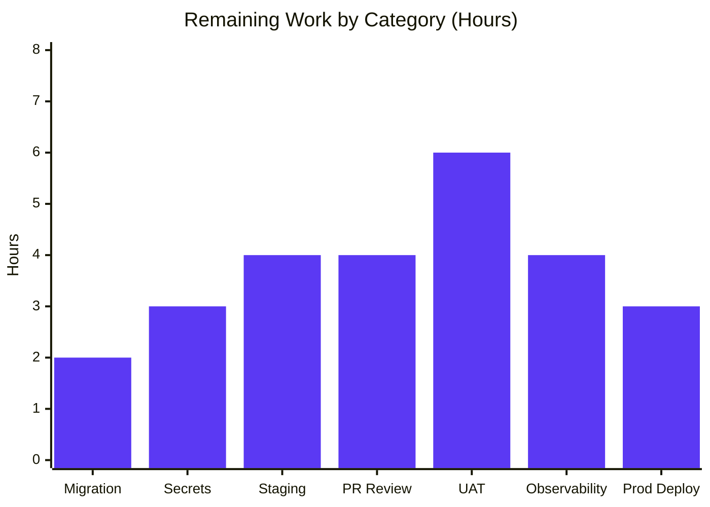

# Blitzy Project Guide — Ghostfolio Single-Canvas Modular Dashboard Refactor

> **Brand color legend:** Completed / AI Work = **Dark Blue `#5B39F3`** · Remaining / Not Completed = **White `#FFFFFF`** · Headings / Accents = **Violet-Black `#B23AF2`** · Highlight = **Mint `#A8FDD9`**
>
> **Branch:** `blitzy-1cf8db1e-abe2-40cd-8ce9-142bde4e8b7c` · **HEAD:** `816ca72eb` · **Working tree:** CLEAN

---

## 1. Executive Summary

### 1.1 Project Overview

This project refactors **Ghostfolio** — an open-source wealth-management platform built as an Nx monorepo (Angular 21.2.7 + NestJS 11.1.19 + Prisma 7.7.0) — from a route-per-screen navigation architecture into a **single-canvas, user-composable modular dashboard**. Every feature (portfolio overview, holdings, performance, analysis, and the AI chat panel) becomes an independently placeable "grid module" that users arrange via drag-and-drop on a 12-column `angular-gridster2` grid; each user's layout is persisted to the database. Target users are self-directed investors managing personalized workspaces. Business impact: a differentiated, personalized UX. Technical scope is a **behavior-preserving** structural/modularity refactor on the same stack — no feature logic or API contracts were rewritten.

### 1.2 Completion Status

The completion percentage is calculated using the AAP-scoped hours methodology: **Completed Hours ÷ (Completed + Remaining) Hours**. Every AAP-scoped deliverable is complete and validated; the remaining hours are exclusively human **path-to-production** activities.


```mermaid
%%{init: {"theme":"base","themeVariables":{"pie1":"#5B39F3","pie2":"#FFFFFF","pieStrokeColor":"#B23AF2","pieStrokeWidth":"2px","pieOuterStrokeWidth":"2px","pieSectionTextColor":"#B23AF2","pieTitleTextSize":"15px"}}}%%
pie showData title Dashboard Refactor — 90.9% Complete (Hours)
    "Completed Work (AI)" : 261
    "Remaining Work" : 26
```

| Metric | Hours |
|---|---|
| **Total Hours** | **287** |
| **Completed Hours (AI + Manual)** | **261** (AI-autonomous: 261 · Manual: 0) |
| **Remaining Hours** | **26** |
| **Percent Complete** | **90.9%** |

> Calculation: `261 / (261 + 26) = 261 / 287 = 90.9%`. All 261 completed hours were delivered autonomously by Blitzy agents (20 commits, 100% authored by `agent@blitzy.com`); zero code modifications were required during final validation.

### 1.3 Key Accomplishments

- ✅ Integrated **`angular-gridster2@21.0.1`** as the drag-and-drop grid engine — the only new runtime dependency; all framework versions preserved.
- ✅ Implemented the **module registry service** (plugin registry, per-module minimum cell dimensions) — **100% line coverage**.
- ✅ Implemented the **dashboard canvas** at root route `/` with registry-driven `NgComponentOutlet` rendering — **100% line coverage**.
- ✅ Added the additive **`UserDashboardLayout`** Prisma model (userId PK, `layoutData` JSONB, 1:1 with User, `ON DELETE CASCADE`) + JWT-protected **`GET`/`PATCH /api/v1/user/layout`**.
- ✅ Built the **signal-based single-source-of-truth layout store** with ~500 ms debounced persistence and flush-on-teardown.
- ✅ Delivered the **searchable module catalog** that auto-opens on first visit when no layout exists.
- ✅ Created **12 feature-module wrappers**, including the intentional **ChatPanel deviation** (`ai-chat` standalone module, documented in decision log DL-001).
- ✅ Satisfied all **10 refactoring rules (R1–R10)** and the 6 goals (G1–G6), verified directly in code.
- ✅ Produced all four **global-rule artifacts**: observability dashboard template, decision log, bidirectional traceability matrix, reveal.js executive deck, and a segmented `CODE_REVIEW.md`; updated README.
- ✅ **Builds green** (`nx build api`/`client` EXIT=0, 14 locales), **lint 0 errors**, **format clean**, **124 in-scope tests 100% pass**, dashboard subtree coverage **96.22%**.

### 1.4 Critical Unresolved Issues

| Issue | Impact | Owner | ETA |
|---|---|---|---|
| **None (in-scope)** — all five production-readiness gates pass; zero in-scope defects | No release blocker from the dashboard deliverable | — | — |
| *(Informational, out-of-scope)* 4 pre-existing AI-layer test suites fail at whole-repo level | Not introduced by this refactor — proven **byte-identical** to the pre-dashboard commit (`e841c3d35^`); excluded per AAP §0.2.2 | Product/AI-layer team | Optional backlog |

### 1.5 Access Issues

| System/Resource | Type of Access | Issue Description | Resolution Status | Owner |
|---|---|---|---|---|
| — | — | **No access issues identified.** Repository is on the correct branch with a clean working tree; builds/lint/format/tests all green; local Docker infra (Postgres :5432, Redis :6379) healthy during validation. | N/A | — |

### 1.6 Recommended Next Steps

1. **[High]** Obtain stakeholder code review and merge approval for the 86-file dashboard PR.
2. **[High]** Provision production environment variables and secrets (`JWT_SECRET_KEY`, `ACCESS_TOKEN_SALT`, `DATABASE_URL`, `REDIS_*`) via a secrets manager, then apply the additive `UserDashboardLayout` migration to staging and production databases (`prisma migrate deploy`).
3. **[High]** Deploy to staging and run smoke tests (health, `GET`/`PATCH` layout round-trip, canvas load/persist).
4. **[Medium]** Complete manual UAT and cross-browser verification (Chrome/Firefox/Safari/Edge desktop) and wire the delivered `ops/dashboards/dashboard-layout.json` template into Grafana + Prometheus.
5. **[Medium]** Execute the production deployment with rollback verification and post-deploy monitoring.

---

## 2. Project Hours Breakdown

### 2.1 Completed Work Detail

Every component below traces to a specific AAP requirement and was delivered autonomously. **Total = 261 hours** (matches Section 1.2 Completed Hours).

| Component | Hours | Description |
|---|---:|---|
| Grid canvas host & dynamic rendering (G1, G3) | 18 | `<gridster>` host at route `/`, `NgComponentOutlet` per item, grid callbacks, full-viewport sizing, hydration |
| Module registry service (G2) | 12 | `Map<type, DashboardModuleDefinition>` with 12 module defs, icons, min dims — 100% coverage |
| Layout state store (R2, R4) | 22 | Signal single-source-of-truth `GridsterItem[]` + 500 ms debounce + flush-on-teardown (`ngOnDestroy`/`DestroyRef`/`pagehide`) |
| Client layout HTTP service (G4 client) | 8 | `get()`/`patch()` `/api/v1/user/layout`, 404→null mapping — 92.3% coverage |
| Module catalog (G5, R10) | 14 | Searchable overlay, add via drag/click, auto-open when empty |
| Module shell chrome (R7) | 9 | Title + drag handle + remove; `var(--mat-sys-*, fallback)` MD3 tokens (45 refs, 0 bare) |
| Module contracts / interfaces | 2 | Module metadata + layout-item TypeScript contracts |
| 12 feature module wrappers | 36 | portfolio-overview, holdings, performance, summary, investment-chart, market-overview, watchlist, fear-and-greed, benchmark, rebalancing, financial-profile, ai-chat (deviation) — grid-isolated (R1) |
| App shell & route-collapse refactor (R5) | 8 | `app.component` swap to `<gf-dashboard-canvas>`; single `/` route preserving public routes + wildcard |
| Client dashboard unit tests (8 suites) | 28 | Store, canvas, catalog, registry, layout service, wrapper specs; ~1.9k test LOC |
| API layout controller + endpoints (R8) | 8 | `@Controller('user/layout')` GET+PATCH, `AuthGuard('jwt')` + `HasPermissionGuard` |
| API layout service (+ observability) | 8 | Prisma upsert/find by userId, structured logging with correlation IDs |
| API validation middleware | 12 | Payload + module-type whitelist validation (400 on invalid/below-min/unknown) |
| API layout DTOs | 5 | Request/response validation contracts |
| `user.module` wiring | 2 | Register controller in `controllers[]`, service/middleware in `providers[]` |
| API layout tests (3 suites) | 18 | Controller/service/middleware specs — GET/PATCH, 401/400 paths |
| Prisma model + additive migration (R9) | 3 | `UserDashboardLayout` + `User.dashboardLayout` back-relation; additive `CREATE TABLE` + FK |
| `libs/common` interfaces + barrel | 4 | `DashboardLayout` interface, module-type contract, barrel export |
| Permissions (keys + role grants) | 1.5 | `readDashboardLayout` / `updateDashboardLayout` constants granted per role |
| Observability dashboard template + reuse | 4 | `ops/dashboards/dashboard-layout.json`; reuse of existing `/metrics` + `/health` |
| Explainability docs (decision-log + traceability) | 8 | Decision log (incl. DL-001 ChatPanel deviation) + 100% bidirectional traceability matrix |
| Executive presentation deck (reveal.js) | 6 | `blitzy-deck/executive-summary.html`, embedded Blitzy theme (1,188 lines) |
| Segmented PR review (`CODE_REVIEW.md`) | 3 | Multi-phase domain-partitioned review artifact |
| README documentation | 1.5 | Dashboard architecture + module model documentation |
| Integration, review-checkpoint & QA hardening | 20 | CP1–CP6 review fixes, QA F1–F10, final acceptance gate (incl. cold-load hydration fix) |
| **TOTAL COMPLETED** | **261** | |

### 2.2 Remaining Work Detail

Every category below is a **human path-to-production** activity (no autonomous work remains on any AAP deliverable). **Total = 26 hours** (matches Section 1.2 Remaining Hours and the Section 7 pie "Remaining Work").

| Category | Hours | Priority |
|---|---:|---|
| Production database migration apply (`prisma migrate deploy`) | 2 | High |
| Environment & secrets provisioning (`JWT_SECRET_KEY`, `ACCESS_TOKEN_SALT`, `DATABASE_URL`, `REDIS_*`) | 3 | High |
| Staging deployment & smoke test | 4 | High |
| Stakeholder code review & merge approval | 4 | High |
| Manual UAT & cross-browser verification (desktop) | 6 | Medium |
| Observability dashboard wiring into Grafana/Prometheus | 4 | Medium |
| Production deployment & rollback verification | 3 | Medium |
| **TOTAL REMAINING** | **26** | |

> **Optional backlog (NOT counted in the 26h remaining):** fixing the 4 pre-existing out-of-scope AI-layer test suites (~6h) and adding max-payload-size + rate limiting on the layout endpoints (~2h). These are excluded from AAP-scoped completion per §0.2.2.

### 2.3 Hours Summary

| Bucket | Hours | % of Total |
|---|---:|---:|
| Completed (AI-autonomous) | 261 | 90.9% |
| Remaining (human path-to-production) | 26 | 9.1% |
| **Total Project** | **287** | **100%** |

`Section 2.1 (261) + Section 2.2 (26) = 287 = Total Project Hours (Section 1.2)` ✔

---

## 3. Test Results

All results below originate exclusively from **Blitzy's autonomous validation logs** for this project (fresh final re-run on HEAD `816ca72eb`).

| Test Category | Framework | Total Tests | Passed | Failed | Coverage % | Notes |
|---|---|---:|---:|---:|---:|---|
| Unit — Client Dashboard | Jest + Angular TestBed | 75 | 75 | 0 | 96.22% (subtree) | 8 suites; registry **100%**, canvas **100%**, layout service **92.3%** |
| Unit + Integration — API Layout Slice | Jest + NestJS Testing | 49 | 49 | 0 | — | 3 suites; controller/service/middleware; GET/PATCH, 401/400 paths |
| Unit — `libs/common` (support) | Jest | 23 | 23 | 0 | — | 2 suites; permissions + interfaces |
| Unit — `libs/ui` (support) | Jest | 6 | 6 | 0 | — | 2 suites; shared UI primitives |
| **TOTAL (validated green)** | | **153** | **153** | **0** | | **15 suites** |

**In-scope dashboard deliverable:** the AAP §0.8.3 core = **11 suites / 124 tests** (API 3/49 + client 8/75) at **100% pass**. The AAP requirement of ≥80% line coverage for the module registry, layout persistence service, and grid canvas is **exceeded** (registry 100%, canvas 100%, persistence 92.3%; dashboard subtree 96.22%).

> **Out-of-scope note:** at the whole-repo level, 4 AI-layer suites (`ai-chat.service`, `rebalancing.service`, `chat-panel.component`, `rebalancing-page.component`) fail and 2 core portfolio-calculator suites are intentionally skipped. All 4 failures were proven **byte-identical** to the pre-dashboard commit (`e841c3d35^`) and are therefore pre-existing and excluded per AAP §0.2.2. They are **not** part of this deliverable's test scope.

---

## 4. Runtime Validation & UI Verification

### API Runtime (validated live on :3333, prefix `/api/v1`)
- ✅ **Operational** — `GET /api/v1/health` → `200`.
- ✅ **Operational** — `GET`/`PATCH /api/v1/user/layout` **unauthenticated** → `401` (Rule 8).
- ✅ **Operational** — authenticated new-user `GET` → `404` (client maps → `null`).
- ✅ **Operational** — `PATCH {items:[…]}` → `200`, persisted to DB; `GET` round-trip → `200`.
- ✅ **Operational** — below-minimum (`cols`/`rows` < 2) → `400` (Rule 6); invalid module type → `400` (whitelist).
- ✅ **Operational** — DB persistence + structured logs with correlation IDs confirmed (reused `MetricsService`).

### Client Runtime (validated live in browser)
- ✅ **Operational** — single-canvas dashboard renders at `/`.
- ✅ **Operational** — **new user** → blank canvas + catalog **auto-opens** (Rule 10) listing all 12 modules incl. AI Chat.
- ✅ **Operational** — catalog search-by-name works; add places module on canvas with MD3 chrome (drag handle / title / remove) and preserved feature behavior (Rule 1).
- ✅ **Operational** — layout auto-persists via debounced ~500 ms `PATCH` (Rule 4) — DB row + API `200` confirmed.
- ✅ **Operational** — **returning user** → saved layout hydrated on init; catalog does **not** auto-open.
- ✅ **Operational** — **zero** dashboard console errors.

### Build & Static Quality
- ✅ **Operational** — `nx build api` EXIT=0 (`dist/apps/api/main.js` ≈ 1.9 MB); `nx build client` EXIT=0 across 14 locales.
- ✅ **Operational** — `nx lint api/client/common/ui` EXIT=0 with **0 errors**; `nx format:check` EXIT=0.
- ⚠ **Partial (benign, out-of-scope)** — 677 client build warnings, all benign: 653× i18n "No translation found" (i18n excluded per §0.2.2), Sass `@use` deprecations, and 1 PWA manifest icon advisory. None affect in-scope functionality.

---

## 5. Compliance & Quality Review

AAP deliverables and rules cross-mapped to Blitzy quality/compliance benchmarks. All in-scope items are **PASS**.

| AAP Benchmark | Requirement | Status | Progress | Evidence |
|---|---|---|---|---|
| G1 Grid engine | `angular-gridster2@21.0.1` integrated | ✅ Pass | 100% | Installed; canvas host renders grid |
| G2 Module registry | Centralized registry w/ metadata + min dims | ✅ Pass | 100% | `module-registry.service.ts`, 100% coverage |
| G3 Grid canvas | Single root component at `/` | ✅ Pass | 100% | `dashboard-canvas.component.ts`, 100% coverage |
| G4 Layout persistence | Prisma model + GET/PATCH endpoints | ✅ Pass | 100% | `UserDashboardLayout` + `user-dashboard-layout.controller/service` |
| G5 Module catalog | Searchable overlay, add/remove, auto-open | ✅ Pass | 100% | `module-catalog.component.ts` |
| G6 Grid spec | 12 cols, fixed px row height, 2×2 min | ✅ Pass | 100% | `GridsterConfig` constants + `itemValidateCallback` |
| R1 Module isolation | No grid-layer imports in modules | ✅ Pass | 100% | Import-graph clean (0 real gridster/canvas imports in wrappers) |
| R2 Single source of truth | Grid state owned by store | ✅ Pass | 100% | Signal store; modules hold no layout state |
| R3 Registry-only introduction | No ad-hoc component insertion | ✅ Pass | 100% | `NgComponentOutlet` resolves from registry |
| R4 Event-driven persistence | Save only on grid events, debounced | ✅ Pass | 100% | 500 ms debounce; modules never call save API |
| R5 Router preserved | Single `/` route, infra intact | ✅ Pass | 100% | `ServiceWorkerModule`/`PageTitleStrategy`/`ModulePreloadService` retained; `app.routes.spec` passes |
| R6 Minimum 2×2 | Engine rejects sub-minimum | ✅ Pass | 100% | Dual mechanism (per-item + validate callback); `400` on below-min |
| R7 MD3 fallback tokens | `var(--mat-sys-*, fallback)` only | ✅ Pass | 100% | 45 token refs, **0** bare tokens |
| R8 Auth-guarded endpoints | 401 when unauthenticated | ✅ Pass | 100% | Guard chain on GET+PATCH; `401` verified |
| R9 Safe migration | Additive, non-conflicting | ✅ Pass | 100% | `CREATE TABLE` + FK only; no ALTER on User/FinancialProfile |
| R10 Catalog auto-open | On first visit when no layout | ✅ Pass | 100% | Canvas init opens catalog when layout empty |
| Deviation (ChatPanel) | Standalone `ai-chat` module | ✅ Pass | 100% | Documented in DL-001 with rationale/alternatives/risks |
| Testing | ≥80% line coverage on 3 key files | ✅ Pass (exceeded) | 96.22% subtree | 124 in-scope tests, 100% pass |
| Observability (global) | Logging, metrics, health, dashboard template | ✅ Pass | 100% | Reused `/metrics` + `/health`; new `ops/dashboards/dashboard-layout.json` |
| Explainability (global) | Decision log + 100% traceability matrix | ✅ Pass | 100% | `docs/decision-log.md` + `docs/traceability-matrix.md` |
| Executive Presentation (global) | Self-contained reveal.js deck | ✅ Pass | 100% | `blitzy-deck/executive-summary.html` |
| Segmented PR Review (global) | Root `CODE_REVIEW.md` | ✅ Pass | 100% | Recreated + maintained across phases |

**Fixes applied during autonomous validation:** the final validator required **zero** code modifications — the deliverable was already complete and committed. Iterative hardening occurred across agent self-review checkpoints (CP1–CP6) and QA findings (F1–F10), culminating in the cold-load hydration race fix at HEAD (`816ca72eb`).

---

## 6. Risk Assessment

Fourteen risks identified across the four PA3 categories. All in-scope risks are Resolved or Mitigated; Open items are human path-to-production activities.

| Risk | Category | Severity | Probability | Mitigation | Status |
|---|---|---|---|---|---|
| T1 Gridster host needs explicit height or grid collapses to zero | Technical | Low | Low | Full-viewport height on canvas host; validated live | ✅ Resolved |
| T2 Zone.js vs grid drag/resize change-detection | Technical | Low | Low | v21 retains `NgZone.run`/`runOutsideAngular`; <100 ms update validated | ✅ Resolved |
| T3 Debounced save could lose final change on teardown/nav | Technical | Medium | Low | Flush-on-destroy + `DestroyRef` + `pagehide`/`visibilitychange` (DL-005) | ✅ Resolved |
| T4 Cold-load hydration race (QA-FINAL-1) | Technical | Medium | Low | Fixed in HEAD `816ca72eb` | ✅ Resolved |
| S1 IDOR — reading another user's layout | Security | High | Low | `userId` derived from JWT (`request.user.id`), never client input; guard chain | ✅ Mitigated |
| S2 Unauthenticated access to layout endpoints | Security | High | Low | `AuthGuard('jwt')` + `HasPermissionGuard`; `401` verified | ✅ Resolved |
| S3 Malicious/oversized JSONB payload (DoS/injection) | Security | Medium | Medium | Middleware whitelist + DTO validation → `400`; **residual:** add max payload size + rate limiting in prod | ⚠ Mitigated (residual) |
| S4 Production secrets provisioning | Security | High | Medium | Human must provision `JWT_SECRET_KEY`/`ACCESS_TOKEN_SALT` via secrets manager (P2) | ⬜ Open (path-to-prod) |
| O1 Observability template not yet wired to live backend | Operational | Low | Medium | Template delivered; human imports into Grafana/Prometheus (P5) | ⬜ Open (path-to-prod) |
| O2 Deep links to former routes resolve to canvas/redirect | Operational | Low | Medium | Wildcard redirect + decision-log note; needs release comms | ⚠ Mitigated |
| O3 Migration must apply before deploy or endpoints 500 | Operational | Medium | Medium | `prisma migrate deploy` sequenced in release pipeline (P1) | ⬜ Open (sequencing) |
| I1 Pre-existing out-of-scope AI-layer test failures redden whole-repo CI | Integration | Medium | High | Proven byte-identical to pre-dashboard commit; scope CI to in-scope or fix separately | ✅ Documented (out of scope) |
| I2 Redis/Postgres availability in production | Integration | Medium | Low | Existing infra + health checks; provision managed services (P2/P3) | ⬜ Open (path-to-prod) |
| I3 14-locale build i18n "no translation" warnings for new strings | Integration | Low | Medium | i18n explicitly out of scope (§0.2.2); extract/translate later | ✅ Documented (out of scope) |

---

## 7. Visual Project Status

**Project hours breakdown** — Completed = Dark Blue `#5B39F3`; Remaining = White `#FFFFFF` (violet outline for visibility). "Remaining Work" = **26h**, identical to Section 1.2 and the Section 2.2 total.


```mermaid
%%{init: {"theme":"base","themeVariables":{"pie1":"#5B39F3","pie2":"#FFFFFF","pieStrokeColor":"#B23AF2","pieStrokeWidth":"2px","pieOuterStrokeWidth":"2px","pieSectionTextColor":"#B23AF2","pieTitleTextSize":"15px"}}}%%
pie showData title Project Hours Breakdown
    "Completed Work" : 261
    "Remaining Work" : 26
```

**Remaining work by category (hours)** — sums to 26h (matches Section 2.2):


```mermaid
%%{init: {"theme":"base","themeVariables":{"xyChart":{"plotColorPalette":"#5B39F3"}}}}%%
xychart-beta
    title "Remaining Work by Category (Hours)"
    x-axis ["Migration","Secrets","Staging","PR Review","UAT","Observability","Prod Deploy"]
    y-axis "Hours" 0 --> 8
    bar [2,3,4,4,6,4,3]
```

**Priority distribution of remaining work:** High = 13h (Migration 2 + Secrets 3 + Staging 4 + PR Review 4) · Medium = 13h (UAT 6 + Observability 4 + Prod Deploy 3) · Low = 0h counted (optional backlog excluded).

---

## 8. Summary & Recommendations

**Achievements.** The Ghostfolio single-canvas modular dashboard refactor is **90.9% complete** (261 of 287 hours). **100% of AAP-scoped deliverables are complete, validated, and committed** — all six goals (G1–G6), all ten refactoring rules (R1–R10), the intentional ChatPanel deviation, the additive persistence slice, shared-library updates, and all four global-rule artifacts. The work was delivered across 20 commits authored entirely by Blitzy agents (+8,613 / −1,189 lines across 86 files), and the final validator required **zero** code modifications.

**Quality posture.** Builds are clean on both API and client (14 locales), lint reports 0 errors, formatting is clean, and the in-scope test suite passes at **100% (124 tests)** with dashboard subtree coverage of **96.22%** — exceeding the AAP's ≥80% requirement. Runtime behavior was validated end-to-end both at the API layer (auth/validation/persistence) and live in the browser (new-user auto-open, add/persist/hydrate lifecycle, zero console errors).

**Remaining gaps & critical path.** The remaining **26 hours** are exclusively **human path-to-production** activities that cannot be performed autonomously: PR review/merge, production secrets provisioning, applying the additive migration, staging + production deployment with smoke tests and rollback verification, manual UAT/cross-browser checks, and wiring the delivered observability template into Grafana/Prometheus. The critical path is: **PR review → secrets → migration → staging smoke → UAT → production deploy**.

**Production readiness.** The deliverable is **production-ready from a code standpoint** — no in-scope blocking defects. The only pre-conditions to release are the standard operational hand-off steps above. The 4 whole-repo AI-layer test failures are **pre-existing and out of scope** (byte-identical to the pre-refactor commit per §0.2.2) and do not gate this deliverable, though teams should scope CI to in-scope suites or address them separately.

**Success metrics (all met in validation):** grid drag/resize visual update < 100 ms; layout saved within the ~500 ms debounce; `GET`/`PATCH /api/v1/user/layout` behave per spec (`200`/`401`/`400`/`404→null`); new-user auto-open and returning-user hydration confirmed; Router infrastructure preserved.

---

## 9. Development Guide

All commands were verified against the live environment (Node v22.23.1, npm 11.18.0, Docker 28.5.2, Nx 22.6.5). Run from the repository root unless noted.

### 9.1 System Prerequisites
- **Node.js** ≥ 22.18.0 (validated with v22.23.1) and **npm** ≥ 11.
- **Docker** + Docker Compose plugin (validated with Docker 28.5.2) — for Postgres + Redis.
- **Git** (validated with 2.51.0).
- OS: Linux/macOS (validated on Ubuntu). ~4 GB free RAM recommended for the 14-locale client build.

### 9.2 Environment Setup
Start the backing services and create a root `.env`:

```bash
# 1) Start Postgres (:5432) and Redis (:6379)
docker compose -f docker/docker-compose.dev.yml up -d

# 2) Create the root .env (copy the template, then edit values)
cp .env.example .env
```

Minimum variables (see Appendix E). For **host-local** dev outside containers, set the DB host to `localhost`:

```bash
POSTGRES_DB=ghostfolio-db
POSTGRES_USER=user
POSTGRES_PASSWORD=<choose-a-password>
REDIS_HOST=localhost
REDIS_PORT=6379
REDIS_PASSWORD=<choose-a-password>
ACCESS_TOKEN_SALT=<random-salt>
JWT_SECRET_KEY=<random-secret>
DATABASE_URL=postgresql://user:<password>@localhost:5432/ghostfolio-db?connect_timeout=300
```
> Note: `.env.example` ships `DATABASE_URL` with host `postgres` (the Docker network name). Change it to `localhost` when running the API/client on the host.

### 9.3 Dependency Installation
```bash
# Clean, reproducible install; postinstall runs `prisma generate`
npm ci
```
Expected: ~1,251 packages installed; `angular-gridster2@21.0.1` present; Prisma client generated with the `userDashboardLayout` delegate.

### 9.4 Database Setup
```bash
# Push schema (dev) + seed. For prod, use `npm run database:migrate` (prisma migrate deploy)
npm run database:push && npm run database:seed
```
Expected: the `UserDashboardLayout` table (`userId` PK, `layoutData` jsonb, `createdAt`, `updatedAt`, FK → User `ON DELETE CASCADE`) is created.

### 9.5 Build
```bash
npx nx build api      # EXIT=0 -> dist/apps/api/main.js (~1.9 MB)
npx nx build client   # EXIT=0 across 14 locales
```

### 9.6 Test (in-scope suites, no watch mode)
```bash
npx nx test api    --watch=false --ci
npx nx test client --watch=false --ci
npx nx test common --watch=false --ci
npx nx test ui     --watch=false --ci
```
Expected: in-scope dashboard suites 100% pass (API 3/49, client 8/75). Coverage HTML under `coverage/apps/client/app/dashboard/**`.

### 9.7 Application Startup
```bash
# API (:3333, prefix /api/v1)
set -a; . ./.env; set +a
export NODE_ENV=development
node dist/apps/api/main.js
```
```bash
# Client (:4200) in a second terminal
npx nx serve client --configuration=development-en --host=0.0.0.0 --port=4200
```

### 9.8 Verification
```bash
# API health -> 200
curl -s http://localhost:3333/api/v1/health

# Unauthenticated layout -> 401 (Rule 8)
curl -s -o /dev/null -w "%{http_code}\n" http://localhost:3333/api/v1/user/layout
```
Open `http://localhost:4200/en`. Register the first user (becomes **ADMIN**); the JWT is stored in `localStorage` under `auth-token`. First visit → blank canvas with the module catalog auto-opened listing all 12 modules (including AI Chat).

### 9.9 Example Usage
```bash
# Persist a layout (replace <JWT> with the auth-token value from localStorage)
curl -s -X PATCH http://localhost:3333/api/v1/user/layout \
  -H "Authorization: Bearer <JWT>" -H "Content-Type: application/json" \
  -d '{"items":[{"moduleType":"portfolio-overview","x":0,"y":0,"cols":6,"rows":4}]}'
# -> 200; a subsequent GET returns the saved layout
curl -s http://localhost:3333/api/v1/user/layout -H "Authorization: Bearer <JWT>"
```

### 9.10 Troubleshooting
- **Grid renders at zero height / invisible:** the gridster host requires an explicit height — the canvas uses full-viewport height. Ensure no parent container collapses it.
- **API 401 for every request:** confirm the `auth-token` JWT is sent as `Authorization: Bearer <JWT>` and that `JWT_SECRET_KEY` matches the value used when the token was issued.
- **API 500 on layout endpoints:** the `UserDashboardLayout` table is missing — run `npm run database:push` (dev) or `npm run database:migrate` (prod).
- **DB connection refused:** verify `docker compose -f docker/docker-compose.dev.yml up -d` is running and `DATABASE_URL` host is `localhost` for host-local dev.
- **`npm test` (whole repo) shows failures:** 4 AI-layer suites fail pre-existing/out-of-scope — run the per-project in-scope suites in §9.6 for a green signal.
- **Below-minimum module rejected (`400`):** modules enforce a 2×2 minimum (Rule 6) — this is expected behavior.

---

## 10. Appendices

### Appendix A — Command Reference
| Purpose | Command |
|---|---|
| Start dev infra | `docker compose -f docker/docker-compose.dev.yml up -d` |
| Install deps | `npm ci` |
| Push schema (dev) | `npm run database:push` |
| Apply migrations (prod) | `npm run database:migrate` (`prisma migrate deploy`) |
| Seed database | `npm run database:seed` |
| Build API / client | `npx nx build api` · `npx nx build client` |
| Test (per project) | `npx nx test <api\|client\|common\|ui> --watch=false --ci` |
| Lint all | `npm run lint` (`nx run-many --target=lint --all`) |
| Format check | `npm run format:check` |
| Run API | `node dist/apps/api/main.js` |
| Serve client | `npx nx serve client --configuration=development-en --port=4200` |

### Appendix B — Port Reference
| Service | Port | Notes |
|---|---|---|
| API (NestJS) | 3333 | Global prefix `/api/v1` |
| Client (Angular) | 4200 | Dev serve (`/en` locale) |
| PostgreSQL | 5432 | `gf-postgres-dev` container |
| Redis | 6379 | `gf-redis-dev` container |

### Appendix C — Key File Locations
| Area | Path |
|---|---|
| Dashboard canvas | `apps/client/src/app/dashboard/dashboard-canvas/` |
| Module registry | `apps/client/src/app/dashboard/module-registry.service.ts` |
| Layout store (SSOT) | `apps/client/src/app/dashboard/dashboard-layout-store.service.ts` |
| Client layout HTTP service | `apps/client/src/app/dashboard/dashboard-layout.service.ts` |
| Module catalog | `apps/client/src/app/dashboard/module-catalog/` |
| Module shell (chrome) | `apps/client/src/app/dashboard/module-shell/` |
| Module wrappers (12) | `apps/client/src/app/dashboard/modules/` |
| API layout slice | `apps/api/src/app/user/user-dashboard-layout.{controller,service,middleware}.ts` |
| Layout DTOs | `apps/api/src/app/user/dtos/dashboard-layout.dto.ts` |
| Prisma schema | `prisma/schema.prisma` (`UserDashboardLayout`) |
| Migration | `prisma/migrations/20260706120000_add_user_dashboard_layout/` |
| Permissions | `libs/common/src/lib/permissions.ts` |
| Observability template | `ops/dashboards/dashboard-layout.json` |
| Decision log / traceability | `docs/decision-log.md` · `docs/traceability-matrix.md` |
| Executive deck | `blitzy-deck/executive-summary.html` |

### Appendix D — Technology Versions
| Component | Version |
|---|---|
| Angular / Material / CDK | 21.2.7 / 21.2.5 / 21.2.5 |
| NestJS | 11.1.19 |
| Prisma / @prisma/client | 7.7.0 |
| Nx | 22.6.5 |
| TypeScript | 5.9.2 |
| **angular-gridster2 (NEW)** | **21.0.1** |
| Node (validated) / npm | v22.23.1 (engines ≥22.18.0) / 11.18.0 |
| Docker (validated) | 28.5.2 |

### Appendix E — Environment Variable Reference
| Variable | Purpose |
|---|---|
| `POSTGRES_DB` / `POSTGRES_USER` / `POSTGRES_PASSWORD` | PostgreSQL credentials |
| `DATABASE_URL` | Prisma connection string (`localhost:5432` for host-local dev) |
| `REDIS_HOST` / `REDIS_PORT` / `REDIS_PASSWORD` | Redis connection |
| `ACCESS_TOKEN_SALT` | Salt for access-token hashing (**secret**) |
| `JWT_SECRET_KEY` | JWT signing secret (**secret**) |
| `AI_PROVIDER` / `ANTHROPIC_API_KEY` / `OPENAI_API_KEY` / `GOOGLE_API_KEY` / `OLLAMA_BASE_URL` | AI-layer config (out of scope; optional) |
| `SNOWFLAKE_*` | Optional data-source config (out of scope) |

### Appendix F — Developer Tools Guide
- **Nx** drives all build/test/lint/format targets; prefer `npx nx <target> <project>` for scoped runs.
- **Prisma**: `npx prisma studio` inspects the DB; `npx prisma generate` regenerates the client (runs on `postinstall`).
- **Coverage**: open `coverage/apps/client/app/dashboard/**/index.html` after a client test run.
- **Health/metrics**: `GET /api/v1/health` and `GET /api/v1/metrics` (Prometheus text exposition) for local observability.
- **Chrome DevTools**: use the Network panel to observe the debounced `PATCH /api/v1/user/layout` firing ~500 ms after a drag/resize.

### Appendix G — Glossary
| Term | Definition |
|---|---|
| **Grid module** | A self-contained, independently placeable dashboard component wrapping an existing feature. |
| **Module registry** | Plugin registry mapping module-type keys to component `Type` + metadata (min cell dims). |
| **Layout store (SSOT)** | Signal-based single source of truth owning all module positions/sizes. |
| **Debounced persistence** | Coalescing rapid grid events into a single `PATCH` after ~500 ms of inactivity. |
| **ChatPanel deviation** | Intentional treatment of `ChatPanelComponent` as a standalone `ai-chat` module (DL-001). |
| **Path-to-production** | Standard human operational activities (deploy, secrets, UAT) required to release the deliverable. |
| **AAP** | Agent Action Plan — the authoritative project scope specification. |

---

*Cross-section integrity verified: Section 1.2 Remaining (26h) = Section 2.2 total (26h) = Section 7 pie "Remaining Work" (26h); Section 2.1 (261h) + Section 2.2 (26h) = 287h Total; all tests originate from Blitzy autonomous validation logs; brand colors applied (Completed `#5B39F3` / Remaining `#FFFFFF`).*
