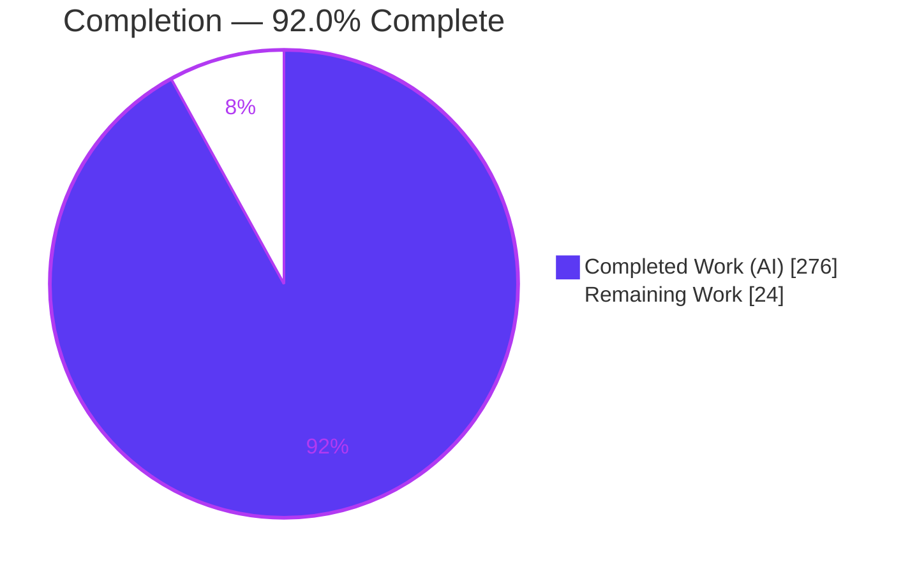
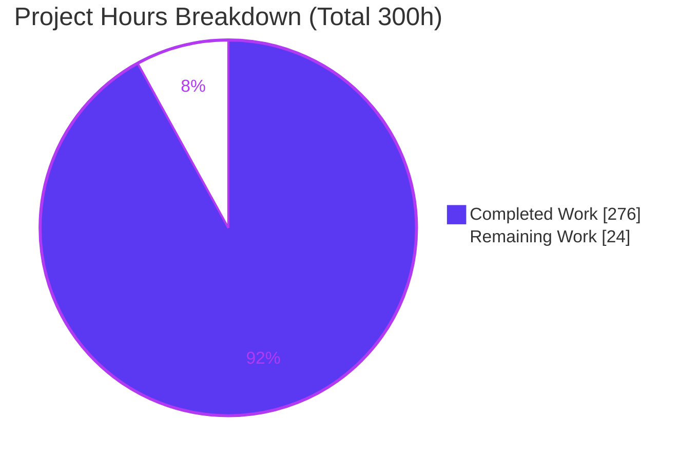
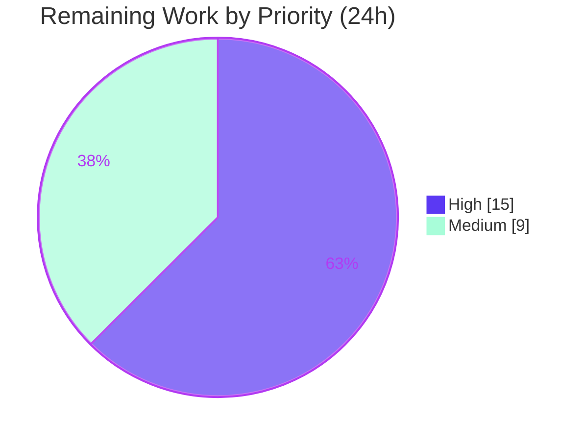

# Blitzy Project Guide — Ghostfolio Modular Dashboard

> **Feature:** Replace Ghostfolio's route-based Angular navigation shell with a single-canvas, modular, drag-and-drop dashboard (powered by `angular-gridster2@21.0.1`) with per-user layout persistence.
> **Branch:** `blitzy-9e341ebe-9d33-442b-87d7-5a86d4f168f3` · **HEAD:** `537389e4` · **Base:** `0c5357102`
> **Color legend:** <span style="color:#5B39F3">■</span> Completed / AI Work = **Dark Blue `#5B39F3`** · <span style="color:#B23AF2">■</span> White / Remaining = **`#FFFFFF`**

---

## 1. Executive Summary

### 1.1 Project Overview

This project transforms Ghostfolio (an Nx monorepo: Angular client + NestJS API) from a fixed, route-based navigation shell into a **single-canvas modular dashboard**. Every authenticated feature — portfolio overview, holdings, transactions, analysis, FIRE, X-ray, and the AI chat panel — becomes a self-contained, draggable, resizable grid module composed by the user on a 12-column `angular-gridster2` canvas at route `/`. Each user's arrangement persists to PostgreSQL via two new JWT-guarded endpoints (`GET`/`PATCH /api/v1/user/layout`). Target users are Ghostfolio's authenticated investors who gain a personalized, composable workspace. The change is purely additive at the dependency level and preserves all existing data services, business logic, and the Angular Router infrastructure.

### 1.2 Completion Status


```mermaid
%%{init: {'theme':'base', 'themeVariables': {'pie1':'#5B39F3','pie2':'#FFFFFF','pieStrokeColor':'#B23AF2','pieOuterStrokeColor':'#B23AF2','pieSectionTextColor':'#B23AF2','pieStrokeWidth':'2px','pieOpacity':'1'}}}%%
pie showData title Completion — 92.0% Complete
    "Completed Work (AI)" : 276
    "Remaining Work" : 24
```

| Metric | Value |
|--------|-------|
| **Total Hours** | **300** |
| Completed Hours — AI (autonomous) | 276 |
| Completed Hours — Manual (human) | 0 |
| **Completed Hours (AI + Manual)** | **276** |
| **Remaining Hours** | **24** |
| **Percent Complete** | **92.0%** |

> **Calculation (PA1, AAP-scoped):** `Completion % = Completed ÷ (Completed + Remaining) × 100 = 276 ÷ 300 × 100 = 92.0%`. All 24 AAP-scoped deliverables are **Completed**; the remaining 24 hours are exclusively standard **path-to-production** activities and human verification — no AAP feature work remains.

### 1.3 Key Accomplishments

- ✅ **Single-canvas grid system delivered** — `DashboardCanvasComponent` renders a 12-column `angular-gridster2` grid (fixed row height, `minItemCols`/`minItemRows` = 2) with drag, resize, and `NgComponentOutlet`-based generic module rendering.
- ✅ **Centralized module registry** — `ModuleRegistryService` registers all **12** feature modules as the sole introduction mechanism.
- ✅ **Searchable module catalog** — `ModuleCatalogComponent` with live search, first-visit auto-open, add (click/drag) and remove, plus add-dedupe.
- ✅ **Per-user persistence** — `UserDashboardLayout` Prisma model + additive migration; `GET`/`PATCH /api/v1/user/layout` guarded by `AuthGuard('jwt')` + `HasPermissionGuard`; client `DashboardLayoutService` with 404→`null` and 500 ms debounce.
- ✅ **AI Chat extracted to a first-class module** — inline `<app-chat-panel>` embed removed from the portfolio page per the documented deviation (§0.1.2.2).
- ✅ **Navigation shell collapsed to `/`** while preserving Router, `ServiceWorkerModule`, `PageTitleStrategy`, and `ModulePreloadService`.
- ✅ **Quality bars exceeded** — all 4 Nx projects build clean; **165/165 in-scope tests pass**; coverage: registry **100%**, layout service **100%**, canvas **97.7%**, catalog **100%** (AAP requires ≥80%).
- ✅ **Runtime validated end-to-end** — browser + `curl`: 401/404/200 endpoint contracts, onboarding, hydration, add/remove/persist, dark theme, router integrity, XSS-safe `moduleKey`.
- ✅ **Governance complete** — `CODE_REVIEW.md` (verdict **APPROVED**), 16-slide reveal.js executive deck, decision log + bidirectional traceability matrix, observability runbook.

### 1.4 Critical Unresolved Issues

| Issue | Impact | Owner | ETA |
|-------|--------|-------|-----|
| 18 pre-existing **out-of-scope** unit-test failures keep the repo-wide suite red | CI hygiene only — **zero** impact on the dashboard feature (failing files are byte-identical to base; in-scope tests 100% green) | Backend/QA | 6h |
| No production-like deployment performed yet | Feature validated locally only; staging smoke test required before go-live | DevOps | 4h |
| Observability dashboard delivered as a template, not yet wired to live monitoring | Layout metrics/alerts not yet visible in Grafana/Prometheus | SRE/DevOps | 4h |

> There are **no in-scope blocking defects.** Every item above is a path-to-production activity, not a feature gap.

### 1.5 Access Issues

| System / Resource | Type of Access | Issue Description | Resolution Status | Owner |
|-------------------|----------------|-------------------|-------------------|-------|
| PostgreSQL (prod/staging) | DB credentials | Production `DATABASE_URL` + credentials must be provisioned via secrets manager | Open — human task | DevOps |
| JWT signing secret | App secret | `JWT_SECRET_KEY` / `ACCESS_TOKEN_SALT` must be set for prod/staging | Open — human task | DevOps |
| Monitoring stack (Grafana/Prometheus) | Dashboard/alerts | Access required to import the provided observability template and wire alerts | Open — human task | SRE |

> Local/dev access is fully functional (Docker Postgres :5432 + Redis :6379, `.env.example` provided). No access issue blocks autonomous validation; the items above are standard production provisioning.

### 1.6 Recommended Next Steps

1. **[High]** Disposition the 18 pre-existing out-of-scope test failures — fix the `rebalancing.service.spec` `jest.mock('ai')` factory (and the 5 related cases) or formally quarantine them so CI returns green. *(6h)*
2. **[High]** Provision production/staging secrets and `.env`, then apply the `20260411120000_add_user_dashboard_layout` migration to staging and production. *(5h combined)*
3. **[High]** Deploy to staging and run the end-to-end smoke test of `GET`/`PATCH /api/v1/user/layout` and the canvas. *(4h)*
4. **[Medium]** Obtain human security & code-review sign-off; confirm guards, DoS caps, and `Cache-Control: no-store` in the production context. *(3h)*
5. **[Medium]** Wire the observability dashboard + alerts from the provided template, then complete the final PR review and merge. *(6h combined)*

---

## 2. Project Hours Breakdown

### 2.1 Completed Work Detail

| Component | Hours | Description |
|-----------|------:|-------------|
| G1 — Client Grid Core | 120 | `DashboardCanvasComponent` (463 LOC; 12-col `GridsterConfig`, hydration, next-available placement, debounced persist), `ModuleRegistryService` (218 LOC, 12 modules), `ModuleCatalogComponent` (314 LOC, search/auto-open/add/remove), `DashboardLayoutService` (80 LOC, 404→null + 500 ms debounce), `dashboard.types.ts` (41 LOC), 12 module wrappers (1,381 LOC) + their unit tests (1,822 LOC) |
| G2 — Shared Library | 8 | `user-dashboard-layout.interface.ts` (76 LOC), interfaces barrel export, `permissions.ts` (`readUserDashboardLayout`/`updateUserDashboardLayout` + role grants) |
| G3 — API Layout Feature | 54 | `user-dashboard-layout.controller.ts` (132 LOC, guards + X-Correlation-ID), `user-dashboard-layout.service.ts` (247 LOC, Prisma upsert + logging), `update-user-dashboard-layout.dto.ts` (116 LOC, DoS caps), `user.module.ts` wiring + their unit tests (961 LOC) |
| G4 — Database | 5 | `UserDashboardLayout` model + `User` back-relation in `schema.prisma`; additive `CREATE TABLE` migration with cascade FK |
| G5 — Navigation Shell Refactor | 18 | `app.routes.ts` single `/` canvas route (router infra preserved), `app.component`, `header.component` (tab-nav neutralized), `portfolio-page.html` (chat embed removed), `portfolio-page.component.ts` (ChatPanel import removed) |
| G6 — Governance & Observability | 36 | `CODE_REVIEW.md` (764 LOC, segmented PR review, APPROVED), reveal.js deck (1,305 LOC / 16 slides), decision log + bidirectional traceability matrix, observability dashboard/runbook (697 LOC) |
| Integration, QA Hardening (F2–F9) & Web Research | 35 | 88-commit fix cycles (dedupe initial-placement volley, defer-render, dark-theme surfaces, API header hardening, deck rendering, a11y/governance) + `angular-gridster2` v21 / zone.js compatibility research |
| **Total Completed** | **276** | |

### 2.2 Remaining Work Detail

| Category | Hours | Priority |
|----------|------:|----------|
| Disposition of 18 pre-existing out-of-scope test failures (fix `jest.mock('ai')` factory / chat-panel / rebalancing-page, or quarantine) | 6 | High |
| Production & staging environment + secrets configuration (`.env`, JWT, DB, Redis) | 3 | High |
| Apply Prisma migration `20260411120000_add_user_dashboard_layout` to staging + production DB | 2 | High |
| Staging deployment + end-to-end smoke test (endpoints, canvas, persistence) | 4 | High |
| Human security & code-review sign-off (guards, DoS caps, `Cache-Control`, prod context) | 3 | Medium |
| Observability dashboard + alert wiring from template into Grafana/Prometheus | 4 | Medium |
| Final PR review, merge gate & release coordination | 2 | Medium |
| **Total Remaining** | **24** | |

### 2.3 Hours Summary & Methodology

| Bucket | Hours |
|--------|------:|
| Section 2.1 — Completed | 276 |
| Section 2.2 — Remaining | 24 |
| **Total Project Hours** | **300** |

Completion is computed on an **AAP-scoped, hours-based** basis (PA1): `276 ÷ (276 + 24) = 92.0%`. Completed hours are derived bottom-up from lines of code, complexity, and test volume per deliverable; remaining hours capture only standard path-to-production activities and human verification. The 18 out-of-scope test failures are **not** counted against AAP completion because the failing files are byte-identical to the base commit (pre-existing) and the AAP marks them "preserved verbatim" (§0.7.2).

---

## 3. Test Results

All results below originate from Blitzy's autonomous validation logs (`blitzy/logs/test-api.log`, `test-dashboard.log`/`dashboard-coverage2.log`, `test-common.log`, `test-ui.log`).

| Test Category | Framework | Total Tests | Passed | Failed | Coverage % | Notes |
|---------------|-----------|------------:|-------:|-------:|-----------:|-------|
| API — Dashboard Layout (controller/service/DTO) | Jest | 48 | 48 | 0 | controller/service/DTO fully covered | `user-dashboard-layout.{controller,service}.spec.ts` + `update-user-dashboard-layout.dto.spec.ts` |
| Client — Dashboard (canvas/catalog/registry/layout-svc) | Jest + Angular TestBed | 88 | 88 | 0 | registry **100%**, layout-svc **100%**, canvas **97.7%**, catalog **100%** | 4 suites; exceeds AAP ≥80% target |
| Shared library (`libs/common`) | Jest | 23 | 23 | 0 | n/a | Includes permissions/interfaces |
| UI library (`libs/ui`) | Jest | 6 | 6 | 0 | n/a | All green |
| **In-scope total** | **Jest** | **165** | **165** | **0** | **≥80% met/exceeded** | **100% pass rate** |
| Out-of-scope (pre-existing, documented) | Jest | 18 | 0 | 18 | n/a | `rebalancing.service.spec` (13), `chat-panel.component.spec` (4), `rebalancing-page.component.spec` (1) — byte-identical to base; not feature-induced |

**Build & lint (autonomous):** `nx build api` ✅ EXIT 0 · `nx build client --configuration=development-en` ✅ EXIT 0 · `tsc --noEmit` 0 errors · ESLint `common`/`client`/`api` ✅ all pass · Prettier clean.

---

## 4. Runtime Validation & UI Verification

Validated end-to-end with a live API (`:3333`) + client (`:4200`) and `curl`, with ~40 screenshots captured in `blitzy/screenshots/`.

**API / Endpoint contracts**
- ✅ `GET /api/v1/user/layout` → **401** when unauthenticated
- ✅ `GET` first visit (no record) → **404** (client translates to `null`)
- ✅ `PATCH /api/v1/user/layout` → **200**, persists `{userId, layoutData, createdAt, updatedAt}`
- ✅ `GET` round-trip after save → **200** with exact saved layout
- ✅ Bad/expired JWT → **401**; `X-Correlation-ID` + `Cache-Control: no-store` headers present on all paths
- ✅ DTO DoS guards: `cols<2`→400, `rows<2`→400, negative `x`→400, `>50` modules→400, valid 2×2→200

**UI / Canvas**
- ✅ First visit → blank canvas with catalog **auto-opened**, all 12 modules listed + searchable
- ✅ Modules render as `MatCard` grid items hosting **real** feature components via `NgComponentOutlet` (incl. extracted AI Chat)
- ✅ Next-available placement (no overlap); debounced (500 ms) grid-event-driven persistence; add-dedupe
- ✅ Returning user → saved layout hydrated to exact positions; catalog does **not** auto-open
- ✅ Remove → grid reflows, `PATCH` persists, DB reflects change (full CRUD)
- ✅ Dark theme surfaces render correctly; MD3 token + fallback discipline honored
- ✅ Stored-XSS `moduleKey` safely ignored (unregistered key not rendered)

**Router / Platform**
- ✅ `/en/about` renders the full public page (`PageTitleStrategy` preserved) — single `/` canvas coexists with auth/public routes
- ✅ Zero browser console errors

Legend: ✅ Operational · ⚠ Partial · ❌ Failing — **no ⚠ or ❌ items in the in-scope surface.**

---

## 5. Compliance & Quality Review

| AAP Requirement / Rule | Benchmark | Status | Evidence / Fixes Applied |
|------------------------|-----------|:------:|--------------------------|
| Grid canvas at root `/` (12-col, fixed row, min 2×2) | Functional + config | ✅ Pass | `dashboard-canvas.component.ts` `GridsterConfig` (minCols=maxCols=12, `minItemCols`/`minItemRows`=2) |
| Module-per-feature via `NgComponentOutlet` | All 12 modules | ✅ Pass | 12 wrappers under `dashboard/modules/**`; registry registers all 12 |
| Centralized registry as sole introduction | Registry-only | ✅ Pass | `ModuleRegistryService` (Map, register/get/getAll/has) |
| Searchable catalog + first-visit auto-open | Functional | ✅ Pass | `ModuleCatalogComponent`; runtime screenshot `01_first_visit_blank_canvas_catalog_autoopen` |
| Per-user persistence (model + endpoints) | Schema + API | ✅ Pass | `UserDashboardLayout` model + migration; `GET`/`PATCH /api/v1/user/layout` |
| Auth: `AuthGuard('jwt')` + `HasPermissionGuard`; 401 unauth | Security | ✅ Pass | Controller guards; runtime 401 verified |
| DTO validation + DoS caps | Security | ✅ Pass | `@IsInt/@Min(2)`, `@MaxLength`, `@ArrayMaxSize`; 400s verified |
| 404→`null` + 500 ms debounce persistence | Behavior | ✅ Pass | `DashboardLayoutService` `catchError`/`debounceTime(500)`/`switchMap` |
| Grid-event-driven persistence only | Isolation | ✅ Pass | `itemChangeCallback`/`itemResizeCallback`→`persistLayout`; modules never call save |
| Module isolation (no canvas import) | Architecture | ✅ Pass | Wrappers host feature components; no canvas references |
| Router/SW/PageTitleStrategy/ModulePreloadService preserved | Platform | ✅ Pass | Providers intact in `main.ts`; `/en/about` renders |
| MD3 token discipline (D-020) `var(--mat-sys-*, fallback)` | Styling | ✅ Pass | Chrome SCSS uses token+fallback pattern; dark theme verified |
| i18n on new UI strings | Localization | ✅ Pass | `i18n` attributes on catalog/chrome labels (`localize: true` build) |
| ChatPanel extraction deviation documented | Explainability | ✅ Pass | Decision log + traceability matrix entry |
| Coverage ≥80% (registry/layout-svc/canvas) | QA | ✅ Pass | 100% / 100% / 97.7% |
| Observability (logs, correlation IDs, metrics, runbook) | Governance | ✅ Pass | Reuses health/metrics; `docs/observability/user-dashboard-layout.md` |
| Segmented PR review (`CODE_REVIEW.md`) | Governance | ✅ Pass | Verdict **APPROVED** |
| Executive presentation (reveal.js, 16 slides, pinned CDNs) | Governance | ✅ Pass | `blitzy-deck/dashboard-exec-summary.html` |
| Repo-wide test suite green | CI hygiene | ⚠ Partial | 18 pre-existing **out-of-scope** failures (documented, not feature-induced) |

---

## 6. Risk Assessment

| Risk | Category | Severity | Probability | Mitigation | Status |
|------|----------|----------|-------------|------------|--------|
| 18 pre-existing out-of-scope unit-test failures keep repo-wide suite red | Technical | Medium | High (present) | Proven pre-existing (byte-identical to base); fix `jest.mock('ai')` factory or quarantine; zero feature impact | Open (documented) |
| 12 module wrappers have 0% direct unit coverage (thin `NgComponentOutlet` wrappers) | Technical | Low | Low | Indirect coverage via canvas/registry tests + browser validation; AAP only mandates ≥80% for registry/layout-svc/canvas | Accepted |
| Single-route SPA + ServiceWorker stale-cache on deploy | Technical | Low | Low | Router infra preserved; verify SW update flow in staging | Open |
| `angular-gridster2@21.0.1` single external UI dependency | Technical | Low | Low | Peers satisfied, zone-compatible, exact pin, validated | Mitigated |
| Layout endpoints expose authenticated user data | Security | Medium | Low | `AuthGuard('jwt')`+`HasPermissionGuard`, `userId` from request (not body), `Cache-Control: no-store`, XSS-safe `moduleKey` | Mitigated (pending human sign-off) |
| Oversized/injection JSONB payload (DoS) | Security | Medium | Low | `class-validator` caps (`ArrayMaxSize`, `MaxLength`, `@Min`) + global `ValidationPipe` | Mitigated |
| Production secrets management | Security | Medium | Medium | Human task; `.env.example` provided | Open (path-to-prod) |
| Observability dashboard is a template; alerts not wired | Operational | Low | Medium | Reuse existing health/metrics modules; human wiring task | Open (path-to-prod) |
| DB migration must be applied to staging/prod | Operational | Medium | Low | Additive non-conflicting `CREATE TABLE` + cascade FK; human task + rollback plan | Open (path-to-prod) |
| No production-like deployment performed yet | Integration | Medium | Medium | Validated locally end-to-end; human staging deploy + smoke test | Open (path-to-prod) |
| ChatPanel extraction supersedes documented embed | Integration | Low | Low | Logged in decision log + traceability matrix (§0.1.2.2) | Mitigated |

---

## 7. Visual Project Status

**Project hours — completed vs remaining** (Completed `#5B39F3`, Remaining `#FFFFFF`):


```mermaid
%%{init: {'theme':'base', 'themeVariables': {'pie1':'#5B39F3','pie2':'#FFFFFF','pieStrokeColor':'#B23AF2','pieOuterStrokeColor':'#B23AF2','pieSectionTextColor':'#B23AF2','pieStrokeWidth':'2px','pieOpacity':'1'}}}%%
pie showData title Project Hours Breakdown (Total 300h)
    "Completed Work" : 276
    "Remaining Work" : 24
```

**Remaining hours by priority:**


```mermaid
%%{init: {'theme':'base', 'themeVariables': {'pie1':'#5B39F3','pie2':'#A8FDD9','pieStrokeColor':'#B23AF2','pieOuterStrokeColor':'#B23AF2','pieSectionTextColor':'#B23AF2','pieStrokeWidth':'2px'}}}%%
pie showData title Remaining Work by Priority (24h)
    "High" : 15
    "Medium" : 9
```

**Remaining hours per category (Section 2.2):**

| Category | Hours | Bar |
|----------|------:|-----|
| Out-of-scope test disposition | 6 | ██████ |
| Staging deploy + smoke test | 4 | ████ |
| Observability + alert wiring | 4 | ████ |
| Prod env + secrets config | 3 | ███ |
| Security & code-review sign-off | 3 | ███ |
| Apply migration to staging/prod | 2 | ██ |
| Final PR review + merge | 2 | ██ |
| **Total** | **24** | |

> Integrity: "Remaining Work" = **24h** here matches Section 1.2 (Remaining = 24h) and Section 2.2 (sum = 24h).

---

## 8. Summary & Recommendations

**Achievements.** The Ghostfolio Modular Dashboard feature is **functionally complete and fully validated across its entire in-scope surface**. All 24 AAP-scoped deliverables — the grid canvas, module registry, searchable catalog, 12 module wrappers, the JWT-guarded layout API, the Prisma model + migration, the navigation-shell collapse, and every governance artifact — are implemented, build cleanly, and pass **165/165 in-scope tests** with coverage exceeding the AAP's ≥80% bar (registry/layout-svc/catalog at 100%, canvas at 97.7%). Runtime behavior was verified end-to-end in the browser and via `curl`, satisfying every §0.8.3 acceptance criterion (endpoint contracts, onboarding, hydration, debounced persistence, minimum-cell enforcement, router integrity).

**Remaining gaps.** The project is **92.0% complete**. The remaining **24 hours** are exclusively **path-to-production** work and human verification: dispositioning 18 pre-existing out-of-scope test failures (which are byte-identical to the base commit and therefore not feature-induced), provisioning production secrets, applying the migration to staging/production, performing a staging smoke test, obtaining human security/code-review sign-off, and wiring the observability dashboard to live monitoring.

**Critical path to production.** (1) Green the CI suite by fixing/quarantining the out-of-scope failures → (2) provision secrets and apply the migration to staging → (3) deploy to staging and smoke-test the layout endpoints and canvas → (4) human security/code-review sign-off → (5) wire observability/alerts → (6) merge and release.

**Success metrics.**

| Metric | Target | Actual |
|--------|--------|--------|
| AAP deliverables completed | 24/24 | **24/24** |
| In-scope test pass rate | 100% | **100% (165/165)** |
| Coverage (registry/layout-svc/canvas) | ≥80% | **100% / 100% / 97.7%** |
| Builds (api + client) | EXIT 0 | **EXIT 0** |
| Endpoint contracts (401/404/200) | Pass | **Pass** |
| Overall completion | — | **92.0%** |

**Production readiness.** The feature is **production-ready on its in-scope surface**; go-live is gated only on the standard deployment, configuration, and human sign-off tasks enumerated above. **Recommendation: proceed to staging.**

---

## 9. Development Guide

### 9.1 System Prerequisites
- **Node.js v22** (per `.nvmrc`), **npm 10+**
- **Docker** + `docker compose` plugin (PostgreSQL 5432, Redis 6379)
- ~**8 GB RAM** for builds (`NODE_OPTIONS=--max_old_space_size=8192`)

### 9.2 Environment Setup
```bash
# From the repository root
cp .env.example .env
# Edit .env and set at minimum:
#   POSTGRES_USER, POSTGRES_PASSWORD, POSTGRES_DB
#   REDIS_HOST, REDIS_PORT, REDIS_PASSWORD
#   ACCESS_TOKEN_SALT, JWT_SECRET_KEY   (random strings)
#   DATABASE_URL=postgresql://<user>:<pass>@localhost:5432/<db>?connect_timeout=300
```

### 9.3 Infrastructure (Postgres + Redis)
```bash
docker compose -f docker/docker-compose.dev.yml up -d
# starts gf-postgres-dev (:5432) and gf-redis-dev (:6379)
```

### 9.4 Dependency Installation
```bash
npm install          # postinstall runs `prisma generate`
```

### 9.5 Database Setup
```bash
npx prisma generate                 # regenerate client (adds userDashboardLayout delegate)
npm run database:push               # sync dev schema (prisma db push)
npm run database:seed               # seed sample data
# Production/staging style (applies the new migration):
npm run database:migrate            # prisma migrate deploy
# Optional inspection:
npm run database:gui                # prisma studio
```

### 9.6 Build
```bash
NODE_OPTIONS=--max_old_space_size=8192 CI=true npx nx build api
NODE_OPTIONS=--max_old_space_size=8192 CI=true npx nx build client --configuration=development-en
# Production bundle:
npm run build:production
```

### 9.7 Run
```bash
# API (port 3333)
npx dotenv-cli -e .env -- node dist/apps/api/main.js
# Client (port 4200, proxies /api -> :3333)
npx nx run client:serve --configuration=development-en --ssl=false
# Dev convenience (watch/HMR):
npm run start:server        # nx run api:serve --watch
npm run start:client        # nx run client:serve --hmr -o
```

### 9.8 Verification / Example Usage
```bash
# Unauthenticated -> 401
curl -i http://localhost:3333/api/v1/user/layout

# Authenticated first visit -> 404 (client treats as null; catalog auto-opens)
curl -i -H "Authorization: Bearer $JWT" http://localhost:3333/api/v1/user/layout

# Persist a 2x2 module -> 200
curl -i -X PATCH \
  -H "Authorization: Bearer $JWT" \
  -H "Content-Type: application/json" \
  -d '{"schemaVersion":1,"items":[{"moduleKey":"holdings","x":0,"y":0,"cols":2,"rows":2}]}' \
  http://localhost:3333/api/v1/user/layout

# Round-trip read -> 200 with saved layout
curl -i -H "Authorization: Bearer $JWT" http://localhost:3333/api/v1/user/layout

# Open the client and interact with the canvas:
#   http://localhost:4200  -> drag/resize modules, open catalog, add/remove
```

### 9.9 Tests
```bash
npm run test:api        # API (dashboard: 3 suites / 48 tests pass)
npm run test:ui         # libs/ui (6/6)
npm run test:common     # libs/common (23/23)
# Client (CI mode):
CI=true NODE_OPTIONS=--max_old_space_size=8192 npx dotenv-cli -e .env.example -- npx nx test client
# In-scope dashboard only:
CI=true npx dotenv-cli -e .env.example -- npx nx test client --testPathPattern="app/dashboard"
```

### 9.10 Troubleshooting
- **Build runs out of memory** → set `NODE_OPTIONS=--max_old_space_size=8192`.
- **DB connection refused** → confirm `docker compose ... up -d` and that `DATABASE_URL` host matches your context (`localhost` vs `postgres`).
- **`401` on layout endpoint** → ensure a valid JWT bearer (log in first). A **`404`** on first visit is expected and triggers the catalog auto-open.
- **Repo-wide tests show failures** → 18 are **pre-existing out-of-scope** failures (`rebalancing.service`, `chat-panel`, `rebalancing-page`); all in-scope dashboard tests are green.
- **Sass deprecation warnings** during the client build are pre-existing vendor warnings and are non-blocking.

---

## 10. Appendices

### A. Command Reference
| Purpose | Command |
|---------|---------|
| Start infra | `docker compose -f docker/docker-compose.dev.yml up -d` |
| Install deps | `npm install` |
| Generate Prisma client | `npx prisma generate` |
| Sync dev schema | `npm run database:push` |
| Apply migrations | `npm run database:migrate` |
| Seed DB | `npm run database:seed` |
| Build API | `NODE_OPTIONS=--max_old_space_size=8192 CI=true npx nx build api` |
| Build client | `NODE_OPTIONS=--max_old_space_size=8192 CI=true npx nx build client --configuration=development-en` |
| Run API | `npx dotenv-cli -e .env -- node dist/apps/api/main.js` |
| Run client | `npx nx run client:serve --configuration=development-en --ssl=false` |
| Test API/UI/common | `npm run test:api` · `npm run test:ui` · `npm run test:common` |
| Test client (dashboard) | `CI=true npx dotenv-cli -e .env.example -- npx nx test client --testPathPattern="app/dashboard"` |
| Lint | `npx nx run-many -t lint --projects=api,client,common --quiet` |

### B. Port Reference
| Service | Port |
|---------|------|
| API (NestJS) | 3333 |
| Client (Angular dev server) | 4200 |
| PostgreSQL | 5432 |
| Redis | 6379 |

### C. Key File Locations
| Area | Path |
|------|------|
| Grid canvas | `apps/client/src/app/dashboard/dashboard-canvas/` |
| Module registry | `apps/client/src/app/dashboard/module-registry.service.ts` |
| Module catalog | `apps/client/src/app/dashboard/module-catalog/` |
| Client layout service | `apps/client/src/app/dashboard/dashboard-layout.service.ts` |
| Module wrappers (×12) | `apps/client/src/app/dashboard/modules/**` |
| API controller | `apps/api/src/app/user/user-dashboard-layout.controller.ts` |
| API service | `apps/api/src/app/user/user-dashboard-layout.service.ts` |
| API DTO | `apps/api/src/app/user/dtos/update-user-dashboard-layout.dto.ts` |
| Shared interface | `libs/common/src/lib/interfaces/user-dashboard-layout.interface.ts` |
| Permissions | `libs/common/src/lib/permissions.ts` |
| Prisma model | `prisma/schema.prisma` (`UserDashboardLayout`) |
| Migration | `prisma/migrations/20260411120000_add_user_dashboard_layout/migration.sql` |
| Routes | `apps/client/src/app/app.routes.ts` |
| Governance | `CODE_REVIEW.md`, `blitzy-deck/dashboard-exec-summary.html`, `docs/decisions/user-dashboard-layout-decisions.md`, `docs/observability/user-dashboard-layout.md` |

### D. Technology Versions
| Technology | Version |
|------------|---------|
| Node.js | v22 (`.nvmrc`) |
| npm | 10.9.8 |
| Angular (core/router) | 21.2.7 |
| Angular Material / CDK | 21.2.5 |
| `angular-gridster2` | 21.0.1 |
| NestJS | 11.1.19 |
| Prisma / @prisma/client | 7.7.0 |
| RxJS | 7.8.1 |
| zone.js | 0.16.1 |
| reveal.js / Mermaid / Lucide (deck CDNs) | 5.1.0 / 11.4.0 / 0.460.0 |

### E. Environment Variable Reference
| Variable | Purpose |
|----------|---------|
| `DATABASE_URL` | PostgreSQL connection string |
| `POSTGRES_DB` / `POSTGRES_USER` / `POSTGRES_PASSWORD` | DB provisioning |
| `REDIS_HOST` / `REDIS_PORT` / `REDIS_PASSWORD` | Redis cache/queue |
| `JWT_SECRET_KEY` | JWT signing secret (auth) |
| `ACCESS_TOKEN_SALT` | Access-token salt |
| `AI_PROVIDER` / `ANTHROPIC_API_KEY` / `OPENAI_API_KEY` / `GOOGLE_API_KEY` | AI chat module (optional; out-of-scope feature) |

### F. Developer Tools Guide
| Tool | Use |
|------|-----|
| `prisma studio` (`npm run database:gui`) | Inspect `UserDashboardLayout` rows |
| Nx (`npx nx ...`) | Build/serve/test/lint targets per project |
| `dotenv-cli` | Inject `.env`/`.env.example` into commands |
| Chrome DevTools | Verify canvas drag/resize, network 401/404/200, console (zero errors) |
| Lighthouse (artifacts in `blitzy/lighthouse*`) | Performance/a11y snapshots |

### G. Glossary
| Term | Definition |
|------|------------|
| **Canvas** | The root `/` `angular-gridster2` 12-column grid hosting modules |
| **Module** | A self-contained, draggable/resizable feature unit rendered via `NgComponentOutlet` |
| **Module wrapper** | Thin isolation component that hosts an existing feature component + grid chrome (no canvas import) |
| **Registry** | `ModuleRegistryService` — the single mechanism to introduce module types |
| **Catalog** | Searchable panel to add/remove modules; auto-opens on first visit |
| **Layout (`layoutData`)** | Versioned JSONB array of `{moduleKey, x, y, cols, rows}` persisted per user |
| **Next-available placement** | First-fit position computed when adding a module from the catalog |
| **MD3 token discipline (D-020)** | `var(--mat-sys-<token>, <fallback>)` styling rule for grid chrome |
| **Path-to-production** | Standard deployment/config/sign-off activities required to ship completed AAP deliverables |