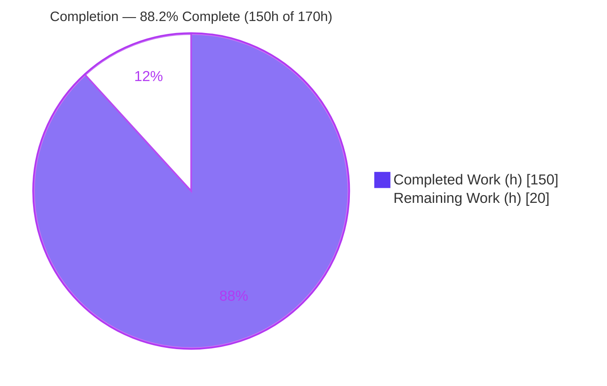
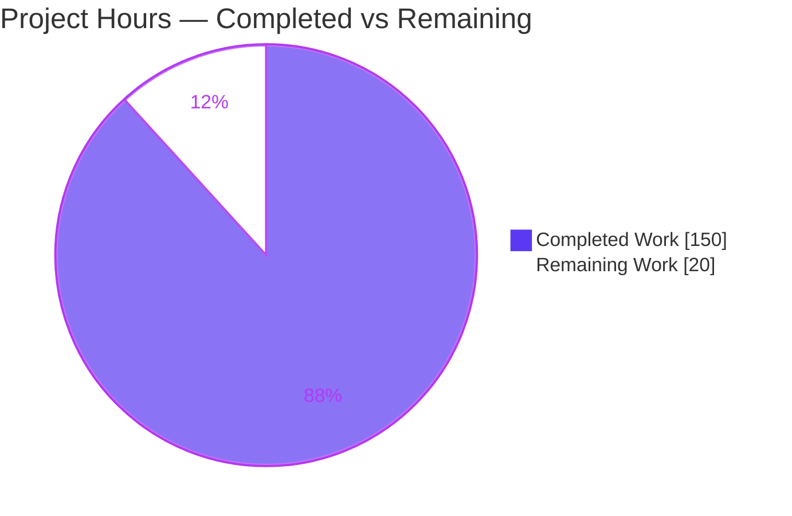
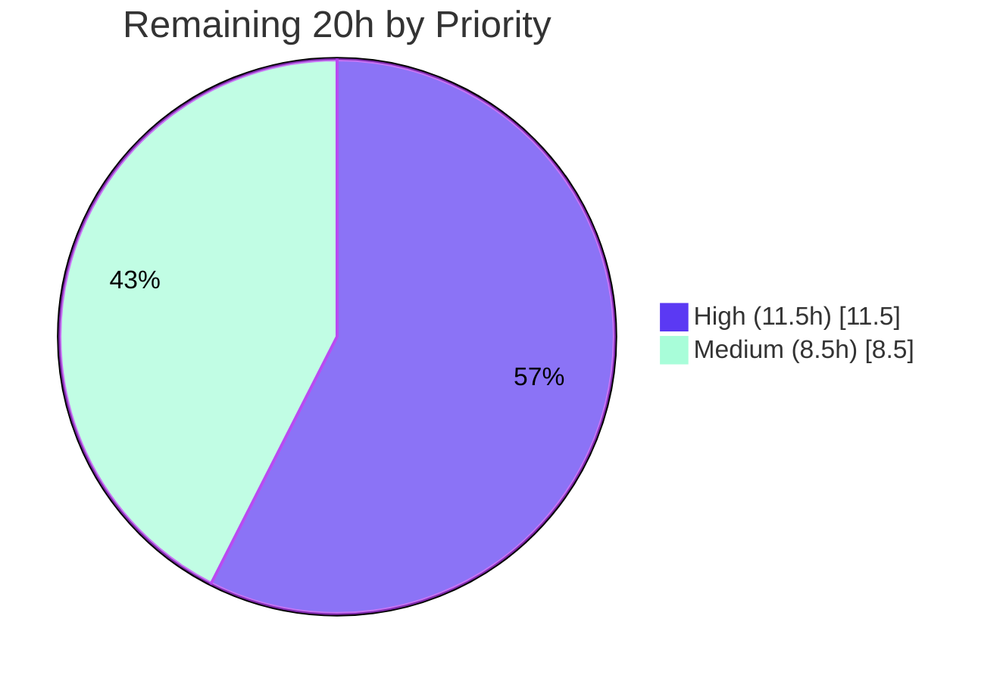

# Blitzy Project Guide — Ghostfolio Modular Dashboard

> **Feature:** Single-canvas, modular drag-and-drop dashboard (angular-gridster2) with per-user layout persistence
> **Branch:** `blitzy-9e341ebe-9d33-442b-87d7-5a86d4f168f3` · **HEAD:** `aa2934822`
> **Brand legend:** <span style="color:#5B39F3">■ Completed / AI Work (Dark Blue #5B39F3)</span> · <span style="color:#000000">□ Remaining / Not Completed (White #FFFFFF)</span>

---

## 1. Executive Summary

### 1.1 Project Overview

This project replaces Ghostfolio's route-based Angular navigation shell with a single-canvas, modular dashboard. Every authenticated feature — portfolio overview, holdings, transactions, analysis, FIRE, X-ray, and the AI chat panel — becomes a self-contained grid module that users compose via drag-and-drop on a 12-column `angular-gridster2` canvas at route `/`. A centralized registry introduces module types; a searchable catalog adds/removes them; and each user's layout persists to PostgreSQL through two JWT-guarded NestJS endpoints. Target users are authenticated Ghostfolio investors who want a personalized, composable workspace. The technical scope spans the Angular client, the NestJS API, the shared `libs/common` contracts, and the Prisma schema within the existing Nx monorepo.

### 1.2 Completion Status


```mermaid
%%{init: {'theme':'base', 'themeVariables': {'pie1':'#5B39F3','pie2':'#FFFFFF','pieStrokeColor':'#B23AF2','pieStrokeWidth':'2px','pieOuterStrokeColor':'#B23AF2','pieOuterStrokeWidth':'2px','pieTitleTextSize':'16px','pieSectionTextColor':'#B23AF2'}}}%%
pie showData title Completion — 88.2% Complete (150h of 170h)
    "Completed Work (h)" : 150
    "Remaining Work (h)" : 20
```

| Metric | Hours |
|--------|-------|
| **Total Hours** | **170** |
| Completed Hours (AI: 150 + Manual: 0) | 150 |
| Remaining Hours | 20 |
| **Percent Complete** | **88.2%** |

> Completion is computed per the AAP-scoped, hours-based methodology: `Completion % = Completed ÷ (Completed + Remaining) = 150 ÷ 170 = 88.2%`. All 15 AAP deliverable groups are autonomously **completed**; the remaining 20 hours are exclusively path-to-production activities (human review/merge, deployment, observability provisioning, staging UAT).

### 1.3 Key Accomplishments

- ✅ **Grid canvas at `/`** — `GfDashboardCanvasComponent` with a locked 12-column grid (`minCols === maxCols === 12`), fixed row height, enforced 2×2 minimum cell size, and `GridsterItem[]` as the single source of truth.
- ✅ **All 12 feature modules** — portfolio-overview, holdings, summary, markets, watchlist, portfolio-summary, transactions, allocations, analysis, fire, x-ray, and the extracted **AI Chat** — hosted generically via `NgComponentOutlet` wrappers with full module isolation.
- ✅ **Centralized `ModuleRegistryService`** — `Map`-based registry (`register`/`get`/`getAll`/`has`) is the sole module-introduction mechanism; 100% line coverage.
- ✅ **Searchable, auto-opening catalog** — `GfModuleCatalogComponent` filters modules by name, supports add (click/drag) and remove, and auto-opens on first visit when no layout exists.
- ✅ **Per-user persistence** — Prisma `UserDashboardLayout` model + `User` back-relation + additive migration; `GET`/`PATCH /api/v1/user/layout` guarded by `AuthGuard('jwt')` + `HasPermissionGuard` (401/403/404/200/400 verified).
- ✅ **Debounced client layout service** — 404→`null` translation + 500 ms `debounceTime` persistence pipeline (`Subject` + `switchMap`).
- ✅ **Navigation shell collapsed** — single `/` canvas route with `AuthGuard`; router, service-worker, title strategy, and module-preload infrastructure preserved; inline `<app-chat-panel>` embed removed from the portfolio page.
- ✅ **Governance & quality** — full MD3 D-020 token discipline (zero bare `--mat-sys-*`), i18n on all new strings, decision log + traceability matrix, observability runbook, reveal.js executive summary, and a segmented `CODE_REVIEW.md`.
- ✅ **Validated** — clean `nx build api` + `nx build client`; **182/182 in-scope tests pass**; full browser + API E2E confirmed (106 screenshots, 7 recordings).

### 1.4 Critical Unresolved Issues

| Issue | Impact | Owner | ETA |
|-------|--------|-------|-----|
| _None blocking._ The in-scope feature compiles cleanly, passes 182/182 in-scope tests, and is runtime-validated end-to-end. | No release blocker from the feature itself. | — | — |
| Production database migration not yet executed against staging/prod | Feature non-functional until the `UserDashboardLayout` table exists in the target DB | Backend / DevOps | 1.5h (see §2.2 R2) |
| Segmented PR review verdicts in `CODE_REVIEW.md` remain `PENDING` (blank scaffold by mandate) | Merge to main is gated on human SME sign-off | Reviewers (7 domains) | 8h (see §2.2 R1) |

> Note: 18 full-suite test failures exist in `rebalancing` and `chat-panel` specs. These are **out-of-scope, pre-existing, and proven byte-identical at the merge base** (`0c5357102`); they touch AAP-preserved files and are not part of this feature. They are tracked in §3 and §6 (risk T1), not as unresolved issues of this delivery.

### 1.5 Access Issues

| System/Resource | Type of Access | Issue Description | Resolution Status | Owner |
|-----------------|----------------|-------------------|-------------------|-------|
| Production PostgreSQL | DB migration credentials | `prisma migrate deploy` must run against staging/prod DB; not performed autonomously | Open — requires human/infra credentials | DevOps |
| Production environment config | Secrets / role grants | New permissions (`readUserDashboardLayout`/`updateUserDashboardLayout`) must be granted to roles; prod `.env` (JWT/DB/Redis) verified | Open — requires prod access | DevOps / Security |
| Monitoring stack (Grafana/Prometheus) | Dashboard import | Observability template/runbook authored but not imported into the live monitoring stack | Open — requires monitoring access | SRE / Observability |
| Snowflake (optional) | API credentials | Non-fatal startup warning when `SNOWFLAKE_*` unset; out of scope for this feature | Accepted — optional integration | — |

> Local development access (repository, Docker Postgres/Redis, `.env`) is fully available and verified; the autonomous validation ran against it successfully.

### 1.6 Recommended Next Steps

1. **[High]** Complete the segmented PR code review across all 7 domains and resolve every `CODE_REVIEW.md` phase verdict to `APPROVED`, then merge to main (8h).
2. **[High]** Execute the production database migration (`npx prisma migrate deploy`) on staging then production and verify the `UserDashboardLayout` table + cascade FK (1.5h).
3. **[High]** Configure the production environment and grant the two new permissions to the appropriate roles; verify JWT/DB/Redis settings (2h).
4. **[Medium]** Provision the observability dashboard from the runbook template into the monitoring stack and validate alert thresholds (4h).
5. **[Medium]** Deploy to staging and complete E2E/UAT acceptance against the AAP §0.8.3 criteria, including p95 latency confirmation, then obtain sign-off (4.5h).

---

## 2. Project Hours Breakdown

### 2.1 Completed Work Detail

| Component | Hours | Description |
|-----------|------:|-------------|
| Dependency integration & Prisma client regeneration | 2 | Pin `angular-gridster2@21.0.1`, lockfile regen, `prisma generate` exposing the `userDashboardLayout` delegate |
| Database schema, model & migration | 4 | `UserDashboardLayout` model (userId PK, layoutData JSONB, timestamps), `User` back-relation, additive `CREATE TABLE` + cascade FK migration |
| Shared library contracts & permissions | 4 | `user-dashboard-layout.interface.ts` (keys, `LayoutData`, payload types), barrel export, two permission constants granted in two role sets |
| API layout controller | 6 | Thin `GET`/`PATCH /api/v1/user/layout`; dual guards, `@HasPermission`, `@HttpCode(OK)`, `X-Correlation-ID`, userId sourced from JWT only |
| API layout service | 8 | Prisma `upsert`/`findByUserId`, correlation-ID logging, `try/catch` error handling |
| API validation DTO | 6 | `class-validator` nested geometry, size caps (`@ArrayMaxSize`/`@MaxLength`), module-key validation for DoS defense |
| API test suite (56 tests) | 12 | Controller, service, and DTO specs (1,211 spec lines) — 100% pass |
| Dashboard canvas component | 18 | 12-column `GridsterConfig`, next-available placement, hydration, debounced persistence wiring, `NgComponentOutlet`, error handling (100% line coverage) |
| Module registry service | 5 | `Map`-based registry with all 12 module definitions (100% line coverage) |
| Client layout service | 6 | `GET`/`PATCH` wrapper, 404→`null`, 500 ms `debounceTime` pipeline (88.23% line coverage) |
| Module catalog component | 8 | Search filter, `MatList`, add/drag, first-visit auto-open (96% line coverage) |
| 12 feature module wrappers | 12 | Isolation wrappers hosting existing feature components in `MatCard` chrome with remove action + i18n |
| Client test suite (97 tests) | 16 | Canvas, registry, layout service, catalog, and app util specs (1,695 spec lines) — 100% pass |
| Navigation shell refactor | 9 | Single `/` route collapse + `AuthGuard`, `app.component` + util, header simplification, portfolio-page chat-embed removal |
| MD3 D-020 token styling & i18n | 5 | `var(--mat-sys-<token>, <fallback>)` across all grid chrome (zero bare tokens), localized strings |
| Governance & observability deliverables | 16 | Decision log + traceability matrix (4h), observability runbook (5h), reveal.js executive summary (5h), `CODE_REVIEW.md` segmented scaffold (2h) |
| Iterative checkpoint & QA remediation | 13 | CP1/CP2 (1 Major + 13 Minor)/CP3 review fixes + QA findings F1–F9 + QA Issue #1 (empty-array rejection) + autonomous validation |
| **Total Completed** | **150** | |

### 2.2 Remaining Work Detail

| Category | Hours | Priority |
|----------|------:|----------|
| Human segmented PR/code review (7 domains, 55 files) + resolve `CODE_REVIEW.md` verdicts + merge | 8.0 | High |
| Production DB migration execution (`prisma migrate deploy` → staging + prod, verify table/FK) | 1.5 | High |
| Production environment & permission-role configuration (grant 2 permissions, verify env) | 2.0 | High |
| Observability dashboard provisioning (import template, wire metrics, validate alerts) | 4.0 | Medium |
| Staging deployment + E2E/UAT acceptance sign-off (validate §0.8.3 incl. p95 latency) | 4.5 | Medium |
| **Total Remaining** | **20.0** | |

### 2.3 Reconciliation

- Section 2.1 total (150h) **+** Section 2.2 total (20h) **=** 170h Total Project Hours (matches §1.2). ✓
- Section 2.2 total (20h) **=** §1.2 Remaining Hours **=** §7 pie "Remaining Work". ✓

---

## 3. Test Results

All tests below originate from Blitzy's autonomous validation logs for this project (Nx **Jest** runners; runtime contracts via curl; browser E2E via Chrome DevTools). The figures reflect **in-scope** dashboard-feature suites.

| Test Category | Framework | Total Tests | Passed | Failed | Coverage % | Notes |
|---------------|-----------|------------:|-------:|-------:|-----------|-------|
| Shared contracts (libs/common) | Jest | 23 | 23 | 0 | n/a | Includes layout interface/permissions |
| UI library (libs/ui) | Jest | 6 | 6 | 0 | n/a | Transitive shared UI |
| API layout feature | Jest (Nest TestBed) | 56 | 56 | 0 | High | Controller + service + DTO (incl. 401/404/200/400 + below-min rejection) |
| Client dashboard | Jest (Angular TestBed) | 97 | 97 | 0 | Canvas 100%, Registry 100%, Catalog 96%, Layout svc 88.2% | Canvas, registry, layout service, catalog, app util |
| **In-scope subtotal** | **Jest** | **182** | **182** | **0** | **≥80% (target met)** | **100% pass** |
| Runtime API contracts | curl | 7 flows | 7 | 0 | n/a | GET/PATCH 401, GET 404, PATCH 200, GET 200, malformed 400, wrong-type 400, below-min 400 |
| Browser E2E (scenario) | Chrome DevTools | 6 flows | 6 | 0 | n/a | First-visit blank+auto-open, search, add→placement, hydrate-on-reload, remove, debounced persist |

**Coverage vs. AAP threshold (≥80% for registry, layout service, canvas):**

| File | Line Coverage | Threshold Met |
|------|--------------:|:-------------:|
| `dashboard-canvas.component.ts` | 100% | ✅ |
| `module-registry.service.ts` | 100% | ✅ |
| `dashboard-layout.service.ts` | 88.23% | ✅ |
| `module-catalog.component.ts` | 96% | ✅ |

> **Out-of-scope, pre-existing failures (NOT part of this feature):** running the full workspace suites surfaces 18 failures (API `rebalancing.service.spec` 13, client `rebalancing-page.component.spec` 1, `chat-panel.component.spec` 4) and 2 intentional `.skip()`s. These were proven **identical at the merge base** `0c5357102` in an isolated worktree; all affected files are byte-identical to base and on AAP-preserved (out-of-scope) paths. They are excluded from in-scope totals and from the completion denominator.

---

## 4. Runtime Validation & UI Verification

**API runtime (`node dist/apps/api/main.js`, port 3333)**
- ✅ Operational — API boots cleanly; routes mapped under `/api/v1`.
- ✅ Operational — `GET /api/v1/user/layout` without JWT → **401**; with JWT for a new user → **404**.
- ✅ Operational — `PATCH /api/v1/user/layout` persists versioned JSONB `{items, schemaVersion}` → **200**; subsequent `GET` → **200**.
- ✅ Operational — Validation: malformed JSON → **400**; `layoutData` wrong type → **400**; below-minimum cell dimensions (`cols`/`rows` < 2) → **400**.
- ✅ Operational — `X-Correlation-ID` response header emitted; structured correlation logging present.

**Database**
- ✅ Operational — `UserDashboardLayout` table verified: `userId` PK, `layoutData` JSONB, `createdAt`/`updatedAt` timestamps, FK `ON DELETE CASCADE`.

**Browser UI (Chrome, fresh anonymous JWT, client on port 4300)**
- ✅ Operational — First visit: blank canvas with the module catalog **auto-opened**, listing all **12 modules including AI Chat**.
- ✅ Operational — Real-time catalog search (e.g., "hold" → Holdings).
- ✅ Operational — Add by click → **next-available placement** → `NgComponentOutlet` hosts the live `gf-home-holdings` component inside `MatCard` chrome with a Remove action.
- ✅ Operational — Debounced `PATCH` persists after grid changes; reload hydrates the returning-user layout and the catalog stays closed.
- ✅ Operational — Preserved routes (e.g., `/about`) still render; router integrity intact.
- ✅ Operational — Zero console errors during E2E.
- ⚠ Partial — Production-monitoring dashboards for the feature are authored but not yet provisioned in the live stack (path-to-production, §2.2 R4).

**Evidence:** 106 screenshots and 7 screen recordings captured under `blitzy/screenshots/` and `blitzy/screen_recordings/`.

---

## 5. Compliance & Quality Review

| AAP Deliverable / Rule | Benchmark | Status | Progress |
|------------------------|-----------|:------:|----------|
| Grid canvas at `/` (12-col, fixed row height, min 2×2) | Functional + enforced | ✅ Pass | 100% |
| Module-per-feature (12 wrappers via `NgComponentOutlet`) | All features selectable incl. AI Chat | ✅ Pass | 100% |
| Centralized registry as sole introduction mechanism | Registry-only | ✅ Pass | 100% |
| Searchable catalog + first-visit auto-open | Functional | ✅ Pass | 100% |
| Per-user persistence (model + migration + endpoints) | Schema valid + contracts | ✅ Pass | 100% |
| Auth-guarded endpoints (`AuthGuard('jwt')` + `HasPermissionGuard`) | 401/403 enforced | ✅ Pass | 100% |
| 404→`null` + 500 ms debounced persistence | Behavior verified | ✅ Pass | 100% |
| Versioned JSONB layout schema | `schemaVersion` present | ✅ Pass | 100% |
| Router/service-worker/title/preload preserved | Not degraded | ✅ Pass | 100% |
| Module isolation (no canvas import; data via existing services) | Enforced | ✅ Pass | 100% |
| Grid state as single source of truth | No layout state in modules | ✅ Pass | 100% |
| Minimum cell dimensions declared + enforced | Server + client reject violations | ✅ Pass | 100% |
| MD3 token discipline D-020 (`var(--mat-sys-*, fallback)`) | Zero bare tokens | ✅ Pass | 100% |
| i18n on all new UI strings | `localize: true` build | ✅ Pass | 100% |
| Test coverage ≥80% (registry/layout-svc/canvas) | Threshold | ✅ Pass | 100% / 88.2% / 100% |
| `nx build api` + `nx build client` | No errors | ✅ Pass | 100% |
| Prisma migration non-conflicting | Additive | ✅ Pass | 100% |
| Observability (logging, correlation, health/metrics, dashboard template) | Authored + reused | ✅ Pass (provisioning pending) | 90% |
| Explainability (decision log + traceability matrix) | Delivered | ✅ Pass | 100% |
| Executive presentation (reveal.js) | Self-contained deck | ✅ Pass | 100% |
| Segmented PR review (`CODE_REVIEW.md`) | Blank scaffold; verdicts resolve post-review | ⚠ Pending human review | 50% |

**Fixes applied during autonomous validation:** three checkpoint review cycles (CP1, CP2 = 1 Major + 13 Minor, CP3), nine QA finding groups (F1–F9 spanning canvas rendering, routing isolation, chart plugin order, hydration persistence, visual fidelity, doc accuracy, a11y/security/observability), and QA Issue #1 (reject empty-array `layoutData` → 400). **Outstanding:** human SME sign-off of the segmented review and the path-to-production items in §2.2.

---

## 6. Risk Assessment

| Risk | Category | Severity | Probability | Mitigation | Status |
|------|----------|----------|-------------|------------|--------|
| Out-of-scope pre-existing test failures (18) misread as regressions | Technical | Low | Medium | Documented + merge-base proof; AAP-preserved files | Documented / Accepted |
| `dashboard-canvas` lazy chunk (~1.39 MB) initial size | Technical | Low | Low | Lazy-loaded, within budget; monitor bundle | Monitored |
| `angular-gridster2@21.0.1` coupling to Angular major | Technical | Low | Low | Exact pin; v21 Angular-aligned + zone-compatible | Accepted |
| User-controlled `layoutData` JSONB DoS via oversized payloads | Security | Medium | Low | DTO `@ArrayMaxSize`/`@MaxLength`/size caps; off-grid & below-min → 400 | Mitigated |
| Per-user layout data exposure if endpoints unguarded | Security | High | Low | `AuthGuard('jwt')` + `HasPermissionGuard`; userId from JWT only; 401/403 verified | Mitigated |
| New permissions granted to wrong roles in prod | Security | Medium | Low | Granted in two role sets (financial-profile precedent); verify in prod (R3) | Mitigated / Pending prod verify |
| Production migration not yet executed (table absent breaks feature) | Operational | High | Medium | Additive `CREATE TABLE` ready; `prisma migrate deploy` (R2) | Open (R2) |
| Observability dashboard not yet provisioned in live stack | Operational | Medium | Medium | Runbook + template authored; reuses health/metrics + correlation-ID (R4) | Open (R4) |
| Single `/` route collapse changes navigation UX | Operational | Low | Medium | First-visit catalog auto-open + onboarding; router preserved | Mitigated |
| Snowflake bootstrap warning at API startup (optional `SNOWFLAKE_*` unset) | Integration | Low | High (dev) | Optional integration, non-fatal, out of scope; documented | Accepted / Out-of-scope |
| Full-page feature components rendering inside grid cells | Integration | Medium | Low | Module isolation preserves data services; holdings validated live; recommend staging UAT across all 12 | Mitigated |
| Staging/prod environment parity (DB/Redis/JWT) | Integration | Medium | Low | Standard env config (R3) + staging validation (R5) | Open (R3/R5) |

---

## 7. Visual Project Status

### Project Hours Breakdown


```mermaid
%%{init: {'theme':'base', 'themeVariables': {'pie1':'#5B39F3','pie2':'#FFFFFF','pieStrokeColor':'#B23AF2','pieStrokeWidth':'2px','pieOuterStrokeColor':'#B23AF2','pieOuterStrokeWidth':'2px','pieSectionTextColor':'#B23AF2'}}}%%
pie showData title Project Hours — Completed vs Remaining
    "Completed Work" : 150
    "Remaining Work" : 20
```

### Remaining Work by Priority


```mermaid
%%{init: {'theme':'base', 'themeVariables': {'pie1':'#5B39F3','pie2':'#A8FDD9','pieStrokeColor':'#B23AF2','pieSectionTextColor':'#000000'}}}%%
pie showData title Remaining 20h by Priority
    "High (11.5h)" : 11.5
    "Medium (8.5h)" : 8.5
```

### Remaining Hours per Category (from §2.2)

| Category | Hours | Bar |
|----------|------:|-----|
| PR review + merge (R1) | 8.0 | ████████ |
| Staging deploy + UAT (R5) | 4.5 | ████▌ |
| Observability provisioning (R4) | 4.0 | ████ |
| Prod env & permissions (R3) | 2.0 | ██ |
| Prod migration execution (R2) | 1.5 | █▌ |

> **Integrity:** §7 "Remaining Work" (20h) = §1.2 Remaining Hours (20h) = sum of §2.2 Hours (20h). ✓

---

## 8. Summary & Recommendations

**Achievements.** The modular dashboard feature is **functionally complete and production-ready in code**. All 15 AAP deliverable groups were autonomously delivered: the 12-column grid canvas, 12 isolated feature modules (including the extracted AI Chat), the centralized registry, the searchable auto-opening catalog, the debounced client layout service, the JWT-guarded API endpoints, the Prisma model + migration, the shared contracts and permissions, the navigation-shell collapse with router preservation, full MD3 D-020 token discipline and i18n, and the complete governance/observability deliverables. Quality is high: clean builds, **182/182 in-scope tests passing**, core-file coverage of 88.2–100%, and full browser + API E2E validation with zero console errors.

**Remaining gaps (path to production, 20h).** What remains is **not feature development** — it is the standard path-to-production: human segmented PR review and merge (8h), production database migration execution (1.5h), production environment and permission configuration (2h), observability dashboard provisioning (4h), and staging deployment with E2E/UAT sign-off (4.5h).

**Critical path.** Merge gate → production migration → environment/permission config → staging UAT. The highest-severity item is executing the production migration (risk O1); it is low-effort and standard.

**Success metrics (from AAP §0.8.3, validated locally):** catalog completeness (12/12 incl. AI Chat) ✓; next-available placement ✓; ~500 ms debounced persistence ✓; endpoint contracts (401/404/200/400) ✓; onboarding (new → blank + auto-open, returning → hydrate) ✓; router integrity ✓; clean builds + non-conflicting migration ✓; ≥80% coverage on registry/layout-svc/canvas ✓. Performance targets (≤100 ms drag/resize, ≤300 ms p95 GET) should be re-confirmed in staging with production-like data (R5).

**Production readiness assessment.** **88.2% complete.** The code is ready to ship pending human review and standard deployment activities. No feature rework is required. Recommended posture: proceed to PR review immediately, then deploy through staging with the §2.2 checklist.

**Out-of-scope / future considerations (0h against this project):** the 18 pre-existing AI-layer test failures (rebalancing/chat-panel) are a separate effort on AAP-preserved files; mobile/responsive layout, shared/admin/multi-user layouts, and bundle-size optimization are explicitly excluded by the AAP.

| Metric | Value |
|--------|-------|
| AAP-scoped completion | 88.2% |
| In-scope test pass rate | 182/182 (100%) |
| Completed / Total hours | 150 / 170 |
| Remaining hours | 20 |
| Critical blockers (feature) | 0 |

---

## 9. Development Guide

### 9.1 System Prerequisites

- **Node.js** ≥ 22.18.0 (verified `v22.23.0`; `.nvmrc` → `v22`)
- **npm** 10.x (verified `10.9.8`)
- **Nx** 22.x (via `npx`; verified `22.6.5`)
- **Docker** + Compose plugin (verified `28.5.2`) — for PostgreSQL + Redis
- **PostgreSQL** (dev container `gf-postgres-dev`, port **5432**) and **Redis** (dev container `gf-redis-dev`, port **6379**)
- OS: Linux/macOS (project developed on Ubuntu)

### 9.2 Environment Setup

```bash
# From the repository root
cp .env.example .env            # if .env not already present (it is, in this workspace)
# Ensure these keys are set in .env:
#   DATABASE_URL, JWT_SECRET_KEY, ACCESS_TOKEN_SALT,
#   POSTGRES_DB/USER/PASSWORD, REDIS_HOST/PORT
# Optional (non-fatal if unset): SNOWFLAKE_*, AI provider keys
```

```bash
# Start backing services (PostgreSQL + Redis)
docker compose -f docker/docker-compose.dev.yml up -d
docker ps   # expect gf-postgres-dev (5432) and gf-redis-dev (6379) healthy
```

### 9.3 Dependency Installation

```bash
npm install                     # postinstall runs `prisma generate`
npx prisma generate             # (idempotent) exposes the userDashboardLayout delegate
npx prisma validate             # expect: "The schema at prisma/schema.prisma is valid 🚀"
```

### 9.4 Database Setup

```bash
# Development (push schema + seed)
npm run database:setup          # = prisma db push && prisma db seed

# Production / staging (apply versioned migrations)
npm run database:migrate        # = prisma migrate deploy

# Optional: inspect the schema visually
npm run database:gui            # = prisma studio
```

### 9.5 Build

```bash
npx nx build api                                          # expect EXIT 0
npx nx build client --configuration=development-en        # expect EXIT 0 (dashboard-canvas lazy chunk ~1.39 MB)
# Production bundle:
npm run build:production
```

### 9.6 Run

```bash
# API (port 3333, global prefix /api, URI versioning)
set -a; . ./.env; set +a
node dist/apps/api/main.js
# — or dev watch —
npm run start:server

# Client (port 4300)
npx nx serve client --configuration=development-en --port=4300 --ssl=false
# — or dev with HMR —
npm run start:client
```

### 9.7 Test

```bash
# In-scope suites (all pass — 182/182)
CI=true npx --offline dotenv-cli -e .env.example -- npx nx test api    --watchAll=false
CI=true npx --offline dotenv-cli -e .env.example -- npx nx test client --watchAll=false
CI=true npx --offline dotenv-cli -e .env.example -- npx nx test common --watchAll=false
CI=true npx --offline dotenv-cli -e .env.example -- npx nx test ui     --watchAll=false
```

### 9.8 Verification

```bash
# API health
curl -s http://localhost:3333/api/v1/health

# Layout endpoint — unauthenticated → 401
curl -si http://localhost:3333/api/v1/user/layout | head -1

# DB table shape
psql "$DATABASE_URL" -c '\d "UserDashboardLayout"'   # userId PK, layoutData jsonb, timestamps, FK CASCADE
```

Open `http://localhost:4300` → on first visit you should see a **blank canvas with the catalog auto-opened** listing all 12 modules including **AI Chat**.

### 9.9 Example Usage

```bash
# GET the current user's layout (JWT required)
curl -s -H "Authorization: Bearer <JWT>" \
  http://localhost:3333/api/v1/user/layout

# PATCH (persist) a layout — versioned JSONB payload
curl -s -X PATCH \
  -H "Authorization: Bearer <JWT>" \
  -H "Content-Type: application/json" \
  -d '{"layoutData":{"schemaVersion":1,"items":[{"moduleKey":"holdings","x":0,"y":0,"cols":4,"rows":4}]}}' \
  http://localhost:3333/api/v1/user/layout
```

### 9.10 Troubleshooting

- **Snowflake bootstrap error at API startup** — expected and **non-fatal** when optional `SNOWFLAKE_*` vars are unset (out of scope).
- **401 on canvas load** — JWT missing/expired; `AuthGuard` redirects to `/start` by design.
- **SASS `@import`/`green()` deprecation warnings on client build** — pre-existing, from out-of-scope global stylesheets, byte-unchanged since the merge base; not from dashboard files.
- **18 failing tests when running full suites** — pre-existing, out-of-scope `rebalancing`/`chat-panel` specs proven identical at the merge base; in-scope dashboard suites are 182/182 green.
- **Port conflicts** — ensure 3333 (API), 4300 (client), 5432 (PostgreSQL), 6379 (Redis) are free.

---

## 10. Appendices

### A. Command Reference

| Purpose | Command |
|---------|---------|
| Install dependencies | `npm install` |
| Generate Prisma client | `npx prisma generate` |
| Validate Prisma schema | `npx prisma validate` |
| Dev DB setup (push + seed) | `npm run database:setup` |
| Apply migrations (prod/staging) | `npm run database:migrate` (`prisma migrate deploy`) |
| Build API | `npx nx build api` |
| Build client | `npx nx build client --configuration=development-en` |
| Production build | `npm run build:production` |
| Test (per project) | `CI=true npx --offline dotenv-cli -e .env.example -- npx nx test <api\|client\|common\|ui> --watchAll=false` |
| Serve API | `node dist/apps/api/main.js` (or `npm run start:server`) |
| Serve client | `npx nx serve client --configuration=development-en --port=4300 --ssl=false` |
| Lint | `npx nx lint <project>` |
| Format check | `npm run format:check` |

### B. Port Reference

| Service | Port |
|---------|------|
| NestJS API | 3333 |
| Angular client (dev) | 4300 |
| PostgreSQL (dev) | 5432 |
| Redis (dev) | 6379 |
| Prisma Studio | 5555 (default) |

### C. Key File Locations

| Area | Path |
|------|------|
| Grid canvas | `apps/client/src/app/dashboard/dashboard-canvas/dashboard-canvas.component.*` |
| Module registry | `apps/client/src/app/dashboard/module-registry.service.ts` |
| Module catalog | `apps/client/src/app/dashboard/module-catalog/module-catalog.component.*` |
| Client layout service | `apps/client/src/app/dashboard/dashboard-layout.service.ts` |
| Layout types | `apps/client/src/app/dashboard/dashboard.types.ts` |
| Module wrappers (×12) | `apps/client/src/app/dashboard/modules/<name>/<name>.component.ts` |
| API controller | `apps/api/src/app/user/user-dashboard-layout.controller.ts` |
| API service | `apps/api/src/app/user/user-dashboard-layout.service.ts` |
| API DTO | `apps/api/src/app/user/dtos/update-user-dashboard-layout.dto.ts` |
| Shared interface | `libs/common/src/lib/interfaces/user-dashboard-layout.interface.ts` |
| Permissions | `libs/common/src/lib/permissions.ts` |
| Prisma schema | `prisma/schema.prisma` |
| Migration | `prisma/migrations/20260411120000_add_user_dashboard_layout/migration.sql` |
| Routes | `apps/client/src/app/app.routes.ts` |
| Decision log | `docs/decisions/user-dashboard-layout-decisions.md` |
| Observability runbook | `docs/observability/user-dashboard-layout.md` |
| Executive deck | `blitzy-deck/dashboard-exec-summary.html` |
| Segmented review | `CODE_REVIEW.md` |

### D. Technology Versions

| Technology | Version |
|------------|---------|
| Angular (`@angular/core`) | 21.2.7 |
| Angular Material / CDK | 21.2.5 |
| angular-gridster2 | 21.0.1 |
| NestJS | 11.1.19 |
| Prisma / @prisma/client | 7.7.0 |
| RxJS | 7.8.1 |
| zone.js | 0.16.1 |
| Node.js | ≥ 22.18.0 (verified 22.23.0) |
| npm | 10.9.8 |
| Nx | 22.6.5 |
| Docker | 28.5.2 |

### E. Environment Variable Reference

| Variable | Purpose | Required |
|----------|---------|:--------:|
| `DATABASE_URL` | PostgreSQL connection string | Yes |
| `JWT_SECRET_KEY` | JWT signing/verification | Yes |
| `ACCESS_TOKEN_SALT` | Token salting | Yes |
| `POSTGRES_DB` / `POSTGRES_USER` / `POSTGRES_PASSWORD` | DB credentials | Yes |
| `REDIS_HOST` / `REDIS_PORT` / `REDIS_PASSWORD` | Cache/queue | Yes |
| `AI_PROVIDER` / `AI_MODEL` + provider keys | AI chat module backend | Optional |
| `SNOWFLAKE_*` | Optional Snowflake integration | Optional (non-fatal if unset) |

### F. Developer Tools Guide

- **Prisma Studio** (`npm run database:gui`) — inspect the `UserDashboardLayout` rows and verify persisted `layoutData` JSONB.
- **Nx dep-graph** (`npm run dep-graph`) — confirm module isolation (dashboard modules do not import the canvas layer).
- **Chrome DevTools** — used for the autonomous browser E2E; reproduce via the client on port 4300.
- **Coverage report** — `coverage/apps/client/coverage-summary.json` holds per-file coverage used in §3.

### G. Glossary

| Term | Meaning |
|------|---------|
| **Module** | A self-contained, independently placeable grid unit wrapping an existing feature component |
| **Wrapper** | A thin standalone component (rendered via `NgComponentOutlet`) that hosts a feature component and adds grid chrome |
| **Registry** | `ModuleRegistryService` — the sole mechanism for introducing module types |
| **Catalog** | The searchable overlay listing registered modules; auto-opens on first visit |
| **Canvas** | `GfDashboardCanvasComponent` — the 12-column gridster root at route `/` |
| **`LayoutData`** | Versioned JSONB `{ schemaVersion, items[{ moduleKey, x, y, cols, rows }] }` |
| **D-020** | MD3 token-discipline rule: `var(--mat-sys-<token>, <fallback>)` for all grid chrome |
| **Merge base** | `0c5357102` — the commit the feature branch diverged from |

---

*Generated by the Blitzy Platform · AAP-scoped completion: **88.2%** (150h completed / 20h remaining / 170h total).*