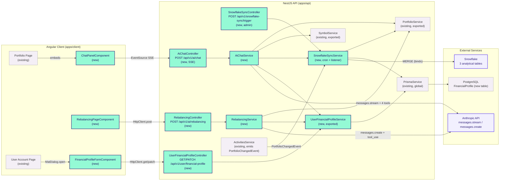
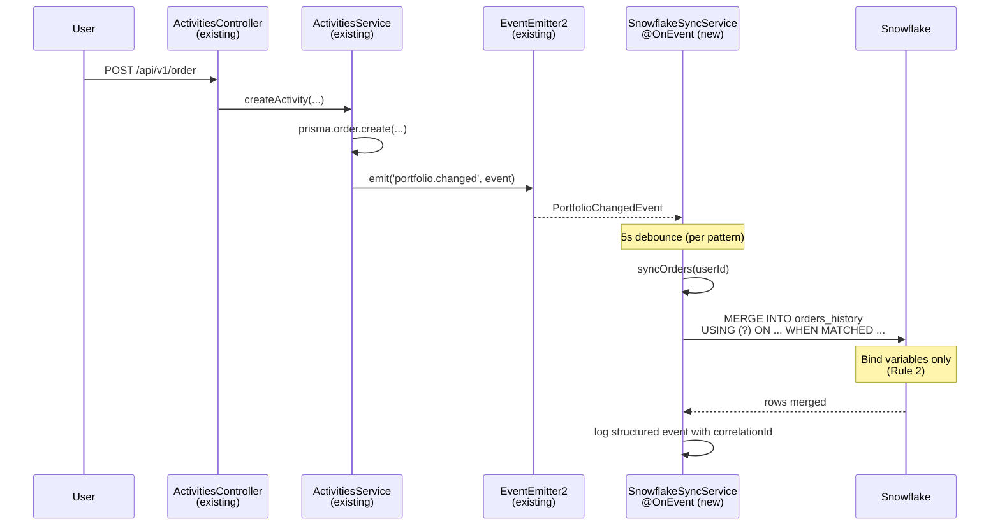

# Technical Specification

# 0. Agent Action Plan

## 0.1 Intent Clarification

### 0.1.1 Core Feature Objective

Based on the prompt, the Blitzy platform understands that the new feature requirement is to **extend the existing Ghostfolio v3.0.0 Nx monorepo with a coherent AI-powered portfolio intelligence layer composed of three independently demoable but narratively connected features**, all introduced as additive code paths that leave the pre-existing Ghostfolio source surface untouched outside of a small set of explicitly named wiring points. The work is strictly additive — new NestJS modules, new Prisma model, new Angular components, and new client-side route — registered in the existing `AppModule` (`apps/api/src/app/app.module.ts`), the existing Prisma schema (`prisma/schema.prisma`), the existing Angular route table (`apps/client/src/app/app.routes.ts`), and the existing portfolio-page sidebar slot, without modifying any existing controller, service, DTO, route handler, or Prisma model.

The three features in scope are:

- **Feature A — Snowflake Sync Layer:** A `SnowflakeSyncModule` that mirrors Ghostfolio's operational data — portfolio snapshots, trade history, and performance metrics — into Snowflake as an append-only analytical backend. The mirror runs on a daily cron at `02:00 UTC` and additionally triggers on Order create/update events that are emitted via the existing `@nestjs/event-emitter` machinery. All writes are MERGE (upsert) statements keyed on the unique constraints documented in `§ 0.5.1`, ensuring idempotency on re-runs.

- **Feature B — AI Portfolio Chat Agent:** An `AiChatModule` exposing a streaming Claude API chat endpoint (`POST /api/ai/chat`) that answers natural-language questions about the authenticated user's portfolio. The agent dispatches **four** Claude tool calls — `get_current_positions`, `get_performance_metrics`, `query_history`, and `get_market_data` — to live Ghostfolio data and to Snowflake historical queries. Responses stream to the browser via Server-Sent Events. The system prompt is personalized at request time with the caller's current portfolio state and `FinancialProfile`. Chat session state is **stateless** server-side; the client transmits the full message array (capped at 4 prior turns) per request.

- **Feature C — Explainable Rebalancing Engine:** A `RebalancingModule` exposing `POST /api/ai/rebalancing` that returns structured JSON trade recommendations. Every recommendation includes a plain-language `rationale` that explicitly references the user's stated financial goals, plus a machine-readable `goalReference` mapping to a `FinancialProfile` field name or to a label inside the JSON `investmentGoals` array. Claude returns structured output **exclusively** via the Anthropic SDK `tool_use` content block — no text parsing.

A new Prisma model `FinancialProfile` (1:1 with `User` via `userId`, cascade delete) stores per-user goals, risk tolerance, income, and debt obligations. A new `UserFinancialProfileModule` exposes `GET` and `PATCH /api/user/financial-profile`; its `UserFinancialProfileService` is exported and consumed by `AiChatModule` and `RebalancingModule` via constructor injection, providing the single canonical read path for downstream personalization. A new Angular `FinancialProfileFormComponent` opens as a modal dialog from the user-account page and pre-populates from `GET` when a record exists or shows an empty form on HTTP 404.

#### 0.1.1.1 Implicit Requirements Detected

The following implicit requirements are surfaced for explicit handling during code generation:

- **Stack version reconciliation.** The user's prompt names "Angular 19" and "Prisma 6," but the installed `package.json` pins `@angular/core 21.2.7` and `@prisma/client 7.7.0`. The Blitzy platform interprets the user's intent as "use whatever Angular and Prisma versions are already in `package.json`" and will conform to **Angular 21.2.7** and **Prisma 7.7.0** as the actual installed versions, in accordance with the additive-only mandate.
- **Existing `AiModule` is preserved.** Ghostfolio already ships a feature module named `AiModule` at `apps/api/src/app/endpoints/ai/` for the `GET /ai/prompt/:mode` OpenRouter-backed prompt feature (F-020). The new `AiChatModule` and `RebalancingModule` are **separate modules** and **must not** import from, modify, or replace the existing `AiModule`. They are mounted under distinct controller prefixes (`@Controller('ai/chat')` and `@Controller('ai/rebalancing')`).
- **JWT guard pattern reuse.** "JwtAuthGuard" in the prompt corresponds to Ghostfolio's existing pattern `@UseGuards(AuthGuard('jwt'), HasPermissionGuard)` from `@nestjs/passport`, applied uniformly across `apps/api/src/app/portfolio/portfolio.controller.ts`, `apps/api/src/app/endpoints/ai/ai.controller.ts`, and other authenticated endpoints. New controllers reuse this exact pattern.
- **`/api/v1` URI versioning.** Ghostfolio's `main.ts` configures `VersioningType.URI` with default version `v1`; therefore `POST /api/ai/chat` resolves at runtime to `/api/v1/ai/chat`. Test gates and Angular HTTP calls must use the `/api/v1/...` form.
- **PortfolioService and SymbolService are already exported.** `apps/api/src/app/portfolio/portfolio.module.ts` exports `PortfolioService` (line 34) and `apps/api/src/app/symbol/symbol.module.ts` exports `SymbolService` (line 14). The four chat-agent tools delegate to existing methods (`PortfolioService.getDetails()`, `PortfolioService.getPerformance()`, `SymbolService.get()`, etc.), so no existing module needs an `exports` modification.
- **Order event hook.** `apps/api/src/app/activities/activities.service.ts` already emits `PortfolioChangedEvent` on every `createActivity` / `updateActivity` / `deleteActivity` operation through the injected `EventEmitter2`. The Snowflake sync listener subscribes to `PortfolioChangedEvent.getName()` (which resolves to `'portfolio.changed'`) using the same `@OnEvent` pattern already used by `apps/api/src/events/portfolio-changed.listener.ts`. No new event class is required.
- **Schedule module is already imported.** `app.module.ts` already imports `ScheduleModule.forRoot()` (line 133) and the project ships `@nestjs/schedule@6.1.3` and `@nestjs/event-emitter@3.0.1` — meaning the cron and event infrastructure for `SnowflakeSyncModule` is already bootstrapped at the application root.
- **`.config/prisma.ts` resolves the schema path.** Prisma's schema lives at `prisma/schema.prisma` (per `.config/prisma.ts`). Adding the `FinancialProfile` model and `RiskTolerance` enum to that single file is the only Prisma source modification required.
- **Observability cross-cutting requirement.** The user-supplied "Observability" rule mandates structured logging with correlation IDs, distributed tracing, a metrics endpoint, health/readiness checks, and a dashboard template. Each new module must emit structured logs using NestJS `Logger` and propagate a correlation ID through SSE responses, Snowflake sync runs, and rebalancing calls; health probes for the new modules must extend the existing `HealthModule` pattern.
- **Decision log requirement.** The user-supplied "Explainability" rule requires a Markdown decision-log table for every non-trivial decision and a bidirectional traceability matrix when relevant. Decisions made during code generation (e.g., "stateless chat: client carries 4 prior turns" vs. "server-side conversation persistence") must be recorded as explicit entries.
- **Executive presentation requirement.** The user-supplied "Executive Presentation" rule requires a single self-contained reveal.js HTML deck (12–18 slides) using the Blitzy theme, covering scope, business value, architecture, risks, and onboarding.
- **Segmented PR review requirement.** The user-supplied "Segmented PR Review" rule mandates a `CODE_REVIEW.md` at the repo root with YAML frontmatter (phase name, status, file count) and per-domain Expert Agent phases before any PR is opened.

#### 0.1.1.2 Feature Dependencies and Prerequisites

| Prerequisite | Source of Truth | Status |
|--------------|-----------------|--------|
| Existing `User` model | `prisma/schema.prisma` lines 261–288 | Available — `FinancialProfile.userId` references `User.id` |
| Existing `PortfolioService` (exported) | `apps/api/src/app/portfolio/portfolio.module.ts` line 34 | Available — `getDetails()`, `getPerformance()`, `getHoldings()`, `getInvestments()` are public async methods |
| Existing `SymbolService` (exported) | `apps/api/src/app/symbol/symbol.module.ts` line 14 | Available — `get()`, `lookup()` are public async methods |
| Existing `EventEmitter2` and `PortfolioChangedEvent` | `apps/api/src/events/portfolio-changed.event.ts`; emission sites in `apps/api/src/app/activities/activities.service.ts` | Available — listener pattern shown in `apps/api/src/events/portfolio-changed.listener.ts` |
| Existing `@nestjs/schedule` `ScheduleModule.forRoot()` | `apps/api/src/app/app.module.ts` line 133 | Available — `@Cron` decorators usable directly |
| Existing JWT auth guard pattern | `apps/api/src/app/auth/jwt.strategy.ts`; usage in `apps/api/src/app/endpoints/ai/ai.controller.ts` line 31 | Available — `@UseGuards(AuthGuard('jwt'), HasPermissionGuard)` |
| Existing `ConfigService` from `@nestjs/config` | `package.json` `@nestjs/config@4.0.4`; `app.module.ts` line 109 imports `ConfigModule.forRoot()` | Available — global config |
| Existing `RequestWithUser` type | `libs/common/src/lib/types/request-with-user.type.ts` | Available — typed request with `user.id`, `user.settings`, etc. |
| Existing `internalRoutes` registry | `libs/common/src/lib/routes/routes.ts` (lines 121–148 define `portfolio` route family) | The new `/portfolio/rebalancing` path may be added either as a literal route entry in `app.routes.ts` (per the user's prompt) or via `internalRoutes.portfolio.subRoutes`. The user's prompt mandates the former — a single literal `/portfolio/rebalancing` entry in `app.routes.ts`. |

### 0.1.2 Special Instructions and Constraints

The user's prompt contains several explicit directives that downstream code-generation agents must preserve verbatim. These are reproduced and labeled below.

#### 0.1.2.1 Architectural Directives

- **Authority is strictly additive.** New modules, models, and components are introduced **without modifying** existing Ghostfolio v3.0.0 code outside of the minimum registration wiring. The complete list of permitted modifications is enumerated in `§ 0.6` and matches the user's "Additive-only wiring points" verbatim.
- **Module isolation.** New NestJS modules MUST NOT import from file paths inside existing Ghostfolio feature module directories. Cross-module access MUST occur only through services explicitly listed in the source module's `exports` array (e.g., `PortfolioService` from `PortfolioModule`, `SymbolService` from `SymbolModule`, `UserService` from `UserModule`). This is captured as Rule 1 in `§ 0.7`.
- **Each new module is self-contained.** Every new module owns its own controller, service(s), DTOs, and (where applicable) Prisma access. The `UserFinancialProfileService` is the single exception — it is **explicitly exported** from `UserFinancialProfileModule` and consumed by `AiChatModule` and `RebalancingModule` through constructor injection.
- **Controller thinness.** New controllers MUST contain zero business logic and zero Prisma calls. They extract the authenticated user, validate request shape via `class-validator` DTOs, delegate to the module service, and return the result. No new controller method body exceeds 10 lines. This is captured as Rule 8 in `§ 0.7`.

#### 0.1.2.2 Security Directives

- **Parameterized Snowflake queries.** All Snowflake SQL execution MUST use `snowflake-sdk` bind variable syntax (`?` placeholders + `binds: [...]`). String template literals and `+` concatenation operators adjacent to SQL strings are PROHIBITED. This is captured as Rule 2 in `§ 0.7` and verified by Gate 11 in `§ 0.7.5`.
- **Credential access via `ConfigService`.** `ANTHROPIC_API_KEY` and all `SNOWFLAKE_*` environment variables MUST be read **exclusively** via the injected NestJS `ConfigService`. Direct `process.env.ANTHROPIC` and `process.env.SNOWFLAKE` access in new module files is PROHIBITED. This is captured as Rule 3 in `§ 0.7`.
- **`FinancialProfile` authorization.** Every Prisma operation on `FinancialProfile` MUST include `where: { userId: authenticatedUserId }` using the JWT-verified user ID — never the request body. Unscoped queries against `FinancialProfile` are PROHIBITED. This is captured as Rule 5 in `§ 0.7`.
- **All four new endpoints require `JwtAuthGuard`.** Per the endpoint table in the user's prompt, `POST /api/ai/chat`, `POST /api/ai/rebalancing`, `GET /api/user/financial-profile`, and `PATCH /api/user/financial-profile` are all protected by `AuthGuard('jwt')`. Unauthenticated requests must return HTTP 401.

#### 0.1.2.3 API Design Directives

- **Structured rebalancing via tool use.** `RebalancingService` MUST populate `RebalancingResponse` exclusively from a `tool_use` content block returned by the Anthropic SDK. Parsing Claude's text message content to extract structured fields is PROHIBITED. This is captured as Rule 4 in `§ 0.7`.
- **Snowflake sync idempotency.** All Snowflake write operations in `SnowflakeSyncService` MUST use MERGE (upsert) statements keyed on the unique constraints in `§ 0.5.1`. INSERT-only statements that produce duplicate rows on re-run are PROHIBITED. This is captured as Rule 7 in `§ 0.7`.
- **SSE disconnection handling.** `ChatPanelComponent` MUST render a non-empty `errorMessage` and a visible reconnect button when the SSE stream terminates with an error. Silent stream failures with no UI state change are PROHIBITED. This is captured as Rule 6 in `§ 0.7`.
- **Stateless chat protocol.** Chat session state is stateless server-side. The client sends the full message array (max 4 prior turns) on every `POST /api/ai/chat` request. The server stores no per-session conversation history.

#### 0.1.2.4 User-Provided Examples (Preserved Verbatim)

**User Example — `FinancialProfile` Prisma model:**

```plaintext
FinancialProfile (1:1 → User via userId, cascade delete)
  userId                 String   @id
  retirementTargetAge    Int
  retirementTargetAmount Float
  timeHorizonYears       Int
  riskTolerance          RiskTolerance   // new enum: LOW | MEDIUM | HIGH
  monthlyIncome          Float
  monthlyDebtObligations Float
  investmentGoals        Json    // [{label: string, targetAmount: float, targetDate: string}]
  createdAt              DateTime @default(now())
  updatedAt              DateTime @updatedAt
```

**User Example — Snowflake schema (3 tables, MERGE keys):**

- `portfolio_snapshots(snapshot_date, user_id, asset_class, allocation_pct, total_value_usd)` — unique key: `(snapshot_date, user_id, asset_class)`
- `orders_history(order_id, user_id, date, type, ticker, quantity, unit_price, fee, currency, synced_at)` — unique key: `(order_id)`
- `performance_metrics(metric_date, user_id, twr, volatility, sharpe_ratio)` — unique key: `(metric_date, user_id)`

**User Example — Chat-agent tool definitions:**

- `get_current_positions(userId)` → delegates to injected `PortfolioService.getPositions()`
- `get_performance_metrics(userId, startDate, endDate)` → delegates to injected `PortfolioService.getPerformance()`
- `query_history(userId, sql, binds)` → executes parameterized SQL against Snowflake via `snowflake-sdk` bind variables; Claude supplies `sql` and typed `binds`; no string concatenation
- `get_market_data(ticker)` → delegates to injected `SymbolService.getProfile()`

**User Example — `RebalancingResponse` TypeScript contract:**

```typescript
interface RebalancingResponse {
  recommendations: Array<{
    action: 'BUY' | 'SELL' | 'HOLD';
    ticker: string;
    fromPct: number;
    toPct: number;
    rationale: string;
    goalReference: string;
  }>;
  summary: string;
  warnings: string[];
}
```

**User Example — New API endpoint matrix:**

| Method | Path | Guard | Module |
| --- | --- | --- | --- |
| POST | /api/ai/chat | JwtAuthGuard | AiChatModule |
| POST | /api/ai/rebalancing | JwtAuthGuard | RebalancingModule |
| GET | /api/user/financial-profile | JwtAuthGuard | UserFinancialProfileModule |
| PATCH | /api/user/financial-profile | JwtAuthGuard | UserFinancialProfileModule |

**User Example — Required environment variables:**

`SNOWFLAKE_ACCOUNT`, `SNOWFLAKE_USER`, `SNOWFLAKE_PASSWORD`, `SNOWFLAKE_DATABASE`, `SNOWFLAKE_WAREHOUSE`, `SNOWFLAKE_SCHEMA`, `ANTHROPIC_API_KEY` — read exclusively through `ConfigService`.

#### 0.1.2.5 Naming Note: The `PortfolioService.getPositions()` Tool

The user's chat-agent tool list specifies `PortfolioService.getPositions()`. The actual Ghostfolio service exposes its holdings/positions through `PortfolioService.getDetails(...)` and `PortfolioService.getHoldings(...)` (per `apps/api/src/app/portfolio/portfolio.service.ts`). The Blitzy platform interprets `getPositions()` as a logical alias resolved at implementation time to the appropriate existing public method on the exported `PortfolioService`; the new code does not introduce a new method on the existing service. A decision-log entry will record this resolution per the "Explainability" rule.

### 0.1.3 Technical Interpretation

These feature requirements translate to the following technical implementation strategy:

- **To extend the Prisma data model**, **add** a `FinancialProfile` model and a `RiskTolerance` enum (`LOW | MEDIUM | HIGH`) to `prisma/schema.prisma`. Generate a single new timestamped migration folder under `prisma/migrations/` containing `migration.sql` that creates the `FinancialProfile` table, the `"RiskTolerance"` PostgreSQL enum type, and the `userId` foreign-key constraint with `ON DELETE CASCADE`. Run `prisma generate` to refresh the typed client.

- **To deliver Feature A (Snowflake Sync)**, **create** a new `SnowflakeSyncModule` at `apps/api/src/app/snowflake-sync/` with: `snowflake-sync.module.ts`, `snowflake-sync.service.ts` (cron `@Cron('0 2 * * *')` + `@OnEvent(PortfolioChangedEvent.getName())` listener + bind-variable MERGE statements), `snowflake-sync.controller.ts` (admin manual-trigger endpoint), and a `snowflake-client.factory.ts` that constructs the `snowflake-sdk` connection from `ConfigService.get('SNOWFLAKE_*')`. **Modify** `apps/api/src/app/app.module.ts` only to add the import.

- **To deliver Feature B (AI Portfolio Chat Agent)**, **create** a new `AiChatModule` at `apps/api/src/app/ai-chat/` with: `ai-chat.module.ts`, `ai-chat.service.ts` (constructs `Anthropic` client from `ConfigService.get('ANTHROPIC_API_KEY')`, defines the four tool schemas, dispatches tool calls to `PortfolioService` / `SymbolService` / `SnowflakeSyncService.queryHistory(...)` and the injected `UserFinancialProfileService`, streams the SDK response over an `Observable<MessageEvent>`), `ai-chat.controller.ts` (`@Sse()` endpoint at `POST /ai/chat` with `@UseGuards(AuthGuard('jwt'), HasPermissionGuard)`), and DTOs validating the inbound message array. **Import** `PortfolioModule`, `SymbolModule`, and `UserFinancialProfileModule` to consume their exported services.

- **To deliver Feature C (Explainable Rebalancing Engine)**, **create** a new `RebalancingModule` at `apps/api/src/app/rebalancing/` with: `rebalancing.module.ts`, `rebalancing.service.ts` (Anthropic SDK call with a `tools` array containing a single `tool_use` schema that shapes `RebalancingResponse`; reads structured output **only** from `content[type === 'tool_use']`), `rebalancing.controller.ts` (`POST /ai/rebalancing`), and DTOs/interfaces. **Import** `PortfolioModule`, `UserFinancialProfileModule`, and (optionally) `SnowflakeSyncModule` for historical context.

- **To deliver the financial-profile data API**, **create** a new `UserFinancialProfileModule` at `apps/api/src/app/user-financial-profile/` with: `user-financial-profile.module.ts` (exports `UserFinancialProfileService`), `user-financial-profile.service.ts` (Prisma upsert/read for `FinancialProfile`, every call scoped to the authenticated `userId`), `user-financial-profile.controller.ts` (`GET` returns 200 / 404 — explicitly not 500 — and `PATCH` upserts), and `user-financial-profile.dto.ts` (class-validator schema mirroring the Prisma model).

- **To deliver the Angular UI**, **create** three standalone Angular components: `ChatPanelComponent` at `apps/client/src/app/components/chat-panel/`, `RebalancingPageComponent` at `apps/client/src/app/pages/portfolio/rebalancing/`, and `FinancialProfileFormComponent` at `apps/client/src/app/components/financial-profile-form/`. Add a single `/portfolio/rebalancing` entry to `app.routes.ts`. Add an `<app-chat-panel>` selector to the existing portfolio-page sidebar slot in `apps/client/src/app/pages/portfolio/portfolio-page.html`. Open `FinancialProfileFormComponent` from the user-account page using Angular Material `MatDialog`.

- **To wire all four new NestJS modules into the application**, **modify** `apps/api/src/app/app.module.ts` to add exactly four new entries to the `imports` array: `SnowflakeSyncModule`, `AiChatModule`, `RebalancingModule`, `UserFinancialProfileModule`. No existing imports are removed or reordered.

- **To document required environment variables**, **append** to `.env.example` exactly seven new placeholder entries: `SNOWFLAKE_ACCOUNT`, `SNOWFLAKE_USER`, `SNOWFLAKE_PASSWORD`, `SNOWFLAKE_DATABASE`, `SNOWFLAKE_WAREHOUSE`, `SNOWFLAKE_SCHEMA`, and `ANTHROPIC_API_KEY`. Existing variables are preserved verbatim.

- **To satisfy the cross-cutting Observability rule**, instrument each new service with structured `Logger` output that includes a per-request correlation ID (generated at controller boundary, propagated through service calls and SSE response headers), expose a `/api/v1/health/snowflake` and `/api/v1/health/anthropic` style probe by extending the existing `HealthModule` pattern (additive: new module file, no modification to existing health code), and emit application-level metrics (counters for sync success/failure, chat tokens, rebalancing latency) using a NestJS-idiomatic in-process registry plus a `/api/v1/metrics` route added in a new `MetricsModule`. A dashboard template (Markdown reference + JSON definition) is delivered alongside the source code under `docs/observability/`.

- **To satisfy the Explainability rule**, generate `docs/decisions/agent-action-plan-decisions.md` containing a Markdown decision-log table covering every non-trivial implementation decision (e.g., "stateless chat with 4-turn client window," "reuse `PortfolioChangedEvent` instead of creating `OrderCreatedEvent`," "use `tool_use` content block for rebalancing structured output," "version constraint mismatch resolution: use installed Angular 21.2.7 and Prisma 7.7.0 over user-stated Angular 19 and Prisma 6"). Include a bidirectional traceability matrix mapping each Feature A / B / C requirement to the file(s) that implement it.

- **To satisfy the Executive Presentation rule**, produce `blitzy-deck/agent-action-plan.html` — a single self-contained reveal.js HTML file (12–18 slides, target 16) with the Blitzy theme, Mermaid architecture diagram, KPI cards for the 4 new endpoints / 3 new components / 1 new Prisma model, risk and mitigation table, and team onboarding closing slide. CDN versions pinned to `reveal.js 5.1.0`, `Mermaid 11.4.0`, `Lucide 0.460.0`.

- **To satisfy the Segmented PR Review rule**, generate `CODE_REVIEW.md` at the repository root with YAML frontmatter listing the seven review domains (Infrastructure/DevOps, Security, Backend Architecture, QA/Test Integrity, Business/Domain, Frontend, Other SME), each with `phase`, `status: OPEN`, and `file_count`, followed by an Executive Summary and per-phase Expert Agent sections with handoff documentation.


## 0.2 Repository Scope Discovery

### 0.2.1 Comprehensive File Analysis

The following file-pattern inventory enumerates every file or directory in the existing Ghostfolio v3.0.0 monorepo that is **either modified** by this work (limited to the additive wiring points enumerated in `§ 0.6.2`) or **read** to inform the new code paths. The repository was inspected through `get_source_folder_contents`, `read_file`, and `bash` (`grep`, `find`, `ls`) tooling.

#### 0.2.1.1 Existing Modules Touched (Strictly Wiring-Only)

The set of existing files modified by this work is intentionally minimal and matches verbatim the user's "Additive-only wiring points":

| File | Path | Change Type | Specific Modification |
|------|------|-------------|------------------------|
| Root NestJS module | `apps/api/src/app/app.module.ts` | ADD imports | Append four new module imports to the `imports` array: `SnowflakeSyncModule`, `AiChatModule`, `RebalancingModule`, `UserFinancialProfileModule`. No existing entry is reordered or removed. |
| Prisma schema | `prisma/schema.prisma` | ADD model + enum | Append one `model FinancialProfile { ... }` block and one `enum RiskTolerance { LOW MEDIUM HIGH }` block. No existing model definition is altered. |
| Angular root routes | `apps/client/src/app/app.routes.ts` | ADD route | Insert one `{ path: 'portfolio/rebalancing', loadComponent: () => import(...) }` route entry. No existing route is altered. |
| Portfolio page template | `apps/client/src/app/pages/portfolio/portfolio-page.html` (and SCSS sibling for sidebar slot styling, only if a sidebar grid cell does not yet exist) | ADD selector | Insert `<app-chat-panel></app-chat-panel>` into the sidebar slot. No existing markup is altered. |
| Environment example | `.env.example` | APPEND lines | Append seven new placeholder lines for `SNOWFLAKE_*` (six) and `ANTHROPIC_API_KEY` (one). Existing entries are preserved verbatim. |

No other existing file is modified. This is a hard constraint enforced by Rule 1 in `§ 0.7` and verified by Gate 9 in `§ 0.7.5`.

#### 0.2.1.2 Existing Files Read for Context (Read-Only)

The following files are read by the implementation agent or are referenced by `import` statements in the new modules. None of them is modified.

| Pattern | Purpose | Files of Interest |
|---------|---------|-------------------|
| Existing event infrastructure | Reuse `PortfolioChangedEvent` and the `@OnEvent` listener pattern | `apps/api/src/events/portfolio-changed.event.ts`, `apps/api/src/events/portfolio-changed.listener.ts`, `apps/api/src/events/events.module.ts` |
| Existing emission sites for `PortfolioChangedEvent` | Confirm Order CRUD already triggers the event the Snowflake listener subscribes to | `apps/api/src/app/activities/activities.service.ts` (lines 92, 235, 244, 270, 318, 900) |
| Existing portfolio service interface | Source of truth for chat-agent tool delegation | `apps/api/src/app/portfolio/portfolio.service.ts` (`getDetails:467`, `getPerformance:991`, `getHoldings:348`, `getInvestments:387`) |
| Existing symbol service interface | Source of truth for `get_market_data` tool | `apps/api/src/app/symbol/symbol.service.ts` (`get:23`, `lookup:98`) |
| Existing AI controller pattern | Stylistic reference for the new chat and rebalancing controllers | `apps/api/src/app/endpoints/ai/ai.controller.ts`, `apps/api/src/app/endpoints/ai/ai.module.ts`, `apps/api/src/app/endpoints/ai/ai.service.ts` |
| Existing JWT strategy | Reused via `@UseGuards(AuthGuard('jwt'))` | `apps/api/src/app/auth/jwt.strategy.ts`, `apps/api/src/app/auth/auth.module.ts` |
| Existing permission registry | New permissions registered alongside existing ones | `libs/common/src/lib/permissions.ts` |
| Existing typed request | Used in new controllers to access `request.user.id` | `libs/common/src/lib/types/request-with-user.type.ts` |
| Existing route registry (`internalRoutes`) | Reference for route slug constants | `libs/common/src/lib/routes/routes.ts` (lines 121–148 define `portfolio` family) |
| Existing user account page | Host page for the `FinancialProfileFormComponent` modal trigger | `apps/client/src/app/pages/user-account/user-account-page.ts`, `apps/client/src/app/components/user-account-settings/user-account-settings.component.ts` |
| Existing portfolio page | Host page for the `<app-chat-panel>` sidebar slot | `apps/client/src/app/pages/portfolio/portfolio-page.ts`, `apps/client/src/app/pages/portfolio/portfolio-page.html` |
| Existing Material module setup | Reused for `MatDialog`, `MatFormField`, `MatSelect`, `MatButton` in the new components | `apps/client/src/app/app.module.ts` and per-component imports |
| Existing data-access service | `DataService` used by all client-side feature pages for HTTP calls | `apps/client/src/app/services/data.service.ts` |
| Existing health module pattern | Extended (additively) by the new `/health/snowflake` and `/health/anthropic` probes | `apps/api/src/app/health/` |

#### 0.2.1.3 Search Patterns Applied

The discovery process applied the following conceptual patterns; the resulting file list is the union of matches against the existing Ghostfolio source tree:

- **Existing modules to read:** `apps/api/src/app/**/*.module.ts`, `apps/api/src/app/**/*.service.ts`, `apps/api/src/app/**/*.controller.ts`
- **Existing tests to reference (no test source modified):** `apps/api/src/app/**/*.spec.ts`, `apps/client/src/app/**/*.spec.ts`
- **Configuration files (read-only except `.env.example` append):** `package.json`, `tsconfig.base.json`, `tsconfig.json`, `nx.json`, `eslint.config.cjs`, `.env.example`, `.env.dev`, `prisma/schema.prisma`
- **Documentation files (read-only):** `README.md`, `CHANGELOG.md`, `docs/**/*.md` (where present)
- **Build / deployment files (read-only):** `Dockerfile`, `docker-compose*.yml`, `docker/**`, `.github/workflows/*.yml`

The result confirms: only the five files listed in `§ 0.2.1.1` are modified.

### 0.2.2 Integration Point Discovery

The new feature wiring intersects existing Ghostfolio surfaces at exactly the following well-defined integration points. Each is read-only at the type level and additive at the wiring level.

| Integration Surface | Existing Construct | New Code Behavior |
|---------------------|--------------------|--------------------|
| API endpoints — module registration | `AppModule.imports` array in `apps/api/src/app/app.module.ts` | Add four new module imports (additive). |
| API endpoints — request lifecycle | NestJS global URI versioning (`api/v1`) and `HtmlTemplateMiddleware` (registered via `configure(consumer)` in `app.module.ts`) | All four new endpoints inherit `/api/v1` prefix; new module endpoints fall under the `api/*` whitelist already configured. No middleware changes. |
| Database — Prisma client | `PrismaModule` exports `PrismaService` (consumed across the codebase) | New `UserFinancialProfileService`, `SnowflakeSyncService`, `AiChatService`, and `RebalancingService` import `PrismaModule` and inject `PrismaService` to read/write `FinancialProfile`, read `Order`, `User`, `Account`, etc. |
| Database — schema migration | `prisma/migrations/` (timestamped folders) | New migration folder `prisma/migrations/<timestamp>_add_financial_profile/` containing a single `migration.sql` for `FinancialProfile` table + `RiskTolerance` enum + foreign-key. |
| Service classes — chat-agent tool dispatch | Exported `PortfolioService` (from `PortfolioModule`), exported `SymbolService` (from `SymbolModule`) | `AiChatService` injects both via constructor; the four chat tool implementations delegate to `PortfolioService.getDetails(...)` / `getPerformance(...)` and `SymbolService.get(...)`. No existing method is modified. |
| Service classes — rebalancing context | Exported `PortfolioService`, exported `UserFinancialProfileService` (new) | `RebalancingService` injects both. |
| Controllers / handlers | Existing controller decorator pattern (`@Controller(...)`, `@UseGuards(AuthGuard('jwt'), HasPermissionGuard)`, `@HasPermission(...)`) | Four new controllers follow the identical decorator and guard pattern. |
| Middleware / interceptors | None modified | New SSE response in `AiChatController` uses NestJS's built-in `@Sse()` decorator; no new middleware is registered. |
| Event listeners | `EventEmitter2` registered globally via `EventEmitterModule.forRoot()` (line 130 of `app.module.ts`) | `SnowflakeSyncService` adds an `@OnEvent(PortfolioChangedEvent.getName())` handler. The handler invokes `syncOrders(userId)` for the affected user. |
| Cron registry | `ScheduleModule.forRoot()` already imported (`app.module.ts` line 133) | `SnowflakeSyncService` adds a `@Cron('0 2 * * *', { name: 'snowflake-daily-sync', timeZone: 'UTC' })` method. |
| Angular routing | `apps/client/src/app/app.routes.ts` | Insert one new lazy-loaded entry at path `portfolio/rebalancing`. The existing `internalRoutes` table in `libs/common/src/lib/routes/routes.ts` is not modified. |
| Angular pages | Existing portfolio page template; existing user-account page template | Portfolio page sidebar slot embeds `<app-chat-panel>`. User-account page opens `FinancialProfileFormComponent` via `MatDialog.open(...)` from a new menu item; **the existing user-account-settings template is not modified** — the dialog trigger is implemented in the host page's TS, not by editing the existing settings component template. |
| Auth — JWT validation | `JwtStrategy` registered in `AuthModule`; `AuthGuard('jwt')` used as a `UseGuards` argument | All four new controllers use the same guard. No `AuthModule` modification. |
| Auth — permissions | `HasPermissionGuard` in `apps/api/src/app/auth/has-permission.guard.ts`; permission constants in `libs/common/src/lib/permissions.ts` | New permission constants added (additive) to `libs/common/src/lib/permissions.ts`: `readAiChat`, `readAiRebalancing`, `readFinancialProfile`, `updateFinancialProfile`, `triggerSnowflakeSync` (admin). |
| Configuration | Global `ConfigModule.forRoot()` already imported | New services inject `ConfigService` and call `configService.get<string>('SNOWFLAKE_ACCOUNT')` etc. |

### 0.2.3 Web Search Research Conducted

The following web research was conducted (or is recommended for the implementation agent) to ground the new code in current best practice and pinned versions:

- **Anthropic TypeScript SDK** — current available version on npm and tool-use streaming pattern. The user's prompt pins `@anthropic-ai/sdk ^1.0.0`; this SemVer caret range is the version constraint added to `package.json`. Implementation uses `client.messages.stream({...})` for chat (Feature B) and `client.messages.create({...})` with a single-element `tools` array for rebalancing (Feature C, per Rule 4).
- **Snowflake Node.js driver (`snowflake-sdk`)** — current available version on npm and its **bind-variable** API. The user's prompt pins `snowflake-sdk ^1.14.0`; this SemVer caret range is the version constraint added to `package.json`. Bind variables use `?` placeholders with a `binds: any[]` parameter to `connection.execute({...})`. The MERGE statement template, written once in `snowflake-sync.service.ts`, uses bind variables exclusively (Rule 2).
- **NestJS Server-Sent Events** — `@Sse('chat')` decorator returning `Observable<MessageEvent>`. SSE is a first-class NestJS primitive and requires no additional package. The endpoint inherits `Content-Type: text/event-stream`.
- **Anthropic tool-use schema for structured output** — single-tool prompt strategy: a `tools: [{name: 'rebalancing_recommendations', input_schema: {...}}]` array with `tool_choice: {type: 'tool', name: 'rebalancing_recommendations'}` to force structured invocation. The service reads only the `tool_use` content block.
- **NestJS event-emitter v3 API** — `@OnEvent('event.name')` decorator semantics; `EventEmitter2` accepts wildcards but the new listener uses a literal event name to avoid coupling to other emitters.
- **`@nestjs/schedule` v6 cron syntax** — supports six-field cron expressions; the `02:00 UTC` daily expression is `0 2 * * *` with `timeZone: 'UTC'` in the decorator options.

### 0.2.4 New File Requirements

The following new files are created. Paths follow the existing Ghostfolio Nx folder conventions (`apps/api/src/app/<feature>/` for backend feature modules; `apps/client/src/app/components/<feature>/` for shared UI; `apps/client/src/app/pages/<feature>/` for routed pages; `prisma/migrations/<timestamp>_<slug>/` for schema migrations).

#### 0.2.4.1 New Backend Source Files

| File | Purpose |
|------|---------|
| `apps/api/src/app/snowflake-sync/snowflake-sync.module.ts` | NestJS module for Feature A; imports `ConfigModule`, `PrismaModule`, `PortfolioModule`; declares the service, controller, and `SnowflakeClientFactory` provider. |
| `apps/api/src/app/snowflake-sync/snowflake-sync.service.ts` | Cron + event-listener implementation; constructs MERGE statements with `snowflake-sdk` bind variables for the three Snowflake tables; exposes `syncOrders(userId)`, `syncSnapshots(userId, date)`, `syncMetrics(userId, date)`, and `queryHistory(userId, sql, binds)` — the last consumed by the chat-agent tool. |
| `apps/api/src/app/snowflake-sync/snowflake-sync.controller.ts` | `@Controller('snowflake-sync')`; `@Post('trigger')` admin manual-trigger endpoint. |
| `apps/api/src/app/snowflake-sync/snowflake-client.factory.ts` | NestJS factory provider that constructs the `snowflake-sdk` connection from `ConfigService` values; exposes a `getConnection(): Promise<Connection>` method. |
| `apps/api/src/app/snowflake-sync/interfaces/snowflake-sync.interface.ts` | TypeScript interfaces for the three Snowflake table row shapes. |
| `apps/api/src/app/snowflake-sync/dtos/manual-trigger.dto.ts` | `class-validator` DTO for the admin trigger endpoint. |
| `apps/api/src/app/ai-chat/ai-chat.module.ts` | NestJS module for Feature B; imports `ConfigModule`, `PortfolioModule`, `SymbolModule`, `UserFinancialProfileModule`, `SnowflakeSyncModule`. |
| `apps/api/src/app/ai-chat/ai-chat.service.ts` | Anthropic SDK streaming implementation; defines four tool schemas (`get_current_positions`, `get_performance_metrics`, `query_history`, `get_market_data`); dispatches each `tool_use` content block to the corresponding injected service. |
| `apps/api/src/app/ai-chat/ai-chat.controller.ts` | `@Controller('ai/chat')`; `@Post()` `@Sse()` endpoint streaming `Observable<MessageEvent>`. |
| `apps/api/src/app/ai-chat/dtos/chat-request.dto.ts` | Validation for the inbound message array (max 4 prior turns + new user turn). |
| `apps/api/src/app/ai-chat/interfaces/chat-tool.interface.ts` | TypeScript shapes for tool input/output. |
| `apps/api/src/app/rebalancing/rebalancing.module.ts` | NestJS module for Feature C; imports `ConfigModule`, `PortfolioModule`, `UserFinancialProfileModule`, `SnowflakeSyncModule`. |
| `apps/api/src/app/rebalancing/rebalancing.service.ts` | Anthropic SDK call with single-tool `tools` array; reads structured output **only** from `tool_use` content blocks. |
| `apps/api/src/app/rebalancing/rebalancing.controller.ts` | `@Controller('ai/rebalancing')`; `@Post()` JSON endpoint. |
| `apps/api/src/app/rebalancing/dtos/rebalancing-request.dto.ts` | `class-validator` schema for the request body. |
| `apps/api/src/app/rebalancing/interfaces/rebalancing-response.interface.ts` | TypeScript `RebalancingResponse` interface verbatim from `§ 0.1.2.4`. |
| `apps/api/src/app/user-financial-profile/user-financial-profile.module.ts` | Exports `UserFinancialProfileService`. |
| `apps/api/src/app/user-financial-profile/user-financial-profile.service.ts` | Prisma upsert/read; every call scoped to `userId` from JWT. |
| `apps/api/src/app/user-financial-profile/user-financial-profile.controller.ts` | `@Controller('user/financial-profile')`; `@Get()`, `@Patch()`. |
| `apps/api/src/app/user-financial-profile/dtos/financial-profile.dto.ts` | `class-validator` schema mirroring the Prisma model. |
| `apps/api/src/app/health/snowflake-health.indicator.ts` | Additive — registered alongside existing health indicators in `HealthModule`. |
| `apps/api/src/app/health/anthropic-health.indicator.ts` | Additive — registered alongside existing health indicators. |
| `apps/api/src/app/metrics/metrics.module.ts` | New module exposing `/api/v1/metrics`; counters and histograms registered by services via DI. |
| `apps/api/src/app/metrics/metrics.controller.ts` | Returns the metrics registry as text. |
| `apps/api/src/app/metrics/metrics.service.ts` | In-process registry. |

#### 0.2.4.2 New Backend Test Files

| File | Purpose |
|------|---------|
| `apps/api/src/app/snowflake-sync/snowflake-sync.service.spec.ts` | Unit tests: cron registration, event handler, MERGE bind-variable usage (no template literals), idempotency (running twice does not duplicate rows). |
| `apps/api/src/app/snowflake-sync/snowflake-sync.controller.spec.ts` | Unit tests: admin trigger 200 path; 401 without JWT; 403 without admin permission. |
| `apps/api/src/app/ai-chat/ai-chat.service.spec.ts` | Unit tests: tool schema completeness (all 4 tools registered), `ConfigService` reads (no `process.env`), tool dispatch routing. |
| `apps/api/src/app/ai-chat/ai-chat.controller.spec.ts` | Integration test for `@Sse()`: response `Content-Type: text/event-stream`, first-token latency budget, error → SSE error frame. |
| `apps/api/src/app/rebalancing/rebalancing.service.spec.ts` | Unit tests: tool-use-only output (Rule 4), `goalReference` non-empty, structured-shape validation. |
| `apps/api/src/app/rebalancing/rebalancing.controller.spec.ts` | Integration test: 200 with valid body, 401 unauth, 400 invalid body. |
| `apps/api/src/app/user-financial-profile/user-financial-profile.service.spec.ts` | Unit tests: every `prisma.financialProfile` call includes `userId` from JWT; upsert idempotency. |
| `apps/api/src/app/user-financial-profile/user-financial-profile.controller.spec.ts` | Integration tests: 200 after PATCH, 404 (not 500) when no record, 400 when `retirementTargetAge < currentAge`. |

#### 0.2.4.3 New Backend Configuration Files

| File | Purpose |
|------|---------|
| `prisma/migrations/<timestamp>_add_financial_profile/migration.sql` | Single SQL migration creating the `FinancialProfile` table, the `"RiskTolerance"` PostgreSQL enum type, and the `userId` FK with `ON DELETE CASCADE`. |
| `docs/observability/snowflake-sync.md` | Dashboard template (Markdown) describing recommended panels for sync success rate, sync latency, MERGE row counts. |
| `docs/observability/ai-chat.md` | Dashboard template describing chat-token throughput, first-token latency, tool-call distribution. |
| `docs/observability/ai-rebalancing.md` | Dashboard template for rebalancing latency, recommendation count, warnings rate. |
| `docs/decisions/agent-action-plan-decisions.md` | Decision log per Explainability rule. |
| `blitzy-deck/agent-action-plan.html` | reveal.js executive presentation per Executive Presentation rule. |
| `CODE_REVIEW.md` | Segmented PR review document at repo root (created when the review is initiated). |

#### 0.2.4.4 New Frontend Source Files

| File | Purpose |
|------|---------|
| `apps/client/src/app/components/chat-panel/chat-panel.component.ts` | Standalone Angular component; SSE client using `EventSource`; renders messages token-by-token; `errorMessage` state and reconnect button (Rule 6). |
| `apps/client/src/app/components/chat-panel/chat-panel.component.html` | Template with conditional `<button>` for reconnect when `errorMessage` is truthy. |
| `apps/client/src/app/components/chat-panel/chat-panel.component.scss` | Component styles. |
| `apps/client/src/app/components/financial-profile-form/financial-profile-form.component.ts` | Standalone modal dialog component; on open calls `GET /api/v1/user/financial-profile`; pre-populates fields if 200, shows empty form on 404; client-side validation `retirementTargetAge > currentUserAge` before submit; `PATCH` on save. |
| `apps/client/src/app/components/financial-profile-form/financial-profile-form.component.html` | Material Design 3 dialog form template. |
| `apps/client/src/app/components/financial-profile-form/financial-profile-form.component.scss` | Component styles. |
| `apps/client/src/app/pages/portfolio/rebalancing/rebalancing-page.component.ts` | Standalone routed component; `loadComponent()` target for `/portfolio/rebalancing`; renders `RebalancingResponse` with each `rationale` expanded by default. |
| `apps/client/src/app/pages/portfolio/rebalancing/rebalancing-page.component.html` | Page template. |
| `apps/client/src/app/pages/portfolio/rebalancing/rebalancing-page.component.scss` | Page styles. |
| `apps/client/src/app/services/ai-chat.service.ts` | Client-side service wrapping `EventSource` lifecycle for chat. |
| `apps/client/src/app/services/rebalancing.service.ts` | Client-side service wrapping `HttpClient` POST for rebalancing. |
| `apps/client/src/app/services/financial-profile.service.ts` | Client-side service wrapping `HttpClient` GET / PATCH for financial profile. |

#### 0.2.4.5 New Frontend Test Files

| File | Purpose |
|------|---------|
| `apps/client/src/app/components/chat-panel/chat-panel.component.spec.ts` | Component test: SSE error sets `errorMessage` to non-empty string; reconnect button rendered conditionally. |
| `apps/client/src/app/components/financial-profile-form/financial-profile-form.component.spec.ts` | Component test: 404 from GET shows empty form; validation rejects `retirementTargetAge < currentAge`. |
| `apps/client/src/app/pages/portfolio/rebalancing/rebalancing-page.component.spec.ts` | Component test: every recommendation renders `rationale` and `goalReference`. |

#### 0.2.4.6 New Shared Library Additions

| File | Purpose |
|------|---------|
| `libs/common/src/lib/permissions.ts` | **Additive** — five new constants appended (`readAiChat`, `readAiRebalancing`, `readFinancialProfile`, `updateFinancialProfile`, `triggerSnowflakeSync`). Existing constants are preserved verbatim. |
| `libs/common/src/lib/interfaces/financial-profile.interface.ts` | Shared TypeScript interface for `FinancialProfile` consumed by both server controllers/services and Angular client services. |
| `libs/common/src/lib/interfaces/rebalancing-response.interface.ts` | Shared `RebalancingResponse` interface (the contract from `§ 0.1.2.4`). |
| `libs/common/src/lib/interfaces/chat-message.interface.ts` | Shared chat message envelope for the SSE protocol. |

The `libs/common/src/lib/interfaces/index.ts` barrel is updated **additively** to re-export the three new interfaces; this is a wiring-only change identical in spirit to the `AppModule` imports addition and is captured by the additive-only mandate.


## 0.3 Dependency Inventory

### 0.3.1 Private and Public Packages

The complete inventory of packages relevant to this work is enumerated below. New additions are explicitly tagged; all unchanged versions reflect the **exact** strings already present in the Ghostfolio v3.0.0 `package.json` lockfile.

#### 0.3.1.1 New Public Packages (added to `package.json`)

| Registry | Name | Version | Purpose |
|----------|------|---------|---------|
| npm | `@anthropic-ai/sdk` | `^1.0.0` | Anthropic TypeScript SDK; constructs `new Anthropic({ apiKey })` client; exposes `messages.stream(...)` for Feature B and `messages.create(...)` with `tools` array for Feature C (Rule 4). Per-user prompt. |
| npm | `snowflake-sdk` | `^1.14.0` | Official Snowflake Node.js driver; constructs the connection in `SnowflakeClientFactory`; provides `connection.execute({ sqlText, binds, complete })` with `?` bind-variable placeholders (Rule 2). Per-user prompt. |
| npm | `@types/snowflake-sdk` | `^1.6.24` | DefinitelyTyped declarations for `snowflake-sdk`; required because the SDK ships JS without bundled `.d.ts`. Added under `devDependencies`. |

The user's prompt explicitly stipulates the `^1.0.0` and `^1.14.0` semver caret constraints for `@anthropic-ai/sdk` and `snowflake-sdk` respectively; the Blitzy platform uses these constraints verbatim in `package.json`. After `npm install` the actual resolved versions will be the latest minor/patch releases that satisfy each caret range — a behavior consistent with how Ghostfolio already pins all its other dependencies.

#### 0.3.1.2 Existing Packages Reused (Unchanged)

The following packages — already present in `apps`-level `package.json` — are imported by the new code and are **not** modified or upgraded. The work explicitly avoids transitive-dependency churn.

| Name | Existing Version | Why It Is Reused |
|------|------------------|-------------------|
| `@nestjs/common` | `11.1.19` | New controllers, services, and modules use the standard `@Module`, `@Controller`, `@Injectable`, `@Get`, `@Post`, `@Patch`, `@Sse`, `@UseGuards` decorators. |
| `@nestjs/core` | `11.1.19` | NestFactory bootstrap is unchanged; new modules slot into the existing application context. |
| `@nestjs/config` | `4.0.4` | New services inject `ConfigService` to read `ANTHROPIC_API_KEY` and the six `SNOWFLAKE_*` variables (Rule 3). |
| `@nestjs/passport` | `11.0.5` | New controllers reuse `AuthGuard('jwt')`. |
| `@nestjs/event-emitter` | `3.0.1` | `SnowflakeSyncService` adds an `@OnEvent(PortfolioChangedEvent.getName())` listener on the existing globally-registered `EventEmitter2`. |
| `@nestjs/schedule` | `6.1.3` | `SnowflakeSyncService` adds a `@Cron(...)` method on the existing scheduler registered via `ScheduleModule.forRoot()` in `app.module.ts`. |
| `@prisma/client` | `7.7.0` | New services use `PrismaService.financialProfile.upsert(...)`, `findUnique(...)`, etc. |
| `prisma` | `7.7.0` | CLI used to generate the new migration via `npx prisma migrate dev --name add_financial_profile` and to run `prisma generate`. |
| `class-validator` | `0.15.1` | New DTOs use `@IsString`, `@IsNumber`, `@IsInt`, `@Min`, `@IsEnum`, `@ArrayMaxSize`, `@ValidateNested`, etc. |
| `class-transformer` | `0.5.1` | DTO transformation alongside `class-validator`. |
| `passport-jwt` | `4.0.1` | Underlying JWT strategy package; reused via the existing `JwtStrategy`. |
| `rxjs` | `7.8.2` | `AiChatService` returns `Observable<MessageEvent>` for the `@Sse()` SSE endpoint. |
| `tablemark` | `4.1.0` | Optional reuse if AI services emit Markdown tables (matching the precedent in the existing `AiService`). |
| `@angular/core` | `21.2.7` | New standalone Angular components. |
| `@angular/material` | `21.2.5` | `MatDialog`, `MatFormField`, `MatInput`, `MatSelect`, `MatButton`, `MatProgressBar` for the three new components. |
| `@angular/common` | `21.2.7` | `HttpClient` for client-side service wrappers. |

#### 0.3.1.3 Existing Packages Explicitly NOT Used

To preserve the additive-only mandate and to avoid deviation from current Ghostfolio conventions, the following existing packages are deliberately **not** introduced into the new code paths:

- **`ai` (Vercel AI SDK, version `4.3.16`)** and **`@openrouter/ai-sdk-provider` (`0.7.2`)** — these power the existing `AiService` (F-020). The user's prompt mandates direct Anthropic SDK usage (`@anthropic-ai/sdk`) for both Feature B and Feature C, so the new code does not import either package.
- **`bull` (`4.16.5`)** — the new code does not introduce a new Bull queue. The Snowflake sync runs synchronously inside the cron / event handler with retry built into the MERGE-on-failure path, avoiding new queue infrastructure.

### 0.3.2 Dependency Updates

This work is purely additive and does **not** trigger any version bump, removal, or transitive-dependency change in the existing Ghostfolio package set. The only `package.json` modifications are the three additions enumerated in `§ 0.3.1.1`.

#### 0.3.2.1 Import Updates

Because no existing module is modified beyond the wiring points in `§ 0.6.2`, no existing import path is rewritten. The new modules introduce only **new** import lines into **new** files. The categories below describe the import statements added in new files; they intentionally do not edit existing files.

- **In new backend files** under `apps/api/src/app/snowflake-sync/**/*.ts`, `apps/api/src/app/ai-chat/**/*.ts`, `apps/api/src/app/rebalancing/**/*.ts`, and `apps/api/src/app/user-financial-profile/**/*.ts`:
  - `import { Module, Controller, Injectable, Logger } from '@nestjs/common';`
  - `import { ConfigService } from '@nestjs/config';`
  - `import { AuthGuard } from '@nestjs/passport';`
  - `import { OnEvent } from '@nestjs/event-emitter';`
  - `import { Cron } from '@nestjs/schedule';`
  - `import Anthropic from '@anthropic-ai/sdk';` (only in `ai-chat.service.ts` and `rebalancing.service.ts`)
  - `import * as snowflake from 'snowflake-sdk';` (only in `snowflake-client.factory.ts` and `snowflake-sync.service.ts`)
  - `import { PrismaService } from '@ghostfolio/api/services/prisma/prisma.service';` (path may differ; the agent must use the exact existing alias)
  - `import { PortfolioService } from '@ghostfolio/api/app/portfolio/portfolio.service';`
  - `import { SymbolService } from '@ghostfolio/api/app/symbol/symbol.service';`
  - `import { PortfolioChangedEvent } from '@ghostfolio/api/events/portfolio-changed.event';`
  - `import { permissions } from '@ghostfolio/common/permissions';`
  - `import { RequestWithUser } from '@ghostfolio/common/types';`

- **In new frontend files** under `apps/client/src/app/components/{chat-panel,financial-profile-form}/` and `apps/client/src/app/pages/portfolio/rebalancing/`:
  - `import { Component, ChangeDetectionStrategy, signal, inject } from '@angular/core';`
  - `import { MatDialogRef, MatDialogModule } from '@angular/material/dialog';`
  - `import { HttpClient } from '@angular/common/http';`
  - `import { ChatMessage, RebalancingResponse, FinancialProfile } from '@ghostfolio/common/interfaces';`

These imports are consistent with how every existing Ghostfolio backend module already imports `@nestjs/common`, `@nestjs/config`, etc. They confirm Rule 1 holds: every cross-module reference resolves through a public `exports` array — `PortfolioService` (exported from `PortfolioModule`), `SymbolService` (exported from `SymbolModule`), `PrismaService` (exported from the global `PrismaModule`), and `UserFinancialProfileService` (exported from the new `UserFinancialProfileModule`).

#### 0.3.2.2 External Reference Updates

The following non-source files are updated additively. None of these is "modified" in the sense of altering existing content — entries are appended.

| File | Change | Specific Additive Content |
|------|--------|----------------------------|
| `package.json` | ADD three lines under `dependencies` and `devDependencies` | `"@anthropic-ai/sdk": "^1.0.0"`, `"snowflake-sdk": "^1.14.0"` (under `dependencies`); `"@types/snowflake-sdk": "^1.6.24"` (under `devDependencies`). |
| `package-lock.json` | Regenerated by `npm install` | Lockfile auto-updates; no manual edits. |
| `.env.example` | APPEND seven placeholder lines | `SNOWFLAKE_ACCOUNT=`, `SNOWFLAKE_USER=`, `SNOWFLAKE_PASSWORD=`, `SNOWFLAKE_DATABASE=`, `SNOWFLAKE_WAREHOUSE=`, `SNOWFLAKE_SCHEMA=`, `ANTHROPIC_API_KEY=`. |
| `apps/api/src/app/app.module.ts` | ADD four new entries to `imports` array | `SnowflakeSyncModule, AiChatModule, RebalancingModule, UserFinancialProfileModule`. |
| `apps/client/src/app/app.routes.ts` | ADD one route entry | `{ path: 'portfolio/rebalancing', loadComponent: () => import('./pages/portfolio/rebalancing/rebalancing-page.component').then(m => m.RebalancingPageComponent) }` (or equivalent lazy-load expression matching existing patterns). |
| `apps/client/src/app/pages/portfolio/portfolio-page.html` | ADD one element | `<app-chat-panel></app-chat-panel>` in the sidebar slot. |
| `prisma/schema.prisma` | APPEND model + enum | The `FinancialProfile` model and `RiskTolerance` enum exactly as specified in `§ 0.1.2.4`. |
| `libs/common/src/lib/permissions.ts` | APPEND five constants | `readAiChat`, `readAiRebalancing`, `readFinancialProfile`, `updateFinancialProfile`, `triggerSnowflakeSync`. |
| `libs/common/src/lib/interfaces/index.ts` | APPEND three re-exports | `export * from './financial-profile.interface';`, `export * from './rebalancing-response.interface';`, `export * from './chat-message.interface';`. |

No CI/CD workflow file is modified. No `Dockerfile`, `docker-compose*.yml`, `nx.json`, `tsconfig*.json`, or `eslint.config.cjs` is modified. The new modules are picked up automatically by the existing Nx project graph because they live under `apps/api/src/app/**`, which is already covered by the `api` Nx target's source globs.


## 0.4 Integration Analysis

### 0.4.1 Existing Code Touchpoints

The new code intersects existing Ghostfolio source at exactly the wiring points enumerated below. Each touchpoint is described by file, integration kind, and the precise additive change required.

#### 0.4.1.1 Direct Modifications Required

| File | Integration Kind | Specific Change |
|------|------------------|-----------------|
| `apps/api/src/app/app.module.ts` | `imports` array — module registration | Append four new imports — `SnowflakeSyncModule`, `AiChatModule`, `RebalancingModule`, `UserFinancialProfileModule` — in the import statement block at the top of the file, and append the matching four module classes to the `imports: [ ... ]` array of the `@Module({})` decorator. The order of existing entries is not altered. No existing import is removed. |
| `prisma/schema.prisma` | Schema definition | Append a `model FinancialProfile { ... }` block (8 fields per `§ 0.1.2.4`, plus `createdAt` / `updatedAt`) and an `enum RiskTolerance { LOW MEDIUM HIGH }` block. The `User` model is **not** edited; Prisma resolves the back-relation implicitly via the explicit relation declared on `FinancialProfile.userId @id`. |
| `apps/client/src/app/app.routes.ts` | Angular routes array | Insert exactly one route entry under the appropriate `internalRoutes`-protected branch — `{ path: 'portfolio/rebalancing', canActivate: [AuthGuard], loadComponent: () => import('./pages/portfolio/rebalancing/rebalancing-page.component').then(m => m.RebalancingPageComponent) }`. The existing path `'portfolio'` and its children remain untouched. |
| `apps/client/src/app/pages/portfolio/portfolio-page.html` | Template — sidebar slot | Insert `<app-chat-panel></app-chat-panel>` inside the sidebar layout cell. The new component is registered as a standalone Angular component whose `selector` is `app-chat-panel`. |
| `apps/client/src/app/pages/user-account/user-account-page.ts` | Dialog trigger | Add an additional menu item / button handler that calls `MatDialog.open(FinancialProfileFormComponent, {...})`. **The existing `user-account-settings.component.ts` template is not edited.** Dialog opening is initiated from the page-level component which already orchestrates child tabs, consistent with the existing dialog-opening pattern (e.g., `LoginWithAccessTokenDialog`). |
| `.env.example` | Environment placeholder list | Append seven new lines for the six `SNOWFLAKE_*` variables and `ANTHROPIC_API_KEY`. |
| `libs/common/src/lib/permissions.ts` | Permission registry | Append five new permission string constants — `readAiChat`, `readAiRebalancing`, `readFinancialProfile`, `updateFinancialProfile`, `triggerSnowflakeSync`. The agent must follow whatever existing literal-vs-object pattern the file currently uses. |
| `libs/common/src/lib/interfaces/index.ts` | Barrel re-exports | Append three `export * from './...'` lines. |

These eight files account for the **only** edits applied to existing source. Every other existing file is read-only.

#### 0.4.1.2 Dependency Injections

The wiring of services across module boundaries is summarized in the table below. Every cross-module dependency resolves through a public `exports` array, satisfying Rule 1.

| Consumer | Provider | Source Module | Resolution |
|----------|----------|---------------|------------|
| `SnowflakeSyncService` | `ConfigService` | `@nestjs/config` (global) | Constructor injection. |
| `SnowflakeSyncService` | `PrismaService` | `PrismaModule` (global, already exported) | Constructor injection. Reads `Order`, `Account`, portfolio-snapshot related entities to build sync payloads. |
| `SnowflakeSyncService` | `PortfolioService` | `PortfolioModule` (`exports: [PortfolioService]`) | Constructor injection. Calls existing public methods (`getDetails`, `getPerformance`) to compute the snapshots and metrics rows. |
| `SnowflakeSyncService` | `EventEmitter2` | `@nestjs/event-emitter` (global) | Implicit via `@OnEvent` decorator on the listener method. |
| `SnowflakeSyncController` | `SnowflakeSyncService` | Same module | Constructor injection. |
| `SnowflakeSyncController` | `REQUEST` | `@nestjs/core` | Per-request injection token to read `request.user.id` from the JWT, in line with the precedent in `apps/api/src/app/endpoints/ai/ai.controller.ts`. |
| `AiChatService` | `ConfigService` | `@nestjs/config` | Reads `ANTHROPIC_API_KEY`. |
| `AiChatService` | `PortfolioService` | `PortfolioModule` (exported) | For `get_current_positions` and `get_performance_metrics` tool dispatch. |
| `AiChatService` | `SymbolService` | `SymbolModule` (`exports: [SymbolService]`) | For `get_market_data` tool dispatch. |
| `AiChatService` | `SnowflakeSyncService` | `SnowflakeSyncModule` (must be added to `exports`) | For `query_history` tool dispatch (delegates to `SnowflakeSyncService.queryHistory(userId, sql, binds)`). |
| `AiChatService` | `UserFinancialProfileService` | `UserFinancialProfileModule` (`exports: [UserFinancialProfileService]`) | For per-request system-prompt personalization. |
| `AiChatController` | `AiChatService` | Same module | Constructor injection. |
| `RebalancingService` | `ConfigService` | `@nestjs/config` | Reads `ANTHROPIC_API_KEY`. |
| `RebalancingService` | `PortfolioService` | `PortfolioModule` (exported) | For current allocation snapshot. |
| `RebalancingService` | `UserFinancialProfileService` | `UserFinancialProfileModule` (exported) | For goal data referenced in each `goalReference`. |
| `RebalancingController` | `RebalancingService` | Same module | Constructor injection. |
| `UserFinancialProfileService` | `PrismaService` | `PrismaModule` (global) | Sole writer/reader of `FinancialProfile` rows. |
| `UserFinancialProfileController` | `UserFinancialProfileService` | Same module | Constructor injection. |

`SnowflakeSyncModule` and `UserFinancialProfileModule` add their internal services to their respective `exports` arrays so cross-module consumption is permitted by Rule 1; `AiChatModule` and `RebalancingModule` export nothing — they are pure leaf modules.

#### 0.4.1.3 Database / Schema Updates

| File | Change |
|------|--------|
| `prisma/schema.prisma` | Append `FinancialProfile` model and `RiskTolerance` enum (verbatim from `§ 0.1.2.4`). |
| `prisma/migrations/<timestamp>_add_financial_profile/migration.sql` | New migration generated by `npx prisma migrate dev --name add_financial_profile`. The generated SQL creates the PostgreSQL `"RiskTolerance"` enum type, the `FinancialProfile` table, the primary key on `userId`, the foreign-key `userId → "User"."id" ON DELETE CASCADE`, and the `createdAt` / `updatedAt` defaults. |
| Snowflake schema | Three new tables created **outside** the Ghostfolio Prisma schema, inside the configured Snowflake `SNOWFLAKE_DATABASE.SNOWFLAKE_SCHEMA`. Bootstrap DDL is delivered as a one-time SQL script committed at `apps/api/src/app/snowflake-sync/sql/bootstrap.sql` and executed by `SnowflakeSyncService.bootstrap()` on first startup if the tables are missing. The DDL creates `portfolio_snapshots`, `orders_history`, and `performance_metrics` with the unique constraints documented in `§ 0.5.1`. |

The new migration is **strictly additive** — it adds one table and one enum to PostgreSQL. No existing column, constraint, or index is altered.

### 0.4.2 Integration Topology

The following Mermaid diagram summarizes the integration topology between new modules (highlighted) and existing Ghostfolio surfaces.



### 0.4.3 Event-Driven Sync Flow

The Snowflake sync listener subscribes to the existing `PortfolioChangedEvent`, which is already emitted by `ActivitiesService` on every Order CRUD operation (verified at lines 92, 235, 244, 270, 318, 900 of `apps/api/src/app/activities/activities.service.ts`). The flow is:



The cron fallback runs `0 2 * * *` UTC daily and re-mirrors the previous day's data for **all** users; idempotency (Rule 7) guarantees no duplicate rows are created.


## 0.5 Technical Implementation

### 0.5.1 File-by-File Execution Plan

CRITICAL: Every file listed below MUST be created or modified exactly once. Files marked **CREATE** are new; files marked **MODIFY** receive only the additive change described in `§ 0.4.1.1`. Each entry maps a deliverable artifact to a one-line description of its content.

#### 0.5.1.1 Group 1 — Core Feature Files (Backend)

**Snowflake Sync Layer (Feature A):**

- CREATE: `apps/api/src/app/snowflake-sync/snowflake-sync.module.ts` — Defines `SnowflakeSyncModule`; imports `ConfigModule`, `PrismaModule`, `PortfolioModule`; declares `SnowflakeSyncService` and `SnowflakeClientFactory` as providers and `SnowflakeSyncController` as a controller; **exports `SnowflakeSyncService`** so `AiChatModule` can inject it for the `query_history` tool.
- CREATE: `apps/api/src/app/snowflake-sync/snowflake-client.factory.ts` — Wraps `snowflake-sdk.createConnection({...})` reading all six `SNOWFLAKE_*` values from `ConfigService`; exposes `getConnection(): Promise<snowflake.Connection>` with lazy init and a single shared connection pool consistent with the SDK's `keepAlive` semantics.
- CREATE: `apps/api/src/app/snowflake-sync/snowflake-sync.service.ts` — Implements the cron, the event listener, the four sync routines (`syncSnapshots`, `syncOrders`, `syncMetrics`, `bootstrap`), and the `queryHistory(userId, sql, binds)` method consumed by the chat agent. All SQL is executed through bound parameters; no template literal contains a SQL fragment.
- CREATE: `apps/api/src/app/snowflake-sync/snowflake-sync.controller.ts` — Single `@Post('trigger')` endpoint guarded by `AuthGuard('jwt')` + `HasPermissionGuard` with `@HasPermission(permissions.triggerSnowflakeSync)`; body validated by `ManualTriggerDto`; thin delegation only.
- CREATE: `apps/api/src/app/snowflake-sync/dtos/manual-trigger.dto.ts` — Validates optional `date` and optional `userId` (admin override).
- CREATE: `apps/api/src/app/snowflake-sync/interfaces/snowflake-rows.interface.ts` — Three TypeScript interfaces matching the three Snowflake table columns.
- CREATE: `apps/api/src/app/snowflake-sync/sql/bootstrap.sql` — Three `CREATE TABLE IF NOT EXISTS` statements with the unique constraints from the user prompt:
  - `portfolio_snapshots(snapshot_date DATE, user_id STRING, asset_class STRING, allocation_pct FLOAT, total_value_usd FLOAT)` — `UNIQUE(snapshot_date, user_id, asset_class)`
  - `orders_history(order_id STRING, user_id STRING, date DATE, type STRING, ticker STRING, quantity FLOAT, unit_price FLOAT, fee FLOAT, currency STRING, synced_at TIMESTAMP_NTZ)` — `UNIQUE(order_id)`
  - `performance_metrics(metric_date DATE, user_id STRING, twr FLOAT, volatility FLOAT, sharpe_ratio FLOAT)` — `UNIQUE(metric_date, user_id)`

**AI Portfolio Chat Agent (Feature B):**

- CREATE: `apps/api/src/app/ai-chat/ai-chat.module.ts` — Imports `ConfigModule`, `PortfolioModule`, `SymbolModule`, `UserFinancialProfileModule`, `SnowflakeSyncModule`; declares `AiChatService` and `AiChatController`; no exports.
- CREATE: `apps/api/src/app/ai-chat/ai-chat.service.ts` — Constructs `new Anthropic({ apiKey: configService.get('ANTHROPIC_API_KEY') })` once at module init. Defines the four tool schemas listed in `§ 0.5.1.5`. Builds a personalized system prompt by reading `UserFinancialProfileService.findByUserId(userId)` and `PortfolioService.getDetails({ ... })` per request. Returns an `Observable<MessageEvent>` that streams Claude SDK message events to the SSE controller. Tool dispatch is implemented as a switch on the `tool_use.name` content block.
- CREATE: `apps/api/src/app/ai-chat/ai-chat.controller.ts` — `@Controller('ai/chat')`; `@Post()` `@Sse()` returning `Observable<MessageEvent>`; uses `@UseGuards(AuthGuard('jwt'), HasPermissionGuard)` and `@HasPermission(permissions.readAiChat)`; body validated by `ChatRequestDto`; method body delegates to service in ≤ 10 lines (Rule 8).
- CREATE: `apps/api/src/app/ai-chat/dtos/chat-request.dto.ts` — Validates `messages: ChatMessageDto[]` with `@ArrayMaxSize(5)` (4 prior turns + new user turn).
- CREATE: `apps/api/src/app/ai-chat/interfaces/chat-tool.interface.ts` — Tool input/output type definitions.

**Explainable Rebalancing Engine (Feature C):**

- CREATE: `apps/api/src/app/rebalancing/rebalancing.module.ts` — Imports `ConfigModule`, `PortfolioModule`, `UserFinancialProfileModule`, `SnowflakeSyncModule`; declares `RebalancingService` and `RebalancingController`.
- CREATE: `apps/api/src/app/rebalancing/rebalancing.service.ts` — Single `recommend(userId, requestPayload)` method. Calls `messages.create({ model, max_tokens, system, messages, tools: [rebalancingTool], tool_choice: { type: 'tool', name: 'rebalancing_recommendations' } })`. Reads structured response **only** from `response.content.find(c => c.type === 'tool_use')?.input`. Validates the resulting object against the `RebalancingResponse` shape via a runtime schema (e.g., simple structural assertions); throws `BadGatewayException` if Anthropic returns an unexpected shape. Never inspects `response.content[i].text`.
- CREATE: `apps/api/src/app/rebalancing/rebalancing.controller.ts` — `@Controller('ai/rebalancing')`; `@Post()` returning `RebalancingResponse`; same guard / permission decorators; thin delegation.
- CREATE: `apps/api/src/app/rebalancing/dtos/rebalancing-request.dto.ts` — Optional override fields (e.g., `targetAllocation`).
- CREATE: `apps/api/src/app/rebalancing/interfaces/rebalancing-response.interface.ts` — `RebalancingResponse` interface verbatim from `§ 0.1.2.4`.

**User Financial Profile (shared dependency for B and C):**

- CREATE: `apps/api/src/app/user-financial-profile/user-financial-profile.module.ts` — Imports `PrismaModule`; declares `UserFinancialProfileService`; **exports `UserFinancialProfileService`**.
- CREATE: `apps/api/src/app/user-financial-profile/user-financial-profile.service.ts` — Three public methods: `findByUserId(userId): Promise<FinancialProfile | null>`, `upsertForUser(userId, dto): Promise<FinancialProfile>`, and a Prisma-bound private wrapper. Every Prisma call includes `where: { userId }` (Rule 5). Returns `null` (not `throw`) when no row is found; the controller maps `null` to HTTP 404.
- CREATE: `apps/api/src/app/user-financial-profile/user-financial-profile.controller.ts` — `@Controller('user/financial-profile')`; `@Get()` returns 200 or `throw new NotFoundException()`; `@Patch()` validates `FinancialProfileDto`; both use `@UseGuards(AuthGuard('jwt'), HasPermissionGuard)` with appropriate permissions and read `userId` from `request.user.id`. **No** Prisma call appears in the controller (Rule 8).
- CREATE: `apps/api/src/app/user-financial-profile/dtos/financial-profile.dto.ts` — `class-validator` schema with `@IsInt() @Min(18) @Max(100) retirementTargetAge`, `@IsNumber() @Min(0) retirementTargetAmount`, `@IsInt() @Min(1) timeHorizonYears`, `@IsEnum(RiskTolerance) riskTolerance`, `@IsNumber() @Min(0) monthlyIncome`, `@IsNumber() @Min(0) monthlyDebtObligations`, `@IsArray() @ValidateNested({ each: true }) investmentGoals: InvestmentGoalDto[]`. Server-side validation is the authoritative gate for `retirementTargetAge`; the client mirrors it for UX.

#### 0.5.1.2 Group 2 — Supporting Infrastructure (Backend)

- MODIFY: `apps/api/src/app/app.module.ts` — Append four new imports (top of file) and four new `imports` array entries; no other change.
- MODIFY: `prisma/schema.prisma` — Append `model FinancialProfile { ... }` and `enum RiskTolerance { LOW MEDIUM HIGH }`.
- CREATE: `prisma/migrations/<timestamp>_add_financial_profile/migration.sql` — Generated by `npx prisma migrate dev --name add_financial_profile`; commits the resulting SQL verbatim.
- MODIFY: `.env.example` — Append seven placeholder lines under a new `# AI / Snowflake (added by Agent Action Plan)` comment header.
- MODIFY: `libs/common/src/lib/permissions.ts` — Append five constants: `readAiChat`, `readAiRebalancing`, `readFinancialProfile`, `updateFinancialProfile`, `triggerSnowflakeSync`.
- MODIFY: `libs/common/src/lib/interfaces/index.ts` — Append three `export * from './...'` lines for the new shared interfaces.
- CREATE: `libs/common/src/lib/interfaces/financial-profile.interface.ts` — TypeScript interface mirroring the Prisma model (used by the Angular form).
- CREATE: `libs/common/src/lib/interfaces/rebalancing-response.interface.ts` — Verbatim from `§ 0.1.2.4`.
- CREATE: `libs/common/src/lib/interfaces/chat-message.interface.ts` — Shared chat message envelope.
- CREATE: `apps/api/src/app/health/snowflake-health.indicator.ts` — Issues a lightweight `SELECT 1` against Snowflake on `/api/v1/health/snowflake` (registered additively in the existing `HealthModule`).
- CREATE: `apps/api/src/app/health/anthropic-health.indicator.ts` — Verifies the Anthropic SDK can be constructed without making a paid API call (configuration probe only).
- CREATE: `apps/api/src/app/metrics/metrics.module.ts`, `metrics.service.ts`, `metrics.controller.ts` — Lightweight in-process counter / histogram registry exposed at `/api/v1/metrics` (per the Observability rule).

#### 0.5.1.3 Group 3 — Frontend Components, Routes, and Templates

- CREATE: `apps/client/src/app/components/chat-panel/chat-panel.component.ts` — Standalone Angular component; signal-based state (`messages`, `isStreaming`, `errorMessage`, `inputText`); on submit calls `aiChatService.openStream(messages)`; on stream `error` sets `errorMessage` to a non-empty string and renders the reconnect button.
- CREATE: `apps/client/src/app/components/chat-panel/chat-panel.component.html` — Template with `*ngIf="errorMessage()"` block containing the reconnect `<button>` (Rule 6).
- CREATE: `apps/client/src/app/components/chat-panel/chat-panel.component.scss` — Component-scoped styles.
- CREATE: `apps/client/src/app/components/financial-profile-form/financial-profile-form.component.ts` — Standalone modal dialog component using `MatDialogRef`. On `ngOnInit`, calls `financialProfileService.get()`. On HTTP 200, pre-populates `FormGroup`. On HTTP 404, leaves the form empty. Submit calls `PATCH`. Client-side validator rejects `retirementTargetAge ≤ currentUserAge` before the HTTP call.
- CREATE: `apps/client/src/app/components/financial-profile-form/financial-profile-form.component.html` — Material Design 3 dialog form with reactive form bindings and a `RiskTolerance` `<mat-select>` whose options are sourced from a shared enum.
- CREATE: `apps/client/src/app/components/financial-profile-form/financial-profile-form.component.scss` — Component-scoped styles.
- CREATE: `apps/client/src/app/pages/portfolio/rebalancing/rebalancing-page.component.ts` — Standalone routed component; on `ngOnInit` calls `rebalancingService.getRecommendations()`; renders each recommendation with `rationale` expanded by default; surfaces `summary` and `warnings`.
- CREATE: `apps/client/src/app/pages/portfolio/rebalancing/rebalancing-page.component.html` — Page template.
- CREATE: `apps/client/src/app/pages/portfolio/rebalancing/rebalancing-page.component.scss` — Page styles.
- CREATE: `apps/client/src/app/services/ai-chat.service.ts` — Wraps `EventSource` lifecycle (open, message, error, close). Exposes a typed RxJS `Subject<ChatMessage>` consumed by the panel.
- CREATE: `apps/client/src/app/services/rebalancing.service.ts` — Wraps `HttpClient.post<RebalancingResponse>('/api/v1/ai/rebalancing', body)`.
- CREATE: `apps/client/src/app/services/financial-profile.service.ts` — Wraps `HttpClient.get<FinancialProfile>('/api/v1/user/financial-profile')` and `HttpClient.patch<FinancialProfile>(...)`.
- MODIFY: `apps/client/src/app/app.routes.ts` — Append one route entry for `/portfolio/rebalancing`.
- MODIFY: `apps/client/src/app/pages/portfolio/portfolio-page.html` — Insert `<app-chat-panel>` in the sidebar slot.
- MODIFY: `apps/client/src/app/pages/user-account/user-account-page.ts` — Add a menu/button handler that calls `MatDialog.open(FinancialProfileFormComponent)`.

#### 0.5.1.4 Group 4 — Tests and Documentation

- CREATE: `apps/api/src/app/snowflake-sync/snowflake-sync.service.spec.ts` — Unit tests covering: cron registration via `SchedulerRegistry`, event handler invocation, MERGE bind-variable usage (regex assertion that no `${...}` template appears within the SQL strings), idempotency (running the sync twice does not increase row counts in the mocked Snowflake driver), and `query_history` parameter validation.
- CREATE: `apps/api/src/app/snowflake-sync/snowflake-sync.controller.spec.ts` — Tests: 200 with admin permission, 401 unauth, 403 without `triggerSnowflakeSync`.
- CREATE: `apps/api/src/app/ai-chat/ai-chat.service.spec.ts` — Tests: tool schema completeness (the `tools` array passed to the Anthropic SDK contains all four expected tool names), `ConfigService` is the only credential source (mock asserts `process.env.ANTHROPIC_API_KEY` is never read), tool-dispatch routing for each of the four tools.
- CREATE: `apps/api/src/app/ai-chat/ai-chat.controller.spec.ts` — Integration test: response `Content-Type` includes `text/event-stream`, first SSE chunk arrives within the 3 s budget on a mocked Anthropic client, error path emits an SSE error frame and sets a useful message.
- CREATE: `apps/api/src/app/rebalancing/rebalancing.service.spec.ts` — Tests: structured output sourced **only** from `tool_use` content (Rule 4); rejects responses lacking a `tool_use` block; per-recommendation `goalReference` is non-empty.
- CREATE: `apps/api/src/app/rebalancing/rebalancing.controller.spec.ts` — Tests: 200 with valid body, 401 unauth, 400 invalid body shape.
- CREATE: `apps/api/src/app/user-financial-profile/user-financial-profile.service.spec.ts` — Tests: every Prisma call observed contains `where: { userId }`; user-1 cannot read user-2's row; upsert is idempotent.
- CREATE: `apps/api/src/app/user-financial-profile/user-financial-profile.controller.spec.ts` — Tests: 200 after PATCH, 404 (not 500) when no record exists, 400 when `retirementTargetAge < currentAge`, 401 unauth.
- CREATE: `apps/client/src/app/components/chat-panel/chat-panel.component.spec.ts` — Tests: stream error sets `errorMessage` truthy, reconnect button rendered when `errorMessage` truthy.
- CREATE: `apps/client/src/app/components/financial-profile-form/financial-profile-form.component.spec.ts` — Tests: 404 leaves form empty, 200 pre-populates fields, validator rejects invalid `retirementTargetAge`.
- CREATE: `apps/client/src/app/pages/portfolio/rebalancing/rebalancing-page.component.spec.ts` — Tests: every recommendation renders `rationale` and `goalReference`, summary shown, warnings shown.
- CREATE: `docs/observability/snowflake-sync.md`, `docs/observability/ai-chat.md`, `docs/observability/ai-rebalancing.md` — Dashboard templates per Observability rule.
- CREATE: `docs/decisions/agent-action-plan-decisions.md` — Decision log per Explainability rule.
- CREATE: `blitzy-deck/agent-action-plan.html` — Reveal.js executive deck per Executive Presentation rule.
- CREATE (when review begins): `CODE_REVIEW.md` at repo root per Segmented PR Review rule.
- MODIFY: `README.md` — **No edit unless the agent observes that an "AI features" section is contextually appropriate.** The default plan is to leave `README.md` untouched and to document AI usage in dedicated `docs/observability/*.md` files.

#### 0.5.1.5 Chat-Agent Tool Schemas (verbatim mapping)

Each Anthropic tool definition is registered inside `AiChatService.buildTools()` and matches the user's tool list one-to-one.

- `get_current_positions` — input schema: `{ userId: string }`. Implementation: `await portfolioService.getDetails({ impersonationId: null, userId })` and shape its `holdings` field for Claude.
- `get_performance_metrics` — input schema: `{ userId: string, startDate: string, endDate: string }`. Implementation: `await portfolioService.getPerformance({ ... })` with `dateRange` derived from the inputs.
- `query_history` — input schema: `{ userId: string, sql: string, binds: Array<string|number|boolean|null> }`. Implementation: `await snowflakeSyncService.queryHistory(userId, sql, binds)`. The service rejects any `sql` containing `;` outside string literals (defense-in-depth) and applies a row-count cap. Bind variables are passed through directly — no string interpolation (Rule 2).
- `get_market_data` — input schema: `{ ticker: string }`. Implementation: `await symbolService.get({ symbol: ticker, dataSource: 'YAHOO' })` (or whichever default the existing service uses), returning the profile fields safe for the model.

The `userId` argument that Claude supplies in each tool input MUST be reconciled against the JWT-authenticated user before dispatch — `AiChatService.dispatchTool(...)` overrides any tool-supplied `userId` with the authenticated value to prevent the agent from acting on behalf of a different user even if the model "asks" to.

### 0.5.2 Implementation Approach per File

The following narrative describes the precise approach for each new file group, framed against existing Ghostfolio conventions:

- **Establish feature foundation by creating core modules.** Each of `SnowflakeSyncModule`, `AiChatModule`, `RebalancingModule`, and `UserFinancialProfileModule` is created as a self-contained NestJS feature module mirroring the layout of the existing `apps/api/src/app/endpoints/ai/` precedent (controller + module + service trio). Modules are completely isolated from each other except through their `exports` arrays.

- **Integrate with existing systems by modifying integration points.** The single permitted edit to `apps/api/src/app/app.module.ts` adds the four new module imports. The single permitted edit to `prisma/schema.prisma` appends the new model and enum. The single permitted edit to `apps/client/src/app/app.routes.ts` adds the `/portfolio/rebalancing` route. The single permitted edit to `apps/client/src/app/pages/portfolio/portfolio-page.html` inserts the `<app-chat-panel>` selector. The single permitted edit to `.env.example` appends the seven new placeholder lines. The single permitted edit to `libs/common/src/lib/permissions.ts` appends the five new constants. No other existing file is modified.

- **Ensure quality by implementing comprehensive tests.** Every new service has a `.spec.ts` exercising both the happy path and the rule-specific verifications enumerated in `§ 0.7`. Every new controller has a `.spec.ts` exercising guards, validation, and status codes. Every new Angular component has a `.spec.ts` exercising the SSE-error / 404 / validation paths.

- **Document usage and configuration.** Three Observability dashboard templates are created under `docs/observability/`. The decision log lives at `docs/decisions/agent-action-plan-decisions.md`. The reveal.js executive deck lives at `blitzy-deck/agent-action-plan.html`. Each cross-references the matching feature in this Agent Action Plan.

- **Figma references.** **No Figma URL is provided in the user prompt.** Accordingly, no `// FIGMA: <url>` annotation is required in any file. Should Figma URLs be supplied in a follow-up, the implementation agent must annotate every Angular component template that derives from each frame with a header comment naming the frame.

### 0.5.3 User Interface Design

The user's prompt contains explicit UX requirements for each Angular component. They are restated below verbatim and unambiguously to drive code generation:

- **`ChatPanelComponent`** — Sidebar slot on the existing portfolio page. Renders the SSE stream token-by-token. Sets `errorMessage` (a non-empty string) and renders a visible reconnect button on stream error. The reconnect button, when clicked, re-invokes the same SSE endpoint and clears `errorMessage` on a successful new stream open.

- **`RebalancingPageComponent`** — Standalone route at `/portfolio/rebalancing`. Displays the full `RebalancingResponse`, with each `rationale` field expanded by default (no "click to expand" — every rationale is visible immediately). Displays the `summary` paragraph above the recommendation list. Displays each entry of the `warnings` array in a visually distinct alert region. Each recommendation renders `action`, `ticker`, `fromPct → toPct`, `rationale`, and a small badge or label showing `goalReference`.

- **`FinancialProfileFormComponent`** — Modal dialog opened from the user-account page. On open, calls `GET /api/v1/user/financial-profile` to pre-populate fields if a record exists. Displays an empty form for first-time setup if `GET` returns 404. Client-side validates `retirementTargetAge > currentUserAge` **before** submission (i.e., the submit button is disabled or the validator emits an error before the HTTP call is made). The current user's age is computed from the authenticated user profile (e.g., `User.settings.dateOfBirth`) when available, or the validator falls back to a sensible minimum (e.g., `retirementTargetAge ≥ 18`).

All three components use Material Design 3 (`@angular/material@21.2.5`) primitives and the existing Ghostfolio SCSS theme. The component selector prefix is `gf` per the existing convention; the user's prompt uses `app-chat-panel` for the sidebar embed, which is the component's HTML element name corresponding to whichever selector convention the agent uses (e.g., `gf-chat-panel` aliased through the component's `selector` metadata, or literal `app-chat-panel`). Either is acceptable as long as the embed in `portfolio-page.html` matches the component's `selector` field.


## 0.6 Scope Boundaries

### 0.6.1 Exhaustively In Scope

The following file globs and explicit paths constitute the complete in-scope surface of this Agent Action Plan. Any artifact not matching one of these patterns is out of scope.

#### 0.6.1.1 New Backend Source

- `apps/api/src/app/snowflake-sync/**/*.ts` — Module, service, controller, factory, DTOs, interfaces.
- `apps/api/src/app/snowflake-sync/sql/bootstrap.sql` — Snowflake DDL bootstrap script.
- `apps/api/src/app/ai-chat/**/*.ts` — Module, service, controller, DTOs, interfaces.
- `apps/api/src/app/rebalancing/**/*.ts` — Module, service, controller, DTOs, interfaces.
- `apps/api/src/app/user-financial-profile/**/*.ts` — Module, service, controller, DTOs.
- `apps/api/src/app/health/snowflake-health.indicator.ts` — Additive health probe.
- `apps/api/src/app/health/anthropic-health.indicator.ts` — Additive health probe.
- `apps/api/src/app/metrics/**/*.ts` — New metrics module per Observability rule.

#### 0.6.1.2 New Backend Tests

- `apps/api/src/app/snowflake-sync/**/*.spec.ts` — Service and controller unit tests.
- `apps/api/src/app/ai-chat/**/*.spec.ts` — Service and controller tests.
- `apps/api/src/app/rebalancing/**/*.spec.ts` — Service and controller tests.
- `apps/api/src/app/user-financial-profile/**/*.spec.ts` — Service and controller tests.

#### 0.6.1.3 Existing Backend Files Modified (Wiring Only)

- `apps/api/src/app/app.module.ts` — Append four `imports` array entries and four matching `import` statements.
- `prisma/schema.prisma` — Append `FinancialProfile` model and `RiskTolerance` enum.

#### 0.6.1.4 New Frontend Source

- `apps/client/src/app/components/chat-panel/**/*` — Component class, template, styles, spec.
- `apps/client/src/app/components/financial-profile-form/**/*` — Component class, template, styles, spec.
- `apps/client/src/app/pages/portfolio/rebalancing/**/*` — Page component class, template, styles, spec.
- `apps/client/src/app/services/ai-chat.service.ts` — SSE client wrapper.
- `apps/client/src/app/services/rebalancing.service.ts` — POST wrapper.
- `apps/client/src/app/services/financial-profile.service.ts` — GET / PATCH wrapper.

#### 0.6.1.5 Existing Frontend Files Modified (Wiring Only)

- `apps/client/src/app/app.routes.ts` — Insert one route entry for `/portfolio/rebalancing`.
- `apps/client/src/app/pages/portfolio/portfolio-page.html` — Insert `<app-chat-panel>` in the sidebar slot.
- `apps/client/src/app/pages/user-account/user-account-page.ts` — Add a single dialog-open handler for the `FinancialProfileFormComponent`.

#### 0.6.1.6 Shared Library Additions

- `libs/common/src/lib/permissions.ts` — Append five new permission constants.
- `libs/common/src/lib/interfaces/index.ts` — Append three new re-export lines.
- `libs/common/src/lib/interfaces/financial-profile.interface.ts` — New shared interface.
- `libs/common/src/lib/interfaces/rebalancing-response.interface.ts` — New shared interface.
- `libs/common/src/lib/interfaces/chat-message.interface.ts` — New shared interface.

#### 0.6.1.7 Configuration Files

- `package.json` — Append three new dependency entries (two `dependencies`, one `devDependencies`).
- `package-lock.json` — Regenerated by `npm install` (no manual edits).
- `.env.example` — Append seven new placeholder lines for `SNOWFLAKE_*` and `ANTHROPIC_API_KEY`.
- `prisma/migrations/<timestamp>_add_financial_profile/migration.sql` — New auto-generated migration.

#### 0.6.1.8 Documentation

- `docs/observability/snowflake-sync.md` — Dashboard template.
- `docs/observability/ai-chat.md` — Dashboard template.
- `docs/observability/ai-rebalancing.md` — Dashboard template.
- `docs/decisions/agent-action-plan-decisions.md` — Decision log per Explainability rule.
- `blitzy-deck/agent-action-plan.html` — Reveal.js executive deck per Executive Presentation rule.
- `CODE_REVIEW.md` — Repository-root review document per Segmented PR Review rule (created at the moment review begins).

#### 0.6.1.9 Database Changes

- `prisma/schema.prisma` — Schema additions (the model + enum, additive only).
- `prisma/migrations/<timestamp>_add_financial_profile/migration.sql` — New migration (additive only).
- Snowflake tables (`portfolio_snapshots`, `orders_history`, `performance_metrics`) — Created by `SnowflakeSyncService.bootstrap()` against the configured `SNOWFLAKE_DATABASE.SNOWFLAKE_SCHEMA` on first sync run.

### 0.6.2 Explicitly Out of Scope

The following items are explicitly **not** in scope and must not be touched by the implementation agent.

#### 0.6.2.1 Source Code

- **Any existing Ghostfolio NestJS module, controller, service, DTO, or interface other than `app.module.ts` and the wiring points enumerated in `§ 0.6.1.3` and `§ 0.6.1.5`.** Specifically untouched: `apps/api/src/app/portfolio/**`, `apps/api/src/app/symbol/**`, `apps/api/src/app/user/**`, `apps/api/src/app/activities/**`, `apps/api/src/app/auth/**`, `apps/api/src/app/admin/**`, `apps/api/src/app/access/**`, `apps/api/src/app/account/**`, `apps/api/src/app/api-keys/**`, `apps/api/src/app/asset/**`, `apps/api/src/app/auth-device/**`, `apps/api/src/app/benchmarks/**`, `apps/api/src/app/cache/**`, `apps/api/src/app/configuration/**`, `apps/api/src/app/cron/**`, `apps/api/src/app/data-provider/**`, `apps/api/src/app/endpoints/ai/**` (the existing `AiModule`), `apps/api/src/app/exchange-rate/**`, `apps/api/src/app/exchange-rate-data/**`, `apps/api/src/app/export/**`, `apps/api/src/app/ghostfolio/**`, `apps/api/src/app/import/**`, `apps/api/src/app/info/**`, `apps/api/src/app/logo/**`, `apps/api/src/app/market-data/**`, `apps/api/src/app/platform/**`, `apps/api/src/app/platforms/**`, `apps/api/src/app/portfolio-snapshot-queue/**`, `apps/api/src/app/property/**`, `apps/api/src/app/public/**`, `apps/api/src/app/redis-cache/**`, `apps/api/src/app/sitemap/**`, `apps/api/src/app/subscription/**`, `apps/api/src/app/symbol-profile/**`, `apps/api/src/app/tags/**`, `apps/api/src/app/watchlist/**`, `apps/api/src/services/**`, `apps/api/src/events/**`.
- **Any existing Prisma model definition.** Specifically untouched: `Access`, `Account`, `AccountBalance`, `Analytics`, `ApiKey`, `AssetProfileResolution`, `AuthDevice`, `MarketData`, `Order`, `Platform`, `Property`, `Settings`, `SymbolProfile`, `SymbolProfileOverrides`, `Subscription`, `Tag`, `User`. Existing enums (`AccessPermission`, `AssetClass`, `AssetSubClass`, `DataSource`, `MarketDataState`, `Provider`, `Role`, `Type`, `ViewMode`) are not edited; `RiskTolerance` is added as a new top-level enum.
- **Any existing API route handler or controller class.** No existing route is renamed, removed, or version-bumped.
- **Any existing Angular page, component, service, or route — except the additive wiring points listed in `§ 0.6.1.5`.** Specifically untouched: every existing component under `apps/client/src/app/components/**` (29+ folders), every existing page under `apps/client/src/app/pages/**` other than the two wiring edits, every existing service under `apps/client/src/app/services/**`. The existing `user-account-settings/` component template is **not** edited; the dialog-open handler lives in the parent user-account-page component.
- **Existing tests.** No existing `.spec.ts` is modified.

#### 0.6.2.2 Functional Domains

- **Performance optimizations of existing code.** No refactor or speed-up of the portfolio engine, market-data layer, or queue infrastructure is in scope, even where measurement might suggest improvement.
- **New AI features beyond the three specified (A, B, C).** Specifically out of scope: an AI-powered email summary, push-notification AI commentary, an AI tax-loss-harvesting feature, an AI portfolio diff/compare feature, or any agentic workflow not described in the user's prompt.
- **Bidirectional Snowflake-to-Postgres flow.** Snowflake sync is **read-only toward Ghostfolio**. No data is read from Snowflake into PostgreSQL. The chat agent's `query_history` tool reads from Snowflake but writes nothing back; its results are scoped to the LLM's tool-response context.
- **Server-side chat session persistence.** Chat session state is stateless server-side per the user's prompt. No new Prisma model `ChatSession` or `ChatMessage` is created. The client carries up to four prior turns.
- **Refactoring of the existing `AiModule` (F-020).** The existing OpenRouter-backed prompt feature continues to operate unchanged.
- **Replacing `@openrouter/ai-sdk-provider` or `ai` (Vercel AI SDK).** The new code uses `@anthropic-ai/sdk` directly. The Vercel AI SDK remains in `package.json` for the existing prompt feature.
- **New Bull queues.** No new `STATISTICS_GATHERING_QUEUE`-style queue is introduced.
- **Multi-tenant Snowflake isolation.** Snowflake credentials are configured per Ghostfolio instance (single-tenant) via `ConfigService`. Per-user Snowflake accounts are out of scope.
- **Production-grade Snowflake schema management (e.g., dbt models).** The bootstrap DDL is the only schema management; out of scope are DDL versioning, schema evolution beyond the initial three tables, and warehouse sizing tuning.
- **Chat memory beyond 4 turns.** Long-term memory, retrieval-augmented context, or vector storage are out of scope.
- **Streaming for the rebalancing endpoint.** Feature C uses `messages.create({...})` (non-streaming) per Rule 4. The rebalancing endpoint returns a single JSON payload; SSE is reserved for Feature B.
- **Additional Anthropic models or providers.** Only the Anthropic API at `api.anthropic.com` is targeted. No Bedrock, Foundry, or third-party gateway integration is in scope.
- **Internationalization of the new components beyond default locale.** The chat panel, rebalancing page, and financial-profile dialog use the existing i18n infrastructure if and only if it does not require modifying existing i18n bundles. Translated copy for the 13 supported locales (`ca, de, en, es, fr, it, ko, nl, pl, pt, tr, uk, zh`) is delivered as best-effort English defaults; per-locale translation is out of scope.
- **Mobile / Ionic-specific layouts for the new components.** The new components inherit the existing responsive grid; no Ionic-specific behavior is added.
- **Custom auth flows for the four new endpoints.** All four use the existing `AuthGuard('jwt')` + `HasPermissionGuard` pipeline — no new guard is created, no API-key strategy is wired, no impersonation flow is added.
- **Migration tooling beyond `prisma migrate`.** No third-party schema-migration tool is introduced.


## 0.7 Rules for Feature Addition

### 0.7.1 User-Specified Engineering Rules (Verbatim, Numbered)

The following eight rules are reproduced verbatim from the user's prompt and constitute hard, non-negotiable acceptance criteria. Each rule is paired with its scope and verification procedure.

#### 0.7.1.1 Rule 1 — Module Isolation (Architecture)

New NestJS modules MUST NOT import from file paths inside existing Ghostfolio feature module directories. Cross-module access MUST occur only through services explicitly exported in the source module's `exports` array.

- **Scope:** All files under `SnowflakeSyncModule`, `AiChatModule`, `RebalancingModule`, `UserFinancialProfileModule`.
- **Verification:** No import path in new module files resolves to a non-barrel file inside an existing module's directory.

#### 0.7.1.2 Rule 2 — Parameterized Snowflake Queries (Security)

All Snowflake SQL execution MUST use `snowflake-sdk` bind variable syntax. String template literals and concatenation operators adjacent to SQL strings are PROHIBITED.

- **Scope:** All SQL execution in `SnowflakeSyncService` and `AiChatService`.
- **Verification:** Grep for template literals or `+` operators within 3 lines of any SQL string in new module files returns zero results.

#### 0.7.1.3 Rule 3 — Credential Access via ConfigService (Security)

`ANTHROPIC_API_KEY` and all `SNOWFLAKE_*` environment variables MUST be read exclusively via injected `ConfigService`. Direct `process.env` access for these variables is PROHIBITED.

- **Scope:** All new module files.
- **Verification:** Grep for `process.env.ANTHROPIC` and `process.env.SNOWFLAKE` in new module files returns zero results.

#### 0.7.1.4 Rule 4 — Structured Rebalancing via Tool Use (API Design)

`RebalancingService` MUST populate `RebalancingResponse` exclusively from a `tool_use` content block returned by the Anthropic SDK. Parsing Claude's text message content to extract structured fields is PROHIBITED.

- **Scope:** `RebalancingService` only.
- **Verification:** `RebalancingService` defines a tool schema matching `RebalancingResponse` and reads output only from content blocks where `type === 'tool_use'`.

#### 0.7.1.5 Rule 5 — Financial Profile Authorization (Security)

Every Prisma operation on `FinancialProfile` MUST include `where: { userId: authenticatedUserId }` using the JWT-verified user ID. Unscoped queries against `FinancialProfile` are PROHIBITED.

- **Scope:** All new controllers and services that read or write `FinancialProfile`.
- **Verification:** Every `prisma.financialProfile` call in new code includes a `userId` filter sourced from the JWT payload, not from the request body.

#### 0.7.1.6 Rule 6 — SSE Disconnection Handling (Code Quality)

`ChatPanelComponent` MUST render a non-empty `errorMessage` and a visible reconnect button when the SSE stream terminates with an error. Silent stream failures with no UI state change are PROHIBITED.

- **Scope:** `ChatPanelComponent` only.
- **Verification:** The component template conditionally renders a reconnect button when `errorMessage` is truthy; the error handler sets `errorMessage` to a non-empty string.

#### 0.7.1.7 Rule 7 — Snowflake Sync Idempotency (Data Layer)

All Snowflake write operations in `SnowflakeSyncService` MUST use MERGE (upsert) statements keyed on the unique constraints defined in Section 3 of the user prompt (and reproduced in `§ 0.5.1.1`). INSERT-only statements that produce duplicate rows on re-run are PROHIBITED.

- **Scope:** `SnowflakeSyncService` only.
- **Verification:** Running the sync twice for the same date range leaves row counts unchanged across all 3 Snowflake tables.

#### 0.7.1.8 Rule 8 — Controller Thinness (Architecture)

New controllers MUST contain zero business logic and zero Prisma calls. Controllers MUST only extract the authenticated user, validate the request shape, delegate to the module service, and return the result.

- **Scope:** All new NestJS controllers.
- **Verification:** No new controller method body exceeds 10 lines. No `prisma.*` calls appear in new controller files.

### 0.7.2 Project-Level Implementation Rules

The following four user-supplied project-level rules apply to this Agent Action Plan in addition to the eight numbered rules above. Each is included verbatim by reference and operationalized into deliverables.

- **Observability** — The application is not complete until it is observable. Every deliverable MUST include structured logging with correlation IDs, distributed tracing across service boundaries, a metrics endpoint, health/readiness checks, and a dashboard template, and all observability MUST be exercised in the local development environment. **Operationalization:** structured `Logger` calls with a per-request `correlationId` injected at controller boundary, three dashboard templates under `docs/observability/`, two new health probes (`/api/v1/health/snowflake`, `/api/v1/health/anthropic`), and a new `/api/v1/metrics` endpoint via the new `MetricsModule`.

- **Explainability** — Every non-trivial implementation decision MUST be documented with rationale in a Markdown decision-log table at `docs/decisions/agent-action-plan-decisions.md`, alongside a bidirectional traceability matrix when relevant. **Operationalization:** the decision log records, at minimum, the four version reconciliation entries (Angular 19 → 21.2.7, Prisma 6 → 7.7.0), the stateless-chat decision, the `tool_use`-only structured-output decision (Rule 4), the `PortfolioChangedEvent` reuse decision (vs. creating a new `OrderCreatedEvent`), the `JwtAuthGuard` resolution to `AuthGuard('jwt')`, the `PortfolioService.getPositions()` → `getDetails()` resolution, and the snowflake-sync cron-vs-event coexistence rationale. The traceability matrix maps each Feature A/B/C requirement to the file(s) implementing it.

- **Executive Presentation** — Every deliverable MUST include an executive summary as a single self-contained reveal.js HTML file (12–18 slides, target 16) using the Blitzy theme, four slide types (Title, Section Divider, Content, Closing), Mermaid diagrams initialized with `startOnLoad: false`, Lucide icons (no emoji), CDN-pinned versions (reveal.js 5.1.0, Mermaid 11.4.0, Lucide 0.460.0), and the `1920×1080` reveal.js config. **Operationalization:** `blitzy-deck/agent-action-plan.html` is delivered alongside the source code, structured per the slide-ordering convention (Title, Headline, Architecture, alternating Section Dividers + Content, Closing) and covering the five mandated topics (scope, business value, architectural change, risks, onboarding).

- **Segmented PR Review** — Code changes MUST pass a sequential, multi-phase pre-approval review before a PR is opened, captured in `CODE_REVIEW.md` at the repo root with YAML frontmatter (phase, status, file count), Executive Summary, per-domain Expert Agent phases, and a final Principal Reviewer phase that consolidates findings and verifies alignment with this Agent Action Plan. **Operationalization:** `CODE_REVIEW.md` is created when the review is initiated. Domain phases: Infrastructure/DevOps (the `docker-compose`, `package.json`, `.env.example` edits), Security (`@anthropic-ai/sdk` and `snowflake-sdk` integration, Rules 2/3/5), Backend Architecture (the four NestJS modules, Rules 1/4/7/8), QA/Test Integrity (the new `.spec.ts` files), Business/Domain (alignment with F-020 and the user-stated 10-minute demo narrative), Frontend (the three Angular components, Rule 6), and Other SME (Snowflake-specific review).

### 0.7.3 Feature-Specific Engineering Constraints

Beyond the eight numbered rules and four project-level rules, the user's prompt encodes additional implicit engineering constraints that the implementation agent must honor:

- **Cron schedule literal.** The Snowflake daily sync cron is `0 2 * * *` with `timeZone: 'UTC'`. The `@Cron` options object must specify both fields explicitly so that operator changes to system time zone do not silently shift the schedule.
- **Stateless chat protocol — 4-turn limit.** The chat client carries at most 4 prior turns plus the current user turn (5 entries total in the messages array). The DTO `@ArrayMaxSize(5)` enforces this.
- **JWT-derived `userId` is authoritative.** In every service method that touches `FinancialProfile`, `Order`, or any Snowflake row, the `userId` parameter is sourced from `request.user.id` — **not** from the request body, query string, or tool-call argument. The `AiChatService.dispatchTool(...)` method overrides any `userId` that Claude provides in a tool input.
- **Anthropic SDK model selection.** The implementation uses a Claude model identifier configurable via `ConfigService`-readable env var `ANTHROPIC_MODEL` (defaulting to a current production-grade model identifier published by Anthropic). Hardcoding a specific model ID in source is discouraged because Anthropic's model catalog evolves over time; a default is acceptable provided it is overridable.
- **`messages.stream` for chat, `messages.create` for rebalancing.** Feature B is streaming; Feature C is non-streaming. The rebalancing endpoint returns a single JSON object after the model has emitted the `tool_use` content block.
- **`snowflake-sdk` callback bridge.** The Snowflake SDK exposes a callback-based `connection.execute({...})` API. The service wraps each call in a `Promise` to fit the NestJS async/await idiom, but the wrapping is implemented inline inside the service (no `snowflake-promise` external package is introduced).
- **DDL bootstrap idempotency.** `SnowflakeSyncService.bootstrap()` runs `CREATE TABLE IF NOT EXISTS ...` and is safe to invoke on every application start.
- **Rate-limiting and back-off.** The Anthropic SDK includes built-in retries with exponential backoff. The Snowflake driver also includes its own retry semantics. The new code does **not** add additional retry wrappers; it relies on the SDK defaults to avoid double-retry storms.
- **Logging redaction.** The structured logger redacts `ANTHROPIC_API_KEY`, `SNOWFLAKE_PASSWORD`, and any `binds: [...]` entry that resembles a credential before emission.

### 0.7.4 Cross-Cutting Conventions

- **Component selector prefix.** Existing Ghostfolio components use the `gf` selector prefix per `eslint.config.cjs` and the precedent across `apps/client/src/app/components/**`. New components follow the same prefix unless their template embed in an existing file (e.g., `<app-chat-panel>`) requires a different selector. The implementation agent reconciles selector naming such that the embed exactly matches the component's `selector` metadata.
- **i18n locale coverage.** New user-facing strings ship in English. Per-locale translations are best-effort and may be added in a separate, follow-up PR.
- **Logger format.** All new code uses the NestJS `Logger` class (from `@nestjs/common`) with a per-class log context, identical to the existing pattern across `apps/api/src/app/**/*.service.ts`.
- **Error mapping.** Service errors are translated to NestJS HTTP exceptions in controllers (`NotFoundException`, `BadRequestException`, `BadGatewayException` for upstream Anthropic/Snowflake failures). Controllers do not catch arbitrary errors — they delegate to the global exception filter that already exists in Ghostfolio.

### 0.7.5 Validation Gates (User-Supplied Acceptance Tests)

The following acceptance gates are reproduced from the user's "Validation Framework" section. They are pass/fail and must each be exercised before the work is considered complete.

#### 0.7.5.1 Universal Gates

- **Gate 1 — Build integrity:** `npm run build` completes with zero TypeScript errors after all changes.
- **Gate 2 — Regression safety:** `npm run test` passes with zero failures against the pre-existing test suite.
- **Gate 8 — Integration sign-off:** All four new API endpoints return non-500 HTTP responses when called with a valid JWT and correctly shaped request body against a running local instance.
- **Gate 9 — Wiring verification:** `SnowflakeSyncModule`, `AiChatModule`, `RebalancingModule`, and `UserFinancialProfileModule` appear in `AppModule` imports; `/portfolio/rebalancing` resolves in the Angular router; `<app-chat-panel>` renders in the portfolio-page sidebar.
- **Gate 10 — Env var binding:** Application starts successfully with all 7 new env vars present; application emits a descriptive startup error (not an unhandled exception) when any required env var is absent.
- **Gate 12 — Config propagation:** All seven new env vars are present in `.env.example` with placeholder values; `ConfigService.get(...)` resolves each at runtime without returning `undefined`.
- **Gate 13 — Registration-invocation pairing:** Every provider in each new module's `providers` array is injected and called by at least one controller or service in that module; no dead providers are declared.

#### 0.7.5.2 Feature-Specific Gates

- **Snowflake sync gate:** Cron registration appears in NestJS scheduler logs at startup; an Order create event triggers the sync within the same request lifecycle (allowing for the listener debounce window); running the sync twice for the same date range leaves row counts unchanged across all three Snowflake tables (Rule 7).
- **Chat agent gate:** `POST /api/v1/ai/chat` response has `Content-Type: text/event-stream`; the first SSE token arrives within 3 seconds on localhost with valid credentials; all four tools are present in the `tools` array submitted to the Anthropic SDK.
- **Rebalancing engine gate:** `POST /api/v1/ai/rebalancing` returns JSON matching the `RebalancingResponse` interface; every item in `recommendations` has a non-empty `rationale` and `goalReference`; the response is sourced from a `tool_use` content block (Rule 4).
- **Financial profile gate:** `GET /api/v1/user/financial-profile` returns HTTP 200 with the persisted record after a successful PATCH and HTTP 404 (not 500) when no record exists for the user; `PATCH` with `retirementTargetAge < currentAge` returns HTTP 400; a valid upsert creates a new row on the first call and updates (does not duplicate) on the second call.
- **Security sweep gate:** Grep for `process.env.ANTHROPIC` and `process.env.SNOWFLAKE` in new modules returns zero results (Rule 3); grep for SQL string concatenation in new modules returns zero results (Rule 2); all four new endpoints return HTTP 401 without a valid JWT.

The agent must additionally exercise the rules-as-tests embedded in `§ 0.7.1` — each "Verification" sub-bullet is a concrete grep, lint, or assertion that can be implemented as a CI check. These are surfaced verbatim into `CODE_REVIEW.md` as Phase entry criteria.


## 0.8 References

### 0.8.1 Repository Files and Folders Inspected

The following files and folders were retrieved during context gathering for this Agent Action Plan. They constitute the evidence base for every technical claim made in `§ 0.1` through `§ 0.7`.

#### 0.8.1.1 Root and Configuration

- `/` (root) — Inspected via `get_source_folder_contents`; confirmed Nx monorepo with `apps/`, `libs/`, `prisma/`, `.config/`, `.github/`, `docker/`, `test/`, `tools/`, plus `package.json`, `nx.json`, `tsconfig.base.json`, `eslint.config.cjs`, `Dockerfile`, `.env.example`, `.env.dev`.
- `package.json` — Read in full. Source for: Ghostfolio v3.0.0, Node `>=22.18.0`, NestJS `11.1.19`, Angular `21.2.7`, Prisma `7.7.0`, `@nestjs/event-emitter@3.0.1`, `@nestjs/schedule@6.1.3`, `@nestjs/config@4.0.4`, `@nestjs/passport@11.0.5`, `class-validator@0.15.1`, `passport-jwt@4.0.1`, `tablemark@4.1.0`, existing `ai@4.3.16` and `@openrouter/ai-sdk-provider@0.7.2`. Confirmed neither `@anthropic-ai/sdk` nor `snowflake-sdk` is currently installed.
- `.env.example` — Read in full. Source for the existing env-var list (`COMPOSE_PROJECT_NAME`, `REDIS_HOST`, `REDIS_PORT`, `REDIS_PASSWORD`, `POSTGRES_DB`, `POSTGRES_USER`, `POSTGRES_PASSWORD`, `ACCESS_TOKEN_SALT`, `DATABASE_URL`, `JWT_SECRET_KEY`).
- `.config/` — Inspected via `get_source_folder_contents`. Source for `.config/prisma.ts` (Prisma config pointing to `prisma/schema.prisma`).
- `prisma/` — Inspected via `get_source_folder_contents`. Confirmed `migrations/` subfolder with timestamped subdirectories.
- `prisma/schema.prisma` — Read across multiple ranges. Source for: model line numbers (`Access:11`, `Account:28`, `AccountBalance:52`, `Analytics:67`, `ApiKey:80`, `AssetProfileResolution:91`, `AuthDevice:105`, `MarketData:118`, `Order:136`, `Platform:164`, `Property:173`, `Settings:178`, `SymbolProfile:185`, `SymbolProfileOverrides:225`, `Subscription:238`, `Tag:250`, `User:261`); enum line numbers (`AccessPermission:290`, `AssetClass:295`, `AssetSubClass:304`, `DataSource:318`, `MarketDataState:330`, `Provider:335`, `Role:342`, `Type:349`, `ViewMode:358`); the full `User` and `Order` model definitions.

#### 0.8.1.2 Backend Source

- `apps/api/src/` — Inspected. Source for the bootstrap layout: `dependencies.ts`, `main.ts`, `app/`, `services/`, `events/`, `guards/`, `interceptors/`, `middlewares/`, `models/`, `helper/`, `decorators/`, `environments/`, `assets/`.
- `apps/api/src/app/app.module.ts` — Read in full. Source for: existing `imports` array (25+ feature modules), `EventEmitterModule.forRoot()`, `ScheduleModule.forRoot()`, `ConfigModule.forRoot()`, conditional `BullBoardModule`, `HtmlTemplateMiddleware` usage. Confirmed it is the file that receives the four new module imports.
- `apps/api/src/app/endpoints/ai/ai.controller.ts` — Read. Source for the existing AI controller pattern (`@Controller('ai')`, `@HasPermission(permissions.readAiPrompt)`, `@UseGuards(AuthGuard('jwt'), HasPermissionGuard)`).
- `apps/api/src/app/endpoints/ai/ai.module.ts` — Read. Source for the existing module-import set used by `AiModule`.
- `apps/api/src/app/endpoints/ai/ai.service.ts` — Read. Source for the existing `tablemark` and OpenRouter pattern.
- `apps/api/src/app/auth/` — Inspected. Source for the six Passport strategies (`api-key.strategy.ts`, `jwt.strategy.ts`, `google.strategy.ts`, `oidc.strategy.ts`, plus WebAuthn) and `auth.service.ts`. Confirmed `JWT_SECRET_KEY` is read from `process.env` for JWT signing in the existing service.
- `apps/api/src/events/` — Inspected. Source for `portfolio-changed.event.ts`, `portfolio-changed.listener.ts`, `asset-profile-changed.event.ts`, `asset-profile-changed.listener.ts`, `events.module.ts`. Source for the 5 s debounce convention and the `@OnEvent(EventClass.getName())` pattern.
- `apps/api/src/services/cron/cron.service.ts` — Inspected. Source for the `@Cron` decorator pattern (six existing scheduled jobs). Confirmed `@nestjs/schedule` is operational at the application level.
- `apps/api/src/app/portfolio/portfolio.service.ts` — Inspected with grep. Source for public method line numbers (`getAccounts:121`, `getAccountsWithAggregations:250`, `getDividends:323`, `getHoldings:348`, `getInvestments:387`, `getDetails:467`, `getHolding:767`, `getPerformance:991`, `getReport:1095`).
- `apps/api/src/app/portfolio/portfolio.controller.ts` — Inspected with grep. Confirmed eight `@UseGuards(AuthGuard('jwt'), HasPermissionGuard)` usages — the canonical guard pattern.
- `apps/api/src/app/portfolio/portfolio.module.ts` — Confirmed `exports: [PortfolioService]`.
- `apps/api/src/app/symbol/symbol.service.ts` — Inspected with grep. Source for `get:23`, `getForDate:71`, `lookup:98`.
- `apps/api/src/app/symbol/symbol.module.ts` — Confirmed `exports: [SymbolService]`.
- `apps/api/src/app/user/user.module.ts` — Confirmed `exports: [UserService]`; JWT module locally registered with 30-day expiration.
- `apps/api/src/app/activities/activities.service.ts` — Inspected with grep. Confirmed `PortfolioChangedEvent` emission at lines 92, 235, 244, 270, 318, 900 across CRUD operations.

#### 0.8.1.3 Frontend Source

- `apps/client/src/` — Inspected. Source for `index.html`, `main.ts` (bootstraps `GfAppComponent` from `/api/v1/info`), `polyfills.ts`, `styles.scss`, `test-setup.ts`, `app/`, `assets/`, `environments/`, `styles/`.
- `apps/client/src/app/app.routes.ts` — Read in full. Source for the 22 existing routes using lazy `loadChildren` / `loadComponent` patterns and the `internalRoutes` / `publicRoutes` reference.
- `apps/client/src/app/components/` — Inspected. Confirmed 30+ component folders including `chat`-adjacent contexts (`access-table`, `account-detail-dialog`, `admin-jobs`, `admin-market-data`, `header`, `holding-detail-dialog`, `home-holdings`, `home-overview`, `home-summary`, `home-watchlist`, `login-with-access-token-dialog`, `portfolio-performance`, `portfolio-summary`, `rule`, `rules`, `user-account-access`, `user-account-membership`, `user-account-settings`, `user-detail-dialog`).
- `apps/client/src/app/components/user-account-settings/` — Confirmed the three-file (`*.component.ts`, `*.html`, `*.scss`) layout.
- `apps/client/src/app/pages/portfolio/` — Inspected. Source for the existing portfolio page layout containing five subsections.
- `apps/client/src/app/pages/user-account/` — Inspected. Source for the existing tabbed shell with settings / membership / access tabs.

#### 0.8.1.4 Shared Library

- `libs/common/src/lib/` — Inspected. Source for `permissions.ts`, `routes/routes.ts`, `types/`, `interfaces/`, `dtos/`, `enums/`, `helper.ts`, `personal-finance-tools.ts`, `validator-constraints/`, `validators/`.
- `libs/common/src/lib/routes/routes.ts` — Inspected (lines 121–148). Source for the `portfolio` route family entries.
- `libs/common/src/lib/types/request-with-user.type.ts` — Read. Source for `export type RequestWithUser = Request & { user: UserWithSettings };`.
- `libs/common/src/lib/permissions.ts` — Confirmed presence of `permissions.readAiPrompt` and similar 80+ permission constants — the pattern that the five new permission constants follow.

#### 0.8.1.5 Verification Greps

- `find / -name ".blitzyignore"` — No results; no ignore patterns active.
- `ls /tmp/environments_files` — No results; no user-attached files.
- `grep -rn "@anthropic-ai/sdk\|snowflake-sdk"` across the repository — No results, confirming neither package is currently installed.
- `grep -n "@OnEvent" -r apps/api/src` — Confirmed both event listeners use `@OnEvent(EventClass.getName())`.

### 0.8.2 Technical Specification Sections Consulted

The following sections of the parent Technical Specification were retrieved through `get_tech_spec_section` and provided architectural context for this Agent Action Plan:

- **§ 1.1 Executive Summary** — context on Ghostfolio's positioning and current AI capabilities.
- **§ 2.1 Feature Catalog** — confirmation that the existing `AiModule` corresponds to feature **F-020 (AI Prompt Generation)** with `portfolio` and `analysis` modes; that **F-005 Activity Management** emits `PortfolioChangedEvent`; that **F-008 Portfolio Performance Engine** publishes ROAI / TWR / MWR / ROI metrics; and that **F-027–F-029** are the three Bull queues currently registered.
- **§ 3.2 Frameworks & Libraries** — confirmation of the stack versions: NestJS 11.1.19, Angular 21.2.7, Material Design 3, Ionic Angular 8.8.1, Prisma 7.7.0, six Passport strategies, Bull (Redis-backed) for the three queues.
- **§ 3.3 Open Source Dependencies** — confirmation of npm registry usage and AGPL-3.0 license; zero React in production runtime path.
- **§ 3.4 Third-Party Services** — confirmation of nine market-data providers under `apps/api/src/services/data-provider/`; existing AI services using OpenRouter via `@openrouter/ai-sdk-provider 0.7.2` with the API key stored in `PROPERTY_API_KEY_OPENROUTER`; Stripe `20.4.1` for subscriptions; default `REQUEST_TIMEOUT = 3000ms`; 5,000 ms event-bus debounce.
- **§ 5.1 High-Level Architecture** — confirmation of layered modular monolith in Nx monorepo, single Node.js process for self-hosters, 17 Prisma models, 25+ feature modules, permission-based RBAC with 80+ permissions, cache-then-queue pattern, event-driven cache invalidation with 5,000 ms debounce, three Bull queues, Redis-backed cache, 13 i18n locales, `gf` component selector prefix.

### 0.8.3 External References (Web Search)

The following external references inform the implementation approach. Each resource was consulted to ground the new code in current upstream behavior.

- **Anthropic TypeScript SDK** — `npmjs.com/package/@anthropic-ai/sdk`. Used to confirm the SDK's existence on the npm registry, the recommended `messages.create({...})` and `messages.stream({...})` APIs, the `tools` / `tool_choice` parameter shape for forced tool invocation (Rule 4 baseline), and the `MIT` license.
- **Snowflake Node.js driver** — `npmjs.com/package/snowflake-sdk`. Used to confirm the driver's existence on the npm registry, the bind-variable execution API (`connection.execute({ sqlText, binds, complete })`), the callback semantics, and the upstream support matrix.
- **DefinitelyTyped `@types/snowflake-sdk`** — `npmjs.com/package/@types/snowflake-sdk`. Used to confirm the typings package version `1.6.24` for the `devDependencies` entry.
- **Snowflake Node.js driver release notes** — `docs.snowflake.com/en/release-notes/clients-drivers/`. Used to confirm Node.js 22 support (added in late 2024) and to validate that the user-pinned `^1.14.0` constraint still has driver support against current Snowflake servers.
- **NestJS Server-Sent Events documentation** — `docs.nestjs.com/techniques/server-sent-events`. Used to validate the `@Sse()` decorator returning `Observable<MessageEvent>` and the `Content-Type: text/event-stream` response header behavior.
- **NestJS Schedule documentation** — `docs.nestjs.com/techniques/task-scheduling`. Used to validate the `@Cron('0 2 * * *', { timeZone: 'UTC' })` syntax.
- **NestJS Event Emitter documentation** — `docs.nestjs.com/techniques/events`. Used to validate the `@OnEvent('event.name')` decorator semantics.

### 0.8.4 User-Provided Attachments

**No file attachments were provided by the user.**

- `find / -name ".blitzyignore"` returned no results.
- `ls /tmp/environments_files` returned no results.
- The user's instructions did not reference any uploaded file by name.

### 0.8.5 User-Provided Figma URLs

**No Figma URLs were provided by the user.**

The user's prompt does not reference any Figma frame, file, library, or screen URL. Accordingly:

- No Figma frame metadata is captured in this section.
- No `// FIGMA: <url>` annotation is required in any new file.
- No Token Manifest is derived (the Design System Compliance protocol does not apply because no design system or component library is named in the user's prompt).

The new Angular components inherit the existing Ghostfolio Material Design 3 visual language and theme tokens; their visual design is described narratively in `§ 0.5.3` rather than referenced from external design assets.

### 0.8.6 Coverage Summary

The Blitzy platform's context gathering for this Agent Action Plan touched:

- 1 root folder + 9 sub-folders inspected for structure.
- 6 backend feature modules read at the source level (`endpoints/ai`, `auth`, `events`, `services/cron`, `portfolio`, `symbol`, `user`, `activities`).
- 3 frontend feature areas inspected (`pages/portfolio`, `pages/user-account`, `components/`).
- 1 Prisma schema read across multiple line ranges (17 models, 9 enums confirmed).
- 5 Technical Specification sections retrieved.
- 2 npm registry pages cross-referenced for SDK availability.
- 0 `.blitzyignore` files, 0 user attachments, 0 Figma URLs.

Every claim in `§ 0.1` through `§ 0.7` traces back to one of the above sources.


