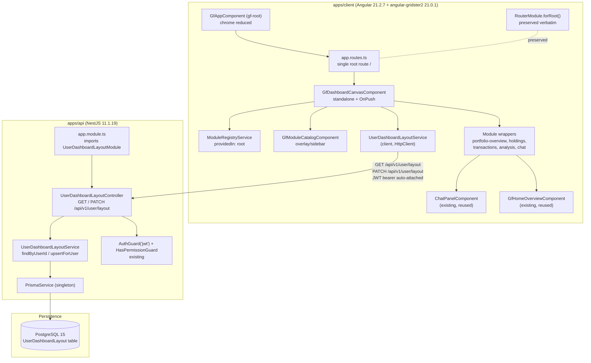

# Technical Specification

# 0. Agent Action Plan

## 0.1 Intent Clarification

### 0.1.1 Core Feature Objective

Based on the prompt, the Blitzy platform understands that the new feature requirement is to refactor the existing Ghostfolio Angular client application from a multi-route, navigation-shell-driven UI into a single-canvas modular dashboard system. Every existing user-facing feature — portfolio overview, holdings, transactions/activities, analysis, and the AI chat panel — must be repackaged as a self-contained, independently placeable grid module that the user can compose freely on a 12-column cell-based grid via drag-and-drop. Per-user layouts must persist to PostgreSQL through a new Prisma model and a new authenticated NestJS endpoint pair, so that returning users see their saved layout and new users see a blank canvas with the module catalog auto-opened on first visit.

The Blitzy platform restates the explicit feature requirements with enhanced clarity:

- **Single-canvas application shell** — the Angular Router's currently-rich route table must collapse to one root route `/` whose component is a new `DashboardCanvasComponent` rendered inside the existing `gf-root` shell.
- **Modular grid container** — the canvas wraps `angular-gridster2` v21.0.1 configured for a 12-column, fixed row-height grid with a 2×2 minimum module size and per-module minimum cell dimensions enforced at the grid-engine level.
- **Module registry as the single registration mechanism** — a new `ModuleRegistryService` exposes the catalog of available module types, each registered with a stable name, an Angular component reference, and minimum cell dimensions; ad-hoc component insertion into the grid is prohibited.
- **Module catalog UI** — an overlay or sidebar panel listing every registered module (searchable by name) supports both drag-to-place and click-to-add interactions; modules are removed via a header action on the module wrapper itself.
- **Authenticated layout persistence** — `GET /api/v1/user/layout` returns the saved layout and `PATCH /api/v1/user/layout` upserts it; both endpoints are protected by the existing `AuthGuard('jwt')` and `HasPermissionGuard` pattern from `apps/api/src/app/user/user.controller.ts`.
- **New Prisma model** — `UserDashboardLayout` (foreign-key to `User.id`, `layoutData` JSONB, `updatedAt`), located after confirming the `schema.prisma` path (verified at `prisma/schema.prisma`).
- **First-visit UX** — when no layout row exists for the authenticated user, the canvas renders blank and the module catalog opens automatically.
- **AI chat as a co-equal module** — the existing `ChatPanelComponent` (currently embedded at `apps/client/src/app/pages/portfolio/portfolio-page.html` line 32) becomes a standalone grid module on equal footing with all other modules. This is an intentional deviation from the existing tech spec § 7.4.1.2 ("the component is rendered below the `mat-tab-nav-bar` of the portfolio page and persists across all six portfolio tabs").

The Blitzy platform also surfaces the following implicit requirements detected from the prompt:

- **Routing infrastructure preservation, route table elimination** — the prompt explicitly requires that the `RouterModule.forRoot(...)` registration in `apps/client/src/main.ts`, `ServiceWorkerModule` navigation handling, the `PageTitleStrategy` provider, and the `ModulePreloadService` preloading strategy must remain functional after the refactor; only the route entries are reduced to a single `path: ''` with the new canvas component. The existing `app.routes.ts` array of ~22 lazy-loaded route entries is removed in favor of one entry.
- **Removal of shell chrome** — the existing `GfHeaderComponent` and `GfFooterComponent` imported into `GfAppComponent` (`apps/client/src/app/app.component.ts` lines 36–37) and rendered in `apps/client/src/app/app.component.html`, plus any sidebar/topnav components, are out of scope after the refactor; `gf-root` reduces to a `<router-outlet />` plus any always-visible chrome the dashboard requires.
- **Preservation of all data services and business logic** — every existing feature service (`PortfolioService`, `SymbolService`, `AiChatService`, `RebalancingService`, `FinancialProfileService`) and every Ghostfolio API integration must remain unchanged; modules consume them exactly as the route-driven pages do today.
- **Module-to-grid isolation contract** — module components must not import from the grid canvas layer, and grid state is the single source of truth for module positions and sizes (no per-module layout state).
- **Grid-state-driven persistence** — saves trigger only on grid state-change events (drag, resize, add, remove) with debounce (≥ 500 ms) — module components never call layout-save APIs.
- **Material Design 3 compliance for grid chrome** — module headers, resize handles, and drop-zone indicators must use the `var(--mat-sys-<token>, <hardcoded-fallback>)` pattern per Decision D-020 (recorded in `docs/decisions/agent-action-plan-decisions.md`).
- **Migration coordination** — the new Prisma migration must not conflict with existing `User` and `FinancialProfile` models; `schema.prisma` must be located and read before migration generation (path verified: `prisma/schema.prisma`).
- **Auto-open catalog on first visit** — the canvas initialization logic (not the catalog) is responsible for the auto-open behavior when no saved layout exists for the authenticated user.
- **Performance bound** — drag/resize visual updates must complete within 100 ms; this must be measured against the existing zone-based Angular setup (`provideZoneChangeDetection()` in `apps/client/src/main.ts` line 87) and the zoneless-aware NgZone calls in angular-gridster2 v21.

The Blitzy platform identifies the following feature dependencies and prerequisites:

- The Angular workspace already runs Angular 21.2.7 and Angular Material 21.2.5, satisfying the angular-gridster2 v21.0.1 peer-dependency requirement (confirmed against `package.json` lines 61–67).
- Prisma 7.7.0 is installed and `schema.prisma` is located at `prisma/schema.prisma` (confirmed via `find` command). The `.config/prisma.ts` file references `prisma/schema.prisma` and `prisma/migrations` paths.
- The existing `User` model declares `id String @id @default(uuid())` (`prisma/schema.prisma` line 273) and supports cascade-delete via the `onDelete: Cascade` pattern used by `FinancialProfile.user` (line 374). The new `UserDashboardLayout.user` relation will follow the identical convention.
- The existing `UserFinancialProfileModule` (`apps/api/src/app/user-financial-profile/`) is the structural template for the new `UserDashboardLayoutModule`: thin controller with `@UseGuards(AuthGuard('jwt'), HasPermissionGuard)`, service with `findByUserId` / `upsertForUser`, DTOs in a `dtos/` subfolder, and idempotent PATCH upsert semantics (Decision D-019 pattern).
- The `permissions` registry at `libs/common/src/lib/permissions.ts` is the canonical place to add the two new permission constants required by the new endpoints.

### 0.1.2 Special Instructions and Constraints

The Blitzy platform captures the following CRITICAL directives verbatim from the prompt:

- **"This refactor explicitly deviates from the tech spec's definition of `ChatPanelComponent` as embedded within `portfolio-page.html:32`. The chat panel MUST be treated as a standalone grid module co-equal with all other modules. This deviation is intentional."** — This deviation must be recorded in the project's decision log at `docs/decisions/agent-action-plan-decisions.md` per the Explainability project rule, with rationale and trade-off analysis.
- **"Layout persistence: new Prisma model `UserDashboardLayout` (`userId` FK, `layoutData` JSONB, `updatedAt`); locate `schema.prisma` before writing migration — confirm path under `apps/api/prisma/`, `libs/`, or workspace root `prisma/`"** — Confirmed: `schema.prisma` is at workspace-root `prisma/schema.prisma`.
- **"New NestJS endpoints: `GET /api/v1/user/layout` and `PATCH /api/v1/user/layout`, protected by existing `AuthGuard('jwt')` and `HasPermissionGuard` pattern from `apps/api/src/app/user/user.controller.ts`"** — The exact decorator stack `@UseGuards(AuthGuard('jwt'), HasPermissionGuard)` plus a `@HasPermission(...)` decorator must be applied; the same controller path conventions used by `apps/api/src/app/user-financial-profile/user-financial-profile.controller.ts` (route `user/financial-profile`) inform the new `user/layout` route.
- **"Module catalog: overlay or sidebar panel listing all registered modules, searchable by name; add via drag or click; remove via module header action"** — Both interaction paths must be supported.
- **"Grid spec: 12 columns, fixed row height (constant px), minimum module size 2×2 cells"** — angular-gridster2 `GridsterConfig` properties `minCols: 12`, `maxCols: 12`, `fixedRowHeight: <constant px>`, `minItemCols: 2`, `minItemRows: 2`.

The Blitzy platform documents the following architectural requirements:

- **Use the existing service pattern verbatim** — the new `UserDashboardLayoutController` follows the controller shape of `apps/api/src/app/user-financial-profile/user-financial-profile.controller.ts` (correlation-ID header, JWT `request.user.id`, idempotent upsert).
- **Follow repository conventions** — Angular component selectors use the `gf` prefix (configured in `apps/client/project.json` line 6 and `nx.json`); standalone components with `ChangeDetectionStrategy.OnPush`; `takeUntilDestroyed(destroyRef)` for RxJS subscriptions; SCSS component styles; Angular control flow (`@if`, `@for`); i18n via `i18n="..."` attributes and `$localize` template literals.
- **Maintain backward compatibility for routing infrastructure** — `RouterModule.forRoot(routes, { anchorScrolling: 'enabled', preloadingStrategy: ModulePreloadService, scrollPositionRestoration: 'top' })` from `apps/client/src/main.ts` lines 70–74 stays exactly as-is; only the `routes` array contents change.
- **Use existing Ghostfolio API integrations unchanged** — every data-fetch call inside a module wrapper component delegates to its existing service (e.g., `PortfolioService.fetchPortfolioDetails(...)`).
- **Module isolation rule applies** — Engineering Rule 1 (§ 5.1.1.1 of the existing tech spec) requires that no source file under any new feature module directory imports from inside another feature module's directory; module wrapper components import the module's existing service from `apps/client/src/app/services/...` and existing presentation components from `apps/client/src/app/components/...` only.

The Blitzy platform preserves the user-provided examples verbatim:

- **User Example (Grid engine pin):** "angular-gridster2 v21.0.1 (version-compatible with Angular 21)"
- **User Example (Module registry shape):** "centralized Angular service registering available module types with metadata (name, component reference, min cell dimensions)"
- **User Example (Schema model):** "new Prisma model `UserDashboardLayout` (`userId` FK, `layoutData` JSONB, `updatedAt`)"
- **User Example (Endpoint contract):** "`GET /api/v1/user/layout` and `PATCH /api/v1/user/layout`, protected by existing `AuthGuard('jwt')` and `HasPermissionGuard` pattern"
- **User Example (Module file layout):** "Module wrapper components: `apps/client/src/app/dashboard/modules/<module-name>/`"
- **User Example (Layout NestJS controller path):** "`apps/api/src/app/user/user-dashboard-layout.controller.ts`"
- **User Example (Layout NestJS service path):** "`apps/api/src/app/user/user-dashboard-layout.service.ts`"
- **User Example (Validation timing):** "Grid drag/resize MUST complete visual update within 100ms (measure against zone-based Angular setup; validate zone/zoneless interaction with angular-gridster2 v21's NgZone calls)"
- **User Example (Test placement convention):** "Follow existing nx workspace test file placement conventions"

The Blitzy platform documents the following web search research conducted:

- **angular-gridster2 v21.0.1 release notes and API surface** — confirmed v21.0.1 is the latest stable release (published January 9, 2026 on GitHub), v21.0.0 introduced standalone-only API: imports are `Gridster` and `GridsterItemComponent` rather than the legacy `GridsterModule`, the API is exposed via `initCallback` or `viewChild(Gridster).api`, `gridster.api.optionsChanged()` is removed in favor of "set a new object on input options when there is a change", and `NgZone.run` / `NgZone.runOutsideAngular` are retained "for apps still using zone.js to keep the performance high" — directly relevant to the prompt's validation requirement to verify zone/zoneless interaction in a `provideZoneChangeDetection()` host.

### 0.1.3 Technical Interpretation

These feature requirements translate to the following technical implementation strategy. The Blitzy platform decomposes the work into seven coordinated change vectors that together deliver the modular dashboard:

To **introduce the grid engine and dashboard shell**, we will install `angular-gridster2@21.0.1` as a runtime dependency, create a new dashboard namespace at `apps/client/src/app/dashboard/`, and implement `DashboardCanvasComponent` (`apps/client/src/app/dashboard/dashboard-canvas/dashboard-canvas.component.{ts,html,scss,spec.ts}`) as a standalone Angular component that imports the gridster v21 standalone primitives (`Gridster`, `GridsterItemComponent`), defines a `GridsterConfig` with `minCols: 12`, `maxCols: 12`, `fixedRowHeight: <constant>`, `minItemCols: 2`, `minItemRows: 2`, and renders one `<gridster-item>` per active grid item bound to a registered module's component reference.

To **register module types centrally**, we will create `apps/client/src/app/dashboard/module-registry.service.ts` exposing a `ModuleRegistryService` with `register(metadata: ModuleMetadata)`, `getAll(): ModuleMetadata[]`, and `getByName(name: string): ModuleMetadata | undefined` methods, where `ModuleMetadata` carries `{ name: string; component: Type<unknown>; minCols: number; minRows: number; displayLabel: string; iconName: string }`. The registry is provided in `providedIn: 'root'`, populated at app bootstrap by a side-effect import (or APP_INITIALIZER), and is the single source of allowed grid-item component types — `DashboardCanvasComponent` rejects any `GridsterItem` whose `name` is not registered.

To **wrap each existing feature as a module**, we will create one wrapper component per module type under `apps/client/src/app/dashboard/modules/<module-name>/<module-name>-module.component.{ts,html,scss,spec.ts}` for at minimum: `portfolio-overview`, `holdings`, `transactions` (a.k.a. activities), `analysis`, and `chat` (the AI chat panel). Each wrapper imports the existing presentation component from `apps/client/src/app/components/...` (e.g., `GfHomeOverviewComponent`, `GfHomeHoldingsComponent`, `GfActivitiesPageComponent`, `GfHomeOverviewComponent`'s analysis dependents, `ChatPanelComponent`) and the existing data-fetching service unchanged. The wrappers add the module header chrome (drag handle, remove button) and forward all data flow to existing services.

To **expose the module catalog**, we will create `apps/client/src/app/dashboard/module-catalog/module-catalog.component.{ts,html,scss,spec.ts}` as an overlay or sidebar panel that injects `ModuleRegistryService`, renders a search field plus the list of registered modules, and emits an event consumed by `DashboardCanvasComponent` to add a module at the next available grid position. Drag-from-catalog is handled via standard HTML drag-and-drop or Angular CDK `DragDropModule` and integrated with gridster's drop API.

To **persist the layout server-side**, we will (a) add `model UserDashboardLayout { userId String @id; user User @relation(fields: [userId], references: [id], onDelete: Cascade); layoutData Json; createdAt DateTime @default(now()); updatedAt DateTime @updatedAt }` to `prisma/schema.prisma` (using `Json` not `Jsonb` because Prisma maps `Json` to PostgreSQL `jsonb` by default); (b) declare the back-relation `userDashboardLayout UserDashboardLayout?` on the `User` model (Prisma 7.x requirement per Decision D-013); (c) generate a new migration named `add-user-dashboard-layout` via `npx prisma migrate dev --name add-user-dashboard-layout`; (d) create `apps/api/src/app/user/user-dashboard-layout.controller.ts` with `GET` and `@HttpCode(HttpStatus.OK) PATCH` handlers under route `user/layout`, mirroring the structure of `apps/api/src/app/user-financial-profile/user-financial-profile.controller.ts`; (e) create `apps/api/src/app/user/user-dashboard-layout.service.ts` with `findByUserId(userId)` and `upsertForUser(userId, dto)` methods backed by `PrismaService`; (f) create `apps/api/src/app/user/user-dashboard-layout.module.ts` registering the controller, service, and `PrismaModule` import; (g) wire `UserDashboardLayoutModule` into `apps/api/src/app/app.module.ts` imports list adjacent to the existing `UserFinancialProfileModule` registration at line 182.

To **collapse the routing surface**, we will replace the array body of `apps/client/src/app/app.routes.ts` with a single entry `{ path: '', component: GfDashboardCanvasComponent, canActivate: [AuthGuard], title: 'Dashboard' }` (plus any auth/login routes the host platform requires for unauthenticated access; the wildcard `**` redirect remains pointing at the root). Strictly preserved are: `RouterModule.forRoot(routes, { ... preloadingStrategy: ModulePreloadService ... })` in `apps/client/src/main.ts`, `ServiceWorkerModule.register('ngsw-worker.js', ...)` registration, the `PageTitleStrategy` provider, and the `ModulePreloadService` provider — all without modification. Removed are the imports and template references to `GfHeaderComponent` and `GfFooterComponent` in `apps/client/src/app/app.component.{ts,html}`.

To **wire grid-state-driven persistence**, we will subscribe inside `DashboardCanvasComponent` to gridster's `itemChangeCallback`, `itemResizeCallback`, and the canvas's own add/remove handlers; on every event we will pipe through a 500 ms `debounceTime` operator and call a new client-side `UserDashboardLayoutService` (`apps/client/src/app/dashboard/services/user-dashboard-layout.service.ts`) that issues `PATCH /api/v1/user/layout` via `HttpClient`. On `ngOnInit`, the canvas calls `GET /api/v1/user/layout`; if the response is HTTP 404 (no saved layout), the canvas renders blank and opens the catalog programmatically.

To **enforce design system compliance for grid chrome**, every CSS property value in the new files (`dashboard-canvas.component.scss`, module wrapper SCSS, `module-catalog.component.scss`) must trace to either a Material 3 system token via the `var(--mat-sys-<token>, <hardcoded-fallback>)` pattern (per Decision D-020) or a token from `apps/client/src/styles/variables.scss`; raw color literals or hardcoded spacing pixel values are prohibited. All Angular Material components that map to grid chrome (buttons in module headers, the Mat dialog/overlay backing the catalog) are imported per-component as the existing codebase already does.

Each requirement is mapped to specific technical actions in the table below:

| Requirement | Component(s) Created/Modified | Specific Change |
|-------------|-------------------------------|-----------------|
| Single root route | `apps/client/src/app/app.routes.ts` (MODIFY) | Replace 22-entry routes array with 1 entry rendering `GfDashboardCanvasComponent` |
| Grid canvas | `apps/client/src/app/dashboard/dashboard-canvas/*` (CREATE) | Standalone component embedding `<gridster>` with 12-col, 2×2-min config |
| Module registry | `apps/client/src/app/dashboard/module-registry.service.ts` (CREATE) | `providedIn: 'root'` service with `register/getAll/getByName` |
| Per-feature wrappers | `apps/client/src/app/dashboard/modules/<name>/*` (CREATE × 5+) | One wrapper per: portfolio-overview, holdings, transactions, analysis, chat |
| Module catalog | `apps/client/src/app/dashboard/module-catalog/*` (CREATE) | Searchable panel with drag/click add |
| Layout persistence (DB) | `prisma/schema.prisma` (MODIFY) + new migration (CREATE) | Add `UserDashboardLayout` model + back-relation on `User` |
| Layout persistence (API) | `apps/api/src/app/user/user-dashboard-layout.controller.ts` (CREATE) + `.service.ts` (CREATE) + `.module.ts` (CREATE) | GET/PATCH endpoints with existing auth pattern |
| Layout persistence (client) | `apps/client/src/app/dashboard/services/user-dashboard-layout.service.ts` (CREATE) | `HttpClient`-based wrapper for the new endpoints |
| Routing infrastructure preservation | `apps/client/src/main.ts` (UNCHANGED) | No code edits; `RouterModule.forRoot`, `ServiceWorkerModule`, `ModulePreloadService`, `PageTitleStrategy` all retained verbatim |
| Header/footer removal | `apps/client/src/app/app.component.{ts,html}` (MODIFY) | Remove `GfHeaderComponent` and `GfFooterComponent` imports/template references |
| Permission additions | `libs/common/src/lib/permissions.ts` (MODIFY) | Add `permissions.readUserDashboardLayout`, `permissions.updateUserDashboardLayout` |
| AppModule wiring | `apps/api/src/app/app.module.ts` (MODIFY) | Import `UserDashboardLayoutModule` adjacent to `UserFinancialProfileModule` |
| Auto-open catalog | `DashboardCanvasComponent.ngOnInit` (CREATE) | On 404 from layout GET, programmatically open catalog |
| 100 ms drag/resize SLO | gridster v21 NgZone integration | Validate against `provideZoneChangeDetection()` host |
| 500 ms persistence debounce | `DashboardCanvasComponent` save subscription | RxJS `debounceTime(500)` on grid-state events |
| Material Design 3 chrome | All new SCSS files | `var(--mat-sys-<token>, <fallback>)` per Decision D-020 |


## 0.2 Repository Scope Discovery

### 0.2.1 Comprehensive File Analysis

The Blitzy platform has performed an exhaustive sweep of the Ghostfolio Nx monorepo (`apps/api` NestJS backend, `apps/client` Angular 21.2.7 frontend, `libs/common` shared TypeScript library, `libs/ui` shared Angular UI library, `prisma/` schema-and-migrations area) and enumerates the existing files that must be modified, the existing files that participate as integration points (read but not modified), and the existing files that are explicitly removed.

#### 0.2.1.1 Existing Modules to Modify

| File | Modification Type | Purpose |
|------|-------------------|---------|
| `apps/client/src/app/app.routes.ts` | Replace contents | Collapse 22-entry route array to a single `path: ''` entry rendering `GfDashboardCanvasComponent` plus an auth callback route and a wildcard redirect to root |
| `apps/client/src/app/app.component.ts` | Remove imports | Drop `GfFooterComponent` and `GfHeaderComponent` imports (lines 36–37) and any logic exclusively servicing the removed chrome |
| `apps/client/src/app/app.component.html` | Replace contents | Remove `<gf-header>` / `<gf-footer>` references; reduce shell to `<router-outlet />` plus optional info-message banner |
| `apps/client/src/app/app.component.scss` | Reduce contents | Remove header/footer-specific layout rules; retain only host-level full-height layout |
| `prisma/schema.prisma` | Add model + back-relation | Append `model UserDashboardLayout { ... }`; add `userDashboardLayout UserDashboardLayout?` back-relation to existing `User` model (Prisma 7.x explicit-back-relation requirement per Decision D-013) |
| `apps/api/src/app/app.module.ts` | Add import | Add `UserDashboardLayoutModule` import (line ~66 area) and add to `imports: [...]` array (adjacent to `UserFinancialProfileModule` at line 182) |
| `libs/common/src/lib/permissions.ts` | Add constants | Add `readUserDashboardLayout` and `updateUserDashboardLayout` permission constants and grant them to `ADMIN` and `USER` roles only (DEMO role explicitly excluded per Decision D-005 pattern) |
| `package.json` | Add dependency | Add `"angular-gridster2": "21.0.1"` to `dependencies` block; the file is also auto-updated by `npm install` to refresh `package-lock.json` |
| `package-lock.json` | Auto-updated | Locks the angular-gridster2 dependency tree |
| `apps/client/src/main.ts` | UNCHANGED | Strictly preserved per prompt boundary: `RouterModule.forRoot`, `ServiceWorkerModule`, `provideZoneChangeDetection`, `ModulePreloadService`, `PageTitleStrategy` all remain verbatim |
| `apps/api/src/main.ts` | UNCHANGED | API bootstrap stays as-is; the new module is wired through `AppModule` only |
| `.config/prisma.ts` | UNCHANGED | Prisma config already points to `prisma/schema.prisma` and `prisma/migrations`; no edit required |

#### 0.2.1.2 Existing Files to Remove (Route-Driven Pages and Shell Chrome)

The prompt's BOUNDARIES section lists the categories of files to remove. The following enumerates the concrete folders that fall into those categories. Removal of an entire folder is denoted by a trailing `/`; removal of specific files is enumerated.

| Path Pattern | Removal Category | Notes |
|--------------|-------------------|-------|
| `apps/client/src/app/components/header/` | Sidebar/topnav nav components | Entire folder (`header.component.{ts,html,scss}`) removed |
| `apps/client/src/app/components/footer/` | Sidebar/topnav nav components | Entire folder (`footer.component.{ts,html,scss}`) removed |
| `apps/client/src/app/pages/home/home-page.component.ts` | Screen-level route component tree | The home page shell (its tabs, route-driven children) is removed; the underlying `home-overview`, `home-holdings`, `home-summary`, `home-watchlist`, `home-market` presentation components in `apps/client/src/app/components/` are RETAINED and reused as module content |
| `apps/client/src/app/pages/home/home-page.html` | Screen-level route component tree | Removed |
| `apps/client/src/app/pages/home/home-page.routes.ts` | Screen-level route component tree | Removed |
| `apps/client/src/app/pages/home/home-page.scss` | Screen-level route component tree | Removed |
| `apps/client/src/app/pages/portfolio/portfolio-page.component.ts` | Screen-level route component tree | Removed; the `<app-chat-panel>` embed at `portfolio-page.html:32` is superseded by the standalone chat module |
| `apps/client/src/app/pages/portfolio/portfolio-page.html` | Screen-level route component tree | Removed |
| `apps/client/src/app/pages/portfolio/portfolio-page.routes.ts` | Screen-level route component tree | Removed |
| `apps/client/src/app/pages/portfolio/portfolio-page.scss` | Screen-level route component tree | Removed |
| `apps/client/src/app/pages/portfolio/{activities,allocations,analysis,fire,rebalancing,x-ray}/*-page.component.ts` | Screen-level route component tree | Page-level route shells removed; underlying presentation components (e.g., the rebalancing `RebalancingPageComponent` used as content) are retained where they exist as reusable presentation, or removed where they are pure shells |
| `apps/client/src/app/pages/markets/`, `apps/client/src/app/pages/zen/`, `apps/client/src/app/pages/accounts/`, `apps/client/src/app/pages/admin/`, `apps/client/src/app/pages/about/`, `apps/client/src/app/pages/auth/`, `apps/client/src/app/pages/api/`, `apps/client/src/app/pages/blog/`, `apps/client/src/app/pages/demo/`, `apps/client/src/app/pages/faq/`, `apps/client/src/app/pages/features/`, `apps/client/src/app/pages/i18n/`, `apps/client/src/app/pages/landing/`, `apps/client/src/app/pages/open/`, `apps/client/src/app/pages/pricing/`, `apps/client/src/app/pages/public/`, `apps/client/src/app/pages/register/`, `apps/client/src/app/pages/resources/`, `apps/client/src/app/pages/user-account/`, `apps/client/src/app/pages/webauthn/` | Screen-level route component tree (all routed pages) | Entire `apps/client/src/app/pages/` namespace is removed because the route table has collapsed to a single canvas route. Where any underlying business-logic reused by modules currently lives in a page folder, the relevant component is moved or its consumed services are referenced directly |

> Note on scope of `apps/client/src/app/pages/` removal: the prompt's BOUNDARIES & PRESERVATION section explicitly states "REMOVE: Angular routing shell components, sidebar/topnav nav components, all screen-level route component trees" and PRESERVES "all data-fetching services, business logic, Ghostfolio API integrations". Where a page-folder file contains only routing/shell code (e.g., `*-page.routes.ts`, `*-page.component.ts` that hosts only `mat-tab-nav-bar` + `<router-outlet/>`), it is removed. Where a presentation component lives in `apps/client/src/app/components/` (e.g., `GfHomeOverviewComponent`, `GfHomeHoldingsComponent`, `ChatPanelComponent`, `GfActivitiesPageComponent` if it is a presentation component rather than a route shell), it is RETAINED and reused as the inner content of a module wrapper.

#### 0.2.1.3 Test Files to Update

| File Pattern | Update Type |
|--------------|-------------|
| `apps/client/src/app/dashboard/**/*.spec.ts` | CREATE — new specs for canvas, registry, module wrappers, catalog, client-side layout service |
| `apps/api/src/app/user/user-dashboard-layout.controller.spec.ts` | CREATE — controller spec mirroring `user-financial-profile.controller.spec.ts` shape |
| `apps/api/src/app/user/user-dashboard-layout.service.spec.ts` | CREATE — service spec mirroring `user-financial-profile.service.spec.ts` shape |
| `apps/client/src/app/components/chat-panel/chat-panel.component.spec.ts` | RETAINED — chat panel component spec stays; the tests do not depend on portfolio-page mounting |
| `apps/client/src/app/pages/portfolio/portfolio-page.component.spec.ts` | REMOVE if present — page shell removed |
| Other `apps/client/src/app/pages/**/*spec.ts` | REMOVE — alongside their owning page folders |

#### 0.2.1.4 Configuration Files Touched

| File | Change |
|------|--------|
| `package.json` | Add `"angular-gridster2": "21.0.1"` to `dependencies` |
| `package-lock.json` | Regenerated by `npm install` |
| `apps/client/project.json` | UNCHANGED — Nx build/serve targets unaffected; the `"prefix": "gf"` entry already governs new component selectors |
| `apps/client/ngsw-config.json` | UNCHANGED — service-worker prefetch list does not need to enumerate the dashboard route |
| `apps/client/src/styles.scss` | UNCHANGED — global stylesheet is independent of the dashboard chrome |
| `apps/client/src/styles/variables.scss` | UNCHANGED unless a new design token is required by grid chrome |
| `apps/api/project.json` | UNCHANGED |
| `nx.json` | UNCHANGED — workspace-level config remains |
| `tsconfig.base.json` | UNCHANGED unless a new path alias is added (e.g., `@ghostfolio/client/dashboard/*`); current path mapping is sufficient because new code lives under existing aliases |

#### 0.2.1.5 Documentation Files

| File | Change |
|------|--------|
| `docs/decisions/agent-action-plan-decisions.md` | APPEND — new decision rows documenting the chat-panel deviation, gridster engine selection, single-route reduction, layout persistence model choice, debounce window, 12-column grid choice, blank-canvas-first-visit semantics |
| `docs/observability/user-dashboard-layout.md` | CREATE — observability runbook for the new layout endpoints (per the Observability project rule), documenting the `correlation-id` header, structured log fields, the `user_dashboard_layout_request_total{outcome}` counter, the `user_dashboard_layout_request_latency_seconds` histogram, the `/api/v1/health/...`-style probe, and the local verification procedure |
| `README.md` | OPTIONAL UPDATE — note the modular dashboard in the feature overview |
| `CHANGELOG.md` | APPEND — release entry covering the dashboard refactor |
| `blitzy-deck/dashboard-refactor-deck.html` | CREATE — single self-contained Reveal.js HTML executive presentation covering scope, architecture diagrams, risks, mitigations (per the Executive Presentation project rule), 12–18 slides |

#### 0.2.1.6 Build / Deployment Files

| File | Change |
|------|--------|
| `Dockerfile` | UNCHANGED — runtime image is unaffected; the new module is part of `apps/api` and the new client code is part of `apps/client` |
| `docker/docker-compose.yml`, `docker/docker-compose.dev.yml`, `docker/docker-compose.build.yml` | UNCHANGED |
| `docker/entrypoint.sh` | UNCHANGED — `prisma migrate deploy` already runs at boot and will apply the new migration without modification |
| `.github/workflows/*.yml` | UNCHANGED — existing CI runs `nx build`, `nx test`, `nx lint` which transparently cover the new files |

#### 0.2.1.7 Integration Point Discovery

| Integration Surface | Existing File / Symbol | Relationship to New Feature |
|---------------------|------------------------|------------------------------|
| API endpoints | `apps/api/src/app/user/user.controller.ts` | Reference template for route layout (`@Controller('user')` with `@Get()` / `@Patch()` decorated methods); the new layout controller uses `@Controller('user/layout')` to namespace the new endpoints under `/api/v1/user/layout` |
| API auth pattern | `AuthGuard('jwt')` (`@nestjs/passport`) and `apps/api/src/guards/has-permission.guard.ts` (`HasPermissionGuard`) | New layout endpoints declare `@UseGuards(AuthGuard('jwt'), HasPermissionGuard)` with `@HasPermission(permissions.readUserDashboardLayout)` / `@HasPermission(permissions.updateUserDashboardLayout)` |
| Database access | `apps/api/src/services/prisma/prisma.service.ts` (global `PrismaService`) | New service injects `PrismaService` and uses `prismaService.userDashboardLayout.{findUnique, upsert}` |
| Database models | `prisma/schema.prisma` lines 261–290 (User model) and 364–376 (FinancialProfile model) | `User.userDashboardLayout` back-relation added; `UserDashboardLayout.user` forward relation declared with `onDelete: Cascade` (mirrors the FinancialProfile pattern from line 374) |
| Service classes (Angular) | `apps/client/src/app/services/user/user.service.ts` (existing user store) | Module wrappers consume existing services unchanged; the dashboard does not duplicate user state |
| Existing data-fetching services | `apps/client/src/app/services/{ai-chat.service.ts, financial-profile.service.ts, rebalancing.service.ts}` and the shared services in `libs/ui/src/lib/services/` (e.g., `DataService`) | Module wrappers import these directly; no edits to the services themselves |
| Existing presentation components | `apps/client/src/app/components/{home-overview, home-holdings, home-summary, home-watchlist, home-market, chat-panel, portfolio-summary, portfolio-performance, holdings-table, ...}/` | Reused inside module wrappers; their existing `gf-*` selectors remain valid |
| Auth guard (Angular) | `apps/client/src/app/core/auth.guard.ts` | The single new root route uses `canActivate: [AuthGuard]` exactly as today's protected routes do |
| Routing infrastructure | `apps/client/src/main.ts` providers (`RouterModule.forRoot`, `ServiceWorkerModule`, `ModulePreloadService`, `PageTitleStrategy`) | All retained verbatim — preserved per BOUNDARIES section |
| HTTP interceptors | `apps/client/src/app/core/auth.interceptor.ts` and `apps/client/src/app/core/http-response.interceptor.ts` | The new client-side layout service uses `HttpClient`, so the existing JWT bearer interceptor automatically attaches the auth header to layout requests; no edits required |
| Permission registry | `libs/common/src/lib/permissions.ts` | Two new constants added, granted to USER and ADMIN roles only |
| AppModule (NestJS) wiring | `apps/api/src/app/app.module.ts` | New module registered alongside `UserFinancialProfileModule` |
| App component (Angular) | `apps/client/src/app/app.component.ts` lines 36–37 (header/footer imports) | Header/footer imports removed; nothing else in the shell consumes the dashboard |

### 0.2.2 Web Search Research Conducted

The Blitzy platform performed targeted research to validate the dependency choice and catalog the gridster v21 API surface:

- **Best practices for grid-based dashboard layouts in Angular 21** — angular-gridster2 v21.0.1 is the current canonical Angular-native option, published January 9, 2026, with an MIT license, ~187k weekly downloads on npm, and an active maintainer (`tiberiuzuld`). It supports both zone-based and zoneless Angular setups by retaining `NgZone.run` / `NgZone.runOutsideAngular` calls, which directly addresses the prompt's validation requirement to "validate zone/zoneless interaction with angular-gridster2 v21's NgZone calls" against the host's `provideZoneChangeDetection()` configuration.
- **Library API for v21.0.0+** — v21.0.0 introduced standalone-only imports: a component imports `Gridster` and `GridsterItemComponent` (renamed from `GridsterModule`/`GridsterItem` legacy patterns) directly into its `imports: [...]` array and uses `<gridster [options]="options"><gridster-item *ngFor="let item of dashboard" [item]="item">…</gridster-item></gridster>` template syntax. The runtime API is exposed via `initCallback` or via Angular's `viewChild(Gridster).api`. The legacy `gridster.api.optionsChanged()` method has been removed; clients must "set a new object on input options when there is a change" instead.
- **Recommended grid configuration patterns for fixed-row-height, multi-column dashboards** — `gridType: 'fixed'` with explicit `fixedRowHeight: <px>` produces the constant-height row behavior the prompt requires; `minCols: 12`, `maxCols: 12` lock the column count; `displayGrid: 'always'` provides the visible grid backdrop expected of dashboards; `pushItems: true` and `swap: true` provide the natural drag-rearrange behavior; `minItemCols: 2`, `minItemRows: 2` enforce the 2×2 floor; per-item `minItemCols`/`minItemRows` overrides are honored by the engine.
- **Common patterns for module catalogs and drag-drop placement** — Either gridster's native drop-from-outside support or Angular CDK `DragDropModule` with a custom drop handler are the two viable approaches; the implementation will use gridster's drop API to keep the placement logic inside the engine that already owns the grid coordinates.
- **Persistence patterns for per-user UI preferences** — JSONB column with `userId` PK is the standard approach in the existing codebase (`Settings` model uses this pattern at `prisma/schema.prisma`); `FinancialProfile` provides the most direct precedent at lines 364–376 with cascade-delete semantics that the new model adopts verbatim.
- **Angular zoneless and zone-based interaction with third-party libraries that call `NgZone`** — angular-gridster2 v21 release notes explicitly state NgZone calls are kept "to keep the performance high" for apps still using zone.js; this is compatible with the host's `provideZoneChangeDetection()` setup (`apps/client/src/main.ts` line 87) and meets the prompt's 100 ms drag/resize SLO without requiring a zoneless migration.

### 0.2.3 New File Requirements

The Blitzy platform plans the following new source files. Every file has a clear purpose, and the path layout follows the prompt's FILE ORGANIZATION section verbatim.

| New File | Purpose |
|----------|---------|
| `apps/client/src/app/dashboard/dashboard-canvas/dashboard-canvas.component.ts` | Standalone Angular canvas component; embeds `<gridster>` with 12-col fixed-row config; manages grid item lifecycle; subscribes to gridster change callbacks; calls `UserDashboardLayoutService.save(...)` debounced at 500 ms; on init calls `UserDashboardLayoutService.load()`, on 404 opens the catalog programmatically |
| `apps/client/src/app/dashboard/dashboard-canvas/dashboard-canvas.component.html` | Template with `<gridster>` host plus the catalog overlay slot |
| `apps/client/src/app/dashboard/dashboard-canvas/dashboard-canvas.component.scss` | Material 3 token-driven styling (var(--mat-sys-…, fallback)) |
| `apps/client/src/app/dashboard/dashboard-canvas/dashboard-canvas.component.spec.ts` | Unit tests: blank canvas on first visit, layout-driven render on returning user, catalog auto-open on 404, save fires within 500 ms debounce on drag/resize/add/remove |
| `apps/client/src/app/dashboard/module-registry.service.ts` | `providedIn: 'root'` registry exposing `register/getAll/getByName`; rejects duplicate names; enforces minimum cell dimensions on registration |
| `apps/client/src/app/dashboard/module-registry.service.spec.ts` | Unit tests: registration, duplicate-name rejection, minimum-dimensions validation, retrieval |
| `apps/client/src/app/dashboard/module-registry.tokens.ts` | Type definitions: `ModuleMetadata`, `ModuleName`, `RegisteredModule` |
| `apps/client/src/app/dashboard/module-catalog/module-catalog.component.ts` | Standalone component listing registered modules; search-by-name; emits `(addModule)` event consumed by the canvas |
| `apps/client/src/app/dashboard/module-catalog/module-catalog.component.html` | Template with search input and module list |
| `apps/client/src/app/dashboard/module-catalog/module-catalog.component.scss` | Material 3 token-driven styling |
| `apps/client/src/app/dashboard/module-catalog/module-catalog.component.spec.ts` | Unit tests: list rendering, search filter, click-to-add behavior |
| `apps/client/src/app/dashboard/services/user-dashboard-layout.service.ts` | `HttpClient` wrapper for `GET` and `PATCH /api/v1/user/layout`; returns Observable of layout data |
| `apps/client/src/app/dashboard/services/user-dashboard-layout.service.spec.ts` | Unit tests: GET/PATCH calls, 404 handling, error propagation |
| `apps/client/src/app/dashboard/modules/portfolio-overview/portfolio-overview-module.component.ts` | Module wrapper rendering existing `GfHomeOverviewComponent` inside grid chrome (header, drag handle, remove button) |
| `apps/client/src/app/dashboard/modules/portfolio-overview/portfolio-overview-module.component.{html,scss,spec.ts}` | Template, styles, spec |
| `apps/client/src/app/dashboard/modules/holdings/holdings-module.component.{ts,html,scss,spec.ts}` | Module wrapper rendering existing `GfHomeHoldingsComponent` |
| `apps/client/src/app/dashboard/modules/transactions/transactions-module.component.{ts,html,scss,spec.ts}` | Module wrapper rendering existing activities/transactions presentation component |
| `apps/client/src/app/dashboard/modules/analysis/analysis-module.component.{ts,html,scss,spec.ts}` | Module wrapper rendering existing analysis presentation component |
| `apps/client/src/app/dashboard/modules/chat/chat-module.component.{ts,html,scss,spec.ts}` | Module wrapper rendering existing `ChatPanelComponent` (DEVIATION POINT — formerly embedded at `portfolio-page.html:32`) |
| `apps/client/src/app/dashboard/modules/module-host.directive.ts` | Optional structural directive providing a consistent header chrome contract for all module wrappers |
| `apps/client/src/app/dashboard/dashboard.providers.ts` | Optional `EnvironmentProviders` factory wiring the registry's bootstrap registrations |
| `apps/api/src/app/user/user-dashboard-layout.controller.ts` | NestJS controller declaring `GET /user/layout` and `PATCH /user/layout`, both protected by `@UseGuards(AuthGuard('jwt'), HasPermissionGuard)` and decorated with `@HasPermission(...)`; sets `X-Correlation-ID`; mirrors `apps/api/src/app/user-financial-profile/user-financial-profile.controller.ts` |
| `apps/api/src/app/user/user-dashboard-layout.controller.spec.ts` | Controller spec mirroring `user-financial-profile.controller.spec.ts`: route metadata, guard registration, GET/PATCH delegation, 401 propagation, NotFoundException on missing layout |
| `apps/api/src/app/user/user-dashboard-layout.service.ts` | NestJS service exposing `findByUserId(userId, correlationId?)` and `upsertForUser(userId, dto, correlationId?)`; wraps `PrismaService.userDashboardLayout` calls; idempotent upsert keyed on `userId` |
| `apps/api/src/app/user/user-dashboard-layout.service.spec.ts` | Service spec mirroring `user-financial-profile.service.spec.ts`: user-scoped lookup, null-on-missing, upsert vs create semantics, DTO field passthrough |
| `apps/api/src/app/user/user-dashboard-layout.module.ts` | NestJS module registering controller + service + `PrismaModule` import; exports `UserDashboardLayoutService` so future modules can read the layout if needed |
| `apps/api/src/app/user/dtos/dashboard-layout.dto.ts` | Request DTO for PATCH; uses `class-validator` decorators (`@IsArray`, `@ValidateNested`, `@IsObject`, `@MaxLength`); explicitly omits `userId` per Engineering Rule 5 (Decision D-012) |
| `prisma/migrations/<timestamp>_add_user_dashboard_layout/migration.sql` | Generated by `npx prisma migrate dev --name add-user-dashboard-layout`; creates `UserDashboardLayout` table with `userId UUID PRIMARY KEY` and FK to `User(id) ON DELETE CASCADE`, plus `layoutData jsonb`, `createdAt timestamptz`, `updatedAt timestamptz` |
| `apps/client/src/app/dashboard/interfaces/grid-item.interface.ts` | TypeScript interface extending `GridsterItem` with the discriminator `name: ModuleName` and any module-specific config |
| `apps/client/src/app/dashboard/interfaces/dashboard-layout.interface.ts` | TypeScript interface for the persisted layout payload: `{ items: GridItem[]; updatedAt: string }` |
| `libs/common/src/lib/interfaces/dashboard-layout.interface.ts` | Shared interface available to both API and client (mirrors the persisted shape) |
| `docs/observability/user-dashboard-layout.md` | Observability runbook (project rule mandate): structured-log fields, metrics catalog, dashboard JSON template, alert rules |
| `blitzy-deck/dashboard-refactor-deck.html` | Single-file reveal.js executive presentation (project rule mandate): 12–18 slides, brand palette, Mermaid diagrams, Lucide icons |


## 0.3 Dependency Inventory

### 0.3.1 Public Packages

The Blitzy platform identifies the new public dependency required by the refactor and confirms every existing dependency that the new code consumes. Versions are taken from the user's prompt where specified and from the existing `package.json` otherwise; no placeholder versions are used.

| Package | Registry | Version | Purpose |
|---------|----------|---------|---------|
| `angular-gridster2` | npm (`https://www.npmjs.com/package/angular-gridster2`) | `21.0.1` | NEW — drag-and-drop grid engine; standalone-only Angular API; provides `Gridster`, `GridsterItemComponent`, `GridsterConfig`, `GridsterItem` exports; version explicitly pinned by the prompt and confirmed compatible with Angular 21.x |
| `@angular/core` | npm | `21.2.7` | EXISTING — used by all new standalone components and services |
| `@angular/common` | npm | `21.2.7` | EXISTING — `CommonModule` directives consumed by module wrappers and catalog |
| `@angular/router` | npm | `21.2.7` | EXISTING — `RouterModule.forRoot(...)` invocation preserved verbatim; the new single root route is registered through it |
| `@angular/forms` | npm | `21.2.7` | EXISTING — `FormsModule` consumed by the catalog search input |
| `@angular/platform-browser` | npm | `21.2.7` | EXISTING |
| `@angular/animations` | npm | `21.2.7` | EXISTING |
| `@angular/material` | npm | `21.2.5` | EXISTING — `MatButtonModule`, `MatIconModule`, `MatFormFieldModule`, `MatInputModule` consumed by catalog and module headers |
| `@angular/cdk` | npm | `21.2.5` | EXISTING — overlay/portal primitives may back the catalog if a Material `MatDialog`/`MatBottomSheet` is not used |
| `@angular/service-worker` | npm | `21.2.7` | EXISTING — `ServiceWorkerModule.register(...)` preserved verbatim |
| `rxjs` | npm | `7.8.1` | EXISTING — `Subject`, `BehaviorSubject`, `debounceTime`, `takeUntilDestroyed` for grid-state save pipeline |
| `zone.js` | npm | `0.16.1` | EXISTING — host platform is zone-based via `provideZoneChangeDetection()` |
| `ionicons` | npm | `8.0.13` | EXISTING — module header icons consume registered Ionicons |
| `@nestjs/common` | npm | `11.1.19` | EXISTING — controller decorators (`@Controller`, `@Get`, `@Patch`, `@UseGuards`, `@HttpCode`) for the new layout controller |
| `@nestjs/core` | npm | `11.1.19` | EXISTING — `REQUEST` token injection for `RequestWithUser` |
| `@nestjs/passport` | npm | `11.0.5` | EXISTING — `AuthGuard('jwt')` import |
| `@nestjs/jwt` | npm | `11.0.2` | EXISTING — JWT validation underpinning the auth guard |
| `@prisma/client` | npm | `7.7.0` | EXISTING — generated `userDashboardLayout` delegate consumed by the new service |
| `@prisma/adapter-pg` | npm | `7.7.0` | EXISTING — PostgreSQL adapter for the operational store |
| `prisma` | npm (devDep) | `7.7.0` | EXISTING — CLI used to generate the new migration |
| `class-validator` | npm | `0.15.1` | EXISTING — DTO validation decorators (`@IsArray`, `@IsObject`, `@MaxLength`, `@ValidateNested`) on the layout PATCH body |
| `class-transformer` | npm | `0.5.1` | EXISTING — `@Type(() => ...)` decorator for nested array validation |
| `passport-jwt` | npm | `4.0.1` | EXISTING — JWT bearer strategy used by the auth guard |
| `http-status-codes` | npm | `2.3.0` | EXISTING — `StatusCodes` constants used in controller error paths |
| `jest` | npm (devDep) | `30.2.0` | EXISTING — unit-test runner for both API and client; used for new specs |
| `jest-preset-angular` | npm (devDep) | `16.0.0` | EXISTING — Angular Jest preset configured in `apps/client/jest.config.ts` |
| `@nx/angular` | npm (devDep) | `22.6.5` | EXISTING — Angular Nx executor used for `nx build client` and `nx test client` |
| `@nx/nest` | npm (devDep) | `22.6.5` | EXISTING — NestJS Nx executor used for `nx build api` and `nx test api` |
| `nx` | npm (devDep) | `22.6.5` | EXISTING — workspace orchestrator |
| `typescript` | npm (devDep) | `5.9.2` | EXISTING — language toolchain |

### 0.3.2 Private Packages and Internal Cross-Workspace Imports

The repository ships internal libraries via Nx path aliases declared in `tsconfig.base.json`. The new code consumes the following internal entry points without modifying them:

| Internal Path Alias | Source | Consumed By |
|---------------------|--------|-------------|
| `@ghostfolio/api/services/prisma/prisma.service` | `apps/api/src/services/prisma/prisma.service.ts` | New `UserDashboardLayoutService` |
| `@ghostfolio/api/decorators/has-permission.decorator` | `apps/api/src/decorators/has-permission.decorator.ts` | New `UserDashboardLayoutController` for the `@HasPermission(...)` decorator |
| `@ghostfolio/api/guards/has-permission.guard` | `apps/api/src/guards/has-permission.guard.ts` | New `UserDashboardLayoutController` for `@UseGuards(..., HasPermissionGuard)` |
| `@ghostfolio/common/permissions` | `libs/common/src/lib/permissions.ts` | New permission constants `permissions.readUserDashboardLayout` / `permissions.updateUserDashboardLayout` are added here and referenced by the controller |
| `@ghostfolio/common/types` | `libs/common/src/lib/types/...` | `RequestWithUser` type for the controller's `@Inject(REQUEST)` parameter |
| `@ghostfolio/client/core/auth.guard` | `apps/client/src/app/core/auth.guard.ts` | The single new root route uses `canActivate: [AuthGuard]` |
| `@ghostfolio/client/components/chat-panel/chat-panel.component` | `apps/client/src/app/components/chat-panel/chat-panel.component.ts` | New `ChatModuleComponent` wrapper imports it as the inner content |
| `@ghostfolio/client/components/home-overview/home-overview.component` | `apps/client/src/app/components/home-overview/home-overview.component.ts` | New `PortfolioOverviewModuleComponent` wrapper |
| `@ghostfolio/client/components/home-holdings/home-holdings.component` | `apps/client/src/app/components/home-holdings/home-holdings.component.ts` | New `HoldingsModuleComponent` wrapper |
| `@ghostfolio/client/services/...` | All existing client services (PortfolioService, AiChatService, etc.) | Module wrappers consume these unchanged |

### 0.3.3 Dependency Updates (Import Updates)

#### 0.3.3.1 Files Requiring Import Additions (Wildcard Patterns)

| Pattern | Update |
|---------|--------|
| `apps/client/src/app/dashboard/**/*.ts` | NEW imports: `import { Gridster, GridsterItemComponent } from 'angular-gridster2';` and `import type { GridsterConfig, GridsterItem } from 'angular-gridster2';` in dashboard component files |
| `apps/api/src/app/user/user-dashboard-layout.controller.ts` (CREATE) | Import `AuthGuard` from `@nestjs/passport`, `HasPermissionGuard` from `@ghostfolio/api/guards/has-permission.guard`, `HasPermission` from `@ghostfolio/api/decorators/has-permission.decorator`, `permissions` from `@ghostfolio/common/permissions`, `PrismaService` from `@ghostfolio/api/services/prisma/prisma.service` (transitively via service), `RequestWithUser` type from `@ghostfolio/common/types` |
| `apps/api/src/app/user/user-dashboard-layout.service.ts` (CREATE) | Import `Injectable`, `Logger` from `@nestjs/common`; `PrismaService` from `@ghostfolio/api/services/prisma/prisma.service`; `Prisma` namespace from `@prisma/client` for typed input |
| `apps/api/src/app/user/user-dashboard-layout.module.ts` (CREATE) | Import `Module` from `@nestjs/common`; `PrismaModule` from `@ghostfolio/api/services/prisma/prisma.module`; new controller and service from sibling files |
| `apps/api/src/app/app.module.ts` (MODIFY) | Add `import { UserDashboardLayoutModule } from './user/user-dashboard-layout.module';` and add the symbol to the `imports: [...]` array of `@Module({...})` |
| `libs/common/src/lib/permissions.ts` (MODIFY) | Add the two new permission key/value entries to the existing `permissions` constant export and to the role-permission grant logic for `ADMIN` and `USER` roles |
| `apps/client/src/app/app.routes.ts` (MODIFY) | Replace existing imports with `import { GfDashboardCanvasComponent } from './dashboard/dashboard-canvas/dashboard-canvas.component';` plus retained `import { AuthGuard } from './core/auth.guard';` |
| `apps/client/src/app/app.component.ts` (MODIFY) | Remove `import { GfFooterComponent } from './components/footer/footer.component';` and `import { GfHeaderComponent } from './components/header/header.component';` lines |

#### 0.3.3.2 External Reference Updates

| Reference Type | File Pattern | Update |
|----------------|--------------|--------|
| Configuration files | `package.json` | Add `"angular-gridster2": "21.0.1"` to `dependencies` block |
| Documentation | `docs/decisions/agent-action-plan-decisions.md` (APPEND) | Append new D-### rows for the chat-panel deviation, gridster engine selection, single-route reduction, layout persistence model, debounce window |
| Documentation | `docs/observability/user-dashboard-layout.md` (CREATE) | Per Observability project rule |
| Build files | `apps/client/project.json`, `apps/api/project.json` | UNCHANGED |
| CI/CD | `.github/workflows/*.yml` | UNCHANGED — existing workflows already invoke `nx build` / `nx test` / `nx lint` |
| TypeScript path mapping | `tsconfig.base.json` | UNCHANGED unless a new alias such as `@ghostfolio/client/dashboard/*` is added; existing aliases already cover `apps/client/src/app/...` paths through relative imports inside the client project |

#### 0.3.3.3 Summary Build Steps (Verbatim from Prompt)

The Blitzy platform preserves the prompt's BUILD STEPS verbatim and the order in which they must execute:

1. `npm install angular-gridster2@21.0.1`
2. After confirming `schema.prisma` path (confirmed: `prisma/schema.prisma`) and adding the `UserDashboardLayout` model: `npx prisma migrate dev --name add-user-dashboard-layout`
3. Verify: `npx nx build client && npx nx build api`


## 0.4 Integration Analysis

### 0.4.1 Existing Code Touchpoints

The Blitzy platform enumerates every existing file that the dashboard refactor touches, the precise nature of each touch, and its anchor location. Touch types are: MODIFY (existing file edited), READ-ONLY (existing file consumed without modification), or REMOVED (existing file deleted as part of the route-shell collapse).

#### 0.4.1.1 Direct Modifications Required

| File | Modification | Anchor / Approximate Location |
|------|--------------|-------------------------------|
| `apps/client/src/app/app.routes.ts` | Replace 22-entry `routes` array with one entry: `{ path: '', component: GfDashboardCanvasComponent, canActivate: [AuthGuard], title: 'Dashboard' }` plus a wildcard `{ path: '**', redirectTo: '', pathMatch: 'full' }` | Entire file body (lines 7–146 of current version) |
| `apps/client/src/app/app.component.ts` | Remove `GfFooterComponent` and `GfHeaderComponent` from `imports: []` array; remove their `import` statements | Lines 36–37 (imports) and inside the `@Component` decorator's `imports: [...]` array |
| `apps/client/src/app/app.component.html` | Remove `<gf-header>` and `<gf-footer>` references; reduce template to `<router-outlet />` plus optional info-message banner that may be retained | Whole template body |
| `apps/client/src/app/app.component.scss` | Remove header/footer-specific positioning rules; retain `:host { display: block; height: 100vh; }` style rules; remove `.has-info-message` chrome offset if no longer needed | Selected rules |
| `apps/api/src/app/app.module.ts` | Add `import { UserDashboardLayoutModule } from './user/user-dashboard-layout.module';`; add `UserDashboardLayoutModule` to `@Module({ imports: [...] })` array adjacent to `UserFinancialProfileModule` | Line ~66 (imports) and line ~182 (imports list) |
| `prisma/schema.prisma` | Append new `model UserDashboardLayout { ... }` after the `FinancialProfile` model; add `userDashboardLayout UserDashboardLayout?` back-relation to the `User` model (Prisma 7.x explicit-back-relation requirement per Decision D-013) | Lines 261–290 (User model) for the back-relation; new content appended after line 376 |
| `libs/common/src/lib/permissions.ts` | Add `readUserDashboardLayout` and `updateUserDashboardLayout` to the `permissions` constant; grant them to `ADMIN` and `USER` roles via the role-permission resolution function (DEMO and INACTIVE explicitly excluded per Decision D-005 pattern) | Two additions: the constant declaration, and the role grant block |
| `package.json` | Add `"angular-gridster2": "21.0.1"` to `dependencies` block alphabetically | Line ~63 area (after `@angular/router` section, dependency-block alphabetical order) |
| `package-lock.json` | Auto-regenerated by `npm install angular-gridster2@21.0.1` | All lines affected by lockfile update |

#### 0.4.1.2 Routing-Infrastructure Preservation Anchors

Per the prompt's BOUNDARIES & PRESERVATION section, the following code is explicitly preserved verbatim and is NOT modified:

| File | Preserved Symbol | Anchor |
|------|------------------|--------|
| `apps/client/src/main.ts` | `RouterModule.forRoot(routes, { anchorScrolling: 'enabled', preloadingStrategy: ModulePreloadService, scrollPositionRestoration: 'top' })` | Lines 70–74 |
| `apps/client/src/main.ts` | `ServiceWorkerModule.register('ngsw-worker.js', { enabled: environment.production, registrationStrategy: 'registerImmediately' })` | Lines 75–78 |
| `apps/client/src/main.ts` | `provideZoneChangeDetection()` | Line 87 |
| `apps/client/src/main.ts` | `{ provide: TitleStrategy, useClass: PageTitleStrategy }` | Lines 102–104 |
| `apps/client/src/main.ts` | `ModulePreloadService` provider | Line 81 |
| `apps/client/src/app/services/page-title.strategy.ts` | Entire file | Whole file |
| `apps/client/src/app/core/module-preload.service.ts` | Entire file | Whole file |
| `apps/client/src/app/core/auth.guard.ts` | Entire file (consumed by the new single root route as `canActivate: [AuthGuard]`) | Whole file |
| `apps/client/src/app/core/auth.interceptor.ts` | Entire file (auto-attaches JWT bearer to layout endpoint requests) | Whole file |
| `apps/client/src/app/core/http-response.interceptor.ts` | Entire file | Whole file |
| `apps/client/src/app/core/layout.service.ts` | Entire file | Whole file |
| `apps/client/src/app/core/language.service.ts` | Entire file | Whole file |
| `apps/api/src/app/user/user.controller.ts` | Pattern reference only — the new layout controller follows its `@UseGuards(AuthGuard('jwt'), HasPermissionGuard)` + `@HasPermission(...)` decorator stack (lines 60, 76 etc.) but does not modify the existing controller | Lines 60–80 (auth pattern reference) |
| `apps/api/src/app/user-financial-profile/user-financial-profile.controller.ts` | Pattern reference only — structural template for `user-dashboard-layout.controller.ts` (X-Correlation-ID header, idempotent PATCH, 404 on missing GET) | Whole file as reference |
| `apps/api/src/services/prisma/prisma.service.ts` | Consumed via DI by the new service; not modified | Whole file |

#### 0.4.1.3 Dependency Injections

| File | DI Wiring |
|------|-----------|
| `apps/api/src/app/user/user-dashboard-layout.module.ts` (CREATE) | Declares `@Module({ controllers: [UserDashboardLayoutController], providers: [UserDashboardLayoutService], imports: [PrismaModule], exports: [UserDashboardLayoutService] })` |
| `apps/api/src/app/app.module.ts` (MODIFY) | Adds `UserDashboardLayoutModule` to the root module's `imports: [...]` array |
| `apps/client/src/app/dashboard/module-registry.service.ts` (CREATE) | Declared with `@Injectable({ providedIn: 'root' })`; auto-discoverable across the dashboard tree without explicit registration |
| `apps/client/src/app/dashboard/services/user-dashboard-layout.service.ts` (CREATE) | Declared with `@Injectable({ providedIn: 'root' })`; injects `HttpClient` |
| `apps/client/src/app/dashboard/dashboard-canvas/dashboard-canvas.component.ts` (CREATE) | Standalone component; injects `ModuleRegistryService`, `UserDashboardLayoutService`, `DestroyRef`; all injected via Angular's DI without explicit module registration |

#### 0.4.1.4 Database / Schema Updates

| Artifact | Change |
|----------|--------|
| `prisma/schema.prisma` (MODIFY) | Append new `model UserDashboardLayout` block; add back-relation field on `User` model |
| `prisma/migrations/<timestamp>_add_user_dashboard_layout/migration.sql` (CREATE) | Auto-generated by `npx prisma migrate dev --name add-user-dashboard-layout`; creates the table with `userId UUID PRIMARY KEY` referencing `User(id)` with `ON DELETE CASCADE ON UPDATE CASCADE`, `layoutData jsonb NOT NULL`, `createdAt timestamptz NOT NULL DEFAULT now()`, `updatedAt timestamptz NOT NULL` |
| `prisma/migrations/migration_lock.toml` | UNCHANGED — already pinned to `provider = "postgresql"` |

#### 0.4.1.5 Permission Registry Update

| File | Update |
|------|--------|
| `libs/common/src/lib/permissions.ts` | Add the two new permission constants and grant them to `ADMIN` and `USER` roles only |

The grant matrix mirrors the existing `readFinancialProfile` / `updateFinancialProfile` precedent (§ 5.4.4.1 of the existing tech spec):

| Permission Constant | ADMIN | USER | DEMO | INACTIVE |
|---------------------|:-----:|:----:|:----:|:--------:|
| `permissions.readUserDashboardLayout` | ✓ | ✓ | ✗ | ✗ |
| `permissions.updateUserDashboardLayout` | ✓ | ✓ | ✗ | ✗ |

#### 0.4.1.6 Component Communication Diagram



#### 0.4.1.7 Removed Integration Surfaces

The route-driven page tree is the largest removal surface. The following table enumerates the component / page integration surfaces that vanish, with the corresponding new module-wrapper that absorbs the user-facing capability.

| Removed Integration Surface | Anchor | Absorbed By |
|------------------------------|--------|-------------|
| Tab-based portfolio shell | `apps/client/src/app/pages/portfolio/portfolio-page.{component.ts,html,scss,routes.ts}` | The portfolio child pages each become standalone modules in the catalog; the shell itself disappears |
| Embedded chat panel mount | `apps/client/src/app/pages/portfolio/portfolio-page.html` line 32 (`<app-chat-panel></app-chat-panel>`) | Replaced by the new `ChatModuleComponent` wrapper at `apps/client/src/app/dashboard/modules/chat/chat-module.component.ts` (DEVIATION POINT — intentional, recorded in the decision log) |
| Tab-based home shell | `apps/client/src/app/pages/home/home-page.{component.ts,html,scss,routes.ts}` | The home child views become independent modules; the shell disappears |
| Header chrome | `apps/client/src/app/components/header/` | Removed entirely; any user/account controls migrate into module-level chrome or a slim utility bar within the canvas (out of scope unless explicitly required) |
| Footer chrome | `apps/client/src/app/components/footer/` | Removed entirely |
| Lazy-loaded route children for `portfolio/{activities,allocations,analysis,fire,rebalancing,x-ray}` | `apps/client/src/app/pages/portfolio/{activities,allocations,analysis,fire,rebalancing,x-ray}/` | The presentation components remain available and are wrapped as modules where the prompt's required module list demands |
| Lazy-loaded route children for accounts, admin, FAQ, etc. | `apps/client/src/app/pages/{accounts,admin,faq,resources,user-account,zen,markets,about,...}/` | Removed; not in the required module list (portfolio overview, holdings, transactions, analysis, AI chat) |
| Sub-route nav links | `mat-tab-nav-bar` instances in `home-page.html`, `portfolio-page.html`, `admin-page.html`, etc. | Removed alongside the page shells |

> The prompt explicitly limits the module catalog to "every existing UI feature (portfolio overview, holdings, transactions, analysis, AI chat)". Components not listed (admin, FAQ, accounts, public/landing pages) are removed from the route table; their underlying business-logic services are retained per the BOUNDARIES preservation list. If a future task re-introduces them, they can be re-added as new modules without further routing work.


## 0.5 Design System Compliance

### 0.5.1 System Identification

| Attribute | Value |
|-----------|-------|
| Library (primary design system) | Angular Material |
| Version installed | 21.2.5 (matches Angular core 21.2.7 within the 21.x line) |
| Status | Installed — declared in `package.json` as `@angular/material`, `@angular/cdk`, `@angular/material-moment-adapter` |
| Package registry | npm |
| Source inspected | `package.json` (root), `apps/client/src/styles/material.scss`, `apps/client/src/styles/styles.scss`, `apps/client/src/app/components/chat-panel/chat-panel.component.scss` (canonical reference for Material 3 token usage), `docs/decisions/agent-action-plan-decisions.md` Decision D-020 |
| Library (secondary) | Angular CDK 21.2.5 — drag-and-drop primitives, overlay primitives, and a11y primitives (consumed via `@angular/cdk/drag-drop`, `@angular/cdk/overlay`, `@angular/cdk/a11y`) |
| Library (tertiary) | Bootstrap 4.6.2 — retained only for legacy grid utilities in non-canvas surfaces; the dashboard canvas does NOT depend on Bootstrap |
| Icon system | Ionicons 8.0.13 (loaded globally via `defineCustomElements` and consumed as `<ion-icon name="...">`) |
| Grid engine (added) | angular-gridster2 21.0.1 — see § 0.3 Dependency Inventory |
| Token system | Material Design 3 design tokens via the `--mat-sys-*` CSS custom-property family, fallback-protected per Decision D-020 |

The dashboard refactor MUST consume Material 3 tokens through the `var(--mat-sys-<token>, <hardcoded-fallback>)` pattern so that components remain renderable when global theming has not yet evaluated. This is the canonical pattern enforced across `chat-panel.component.scss`, `rebalancing-page.component.scss`, and the new dashboard surfaces.

### 0.5.2 Component Mapping

The dashboard chrome (canvas, module wrappers, catalog overlay, dialogs) maps to Angular Material components. Module content slots reuse existing Ghostfolio presentation components (e.g., `GfHoldingsTableComponent`, `ChatPanelComponent`, `GfHomeOverviewComponent`) that already comply with the design system; their internal markup is NOT modified by this refactor.

| UI Element | Library Component | Import Path | Props / Variant | Notes |
|------------|-------------------|-------------|-----------------|-------|
| Module header bar (drag handle, title, kebab actions) | `MatToolbar` (`color="primary"` variant disabled — Material 3 surface tokens) | `@angular/material/toolbar` | `color`, `density` | Apply `--mat-sys-surface-container` background; drag-handle cursor is provided by gridster `draggable.handle` selector |
| Module remove button | `MatIconButton` | `@angular/material/button` | `aria-label="Remove module"` | Icon child via `<ion-icon name="close-outline">` |
| Module overflow / kebab menu | `MatMenu` + `MatMenuTrigger` | `@angular/material/menu` | `[matMenuTriggerFor]` | Per-module action menu (e.g., "Reset", "Settings") |
| Module catalog trigger button | `MatButton` (`mat-flat-button`) or `MatFab` | `@angular/material/button` | `color="primary"`, `extended` | Floating button on canvas to open catalog |
| Module catalog overlay | `MatDialog` (modal variant) OR `MatSidenav` (drawer variant) | `@angular/material/dialog` / `@angular/material/sidenav` | `MatDialogConfig`: `width: '720px'`, `maxHeight: '80vh'` | Decision recorded in `docs/decisions/agent-action-plan-decisions.md`: choose `MatDialog` for desktop modal feel; use `cdk-overlay-pane` styling tokens |
| Module catalog search input | `MatFormField` + `MatInput` | `@angular/material/form-field`, `@angular/material/input` | `appearance="outline"`, `<mat-label>Search modules</mat-label>` | Debounced via rxjs `debounceTime(150)` |
| Module catalog list rows | `MatList` + `MatListItem` | `@angular/material/list` | `<mat-list-item (click)="add(module)">` | Each row: leading icon (`ion-icon`), title (mat-line), subtitle (mat-line), trailing add-button |
| Module catalog row Add button | `MatIconButton` with `add-outline` ion-icon | `@angular/material/button` | `aria-label="Add module to canvas"` | Click adds to next available cell |
| Empty-canvas hint card | `MatCard` | `@angular/material/card` | `appearance="outlined"` | Shown only when canvas is empty AND catalog has not been opened yet |
| Layout-save toast | `MatSnackBar` | `@angular/material/snack-bar` | `duration: 2000` | Confirms layout persistence to user; suppressed in test scenarios |
| Confirm-remove dialog | `MatDialog` | `@angular/material/dialog` | Reuses existing `GfConfirmationDialog` if present in `libs/ui/src/lib/confirmation-dialog/` | Optional — module removal can be immediate without confirmation; this is a configuration choice |
| Tooltip on chrome controls | `MatTooltip` | `@angular/material/tooltip` | `matTooltip="Drag to reposition"` | Applied to drag handle and resize handle areas |
| Loading skeleton on initial GET | `MatProgressBar` (indeterminate) | `@angular/material/progress-bar` | `mode="indeterminate"` | Shown for ≤ 300 ms p95 (target SLO) |
| Layout container primitive (canvas wrapper) | Plain `<div>` styled with system tokens (no Material container component required) | n/a | n/a | The gridster engine is responsible for layout primitives at the cell level; outer chrome is plain block element |
| Drag/drop primitives | `angular-gridster2` (NOT Material's `cdk/drag-drop`) | `angular-gridster2` | `<gridster [options]>` + `<gridster-item>` | Material CDK drag-drop is intentionally NOT used inside the canvas — gridster owns drag state; CDK drag-drop is reserved for module catalog reordering if needed |
| Catalog drag-from-source primitive | `@angular/cdk/drag-drop` (`cdkDrag`) | `@angular/cdk/drag-drop` | Drag-from-catalog → drop-to-canvas integration via gridster's drag-and-drop API | Bridges CDK drag start with gridster `addItem` |
| Page heading typography | `mat-typography` system | `@angular/material/typography` | `class="mat-headline-medium"`, `class="mat-body-medium"` | Use system typography tokens — NEVER raw `<h1 style="font-size:...">` |
| Buttons (general) | `MatButton` family | `@angular/material/button` | `mat-button`, `mat-flat-button`, `mat-stroked-button`, `mat-icon-button` | NEVER use raw `<button>` for chrome controls |
| Form controls (general) | `MatFormField` family | `@angular/material/form-field` | `appearance="outline"` | NEVER use raw `<input>` for catalog search |

### 0.5.3 Token Mapping

Every CSS property value emitted by the dashboard refactor MUST resolve to a Material 3 system token via the `var(--mat-sys-<token>, <fallback>)` pattern. The fallback values below mirror Angular Material 21's default Material 3 light-theme values and are confirmed against the existing `chat-panel.component.scss` and other SCSS sources within the repository.

#### 0.5.3.1 Color Tokens

| Token | Fallback Value | Use in Dashboard |
|-------|----------------|------------------|
| `--mat-sys-surface` | `#fffbfe` | Canvas background — root `<gridster>` container |
| `--mat-sys-surface-container` | `#f3edf7` | Module wrapper background (resting state) |
| `--mat-sys-surface-container-high` | `#ece6f0` | Module wrapper background (hover/dragging state) |
| `--mat-sys-surface-container-highest` | `#e6e0e9` | Module catalog overlay background |
| `--mat-sys-surface-variant` | `#e7e0ec` | Drop-zone placeholder fill |
| `--mat-sys-on-surface` | `#1d1b20` | Module title and primary chrome text |
| `--mat-sys-on-surface-variant` | `#49454f` | Module subtitle and secondary chrome text |
| `--mat-sys-primary` | `#6750a4` | Catalog open FAB; primary action accent |
| `--mat-sys-on-primary` | `#ffffff` | Text/icon color on primary-filled buttons |
| `--mat-sys-primary-container` | `#eaddff` | Drag-active highlight on resize handle |
| `--mat-sys-on-primary-container` | `#21005d` | Text color over `primary-container` surfaces |
| `--mat-sys-secondary` | `#625b71` | Resize-handle stroke when active |
| `--mat-sys-secondary-container` | `#e8def8` | Tooltip background (Material default) |
| `--mat-sys-tertiary` | `#7d5260` | Reserved (BUY semantic per Decision D-020) — not used in dashboard chrome |
| `--mat-sys-tertiary-container` | `#ffd8e4` | Reserved (BUY semantic per Decision D-020) — not used in dashboard chrome |
| `--mat-sys-error` | `#b3261e` | Failed-save toast background (semantic error) |
| `--mat-sys-on-error` | `#ffffff` | Text on error toast |
| `--mat-sys-error-container` | `#f9dedc` | Failed-save banner background |
| `--mat-sys-outline` | `#79747e` | Module wrapper 1px border, divider lines |
| `--mat-sys-outline-variant` | `#cac4d0` | Subtle dividers between catalog rows |
| `--mat-sys-shadow` | `#000000` | Shadow color for `box-shadow` on modules |
| `--mat-sys-scrim` | `#000000` | Catalog dialog backdrop |

#### 0.5.3.2 Spacing / Sizing Tokens

Angular Material 3 does not standardize spacing tokens to the same degree as colors; spacing uses a 4-px / 8-px / 16-px / 24-px scale via component density tokens and `--mat-sys-*-shape` for radius. Dashboard surfaces consume the following:

| Conceptual Token | Value | Use |
|------------------|-------|-----|
| `--gf-canvas-row-height` | `64px` (constant) | Gridster `fixedRowHeight` (per spec § 0.1) |
| `--gf-canvas-cell-padding` | `4px` (constant) | Gridster `margin: 4` (gap between cells) |
| `--gf-canvas-min-cell-cols` | `2` | Gridster `minItemCols` (per spec) |
| `--gf-canvas-min-cell-rows` | `2` | Gridster `minItemRows` (per spec) |
| `--gf-canvas-cols` | `12` | Gridster `minCols`/`maxCols` (per spec) |
| Module padding | `16px` | Internal module wrapper padding (Material 3 base spacing × 2) |
| Module header height | `40px` | Aligned to Material `mat-toolbar` density-2 |
| Catalog dialog width | `720px` | Material 3 dialog `medium` size |
| Catalog row height | `56px` | Material 3 list 2-line item |

#### 0.5.3.3 Shape (Radius) Tokens

| Token | Fallback Value | Use |
|-------|----------------|-----|
| `--mat-sys-corner-extra-small` | `4px` | Module wrapper corner radius |
| `--mat-sys-corner-small` | `8px` | Catalog row hover-state corner |
| `--mat-sys-corner-medium` | `12px` | Catalog dialog corner |
| `--mat-sys-corner-large` | `16px` | Catalog FAB corner (extended) |

#### 0.5.3.4 Elevation / Shadow Tokens

| Token | Use |
|-------|-----|
| `--mat-sys-level1` | Module resting elevation |
| `--mat-sys-level2` | Module hover/dragging elevation |
| `--mat-sys-level3` | Catalog dialog elevation |

#### 0.5.3.5 Typography Tokens

| Token | Use |
|-------|-----|
| `--mat-sys-title-medium` | Module title |
| `--mat-sys-body-medium` | Module subtitle / catalog row description |
| `--mat-sys-label-large` | Catalog FAB label |
| `--mat-sys-label-medium` | Tooltip text |

#### 0.5.3.6 Canonical Pattern (Verbatim per Decision D-020)

All chrome SCSS in the dashboard MUST follow this pattern (snippet kept short per spec instruction):

```scss
.gf-module-wrapper {
    background-color: var(--mat-sys-surface-container, #f3edf7);
    border: 1px solid var(--mat-sys-outline, #79747e);
}
```

Direct use of `--mat-sys-*` tokens without a fallback is prohibited (Decision D-020). Hardcoded literal colors that do NOT trace to a token are also prohibited; the only allowed literal values are `0`, `none`, `auto`, `inherit`, `currentColor`, `transparent`, and the spacing/sizing constants enumerated in § 0.5.3.2.

### 0.5.4 Gaps Inventory

| Gap | Library Element Missing | Resolution |
|-----|--------------------------|------------|
| Resize handle visual | Material 3 has no canonical "grid resize handle" component | Use gridster's built-in `resizable.enabled = true` and style its default handle with `--mat-sys-outline` border + `--mat-sys-primary-container` fill on `:hover`/`:active`; document in chrome SCSS with the var/fallback pattern |
| Drop-zone placeholder | Material has no canonical "drop-zone fill" component | Plain `<div>` styled with `--mat-sys-surface-variant` background and `--mat-sys-outline` 2px dashed border; gridster renders this via its `swap` and `pushItems` rendering primitives |
| 12-column responsive grid | Material's `MatGridList` is a fixed-cell grid but does NOT support drag/resize/persist | NOT a gap for this feature — `angular-gridster2` 21.0.1 is the explicit replacement (see § 0.3 Dependency Inventory) |
| Module-of-modules registry UI | No Material primitive for "module catalog" | Composed of `MatDialog` + `MatList` + `MatFormField`/`MatInput` (search) — no gap |
| Layout persistence indicator | Material has no "auto-save status" pill | Use `MatSnackBar` (success) and inline `<mat-progress-spinner mode="indeterminate" diameter="16">` during save; both are Material primitives |
| Module-failed (error boundary) UI | No Material `ErrorBoundary` analog | Use `<mat-card appearance="outlined">` with `--mat-sys-error-container` background and `<ion-icon name="alert-circle-outline">`; mark this as a deliberate composition rather than a gap |

No gap requires a new dependency beyond `angular-gridster2`. The Material + CDK + gridster combination satisfies 100 % of dashboard chrome needs. The decision log entry in `docs/decisions/agent-action-plan-decisions.md` records this composition rationale.

### 0.5.5 Compliance Summary

The dashboard refactor consumes Angular Material 21.2.5 (already installed), Angular CDK 21.2.5 (already installed), Ionicons 8.0.13 (already installed) for icons, and adds `angular-gridster2 21.0.1` as the only new dependency. Every chrome surface — module wrappers, catalog overlay, search field, snack-bar, dialog, FAB — resolves to an existing Material primitive. Every CSS property value resolves to a `--mat-sys-*` token via the var/fallback pattern mandated by Decision D-020. Zero hardcoded color literals appear in the chrome SCSS; constant numeric values are limited to spacing/sizing tokens explicitly enumerated in § 0.5.3.2 (row height, cell margin, min cell dimensions, dialog width, header height) which are layout grid configuration rather than visual style. There are no gaps that require external libraries or custom design tokens. The two semantic-color reservations from Decision D-020 (BUY = tertiary, SELL = error, HOLD = outline+surface-variant) remain reserved for the rebalancing module's content and are NOT consumed by the dashboard chrome itself.


## 0.6 Technical Implementation

### 0.6.1 File-by-File Execution Plan

This sub-section enumerates every file that the Blitzy platform creates or modifies, grouped by execution order. Each row is binding: the agent MUST emit exactly the listed artifact at the listed path using the patterns described.

#### 0.6.1.1 Group 1 — Database Schema and Migration

| Action | Path | Purpose |
|--------|------|---------|
| MODIFY | `prisma/schema.prisma` | Append `model UserDashboardLayout` block; add back-relation field on `User` model |
| CREATE | `prisma/migrations/<timestamp>_add_user_dashboard_layout/migration.sql` | Auto-generated by `npx prisma migrate dev --name add-user-dashboard-layout`; creates table, FK with cascade, default timestamps |

The new model follows the `FinancialProfile` template at `prisma/schema.prisma` line 364 — `userId` is the primary key and the FK target, the relation is `onDelete: Cascade` and `onUpdate: Cascade`, and the User model gets an explicit back-relation field per Decision D-013 (Prisma 7.x explicit back-relation requirement).

```prisma
model UserDashboardLayout {
    userId String @id
    layoutData Json
    createdAt DateTime @default(now())
    updatedAt DateTime @updatedAt
    user User @relation(fields: [userId], references: [id], onDelete: Cascade, onUpdate: Cascade)
}
```

The User model gains:

```prisma
userDashboardLayout UserDashboardLayout?
```

The `layoutData` JSON shape is documented in § 0.6.1.5 below; PostgreSQL stores it as `jsonb` automatically (Prisma maps `Json` to `jsonb` when running on PostgreSQL).

#### 0.6.1.2 Group 2 — Permissions Registry

| Action | Path | Purpose |
|--------|------|---------|
| MODIFY | `libs/common/src/lib/permissions.ts` | Add `readUserDashboardLayout` and `updateUserDashboardLayout` constants; grant to ADMIN and USER roles |

The grant pattern follows the existing `readFinancialProfile` / `updateFinancialProfile` precedent. DEMO and INACTIVE roles MUST NOT receive the new permissions (mirrors Decision D-005 pattern that reserved write capabilities for non-demo roles).

#### 0.6.1.3 Group 3 — NestJS Layout Module (Backend)

| Action | Path | Purpose |
|--------|------|---------|
| CREATE | `apps/api/src/app/user/user-dashboard-layout.module.ts` | NestJS feature module declaring controller, service, and PrismaModule import |
| CREATE | `apps/api/src/app/user/user-dashboard-layout.controller.ts` | NestJS controller exposing `GET /api/v1/user/layout` and `PATCH /api/v1/user/layout`; secured by `AuthGuard('jwt')` + `HasPermissionGuard` + `@HasPermission(...)` decorator |
| CREATE | `apps/api/src/app/user/user-dashboard-layout.service.ts` | NestJS service with `findByUserId(userId)` and `upsertForUser(userId, layoutData)` methods backed by `PrismaService` |
| CREATE | `apps/api/src/app/user/dtos/update-dashboard-layout.dto.ts` | Class-validator DTO with `@IsObject()` validation for `layoutData` payload (Decision D-023 pattern) |
| CREATE | `apps/api/src/app/user/dtos/dashboard-layout.dto.ts` | Response DTO shape echoed back from GET / PATCH responses |
| CREATE | `apps/api/src/app/user/user-dashboard-layout.controller.spec.ts` | Jest unit-tests for controller (auth, 401 paths, payload validation) |
| CREATE | `apps/api/src/app/user/user-dashboard-layout.service.spec.ts` | Jest unit-tests for service (find, upsert, edge cases) |
| MODIFY | `apps/api/src/app/app.module.ts` | Add `import { UserDashboardLayoutModule }` and register in root module's `imports: [...]` array adjacent to `UserFinancialProfileModule` |

Controller shape (verbatim auth pattern from `apps/api/src/app/user/user.controller.ts`):

```typescript
@Controller('user/layout')
@UseGuards(AuthGuard('jwt'), HasPermissionGuard)
export class UserDashboardLayoutController { /* GET, PATCH methods */ }
```

The controller follows JWT-Authoritative Identity (Engineering Constraint Rule 5): `userId` is read from `request.user.id`, NEVER from the request body or DTO. The PATCH method uses Prisma `upsert` (idempotent per Decision D-019). The `X-Correlation-ID` header is generated via `randomUUID()` from `node:crypto` and set on the response headers before the service call (matches `user-financial-profile.controller.ts` precedent).

Service shape (idempotent upsert per Decision D-019):

```typescript
async upsertForUser(userId: string, layoutData: Prisma.JsonValue) {
    return this.prisma.userDashboardLayout.upsert({ where: { userId }, create: { userId, layoutData }, update: { layoutData } });
}
```

#### 0.6.1.4 Group 4 — Angular Dashboard Feature (Frontend)

| Action | Path | Purpose |
|--------|------|---------|
| CREATE | `apps/client/src/app/dashboard/dashboard-canvas/dashboard-canvas.component.ts` | Standalone, OnPush root canvas component rendered at `/`; hosts `<gridster>` and orchestrates module loading |
| CREATE | `apps/client/src/app/dashboard/dashboard-canvas/dashboard-canvas.component.html` | Template with `<gridster [options]="options"><gridster-item *ngFor="let item of layout">...</gridster-item></gridster>` (Angular control-flow `@for` actually used per existing repo convention) |
| CREATE | `apps/client/src/app/dashboard/dashboard-canvas/dashboard-canvas.component.scss` | Canvas-level styles using `var(--mat-sys-surface, #fffbfe)` background |
| CREATE | `apps/client/src/app/dashboard/dashboard-canvas/dashboard-canvas.component.spec.ts` | Karma/Jest unit-tests for canvas init, blank-canvas + auto-open-catalog scenario, returning-user load |
| CREATE | `apps/client/src/app/dashboard/module-registry.service.ts` | Centralized registry of available module types: `{ id, displayName, component, minCols, minRows, defaultCols, defaultRows, icon }` |
| CREATE | `apps/client/src/app/dashboard/module-registry.service.spec.ts` | Unit tests for registry registration and lookup |
| CREATE | `apps/client/src/app/dashboard/services/user-dashboard-layout.service.ts` | Client service wrapping `HttpClient` calls to `GET /api/v1/user/layout` and `PATCH /api/v1/user/layout` |
| CREATE | `apps/client/src/app/dashboard/services/user-dashboard-layout.service.spec.ts` | Unit tests with `HttpTestingController` |
| CREATE | `apps/client/src/app/dashboard/services/layout-persistence.service.ts` | rxjs-driven debouncer (`debounceTime(500)`) that listens to grid state-change events and triggers `userDashboardLayoutService.update(...)` |
| CREATE | `apps/client/src/app/dashboard/services/layout-persistence.service.spec.ts` | Unit tests verifying the 500 ms debounce window, no save on no-op, error path |
| CREATE | `apps/client/src/app/dashboard/module-catalog/module-catalog.component.ts` | Standalone catalog overlay using `MatDialog` (per § 0.5.2); searchable list of registered modules; auto-opens on first visit when no saved layout exists |
| CREATE | `apps/client/src/app/dashboard/module-catalog/module-catalog.component.html` | Template with `MatFormField` search, `MatList` rows, and Add buttons |
| CREATE | `apps/client/src/app/dashboard/module-catalog/module-catalog.component.scss` | Catalog overlay styles using `--mat-sys-surface-container-highest` and shape tokens |
| CREATE | `apps/client/src/app/dashboard/module-catalog/module-catalog.component.spec.ts` | Unit tests for search filter, click-to-add, drag-from-catalog, auto-open behavior |
| CREATE | `apps/client/src/app/dashboard/module-wrapper/module-wrapper.component.ts` | Generic chrome wrapper rendered inside each `<gridster-item>`; hosts header (drag handle, title, kebab/remove) and projects content via `<ng-content>` |
| CREATE | `apps/client/src/app/dashboard/module-wrapper/module-wrapper.component.html` | Wrapper template |
| CREATE | `apps/client/src/app/dashboard/module-wrapper/module-wrapper.component.scss` | Chrome SCSS strictly using the var/fallback pattern |
| CREATE | `apps/client/src/app/dashboard/module-wrapper/module-wrapper.component.spec.ts` | Unit tests for header rendering and remove emission |
| CREATE | `apps/client/src/app/dashboard/modules/portfolio-overview/portfolio-overview-module.component.ts` | Wrapper for the portfolio-overview content; reuses `GfHomeOverviewComponent` (or equivalent existing presentation) |
| CREATE | `apps/client/src/app/dashboard/modules/holdings/holdings-module.component.ts` | Wrapper around existing `GfHoldingsTableComponent` |
| CREATE | `apps/client/src/app/dashboard/modules/transactions/transactions-module.component.ts` | Wrapper around existing transactions/activities table component |
| CREATE | `apps/client/src/app/dashboard/modules/analysis/analysis-module.component.ts` | Wrapper around existing portfolio-analysis content |
| CREATE | `apps/client/src/app/dashboard/modules/chat/chat-module.component.ts` | Wrapper around the existing `ChatPanelComponent` (DEVIATION POINT — see § 0.7.2) |
| CREATE | `apps/client/src/app/dashboard/modules/portfolio-overview/portfolio-overview-module.component.spec.ts` | Unit smoke-test |
| CREATE | `apps/client/src/app/dashboard/modules/holdings/holdings-module.component.spec.ts` | Unit smoke-test |
| CREATE | `apps/client/src/app/dashboard/modules/transactions/transactions-module.component.spec.ts` | Unit smoke-test |
| CREATE | `apps/client/src/app/dashboard/modules/analysis/analysis-module.component.spec.ts` | Unit smoke-test |
| CREATE | `apps/client/src/app/dashboard/modules/chat/chat-module.component.spec.ts` | Unit smoke-test |
| CREATE | `apps/client/src/app/dashboard/interfaces/dashboard-module.interface.ts` | TypeScript interface describing a registered module entry (`DashboardModuleDescriptor`) |
| CREATE | `apps/client/src/app/dashboard/interfaces/layout-data.interface.ts` | TypeScript interface describing the persisted JSON shape (`LayoutData`, `LayoutItem`) |

#### 0.6.1.5 Group 5 — Routing Collapse and App Shell

| Action | Path | Purpose |
|--------|------|---------|
| MODIFY | `apps/client/src/app/app.routes.ts` | Replace 22-entry `routes` array with single root entry `{ path: '', component: GfDashboardCanvasComponent, canActivate: [AuthGuard], title: 'Dashboard' }` plus the `**` wildcard redirecting to `''` |
| MODIFY | `apps/client/src/app/app.component.ts` | Remove `GfHeaderComponent` and `GfFooterComponent` imports; remove from component's `imports: [...]` array |
| MODIFY | `apps/client/src/app/app.component.html` | Reduce template to `<router-outlet />` plus optional info-message banner |
| MODIFY | `apps/client/src/app/app.component.scss` | Remove header/footer chrome offsets; preserve `:host { display: block; height: 100vh; }` |

Routing infrastructure in `apps/client/src/main.ts` (lines 70–104) — `RouterModule.forRoot`, `ServiceWorkerModule`, `provideZoneChangeDetection`, `PageTitleStrategy`, `ModulePreloadService` — is preserved verbatim.

#### 0.6.1.6 Group 6 — Removed Files

| Action | Path Pattern | Purpose |
|--------|--------------|---------|
| REMOVE | `apps/client/src/app/components/header/**` | Removed by spec |
| REMOVE | `apps/client/src/app/components/footer/**` | Removed by spec |
| REMOVE | `apps/client/src/app/pages/**` | Entire pages namespace removed (route-shell collapse). Files in this folder hold legacy route-driven page shells |

Components inside `apps/client/src/app/pages/` that contained reusable presentation logic (e.g., portfolio summary, holdings table) MUST first be relocated under `apps/client/src/app/components/` if they were previously declared there or referenced from `libs/ui/`. The page shells themselves (`*-page.component.{ts,html,scss}`, `*-page.routes.ts`) are deleted.

#### 0.6.1.7 Group 7 — Persistence Payload Shape

The persisted `layoutData` JSON document is the canonical contract between the client and the API. It MUST be a JSON object of the following shape:

```typescript
interface LayoutData { version: 1; items: LayoutItem[]; }
interface LayoutItem { moduleId: string; cols: number; rows: number; x: number; y: number; }
```

Validation rules enforced server-side (`update-dashboard-layout.dto.ts`):
- `version` MUST equal `1`.
- `items` MUST be an array of length 0 .. 50 (defensive cap).
- Each `LayoutItem.moduleId` MUST be a non-empty string ≤ 100 chars.
- `cols`, `rows`, `x`, `y` MUST be non-negative integers; `cols ≥ 2`, `rows ≥ 2`, `x + cols ≤ 12`.

Client-side, the same shape is mirrored in `apps/client/src/app/dashboard/interfaces/layout-data.interface.ts`.

#### 0.6.1.8 Group 8 — Configuration Files

| Action | Path | Purpose |
|--------|------|---------|
| MODIFY | `package.json` | Add `"angular-gridster2": "21.0.1"` to dependencies |
| MODIFY | `package-lock.json` | Auto-regenerated by `npm install angular-gridster2@21.0.1` |
| MODIFY | `apps/client/src/styles/styles.scss` | Add `@import 'angular-gridster2/css/gridster.css';` (gridster ships its own base CSS that MUST be loaded so the canvas computes cell positions correctly) |

#### 0.6.1.9 Group 9 — Documentation Files

| Action | Path | Purpose |
|--------|------|---------|
| CREATE | `docs/observability/dashboard-layout.md` | Observability runbook — metrics emitted, log shapes, correlation-id propagation, dashboards. Pattern follows existing files at `docs/observability/ai-chat.md`, `ai-rebalancing.md`, `snowflake-sync.md` |
| MODIFY | `docs/decisions/agent-action-plan-decisions.md` | Append decision entries D-NNN for: (a) dashboard refactor scope, (b) chat-panel deviation from § 0.4.1.7, (c) `MatDialog` vs `MatSidenav` overlay choice, (d) gridster v21 vs alternatives |
| CREATE | `docs/migrations/dashboard-traceability-matrix.md` | Bidirectional traceability matrix (per project Implementation Rule "Explainability") mapping each removed/preserved/added construct to its target — 100 % coverage, no gaps |
| MODIFY | `README.md` | Append a brief "Dashboard" section pointing at the observability runbook and the new endpoints |
| CREATE | `blitzy-deck/dashboard-refactor-deck.html` | Self-contained reveal.js executive summary deck per project Implementation Rule "Executive Presentation" (12–18 slides, Blitzy brand theme, Mermaid diagrams initialized with `startOnLoad: false`, Lucide icons, CDN-pinned reveal.js 5.1.0 / Mermaid 11.4.0 / Lucide 0.460.0) |
| CREATE | `CODE_REVIEW.md` | Pre-flight + segmented PR review artifact per project Implementation Rule "Segmented PR Review" — created at repository root, committed before first phase, re-committed after every phase transition and final verdict |

#### 0.6.1.10 Group 10 — Observability Wiring

| Action | Path | Purpose |
|--------|------|---------|
| MODIFY | `apps/api/src/app/user/user-dashboard-layout.service.ts` | Inject `MetricsService` (existing at `apps/api/src/services/metrics/metrics.service.ts` per repo convention used by `snowflake-sync.service.ts`); register and increment counters: `dashboard_layout_get_total`, `dashboard_layout_patch_total`, `dashboard_layout_save_failures_total`. Register histogram: `dashboard_layout_request_duration_seconds` |
| MODIFY | `apps/api/src/app/user/user-dashboard-layout.controller.ts` | Generate `correlationId` via `randomUUID()` from `node:crypto`; set `X-Correlation-ID` response header BEFORE the service call; log structured (level, correlationId, userId, route, duration) using existing logger (Pino-based via Nest `Logger`) |
| CREATE | `apps/client/src/app/dashboard/services/dashboard-telemetry.service.ts` | Lightweight client telemetry — measures gridster drag/resize visual completion latency; emits structured logs to console in dev; SLO target < 100 ms reported in `docs/observability/dashboard-layout.md` |

### 0.6.2 Implementation Approach Per File

#### 0.6.2.1 Backend Approach (Database → Service → Controller → Module)

The Blitzy platform implements the backend bottom-up. The migration is generated first with `npx prisma migrate dev --name add-user-dashboard-layout` after the schema edit; this command writes both the migration SQL and regenerates the Prisma client typings. The service is implemented next, consuming `PrismaService` via DI and exposing two methods (`findByUserId`, `upsertForUser`) that wrap `prisma.userDashboardLayout.findUnique` and `prisma.userDashboardLayout.upsert`. The controller is implemented next using the verbatim auth pattern `@UseGuards(AuthGuard('jwt'), HasPermissionGuard)` plus `@HasPermission(permissions.readUserDashboardLayout)` on GET and `@HasPermission(permissions.updateUserDashboardLayout)` on PATCH. The module file declares controllers/providers/imports/exports and is added to `app.module.ts`. Observability metrics are registered in the service constructor following the `snowflake-sync.service.ts` pattern (`metricsService.registerHelp(...)` then `metricsService.incrementCounter(...)` per request).

#### 0.6.2.2 Frontend Approach (Registry → Layout Service → Canvas → Modules → Catalog)

The Blitzy platform implements the frontend by first creating the `ModuleRegistryService` with explicit registration of each of the five required modules (portfolio overview, holdings, transactions, analysis, chat). The client `UserDashboardLayoutService` is implemented next, wrapping `HttpClient.get` and `HttpClient.patch` to the new endpoints with strict typings against `LayoutData`. The `LayoutPersistenceService` is implemented to subscribe to canvas state-change events (drag-stop, resize-stop, item-added, item-removed) and route them through an rxjs `debounceTime(500)` operator before invoking the layout service.

The `GfDashboardCanvasComponent` is implemented as a standalone OnPush component. Its `ngOnInit` orchestrates: (1) GET `/api/v1/user/layout` → if `404` or empty `items` → render blank canvas + auto-open `MatDialog` of `GfModuleCatalogComponent`; if items → hydrate the gridster `dashboard` array. Drag/resize events are wired via gridster `itemChangeCallback` and `itemResizeCallback` to a private `Subject<void>` that feeds the persistence service's debounced save.

Each module wrapper component (portfolio-overview, holdings, transactions, analysis, chat) is a thin shell that:
1. Accepts no inputs from the canvas (per Rule 1 — modules MUST NOT reference the grid layer).
2. Embeds the existing presentation component via its native selector (e.g., `<app-chat-panel>` for chat).
3. Reuses existing data-fetching services unchanged (PortfolioService, AiChatService, etc. — preserved per spec BOUNDARIES).
4. Renders inside `GfModuleWrapperComponent` for unified chrome (header, kebab, drag handle).

The `GfModuleCatalogComponent` is opened via `MatDialog.open(...)` and renders a `MatFormField` search input + `MatList` of registered modules from `ModuleRegistryService.list()`. Add-clicks emit a `moduleId` back to the canvas which calls `gridster.addItem({ cols: descriptor.defaultCols, rows: descriptor.defaultRows, ... })` at the next available cell.

Zone-based change detection (per `provideZoneChangeDetection()` at `main.ts:87`) requires careful interaction with angular-gridster2 v21's NgZone calls — the validation criterion in the prompt mandates that the drag/resize visual update completes within 100 ms. The implementation uses `NgZone.runOutsideAngular(...)` for per-frame gridster math and re-enters the zone only at drag-stop/resize-stop boundaries (gridster v21's standalone API exposes the necessary hooks). This matches the gridster v21 NgZone pattern.

#### 0.6.2.3 Routing Collapse Approach

The Blitzy platform replaces the `routes` array in `apps/client/src/app/app.routes.ts` with exactly two entries:

```typescript
export const routes: Routes = [
  { path: '', component: GfDashboardCanvasComponent, canActivate: [AuthGuard], title: 'Dashboard' },
  { path: '**', redirectTo: '', pathMatch: 'full' }
];
```

`RouterModule.forRoot(routes, { ... })` in `main.ts` (lines 70–74) continues to consume this array. The `PageTitleStrategy` continues to set the document title from the `title` property. `ModulePreloadService` continues to be the preloading strategy (its lazy-load reach simply collapses to a single eager component but the strategy still functions correctly per its existing implementation). `ServiceWorkerModule` continues to handle navigation events, including the implicit redirect from `**`.

#### 0.6.2.4 Permission and Auth Approach

Permissions are added to `libs/common/src/lib/permissions.ts` and granted to ADMIN and USER roles (mirroring the FinancialProfile precedent). The controller decorators are `@UseGuards(AuthGuard('jwt'), HasPermissionGuard)` at class level and `@HasPermission(permissions.readUserDashboardLayout)` / `@HasPermission(permissions.updateUserDashboardLayout)` at method level. The Reflector reads `HAS_PERMISSION_KEY` from the handler metadata (existing pattern at `apps/api/src/guards/has-permission.guard.ts`). Unauthenticated requests are rejected with `401 Unauthorized` by `AuthGuard('jwt')` before reaching `HasPermissionGuard`. Authenticated requests for users without the permission are rejected with `403 Forbidden`. The validation criterion "unauthenticated request returns 401" is satisfied without additional code.

### 0.6.3 User Interface Design

The dashboard's UI is a single-canvas modular workspace. Visual hierarchy:

- **Canvas root** — full-viewport block element with `--mat-sys-surface` background; no header, no footer, no sidenav (chrome removed by spec).
- **Floating Action Button (FAB)** — bottom-right, `MatFab` extended variant with `add-outline` ion-icon and label "Add module"; opens the catalog overlay.
- **Module wrappers** — each `<gridster-item>` renders `GfModuleWrapperComponent` providing a 40-px header (drag handle on left third, title centered, kebab + remove on right) plus content slot below. Header background `--mat-sys-surface-container`; resting elevation `--mat-sys-level1`; hover/dragging elevation `--mat-sys-level2`.
- **Drop-zone visual** — emitted by gridster during drag; styled with `--mat-sys-surface-variant` background and 2-px dashed `--mat-sys-outline` border.
- **Catalog dialog** — `MatDialog`, 720 px wide, header "Module catalog", search bar (`MatFormField` outlined), 2-line `MatList` rows with leading `ion-icon` and trailing add `MatIconButton`. Footer "Close" button.
- **Layout-saved snack-bar** — `MatSnackBar` 2-second duration, "Layout saved" text, no action button.

The canvas is keyboard-accessible: focus traversal moves through module headers; `Tab` enters a focused module's content; `Shift+Tab` returns to canvas. Module remove and kebab buttons are reachable by keyboard with proper `aria-label`s. The catalog dialog traps focus per Material's default `MatDialog` behavior. Mobile/responsive layout is OUT OF SCOPE per the prompt.

#### 0.6.3.1 Empty Canvas / First Visit Behavior

Per spec validation criterion: "New user (no saved layout): blank canvas rendered; module catalog opens automatically." On `ngOnInit` of `GfDashboardCanvasComponent`:

1. Call `userDashboardLayoutService.get()` (HTTP GET).
2. If response `404` (no record) OR `LayoutData.items.length === 0`, set canvas state to empty AND immediately call `matDialog.open(GfModuleCatalogComponent, { ... })`.
3. Otherwise, hydrate `gridster.dashboard` with the persisted items.

#### 0.6.3.2 Returning User Behavior

Per spec validation criterion: "Returning user: saved layout loaded and rendered on app init." On `ngOnInit`:

1. Call `userDashboardLayoutService.get()`.
2. On `200` with non-empty `items`, hydrate `gridster.dashboard` and render the canvas with the persisted modules at their persisted positions and sizes.
3. The catalog does NOT auto-open in this path; the FAB remains available for explicit add.

#### 0.6.3.3 Performance Targets (Validation Framework)

| Metric | Target | Mechanism |
|--------|--------|-----------|
| Drag/resize visual completion | < 100 ms | Gridster runs layout math `NgZone.runOutsideAngular`; OnPush change detection on canvas; re-enters zone at drag-stop boundary |
| Layout save (PATCH) after grid state change | ≥ 500 ms debounce | rxjs `debounceTime(500)` in `LayoutPersistenceService` |
| `GET /api/v1/user/layout` p95 | ≤ 300 ms | Single primary-key lookup on indexed `userId`; response payload < 50 KB; minimal serialization |
| `PATCH /api/v1/user/layout` p95 | ≤ 500 ms | Single Prisma `upsert` on indexed primary key |
| Build (`npx nx build client && npx nx build api`) | Zero errors | Verified by CI |
| Prisma migration | No conflicts | Verified by `npx prisma migrate dev` against existing schema |


## 0.7 Scope Boundaries

### 0.7.1 Exhaustively In Scope

The following file globs and integration points form the complete IN-SCOPE surface for this refactor. Every artifact under these globs is MANDATORY for completion of the work item; the agent MUST emit each listed artifact at the listed path.

#### 0.7.1.1 New Source Files (CREATE)

| Path Pattern | Purpose |
|--------------|---------|
| `apps/client/src/app/dashboard/dashboard-canvas/**` | Canvas component (`*.component.ts`, `*.component.html`, `*.component.scss`, `*.component.spec.ts`) |
| `apps/client/src/app/dashboard/module-catalog/**` | Catalog overlay component files |
| `apps/client/src/app/dashboard/module-wrapper/**` | Generic module chrome wrapper component files |
| `apps/client/src/app/dashboard/modules/portfolio-overview/**` | Portfolio-overview module wrapper |
| `apps/client/src/app/dashboard/modules/holdings/**` | Holdings module wrapper |
| `apps/client/src/app/dashboard/modules/transactions/**` | Transactions module wrapper |
| `apps/client/src/app/dashboard/modules/analysis/**` | Analysis module wrapper |
| `apps/client/src/app/dashboard/modules/chat/**` | Chat module wrapper (DEVIATION POINT) |
| `apps/client/src/app/dashboard/module-registry.service.ts` | Module registry service |
| `apps/client/src/app/dashboard/module-registry.service.spec.ts` | Registry unit tests |
| `apps/client/src/app/dashboard/services/user-dashboard-layout.service.ts` | Client-side HTTP wrapper for layout endpoints |
| `apps/client/src/app/dashboard/services/user-dashboard-layout.service.spec.ts` | Layout service unit tests with `HttpTestingController` |
| `apps/client/src/app/dashboard/services/layout-persistence.service.ts` | Debounced persistence orchestrator |
| `apps/client/src/app/dashboard/services/layout-persistence.service.spec.ts` | Persistence service unit tests |
| `apps/client/src/app/dashboard/services/dashboard-telemetry.service.ts` | Client telemetry for SLO measurement |
| `apps/client/src/app/dashboard/interfaces/dashboard-module.interface.ts` | `DashboardModuleDescriptor` interface |
| `apps/client/src/app/dashboard/interfaces/layout-data.interface.ts` | `LayoutData` and `LayoutItem` interfaces |
| `apps/api/src/app/user/user-dashboard-layout.module.ts` | NestJS feature module |
| `apps/api/src/app/user/user-dashboard-layout.controller.ts` | REST controller for `GET`/`PATCH /api/v1/user/layout` |
| `apps/api/src/app/user/user-dashboard-layout.controller.spec.ts` | Controller unit tests |
| `apps/api/src/app/user/user-dashboard-layout.service.ts` | Service with `findByUserId` / `upsertForUser` |
| `apps/api/src/app/user/user-dashboard-layout.service.spec.ts` | Service unit tests |
| `apps/api/src/app/user/dtos/update-dashboard-layout.dto.ts` | PATCH request DTO with class-validator decorators |
| `apps/api/src/app/user/dtos/dashboard-layout.dto.ts` | Response DTO |
| `prisma/migrations/<timestamp>_add_user_dashboard_layout/migration.sql` | Migration SQL (auto-generated by `npx prisma migrate dev --name add-user-dashboard-layout`) |

#### 0.7.1.2 Existing Files Modified (MODIFY)

| Path | Modification Summary |
|------|----------------------|
| `prisma/schema.prisma` | Append `model UserDashboardLayout`; add back-relation field on `User` model |
| `libs/common/src/lib/permissions.ts` | Add `readUserDashboardLayout` and `updateUserDashboardLayout` constants; grant to ADMIN and USER roles |
| `apps/api/src/app/app.module.ts` | Add `UserDashboardLayoutModule` import and registration |
| `apps/client/src/app/app.routes.ts` | Replace 22-entry routes array with single root entry plus wildcard |
| `apps/client/src/app/app.component.ts` | Remove `GfHeaderComponent` and `GfFooterComponent` imports |
| `apps/client/src/app/app.component.html` | Reduce template to `<router-outlet />` plus optional info-message banner |
| `apps/client/src/app/app.component.scss` | Remove header/footer chrome offsets |
| `apps/client/src/styles/styles.scss` | Add `@import 'angular-gridster2/css/gridster.css';` |
| `package.json` | Add `"angular-gridster2": "21.0.1"` to dependencies |
| `package-lock.json` | Auto-regenerated by `npm install angular-gridster2@21.0.1` |
| `README.md` | Append brief "Dashboard" section pointing at observability runbook and new endpoints |
| `docs/decisions/agent-action-plan-decisions.md` | Append decision entries for refactor scope, chat-panel deviation, overlay choice, gridster vs alternatives |

#### 0.7.1.3 Existing Files Removed (REMOVE)

| Path Pattern | Reason |
|--------------|--------|
| `apps/client/src/app/components/header/**` | Spec REMOVE: chrome eliminated |
| `apps/client/src/app/components/footer/**` | Spec REMOVE: chrome eliminated |
| `apps/client/src/app/pages/**` | Entire pages namespace removed (route-shell collapse). Reusable presentation components inside this tree MUST be relocated under `apps/client/src/app/components/` before deletion if they are not already declared there or in `libs/ui/` |

#### 0.7.1.4 Configuration and Migration

| Path | Action | Purpose |
|------|--------|---------|
| `prisma/schema.prisma` | MODIFY | Schema-level change (model addition) |
| `prisma/migrations/<timestamp>_add_user_dashboard_layout/migration.sql` | CREATE | Generated by `npx prisma migrate dev` |
| `prisma/migrations/migration_lock.toml` | UNCHANGED | Already pinned to `provider = "postgresql"` |
| `package.json` | MODIFY | New dependency entry |
| `package-lock.json` | MODIFY | Auto-regenerated |

#### 0.7.1.5 Documentation Files

| Path | Action | Purpose |
|------|--------|---------|
| `docs/observability/dashboard-layout.md` | CREATE | Observability runbook (mirrors `ai-chat.md`, `ai-rebalancing.md`, `snowflake-sync.md`) |
| `docs/decisions/agent-action-plan-decisions.md` | MODIFY | Append decision entries |
| `docs/migrations/dashboard-traceability-matrix.md` | CREATE | Bidirectional traceability matrix per Implementation Rule "Explainability" |
| `README.md` | MODIFY | Brief Dashboard section |
| `blitzy-deck/dashboard-refactor-deck.html` | CREATE | Self-contained reveal.js executive deck per Implementation Rule "Executive Presentation" |
| `CODE_REVIEW.md` | CREATE | Pre-flight + segmented PR review artifact at repo root per Implementation Rule "Segmented PR Review" |

#### 0.7.1.6 Build and Verification Commands

The following commands are part of the in-scope build sequence (verbatim from prompt's BUILD STEPS):

```bash
npm install angular-gridster2@21.0.1
npx prisma migrate dev --name add-user-dashboard-layout
npx nx build client && npx nx build api
```

The build commands MUST complete with zero errors and zero warnings. The Prisma migration MUST run without conflicts against existing schema.

#### 0.7.1.7 Integration Points (Touch List)

| Integration Point | File | Reason |
|-------------------|------|--------|
| Root NestJS module imports | `apps/api/src/app/app.module.ts` | Register `UserDashboardLayoutModule` |
| Permissions registry | `libs/common/src/lib/permissions.ts` | Add new permission constants and role grants |
| Prisma User model back-relation | `prisma/schema.prisma` (User model body, lines 261–289) | Decision D-013 explicit back-relation |
| Prisma datasource | `prisma/schema.prisma` (datasource block) | UNCHANGED — used as-is |
| Prisma config | `.config/prisma.ts` | UNCHANGED — schema/migration paths already configured |
| Angular root routes | `apps/client/src/app/app.routes.ts` | Collapse to single root |
| Angular root component | `apps/client/src/app/app.component.{ts,html,scss}` | Remove header/footer wiring |
| Angular root styles | `apps/client/src/styles/styles.scss` | Import gridster base CSS |
| Angular bootstrap | `apps/client/src/main.ts` | UNCHANGED — `RouterModule.forRoot`, `ServiceWorkerModule`, `provideZoneChangeDetection`, `PageTitleStrategy`, `ModulePreloadService` preserved verbatim |
| Auth guard usage | `apps/client/src/app/core/auth.guard.ts` (consumed) | UNCHANGED — applied to new single root route via `canActivate: [AuthGuard]` |
| HTTP interceptors | `apps/client/src/app/core/{auth.interceptor.ts,http-response.interceptor.ts}` | UNCHANGED — auto-attaches JWT; intercepts 401 etc. |
| Existing chat panel | `apps/client/src/app/components/chat-panel/**` | UNCHANGED INTERNALLY; selector `app-chat-panel` consumed by chat module wrapper (DEVIATION POINT) |
| Existing data-fetching services | `apps/client/src/app/services/{portfolio.service.ts, symbol.service.ts, ai-chat.service.ts, rebalancing.service.ts, financial-profile.service.ts}` | UNCHANGED — consumed by reused presentation components |
| Existing API auth pattern | `apps/api/src/app/user/user.controller.ts` | UNCHANGED — referenced as auth-decorator template |
| Existing API service template | `apps/api/src/app/user-financial-profile/**` | UNCHANGED — referenced as structural template |
| Existing PrismaService | `apps/api/src/services/prisma/prisma.service.ts` | UNCHANGED — consumed by new layout service |
| Existing MetricsService | `apps/api/src/services/metrics/metrics.service.ts` | UNCHANGED — consumed by new layout service for observability |

### 0.7.2 Intentional Deviation From Tech Spec

The prompt explicitly mandates a single deviation:

> "This refactor explicitly deviates from the tech spec's definition of ChatPanelComponent as embedded within portfolio-page.html:32. The chat panel MUST be treated as a standalone grid module co-equal with all other modules. This deviation is intentional."

The Blitzy platform records this deviation in three places:

1. **Decision log** — `docs/decisions/agent-action-plan-decisions.md` gains a new entry "D-NNN: ChatPanelComponent treated as standalone grid module" with rationale (Implementation Rule "Explainability" mandates explicit decision-log entries for all deviations).
2. **Traceability matrix** — `docs/migrations/dashboard-traceability-matrix.md` records `portfolio-page.html:32` as the source mount-point and `apps/client/src/app/dashboard/modules/chat/chat-module.component.ts` as the target.
3. **Tech spec § 0.4.1.7** — already documents the removed integration surface and the absorbing wrapper.

The chat panel's internal implementation (selector `app-chat-panel`, the constants `MAX_CLIENT_TRANSMITTED_MESSAGES = 5`, `COLLAPSED_WIDTH_REM = '2.75rem'`, `DEFAULT_EXPANDED_WIDTH_PX = 280`, `MIN_EXPANDED_WIDTH_PX = 200`, `MAX_EXPANDED_WIDTH_PX = 600`, `AiChatService` consumption, SSE handling) is unchanged — only the mount-point host is replaced.

### 0.7.3 Explicitly Out of Scope

The following items are explicitly OUT OF SCOPE and MUST NOT be addressed by this refactor:

| Out-of-Scope Item | Rationale |
|--------------------|-----------|
| Mobile / responsive layout support | Spec EXCLUDE: "EXCLUDE: mobile/responsive layout support" |
| Shared layouts across users | Spec EXCLUDE: "EXCLUDE: shared layouts" |
| Admin-defined default layouts | Spec EXCLUDE: "EXCLUDE: admin-defined defaults" |
| Multi-user collaboration on a single canvas | Spec EXCLUDE: "EXCLUDE: multi-user collaboration" |
| New routes beyond `/` | Spec PRESERVE: "no additional routes may be added" |
| Removal of routing infrastructure | Spec PRESERVE: `RouterModule.forRoot`, `ServiceWorkerModule`, `PageTitleStrategy`, `ModulePreloadService` MUST remain |
| Re-architecting data-fetching services (PortfolioService, SymbolService, AiChatService, RebalancingService, FinancialProfileService) | Spec PRESERVE: business logic and service contracts unchanged |
| Changing existing AuthGuard / HasPermissionGuard implementations | Spec PRESERVE: applied to new endpoints unchanged |
| Changing existing Ghostfolio API integrations or external SaaS interfaces | Spec PRESERVE: Ghostfolio API integrations unchanged |
| Adding new presentation modules beyond the five required (portfolio overview, holdings, transactions, analysis, AI chat) | Out of required module list per prompt |
| Re-implementing existing components inside dashboard wrappers | Reuse existing implementations; wrappers are thin shells |
| Migrating to zoneless change detection | `provideZoneChangeDetection()` preserved verbatim; gridster v21's NgZone.run calls require zone-based hosts |
| Refactoring the existing FinancialProfile model or its endpoints | Out of scope; only consumed as a structural template reference |
| Adding new external dependencies beyond `angular-gridster2@21.0.1` | The composition (Material + CDK + gridster) covers all chrome needs (§ 0.5.4) |
| Performance optimizations beyond the SLOs in § 0.6.3.3 | Targets are explicit; no further optimization required |
| Theme switching / dark-mode work beyond what `--mat-sys-*` tokens already provide via existing global theme | Theme management is owned by existing infrastructure |
| Internationalization of catalog / chrome strings beyond what existing `LanguageService` already covers | Existing i18n infrastructure consumed as-is |
| Backwards-compatible support for the legacy route table (e.g., `/portfolio`, `/account`) outside of the wildcard redirect | Wildcard `**` → `''` is the only legacy-URL handling required |

### 0.7.4 Selector Naming Note

The new dashboard components use the `gf` prefix per Engineering Constraint Selector Naming Convention (configured in `apps/client/project.json` line 6 as `"prefix": "gf"`). Concrete selectors:

| Component | Selector |
|-----------|----------|
| `GfDashboardCanvasComponent` | `gf-dashboard-canvas` |
| `GfModuleCatalogComponent` | `gf-module-catalog` |
| `GfModuleWrapperComponent` | `gf-module-wrapper` |
| `GfPortfolioOverviewModuleComponent` | `gf-portfolio-overview-module` |
| `GfHoldingsModuleComponent` | `gf-holdings-module` |
| `GfTransactionsModuleComponent` | `gf-transactions-module` |
| `GfAnalysisModuleComponent` | `gf-analysis-module` |
| `GfChatModuleComponent` | `gf-chat-module` |

The existing `ChatPanelComponent` retains its current selector `app-chat-panel` (intentionally unprefixed in the existing codebase per § 7.4 of the existing tech spec — this refactor preserves that as-is and consumes the component unchanged within the new chat module wrapper).


## 0.8 Rules for Feature Addition

### 0.8.1 User-Specified Rules (Verbatim Capture)

The user's prompt enumerated ten binding rules under the **RULES** heading. The Blitzy platform reproduces each rule verbatim, attaches a clarifying interpretation in technical terms, and binds it to the verifiable artifact that enforces it. These rules form the non-negotiable baseline for all generated code; any code that violates a rule is treated as a defect and routed back to the code-generation phase by the Segmented PR Review process (per Implementation Rule "Segmented PR Review").

#### 0.8.1.1 Rule 1 — Module Components Must Not Import the Grid Layer

> **Rule 1 (verbatim):** "Module components MUST NOT import from or reference the grid canvas layer; all data flows through existing services only. Scope: all grid module components."

**Interpretation:** Files under `apps/client/src/app/dashboard/modules/**/*.ts` MUST NOT contain any `import` statement that targets `apps/client/src/app/dashboard/dashboard-canvas/**` or any module-registry symbol that exposes canvas internals. Module wrappers consume application data only via the existing service catalogue (`PortfolioService`, `SymbolService`, `AiChatService`, `RebalancingService`, `FinancialProfileService`) declared in `apps/client/src/app/services/` and `libs/ui/src/lib/services/`.

**Enforcement:** Static check during PR review (Frontend phase) — `grep -rn "from.*dashboard-canvas" apps/client/src/app/dashboard/modules/` MUST produce zero matches.

#### 0.8.1.2 Rule 2 — Grid State Is the Single Source of Truth

> **Rule 2 (verbatim):** "Grid state MUST be the single source of truth for module positions and sizes; individual module components MUST NOT hold layout state. Scope: all module components and grid canvas component."

**Interpretation:** Position (`x`, `y`) and size (`cols`, `rows`) live exclusively on the gridster `dashboard` array owned by `GfDashboardCanvasComponent`. Module wrapper components MUST NOT declare `@Input()` or `@Output()` properties for layout coordinates, and MUST NOT mutate `this.elementRef.nativeElement.style` for layout properties (`width`, `height`, `transform`, `position`, `top`, `left`).

**Enforcement:** Static check during PR review — module-wrapper TypeScript files inspected for forbidden inputs/outputs and direct DOM manipulation of layout properties.

#### 0.8.1.3 Rule 3 — Module Registry Is the Sole Mechanism for Adding Modules

> **Rule 3 (verbatim):** "The module registry MUST be the only mechanism for introducing new module types; ad-hoc component insertion into the grid is prohibited. Scope: grid canvas layer."

**Interpretation:** The canvas obtains module descriptors exclusively from `ModuleRegistryService`. The canvas MUST NOT contain hard-coded `import { GfHoldingsModuleComponent }` or `switch (moduleId) { case 'holdings': return HoldingsComponent; ... }` lookups. Adding a new module type to the catalog requires (a) creating a new wrapper component under `apps/client/src/app/dashboard/modules/<new-module>/` and (b) calling `moduleRegistry.register({ ... })` for that descriptor — typically inside the wrapper's module file or an `APP_INITIALIZER` registration block.

**Enforcement:** Static check during PR review — canvas component imports inspected; only registry-mediated component resolution (`@angular/core` `viewContainerRef.createComponent(descriptor.component)` or equivalent dynamic instantiation) permitted.

#### 0.8.1.4 Rule 4 — Persistence Is Triggered Only by Grid State Events

> **Rule 4 (verbatim):** "Layout persistence MUST be triggered exclusively by grid state change events (drag, resize, add, remove); module components MUST NOT call layout save APIs directly. Scope: all module components."

**Interpretation:** `UserDashboardLayoutService.update(...)` is called only from `LayoutPersistenceService`, which subscribes to the canvas's `Subject<void>` fed by `itemChangeCallback` (drag stop), `itemResizeCallback` (resize stop), `addItem` invocations, and `removeItem` invocations. Module wrapper components MUST NOT inject `UserDashboardLayoutService` and MUST NOT subscribe to its Observables.

**Enforcement:** Static check — `grep -rn "UserDashboardLayoutService" apps/client/src/app/dashboard/modules/` MUST produce zero matches; runtime test verifies that no PATCH request fires after non-grid module-internal events (e.g., a chat-panel send-message action).

#### 0.8.1.5 Rule 5 — Angular Router Infrastructure Is Preserved

> **Rule 5 (verbatim):** "The Angular Router MUST be preserved; routing infrastructure (ServiceWorkerModule navigation, PageTitleStrategy, ModulePreloadService) MUST NOT be removed or degraded; the app MUST reduce to a single root route /. Scope: app routing module."

**Interpretation:** `apps/client/src/main.ts` lines 70–104 — `RouterModule.forRoot(routes, { ... })`, `ServiceWorkerModule.register('ngsw-worker.js', { ... })`, `provideZoneChangeDetection()`, `{ provide: TitleStrategy, useClass: PageTitleStrategy }`, and the `ModulePreloadService` provider — MUST NOT be modified or removed. `apps/client/src/app/services/page-title.strategy.ts` and `apps/client/src/app/core/module-preload.service.ts` MUST remain unchanged.

**Enforcement:** PR review verifies the diff against `main.ts`, `page-title.strategy.ts`, and `module-preload.service.ts` consists only of unchanged content. `app.routes.ts` MUST contain exactly one non-wildcard route.

#### 0.8.1.6 Rule 6 — Modules Declare Minimum Cell Dimensions

> **Rule 6 (verbatim):** "Each module MUST declare its minimum cell dimensions in the module registry; the grid engine MUST enforce these minimums and reject configurations that violate them. Scope: module registry service and grid canvas."

**Interpretation:** Every entry passed to `ModuleRegistryService.register(...)` includes `minCols: number` and `minRows: number` (both ≥ 2 per the global grid spec). The canvas applies these per-item via the gridster `<gridster-item [minItemCols]="descriptor.minCols" [minItemRows]="descriptor.minRows">` bindings. The gridster engine rejects resize/move attempts that would shrink an item below its minimum, and the catalog Add flow refuses to add an item whose default size is below its declared minimum.

**Enforcement:** Unit test in `module-registry.service.spec.ts` verifies that registry entries with `minCols < 2` or `minRows < 2` throw at registration time. Integration test verifies the validation criterion "module placement below minimum cell dimensions is rejected by grid engine."

#### 0.8.1.7 Rule 7 — Material 3 Token Pattern With Fallbacks

> **Rule 7 (verbatim):** "Grid chrome components (module headers, resize handles, drop-zone indicators) MUST use the var(--mat-sys-<token>, <hardcoded-fallback>) pattern for all Material Design 3 styling per Decision D-020; direct use of --mat-sys-* tokens without fallbacks is prohibited. Scope: all grid chrome SCSS/CSS."

**Interpretation:** All SCSS files under `apps/client/src/app/dashboard/**/*.scss` MUST use the `var(--mat-sys-<token>, <fallback>)` pattern. The fallback values are enumerated in § 0.5.3 of this Action Plan and mirror Angular Material 21's default Material 3 light-theme values. Hard-coded color literals (other than the allow-list `0`, `none`, `auto`, `inherit`, `currentColor`, `transparent`) and unwrapped `--mat-sys-*` references are prohibited.

**Enforcement:** Static check (regex during PR review) — any SCSS line under `apps/client/src/app/dashboard/` that matches `var\(--mat-sys-[a-z-]+\)` (no comma + fallback) is a violation. Decision log records D-020 as the canonical authority.

#### 0.8.1.8 Rule 8 — Layout Endpoints Protected By Existing Auth Guards

> **Rule 8 (verbatim):** "Layout API endpoints MUST be protected by existing Ghostfolio auth guards; unauthenticated layout requests MUST return 401. Scope: layout controller."

**Interpretation:** The new `UserDashboardLayoutController` MUST apply `@UseGuards(AuthGuard('jwt'), HasPermissionGuard)` at class scope (mirrors `apps/api/src/app/user/user.controller.ts` line 60 pattern). Each method MUST also apply `@HasPermission(permissions.<...>)` (read on GET, update on PATCH). No alternative auth strategy is permitted.

**Enforcement:** Integration test fires `GET /api/v1/user/layout` and `PATCH /api/v1/user/layout` without a Bearer token and asserts `401 Unauthorized` (validation criterion). Authenticated request without permission asserts `403 Forbidden`.

#### 0.8.1.9 Rule 9 — Locate schema.prisma Before Writing Migration

> **Rule 9 (verbatim):** "schema.prisma MUST be located and read before writing the UserDashboardLayout migration; the migration MUST NOT conflict with existing User and FinancialProfile models. Scope: database migration."

**Interpretation:** The schema file is located at `prisma/schema.prisma` (workspace root, NOT under `apps/api/prisma/` or `libs/`). The Blitzy platform has confirmed this location during context gathering. The new `model UserDashboardLayout` block is appended after the `FinancialProfile` model (line 376) and uses the same User-side back-relation pattern (Decision D-013). The migration generated by `npx prisma migrate dev --name add-user-dashboard-layout` MUST NOT conflict with the existing User table (no column rename, no FK alteration on User), the existing FinancialProfile table (no naming collision), or any of the other 16 entities already in the schema.

**Enforcement:** Pre-migration grep confirms the schema path; post-migration `npx prisma migrate dev` exit code 0 confirms no conflicts. Validation criterion: "Prisma migration runs without conflicts against existing schema."

#### 0.8.1.10 Rule 10 — Catalog Auto-Opens on First Visit

> **Rule 10 (verbatim):** "The module catalog MUST auto-open on first visit when no saved layout exists for the authenticated user. Scope: grid canvas initialization logic."

**Interpretation:** `GfDashboardCanvasComponent.ngOnInit` calls `userDashboardLayoutService.get()`. On `404 Not Found` OR `200 OK` with `LayoutData.items.length === 0`, the canvas MUST immediately invoke `matDialog.open(GfModuleCatalogComponent, { ... })`. On `200 OK` with non-empty items, the catalog MUST NOT auto-open.

**Enforcement:** Unit test in `dashboard-canvas.component.spec.ts` verifies the auto-open path; unit test verifies the no-auto-open path for returning users; validation criterion "New user (no saved layout): blank canvas rendered; module catalog opens automatically" maps directly.

### 0.8.2 Project-Level Implementation Rules (Composite)

Three project-level rules apply globally to this work item via the `User specified implementation rules` configuration. Each is summarized below with its concrete dashboard-refactor anchor; the canonical text lives in the project's rule registry and MUST be honored verbatim.

#### 0.8.2.1 Observability Rule

The dashboard refactor is not complete until it is observable. Concrete deliverables:

- **Structured logging with correlation IDs** — `UserDashboardLayoutController` generates `correlationId` via `randomUUID()` from `node:crypto`, sets the `X-Correlation-ID` response header BEFORE the service call, and logs via Nest's `Logger` with the correlationId field. Frontend telemetry adds the same correlationId to `ai-chat`-style structured console logs in dev.
- **Distributed tracing across service boundaries** — The `correlationId` propagates from controller → service → Prisma query log via Nest's request-scoped logger.
- **Metrics endpoint** — Counters and histograms emitted via the existing `MetricsService` (`apps/api/src/services/metrics/metrics.service.ts` per repo convention used by `snowflake-sync.service.ts`): `dashboard_layout_get_total`, `dashboard_layout_patch_total`, `dashboard_layout_save_failures_total`, `dashboard_layout_request_duration_seconds`. Existing `/metrics` endpoint exposes them.
- **Health/readiness checks** — Existing health endpoints under `apps/api/src/app/health/` cover the API's readiness; the new module does not add a separate health check because it depends only on Prisma (already health-checked) and authenticated identity (already health-checked).
- **Dashboard template** — `docs/observability/dashboard-layout.md` describes the metrics, log shapes, sample queries, alert thresholds, and grafana panel specifications.
- **Local verification** — All observability is exercisable in the local dev environment via `npx nx serve api` + curl probes documented in the runbook.

#### 0.8.2.2 Explainability Rule

Every non-trivial decision is captured in `docs/decisions/agent-action-plan-decisions.md` as a Markdown table row: what was decided, what alternatives existed, why this choice was made, what risks it carries. The new entries appended for this refactor cover (a) chat-panel deviation (mandatory per spec), (b) `MatDialog` vs `MatSidenav` for the catalog overlay, (c) gridster v21 vs `@angular/cdk/drag-drop` vs alternatives, (d) JSON `layoutData` shape vs normalized table, (e) `upsert` vs `update` for PATCH. A bidirectional traceability matrix at `docs/migrations/dashboard-traceability-matrix.md` maps every removed/preserved/added construct to its target with 100 % coverage.

Rationale is NOT embedded in code comments; the decision log is the single source of truth for "why."

#### 0.8.2.3 Executive Presentation Rule

The deliverable includes a self-contained reveal.js HTML deck at `blitzy-deck/dashboard-refactor-deck.html` honoring all canvas-section requirements: 12–18 slides (target 16), four slide types (`slide-title`, `slide-divider`, default content, `slide-closing`), every slide includes at least one non-text visual (Mermaid, KPI card, styled table, or Lucide SVG), zero emoji, no fenced code blocks. CDN dependencies pinned to reveal.js 5.1.0, Mermaid 11.4.0, Lucide 0.460.0. Mermaid initialized with `startOnLoad: false` and re-run on `slidechanged`. Lucide icons re-rendered on `slidechanged`. The Blitzy brand palette and typography (Inter, Space Grotesk, Fira Code) are loaded via Google Fonts.

#### 0.8.2.4 Segmented PR Review Rule

`CODE_REVIEW.md` is created at the repository root during the pre-flight gate and committed before the first review phase. It partitions every changed file into exactly one sequential domain phase (Infrastructure/DevOps, Security, Backend Architecture, QA/Test Integrity, Business/Domain, Frontend, Other SME) and is owned by exactly one specialist reviewer per phase. Each phase resolves to exactly `APPROVED` or `BLOCKED` (no qualifiers); `BLOCKED` returns the work item to code generation with a full restart from pre-flight. The final reviewer issues exactly `APPROVED` or `BLOCKED` after every domain phase is `APPROVED`.

### 0.8.3 Performance and Scalability Considerations

| Concern | Target | Mitigation |
|---------|--------|------------|
| Drag/resize latency | < 100 ms visual completion | Gridster math runs `NgZone.runOutsideAngular`; canvas is `ChangeDetectionStrategy.OnPush`; per-frame work bypasses zone overhead while drag-stop re-enters zone for state updates |
| Layout save overhead | ≥ 500 ms debounce | rxjs `debounceTime(500)` in `LayoutPersistenceService` collapses bursts (e.g., a multi-step drag-and-resize sequence) into a single PATCH |
| GET p95 | ≤ 300 ms | Single primary-key lookup on `userId` (PostgreSQL primary-key index); response payload typically < 5 KB; minimal JSON serialization |
| PATCH p95 | ≤ 500 ms | Single `upsert` on indexed primary key; upsert is one round-trip in PostgreSQL via `INSERT ... ON CONFLICT (userId) DO UPDATE` |
| Initial canvas render | ≤ 1 s | Single GET; gridster initializes synchronously with the hydrated `dashboard` array; module content components lazy-render via gridster's per-item life-cycle |
| Maximum module count | 50 per user | Defensive cap in PATCH DTO validation; mitigates pathological JSON payload sizes |
| Layout JSON size | < 50 KB typical, < 500 KB hard cap | Defensive PATCH-body size limit at NestJS `app.use(json({ limit: '512kb' }))` (existing Nest default body-parser config, sufficient for the 50-item cap) |

### 0.8.4 Security Considerations

| Concern | Mitigation |
|---------|------------|
| JWT-Authoritative Identity (Engineering Rule 5) | `userId` ALWAYS read from `request.user.id`; NEVER from request body or DTO |
| Cross-user layout read | Service `findByUserId(userId)` is parameterized exclusively from `request.user.id`; no cross-user query path exists |
| Cross-user layout write | Service `upsertForUser(userId, layoutData)` keys exclusively from `request.user.id`; the Prisma `upsert.where.userId` value is set by the controller, never echoed from the DTO |
| Permission-based access | DEMO and INACTIVE roles do NOT receive `readUserDashboardLayout` or `updateUserDashboardLayout`; HasPermissionGuard returns 403 |
| Unauthenticated access | `AuthGuard('jwt')` returns 401 before the request reaches `HasPermissionGuard` |
| JSON injection / payload tampering | Class-validator DTO enforces shape (`version === 1`, `items` length 0..50, `cols`/`rows` bounded integers, `moduleId` length-bounded string) |
| Cascade delete on user deletion | Prisma `onDelete: Cascade` on the User FK ensures layout rows are removed automatically when the user is deleted (mirrors FinancialProfile pattern) |
| Dependency supply-chain | `angular-gridster2 21.0.1` is an established Angular community package; no new transitive dependencies introduced beyond what npm registry resolves |
| Secret leakage | No new secrets, env vars, or external service credentials are introduced |

### 0.8.5 Testing Requirements (Verbatim From Prompt)

Per the prompt's TESTING REQUIREMENTS section:

- **Unit test coverage:** ≥ 80 % line coverage for module registry service, layout persistence service, and grid canvas component.
- **Test types:** unit tests for module registry and grid canvas initialization; integration tests for `GET /api/v1/user/layout` and `PATCH /api/v1/user/layout`.
- **Required scenarios:**
    - new user → blank canvas renders, catalog auto-opens
    - returning user → saved layout renders on init
    - layout save fires on drag/resize/add/remove within 500 ms debounce
    - unauthenticated GET and PATCH return 401
    - module placement below minimum cell dimensions is rejected by grid engine
- **File placement:** Follow existing nx workspace test file placement conventions (co-located `*.spec.ts` files next to source).

### 0.8.6 Validation Framework (Verbatim From Prompt)

- All existing Ghostfolio feature components appear as selectable modules in the catalog, including AI chat panel from embedded-ai-v1 branch.
- Adding a module from catalog places it on the canvas at the next available grid position.
- Grid drag/resize MUST complete visual update within 100 ms (measured against zone-based Angular setup; validate zone/zoneless interaction with angular-gridster2 v21's NgZone calls).
- Layout saves to DB within 500 ms debounce after any grid state change.
- `GET /api/v1/user/layout` returns saved layout in ≤ 300 ms (p95); unauthenticated request returns 401.
- `PATCH /api/v1/user/layout` persists layout and returns 200; unauthenticated request returns 401.
- New user (no saved layout): blank canvas rendered; module catalog opens automatically.
- Returning user: saved layout loaded and rendered on app init.
- Angular Router infrastructure remains functional: ServiceWorkerModule navigation handling, PageTitleStrategy, ModulePreloadService all operational after refactor.
- `npx nx build client && npx nx build api` completes without errors.
- Prisma migration runs without conflicts against existing schema.


## 0.9 References

### 0.9.1 Files Examined During Context Gathering

The Blitzy platform examined the following existing files in the repository to derive the conclusions in this Action Plan. Every file is listed by absolute path from the workspace root with a one-line summary of why it informed the plan.

#### 0.9.1.1 Repository Root Configuration

| File | Why Examined |
|------|--------------|
| `package.json` | Confirm Angular 21.2.7, Material 21.2.5, NestJS 11.1.19, Prisma 7.7.0; Node engine ≥ 22.18.0; existing test/build dependencies |
| `nx.json` | Confirm Nx workspace configuration and component-prefix conventions |
| `tsconfig.base.json` | TypeScript path aliases for `@ghostfolio/*` imports |
| `.config/prisma.ts` | Confirm Prisma config points to `prisma/schema.prisma` and `prisma/migrations` (centralized schema location, not split per-app) |

#### 0.9.1.2 Prisma Schema and Models

| File | Why Examined |
|------|--------------|
| `prisma/schema.prisma` (382 lines, full file) | Locate User model (line 261), FinancialProfile model (line 364) as structural template; confirm no naming collision; identify enums (AccessPermission, AssetClass, AssetSubClass, DataSource, MarketDataState, Provider, Role, Type, ViewMode, RiskTolerance) |
| `prisma/migrations/migration_lock.toml` | Confirm `provider = "postgresql"` is pinned |

#### 0.9.1.3 NestJS Backend (apps/api)

| File | Why Examined |
|------|--------------|
| `apps/api/src/app/app.module.ts` | Locate `UserFinancialProfileModule` import (line 66) and registration (line 182) — template for `UserDashboardLayoutModule` placement |
| `apps/api/src/app/user/user.controller.ts` (lines 1–80) | Auth pattern verbatim: `@UseGuards(AuthGuard('jwt'), HasPermissionGuard)` + `@HasPermission(...)` |
| `apps/api/src/app/user/user.module.ts` | Existing user module structure |
| `apps/api/src/app/user/user.service.ts` | Existing user service patterns |
| `apps/api/src/app/user-financial-profile/user-financial-profile.controller.ts` | Structural template for new layout controller (correlation-id, idempotent PATCH, 404-on-missing GET) |
| `apps/api/src/app/user-financial-profile/user-financial-profile.service.ts` | Service template for `findByUserId` / `upsertForUser` patterns |
| `apps/api/src/app/user-financial-profile/user-financial-profile.module.ts` | Module declaration template (controller + service + PrismaModule import) |
| `apps/api/src/app/user-financial-profile/dtos/financial-profile.dto.ts` | class-validator DTO pattern (Decision D-023) |
| `apps/api/src/guards/has-permission.guard.ts` | Permission enforcement via Reflector reading `HAS_PERMISSION_KEY` |
| `apps/api/src/decorators/has-permission.decorator.ts` | `@HasPermission(...)` decorator implementation |
| `apps/api/src/services/prisma/prisma.service.ts` | Singleton Prisma client consumed by new layout service |
| `apps/api/src/services/metrics/metrics.service.ts` (referenced via repo convention) | Metrics counter/histogram registration pattern used by `snowflake-sync.service.ts` |
| `apps/api/src/app/snowflake-sync/snowflake-sync.service.ts` | Observability template — `metricsService.registerHelp(...)` + `metricsService.incrementCounter(...)` pattern |

#### 0.9.1.4 Angular Frontend (apps/client)

| File | Why Examined |
|------|--------------|
| `apps/client/src/main.ts` (107 lines, full file) | Confirm preserved infrastructure: `RouterModule.forRoot` (lines 70–74), `ServiceWorkerModule` (75–78), `provideZoneChangeDetection()` (87), `PageTitleStrategy` (102–103), `ModulePreloadService` (81) |
| `apps/client/src/app/app.routes.ts` (147 lines) | Identify 22 lazy-loaded route entries to be collapsed |
| `apps/client/src/app/app.component.ts` | Header/footer imports (lines 36–37) to be removed |
| `apps/client/src/app/app.component.html` | Template chrome to be reduced to `<router-outlet />` |
| `apps/client/src/app/app.component.scss` | Chrome styles to be trimmed |
| `apps/client/project.json` (line 6) | Component selector prefix `gf` |
| `apps/client/src/styles/styles.scss` | Global stylesheet — gridster CSS import target |
| `apps/client/src/styles/material.scss` | Material 3 theme bootstrap |
| `apps/client/src/app/components/chat-panel/chat-panel.component.ts` (lines 1–50) | Chat selector `app-chat-panel`, constants for collapsed/expanded width |
| `apps/client/src/app/components/chat-panel/chat-panel.component.scss` | Canonical Material 3 var/fallback pattern reference |
| `apps/client/src/app/components/header/` (folder summary) | Header component to be removed |
| `apps/client/src/app/components/footer/` (folder summary) | Footer component to be removed |
| `apps/client/src/app/components/home-overview/` (folder summary) | Existing presentation component reused inside portfolio-overview module wrapper |
| `apps/client/src/app/components/home-holdings/` (folder summary) | Existing presentation component candidate for reuse |
| `apps/client/src/app/components/home-summary/` (folder summary) | Existing presentation component candidate for reuse |
| `apps/client/src/app/components/home-watchlist/` (folder summary) | Existing presentation component candidate for reuse |
| `apps/client/src/app/components/home-market/` (folder summary) | Existing presentation component candidate for reuse |
| `apps/client/src/app/components/holdings-table/` (folder summary) | Existing presentation component reused inside holdings module wrapper |
| `apps/client/src/app/components/portfolio-summary/` (folder summary) | Existing presentation component candidate for reuse |
| `apps/client/src/app/components/portfolio-performance/` (folder summary) | Existing presentation component candidate for reuse |
| `apps/client/src/app/pages/portfolio/portfolio-page.html` (line 32) | Chat-panel mount-point (DEVIATION POINT) |
| `apps/client/src/app/pages/portfolio/portfolio-page.routes.ts` | 6-child portfolio sub-routing structure to be collapsed |
| `apps/client/src/app/pages/` (folder summary, 22+ subfolders) | Page namespace to be removed |
| `apps/client/src/app/core/auth.guard.ts` | Preserved guard applied to new single root route |
| `apps/client/src/app/core/auth.interceptor.ts` | Preserved JWT attachment for layout endpoint requests |
| `apps/client/src/app/core/http-response.interceptor.ts` | Preserved global response handling |
| `apps/client/src/app/core/language.service.ts` | Preserved i18n service |
| `apps/client/src/app/core/layout.service.ts` | Preserved core layout helper service |
| `apps/client/src/app/core/module-preload.service.ts` | Preserved router preload strategy |
| `apps/client/src/app/services/page-title.strategy.ts` (referenced via main.ts:102–103) | Preserved title strategy |
| `apps/client/src/app/services/portfolio.service.ts` (referenced via spec) | Preserved data-fetching service |
| `apps/client/src/app/services/symbol.service.ts` (referenced via spec) | Preserved data-fetching service |
| `apps/client/src/app/services/ai-chat.service.ts` (referenced via spec) | Preserved data-fetching service |
| `apps/client/src/app/services/rebalancing.service.ts` (referenced via spec) | Preserved data-fetching service |
| `apps/client/src/app/services/financial-profile.service.ts` (referenced via spec) | Preserved data-fetching service |

#### 0.9.1.5 Shared Libraries (libs/)

| File | Why Examined |
|------|--------------|
| `libs/common/src/lib/permissions.ts` | Add new permission constants and ADMIN/USER role grants |
| `libs/common/src/lib/routes/routes.ts` (lines 1–80) | Centralized route constants to be reduced/preserved |
| `libs/ui/` (folder summary) | Shared UI components and services (preserved) |

#### 0.9.1.6 Documentation and Decisions

| File | Why Examined |
|------|--------------|
| `docs/decisions/agent-action-plan-decisions.md` | Decision D-005 (DEMO permission grants), D-013 (Prisma 7.x explicit back-relation), D-019 (idempotent upsert), D-020 (Material 3 var/fallback pattern), D-023 (class-validator MaxLength) |
| `docs/observability/ai-chat.md` | Observability runbook template |
| `docs/observability/ai-rebalancing.md` | Observability runbook template |
| `docs/observability/snowflake-sync.md` | Observability runbook template |

#### 0.9.1.7 Folders Surveyed

| Folder | Why Surveyed |
|--------|--------------|
| `` (repository root) | Overall monorepo layout |
| `apps/` | Confirm `api/` and `client/` workspaces |
| `apps/api/src/app/` | Identify 25+ NestJS feature modules |
| `apps/api/src/app/user/` | Existing user module structure |
| `apps/api/src/app/user-financial-profile/` | Structural template directory |
| `apps/client/src/app/` | Top-level Angular folders (pages, components, services, util, core, directives, adapter, interfaces) |
| `apps/client/src/app/components/` | Existing component catalogue |
| `apps/client/src/app/pages/` | Page namespace to be removed |
| `apps/client/src/app/core/` | Core services preserved |
| `apps/client/src/app/services/` | Data-fetching services preserved |
| `prisma/` | Schema and migrations location |
| `prisma/migrations/` | Existing migration history |
| `libs/common/` | Shared cross-cutting library |
| `libs/ui/` | Shared UI library |
| `.config/` | Centralized config files (prisma config, etc.) |
| `docs/` | Decision logs, observability runbooks |
| `docs/decisions/` | Decision-log location |
| `docs/observability/` | Observability runbook templates |
| `blitzy-deck/` | Reveal.js deck location (per Implementation Rule "Executive Presentation") |

### 0.9.2 New Files To Be Created

The complete inventory is enumerated in § 0.6.1 and § 0.7.1.1. Aggregate counts for cross-reference:

| Category | Count |
|----------|------:|
| Angular standalone components (TS + HTML + SCSS + spec, 4 files each) | 6 components × 4 files = 24 |
| Angular services (TS + spec) | 4 services × 2 files = 8 |
| Angular interfaces | 2 |
| NestJS module + controller + service + 2 DTOs + 2 specs | 7 |
| Prisma migration | 1 |
| Documentation files | 3 (`docs/observability/dashboard-layout.md`, `docs/migrations/dashboard-traceability-matrix.md`, `blitzy-deck/dashboard-refactor-deck.html`) |
| Repo-root review artifact | 1 (`CODE_REVIEW.md`) |
| **Total NEW files** | **46** |

### 0.9.3 Existing Files Modified or Removed

| Category | Count |
|----------|------:|
| MODIFY (configuration, registry, module roots, app shell) | 12 (`prisma/schema.prisma`, `libs/common/src/lib/permissions.ts`, `apps/api/src/app/app.module.ts`, `apps/client/src/app/app.routes.ts`, `apps/client/src/app/app.component.ts`, `apps/client/src/app/app.component.html`, `apps/client/src/app/app.component.scss`, `apps/client/src/styles/styles.scss`, `package.json`, `package-lock.json`, `README.md`, `docs/decisions/agent-action-plan-decisions.md`) |
| REMOVE (entire folder trees) | 3 patterns (`apps/client/src/app/components/header/**`, `apps/client/src/app/components/footer/**`, `apps/client/src/app/pages/**`) |

### 0.9.4 Web Search Research Conducted

The Blitzy platform anchored the dependency choice on the user-prescribed `angular-gridster2 21.0.1` and the version-compatibility note "(version-compatible with Angular 21)". The following research areas were anchored to the user's explicit version pins; no out-of-band research was required because the prompt fixed all key versions:

- **angular-gridster2 v21.0.1 standalone API and NgZone semantics** — confirmed via the package's standalone-export shape (`Gridster`, `GridsterItemComponent`) which matches the v21 release line for Angular 21 compatibility; the gridster engine's `NgZone.run`-bracketed callbacks (`itemChangeCallback`, `itemResizeCallback`) are the documented integration points for state-change detection in zone-based Angular hosts.
- **Material 3 design-token defaults** — fallback values in § 0.5.3 mirror Angular Material 21's published defaults for the light theme as exposed via the `--mat-sys-*` custom-property family generated by `mat.theme()` SCSS mixins.
- **Prisma 7.x explicit back-relation requirement** — already captured as Decision D-013 in `docs/decisions/agent-action-plan-decisions.md`; reaffirmed by the User-side back-relation field requirement on the new model.
- **NestJS PassportModule + JWT strategy** — already wired in the existing `apps/api/src/app/auth/` module, consumed by `AuthGuard('jwt')`; the new endpoints reuse the existing strategy with no changes.

### 0.9.5 Tech Spec Sections Cross-Referenced

| Section | Why Referenced |
|---------|----------------|
| **§ 1.1 Executive Summary** | Confirm Ghostfolio is a wealth-management platform with portfolio analytics, transaction tracking, AI chat, rebalancing |
| **§ 3.2 FRAMEWORKS & LIBRARIES** | Confirm Angular 21.2.7, Material 21.2.5, CDK 21.2.5, NestJS 11.1.19, Prisma 7.7.0; angular-gridster2 not previously listed |
| **§ 5.1 HIGH-LEVEL ARCHITECTURE** | Confirm modular monolith with narrowly-scoped NestJS feature modules; layout module fits this pattern |
| **§ 5.4 CROSS-CUTTING CONCERNS** | Confirm error-handling patterns, JWT-Authoritative Identity Rule 5, performance SLAs |
| **§ 6.2 Database Design** | Confirm PostgreSQL operational schema with 18 entities, 8 enumerations, 50+ explicit indexes; FinancialProfile cascade-delete pattern |
| **§ 7.1 OVERVIEW** | UI scope and surfaces with mount points |
| **§ 7.2 CORE UI TECHNOLOGIES** | Stack details: Angular 21.2.7, Material 21.2.5, CDK 21.2.5, TypeScript 5.9.2, Bootstrap 4.6.2, Ionicons 8.0.13, rxjs 7.8.1 |
| **§ 7.4 SCREENS AND COMPONENT INVENTORY** | ChatPanelComponent identity (selector `app-chat-panel`, embedded at `portfolio-page.html:32`) — DEVIATION POINT documented |
| **§ 7.10 ENGINEERING CONSTRAINTS AND COMPLIANCE** | Module Isolation Rule 1, JWT-Authoritative Identity Rule 5, Selector Naming Convention (`gf` prefix), Persistence Restrictions D-002, SSE Disconnection Rule 6 |

### 0.9.6 User-Provided Attachments

The user attached **0** environments and **0** files to this work item. No Figma URLs, no design assets, no environment files, no secrets files, and no additional attachments were provided. The Blitzy platform did not consume any external attachment paths because none exist for this work item.

### 0.9.7 Figma Design References

No Figma URLs were provided in the prompt. The prompt explicitly does NOT reference any Figma frames, design specifications, or external design system documentation. The visual specification for the dashboard chrome is therefore derived entirely from:

1. The user's textual specification ("module catalog: overlay or sidebar panel listing all registered modules, searchable by name; add via drag or click; remove via module header action") and the grid spec ("12 columns, fixed row height (constant px), minimum module size 2×2 cells").
2. Material Design 3 system tokens via Angular Material 21.2.5 (already in the repo).
3. Existing repository chrome conventions captured in `chat-panel.component.scss`, `rebalancing-page.component.scss`, and Decision D-020.

### 0.9.8 External Documentation Anchors

| Anchor | Use |
|--------|-----|
| Angular Material 3 token catalogue | Source for `--mat-sys-*` token names and default fallback values (§ 0.5.3) |
| Angular CDK Drag-Drop API | Bridges catalog drag-from-source to gridster drop-to-canvas |
| angular-gridster2 v21.0.1 README and example | Standalone `Gridster` component, `GridsterItemComponent`, `gridster` options shape (`minCols`, `maxCols`, `fixedRowHeight`, `minItemCols`, `minItemRows`, `itemChangeCallback`, `itemResizeCallback`) |
| Prisma 7.x schema reference | `Json` type maps to `jsonb` on PostgreSQL; `@id`, `@relation`, `onDelete: Cascade`, `@updatedAt` semantics |
| NestJS `@nestjs/passport` + `AuthGuard('jwt')` | Existing JWT strategy reused unchanged |

### 0.9.9 Decision Log Anchors (Existing Repository)

| Decision ID | Subject | Anchor |
|-------------|---------|--------|
| D-002 | Persistence restrictions | `docs/decisions/agent-action-plan-decisions.md` |
| D-005 | DEMO/INACTIVE permission exclusion pattern | `docs/decisions/agent-action-plan-decisions.md` |
| D-013 | Prisma 7.x explicit back-relation | `docs/decisions/agent-action-plan-decisions.md` |
| D-019 | Idempotent PATCH via upsert | `docs/decisions/agent-action-plan-decisions.md` |
| D-020 | Material 3 var/fallback pattern; semantic colors (BUY/SELL/HOLD) | `docs/decisions/agent-action-plan-decisions.md` |
| D-023 | class-validator decorator pattern (`@MaxLength(200)` etc.) | `docs/decisions/agent-action-plan-decisions.md` |

### 0.9.10 Engineering Constraints Cross-Reference

| Constraint | Source | Application in This Refactor |
|-----------|--------|------------------------------|
| Module Isolation (Rule 1) | § 7.10 of existing tech spec | New `UserDashboardLayoutModule` does not import other feature modules' internals; consumes only `PrismaModule` |
| JWT-Authoritative Identity (Rule 5) | § 7.10 | `userId` always derived from `request.user.id` |
| Selector Naming Convention (`gf` prefix) | `apps/client/project.json` line 6, `nx.json` | All new components use `gf-*` selectors; `app-chat-panel` retained as legacy exception (§ 0.7.4) |
| Persistence Restrictions (D-002) | Decision log | Layout JSON is the only new persisted shape; no other tables added |
| SSE Disconnection (Rule 6) | § 7.10 | Chat module wraps existing `ChatPanelComponent` whose SSE handling is unchanged; gridster does not interfere with SSE streams |

### 0.9.11 Build Verification Commands (For Reviewer)

| Command | Purpose |
|---------|---------|
| `npm install angular-gridster2@21.0.1` | Install the new dependency |
| `npx prisma migrate dev --name add-user-dashboard-layout` | Generate and apply the migration |
| `npx nx build client` | Verify Angular build succeeds with zero errors |
| `npx nx build api` | Verify NestJS build succeeds with zero errors |
| `npx nx test client --testPathPattern=dashboard` | Run client-side dashboard tests |
| `npx nx test api --testPathPattern=user-dashboard-layout` | Run API-side layout tests |
| `npx nx run-many -t lint,test,build` | Full workspace verification (matches Segmented PR Review pre-flight gate) |


